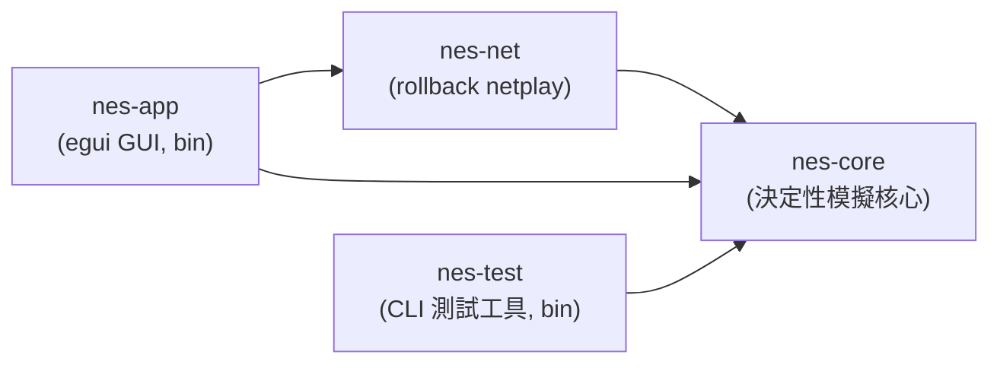
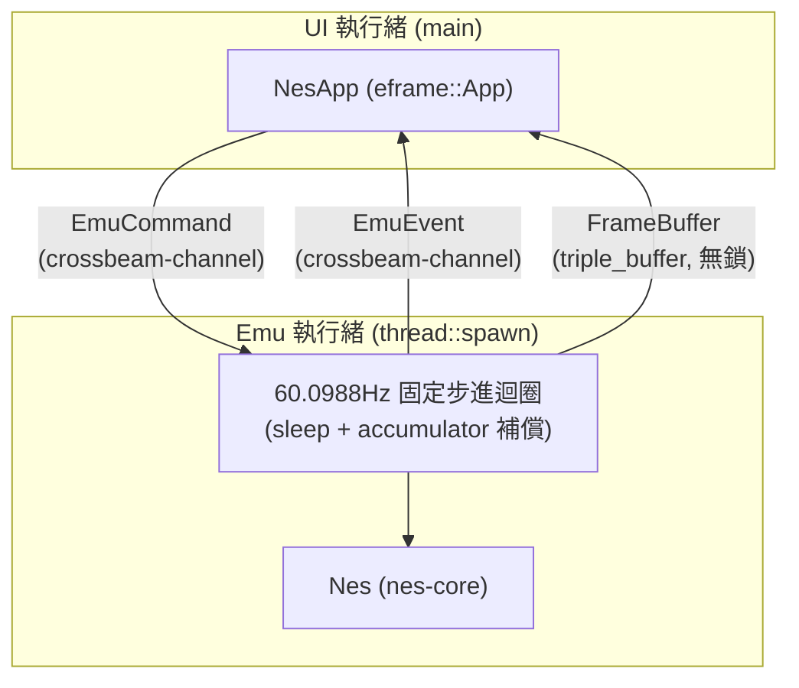
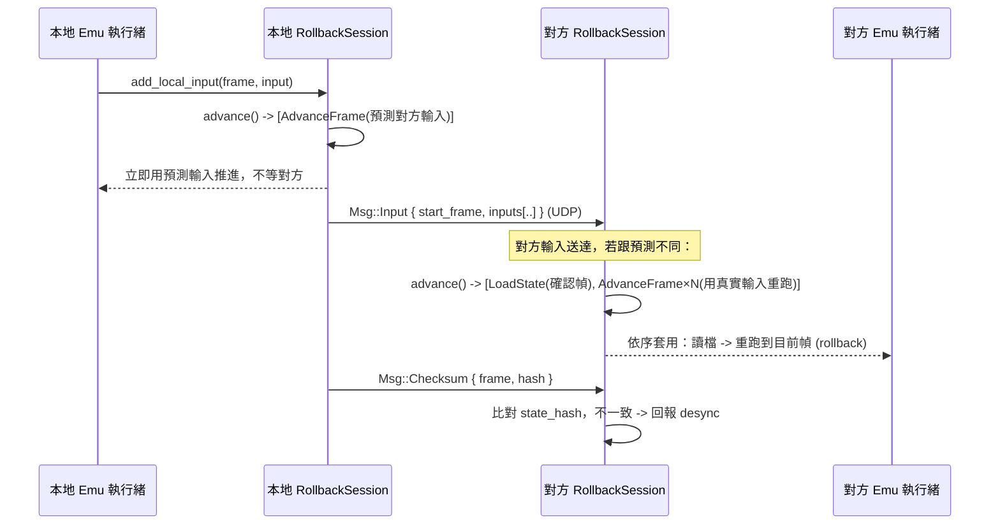

# 架構文件

> 對應課程「應用軟體設計」期末專案的四大主題：作業系統與應用程式的關係、
> 視窗環境、網路環境、整合設計。本文件說明整體架構、各模組如何對應到這些
> 主題，以及幾個關鍵設計決策背後的理由。

## 1. 課程四大主題 ↔ 模組對應表

| 課程主題 | 對應模組 / 機制 | 說明 |
|---|---|---|
| **(1) 作業系統與應用程式的關係**：多執行緒、檔案 I/O、timing | `nes-app/src/emu.rs`（emu 執行緒，60.0988Hz 固定步進）、`nes-app/src/main.rs`（`thread::spawn` + `crossbeam-channel` + `triple_buffer` 跨執行緒通訊）、`nes-app/src/app.rs`（用 `rfd`／`std::fs::read` 做檔案 I/O） | UI 執行緒與 Emu 執行緒分離，避免模擬迴圈的 timing 被 GUI 重繪卡住；反之也避免 GUI 被模擬迴圈的 sleep 卡住。 |
| **(2) 視窗環境** | `nes-app`（`eframe`/`egui`） | 選單列、遊戲畫面 texture、Debugger 側邊面板、狀態列、鍵盤輸入映射。 |
| **(3) 網路環境** | `nes-net`（`protocol.rs` 封包格式、`transport.rs` UDP 傳輸層、`session.rs` rollback 排程） | 用 `std::net::UdpSocket`（non-blocking）+ 手刻協定，不用 async runtime，理由見 §5。 |
| **(4) 整合設計** | `Nes::run_frame` 作為 `nes-core` / `nes-net` / `nes-app` 三者的交會點 | `nes-app` 的 emu 執行緒把「網路層排出的指令」（`nes-net::Request`）套用在 `nes-core::Nes` 上；GUI 只透過 channel 跟 emu 執行緒溝通，三個子系統彼此不直接耦合。 |

## 2. Crate 依賴圖



`nes-core` 是唯一不依賴其他本專案 crate 的節點，且被所有人依賴——這是刻意的：
它必須維持「決定性、無 I/O」的性質，不能被上層的網路或 GUI 邏輯污染。

## 3. 執行緒模型



- **為什麼 emu 執行緒跟 UI 執行緒分開？** GUI 重繪（尤其是開啟 debugger 面板、
  拖動視窗）耗時不固定，如果模擬迴圈跟 UI 畫在同一個執行緒，模擬的 timing
  會被 UI 卡頓拖慢；反過來，模擬迴圈裡的 `sleep` 也不能拖慢 UI 的重繪。
- **為什麼畫面用 `triple_buffer` 而不是 channel？** Emu 執行緒每 1/60 秒就
  產生一張新畫面，如果透過一般 channel 傳遞，UI 執行緒處理不及就會塞住 emu
  執行緒（channel 滿了會 block，或者用 unbounded 會無限堆積記憶體）。
  `triple_buffer` 讓「寫最新一張、讀最新一張」永遠是 O(1) 且無鎖，讀寫互不
  阻塞，天然符合「畫面只在乎最新一張」的需求。
- **為什麼指令/事件用 `crossbeam-channel`？** 指令（LoadRom、SetInput……）跟
  畫面不同，每一則都有意義、不能丟，用 unbounded channel 剛好；`crossbeam`
  比 `std::sync::mpsc` 效能更好、API 更完整（`try_iter` 等）。

## 4. `nes-core` 公開 API：為什麼不用 callback

`Nes` 的對外介面刻意設計成「外部驅動、每次跑一幀」：

```rust
pub fn run_frame(&mut self, input: [Buttons; 2]) -> &FrameBuffer;
```

而不是常見的：

```rust
// 不採用的設計
pub fn run(&mut self, get_input: impl FnMut() -> [Buttons; 2], on_frame: impl FnMut(&FrameBuffer));
```

理由：

1. **Rollback 需要「隨時暫停、讀檔、重跑」**。如果模擬迴圈自己控制節奏（例如
   內部跑一個 `loop { ... }` 並透過 callback 要輸入、丟畫面），呼叫端就沒辦法
   在「這一幀」跟「下一幀」之間插入 `save_state`/`load_state`。外部驅動的
   `run_frame` 讓呼叫端（emu 執行緒 / rollback session）完全掌控時間軸。
2. **帶 lifetime 的 closure 會讓 `Nes` 很難被存進其他結構、很難被 `Clone`**。
   rollback 需要對 `Nes` 做 `Clone`／序列化／在多個「假設分支」之間切換，
   closure 型別（尤其是捕捉了外部狀態的）會讓這些操作變得非常麻煩，甚至
   需要 `Box<dyn FnMut>` 才能存起來，等於繞了一圈又回到需要動態分派。
3. **測試更簡單**：外部驅動的 API 讓單元測試可以完全不碰執行緒/計時器，直接
   在迴圈裡呼叫 `run_frame` 幾十幀，這也是 §7 那三個決定性測試能寫得這麼
   直接的原因。

## 5. 為什麼 `Mapper` 用 `enum` 而不是 trait object

`cartridge/mapper.rs`：

```rust
pub enum Mapper {
    Nrom(Nrom),
    // Mmc1(Mmc1), Uxrom(Uxrom), Cnrom(Cnrom)  <- 之後才加
}
```

而不是：

```rust
// 不採用的設計
pub struct Cartridge {
    mapper: Box<dyn MapperTrait>,
}
```

理由是 **serde 序列化**。存檔（save state）需要把整台 `Nes` 的狀態（包含
`Cartridge`／`Mapper`）序列化成 bytes，之後還要能反序列化回「正確的具體型別」。
`enum` 的每個 variant 都是編譯期已知的具體型別，`derive(Serialize,
Deserialize)` 可以直接運作，postcard 編碼時只需要多存一個 variant tag。

`Box<dyn Trait>` 做不到這件事：trait object 在執行期已經抹除了具體型別資訊，
`serde` 沒辦法單靠 `Box<dyn Trait>` 知道反序列化時該建構哪一個實際的 struct
（需要額外的 registry/tag 機制，例如 `typetag` crate，那還是繞回「本質上是
一個 enum」，只是換一種寫法，且引入了額外依賴與執行期開銷）。既然 mapper
種類是有限且編譯期已知的（NROM/MMC1/UXROM/CNROM……），直接用 `enum` 最簡單、
最快、對 serde 最友善。

## 6. Netplay 協定與 rollback 流程

### 封包格式（`nes-net::protocol::Msg`）

`Input` 封包刻意帶「最近 N 幀」的輸入歷史（冗餘設計），而不是每幀送一個只
包含當幀輸入的小封包：UDP 會掉包，冗餘設計讓下一個送達的封包自然補上前面
掉的幀，不需要額外的重傳握手（reduce round-trip，這對延遲敏感的 netplay
很重要）。

### Rollback 演算法（詳細版見 `nes-net/src/session.rs` 的 doc comment）



要點：

1. **樂觀預測**：本地不等對方，用「對方上一次已知輸入」預測這一幀，正常
   `AdvanceFrame`。
2. **持續存檔**：每推進一幀都 `SaveState`，保留最近 N 幀（N 由
   `input_delay` 與允許的 rollback 深度決定）。
3. **輸入送達後比對**：真正的對方輸入送到後，如果跟預測不同，從「雙方都
   確定」的那一幀 `LoadState`，再用真實輸入依序 `AdvanceFrame` 追到目前幀
   （這就是 rollback：時間軸上退回去，重新播放）。
4. **確認幀推進**：雙方輸入都確定的幀變成 `confirmed_frame`，更早的存檔可
   以丟棄。
5. **Desync 偵測**：定期交換 `Nes::state_hash()`（xxh3-64 對 `save_state()`
   雜湊），同一幀雙方雜湊不一致就代表模擬邏輯出現了不確定性，應立即中止並
   回報，而不是悄悄讓兩邊玩不同的遊戲。

`RollbackSession` 目前（Phase 0）只定義了資料結構與方法簽名，`handle_msg`／
`advance` 的本體回傳空結果，真正的排程邏輯排進後續階段。

## 7. 決定性（determinism）規則清單

Rollback 與 desync 偵測完全依賴「同樣的初始狀態 + 同樣的輸入序列，永遠算出
同樣的結果」。`nes-core` 因此遵守以下規則：

1. `#![forbid(unsafe_code)]`：整個 crate 禁止 `unsafe`。
2. **不依賴任何 I/O、時間、亂數、執行緒或 GUI crate**——`nes-core` 的
   `Cargo.toml` 只有 `serde`/`postcard`/`xxhash-rust`/`thiserror`/
   `bitflags`，沒有 `std::time`、沒有 RNG、沒有 `std::thread`。所有「這一幀
   该做什麼」都由呼叫端透過 `run_frame(input)` 的參數決定。
3. **不在會影響狀態的邏輯中迭代 `HashMap`**——`HashMap` 的迭代順序在不同
   執行、不同機器上不保證一致（受 `RandomState` 影響），會讓兩台跑一樣輸入
   序列的機器算出不同結果。`nes-core` 目前沒有任何 `HashMap`；`nes-net` 的
   `RollbackSession` 需要「照幀號排序」的關聯容器時，用的是 `BTreeMap`（見
   `session.rs`），因為它的迭代順序是由 key 排序決定的，跨執行/跨機器保證
   一致。
4. **對外 API 是外部驅動、每幀呼叫**：見 §4，避免 `Nes` 自己掌控時間軸。
5. **所有進入 save state 的型別都 `derive(Serialize, Deserialize)`**，且整個
   `Nes` 型別樹只用 plain owned data（沒有 `Rc`/`RefCell`/`Arc`/`Mutex`），
   確保 `Nes` 可以被完整 `Clone`／序列化／還原，這是 rollback 的存檔/讀檔
   機制能運作的前提。
6. **畫面渲染是純函式**：Phase 0 的 `FrameBuffer::render_test_pattern(frame_count,
   input)` 只由這兩個參數決定輸出，不讀取任何全域/外部狀態；未來真正的 PPU
   渲染器也必須維持這個性質（只由 `Ppu`/`Bus` 內部狀態決定，不能讀系統時間
   或其他非決定性來源）。

這三個測試（`crates/nes-core/src/lib.rs` 的 `tests` module）直接驗證了規則
5、6 帶來的性質：

- `save_then_load_preserves_state_hash`：存檔後立刻讀檔，`state_hash` 不變。
- `identical_input_sequences_produce_identical_hashes_across_instances`：
  兩個獨立的 `Nes` 實例，餵一模一樣的輸入序列，跑完之後雜湊完全相同。
- `rollback_replay_matches_uninterrupted_run`：在第 k 幀存檔、跑到 k+m、
  讀回存檔、用「相同」的輸入重新跑到 k+m，結果與「完全沒有讀檔」的一次
  性執行一模一樣——這正是 rollback 依賴的核心性質。
