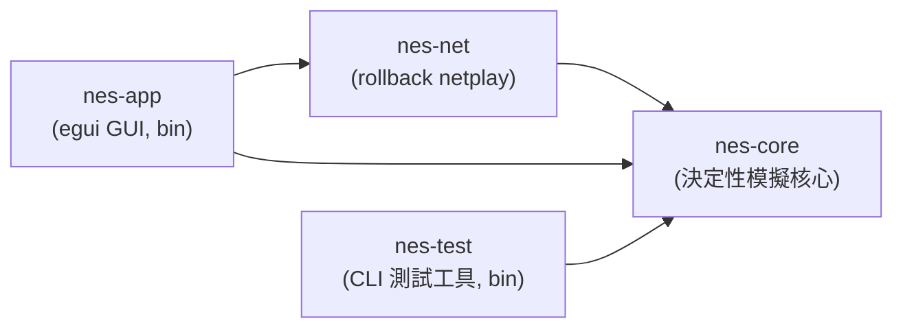
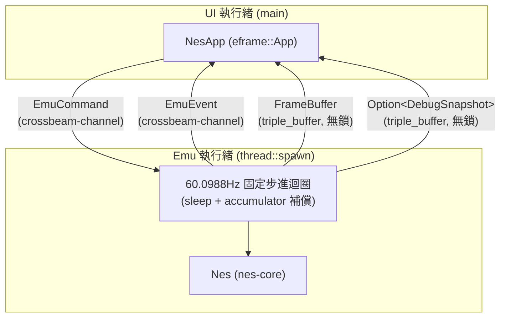
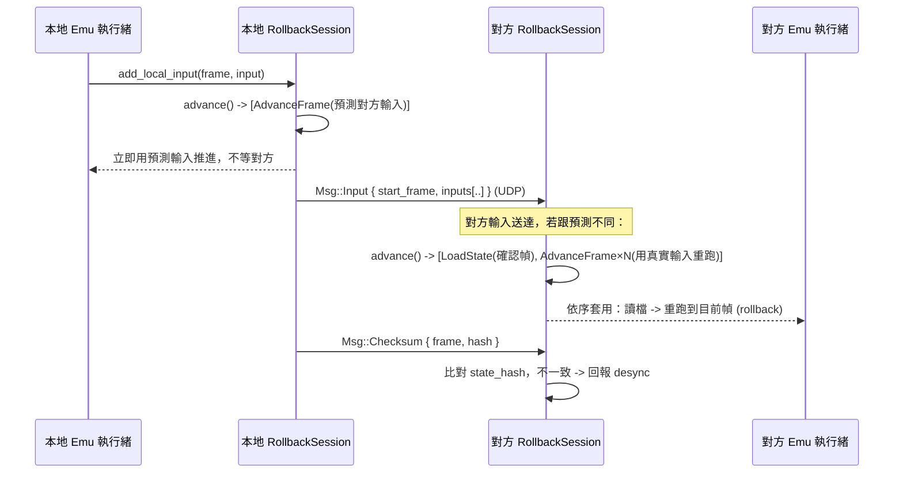
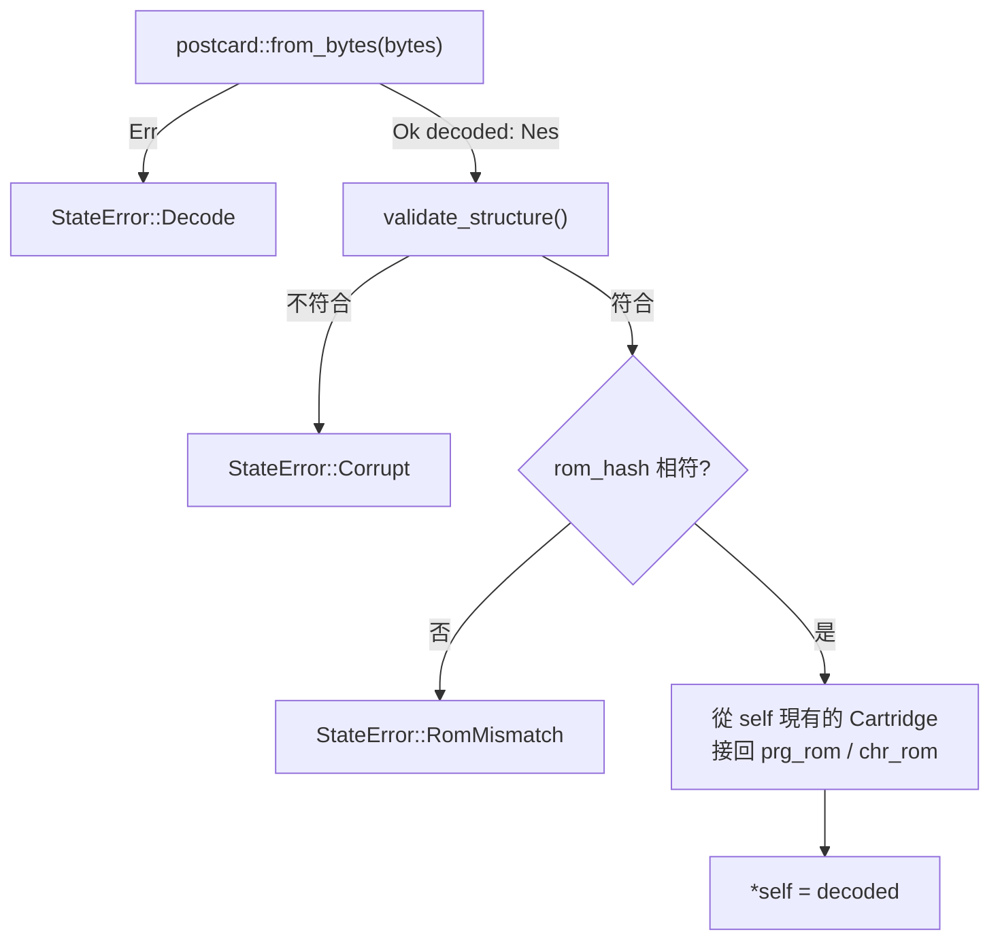

# 架構文件

> 對應課程「應用軟體設計」期末專案的四大主題：作業系統與應用程式的關係、
> 視窗環境、網路環境、整合設計。本文件說明整體架構、各模組如何對應到這些
> 主題，以及幾個關鍵設計決策背後的理由。

## 1. 課程四大主題 ↔ 模組對應表

| 課程主題 | 對應模組 / 機制 | 說明 |
|---|---|---|
| **(1) 作業系統與應用程式的關係**：多執行緒、檔案 I/O、timing | `nes-app/src/emu.rs`（emu 執行緒，60.0988Hz 固定步進）、`nes-app/src/main.rs`（`thread::spawn` + `crossbeam-channel` + `triple_buffer` 跨執行緒通訊）、`nes-app/src/app.rs`（用 `rfd`／`std::fs::read` 做檔案 I/O） | UI 執行緒與 Emu 執行緒分離，避免模擬迴圈的 timing 被 GUI 重繪卡住；反之也避免 GUI 被模擬迴圈的 sleep 卡住。 |
| **(2) 視窗環境** | `nes-app`（`eframe`/`egui`） | 選單列、遊戲畫面 texture、Debugger 側邊面板、狀態列、鍵盤輸入映射。 |
| **(3) 網路環境** | `nes-net`（`protocol.rs` 封包格式、`transport.rs` UDP 傳輸層、`session.rs` rollback 排程） | 用 `std::net::UdpSocket`（non-blocking）+ 手刻協定，不用 async runtime，理由見 §5。 |
| **(4) 整合設計** | `Nes::run_frame` 作為 `nes-core` / `nes-net` / `nes-app` 三者的交會點 | `nes-app` 的 emu 執行緒把「網路層排出的指令」（`nes-net::Request`）套用在 `nes-core::Nes` 上；GUI 只透過 channel 跟 emu 執行緒溝通，三個子系統彼此不直接耦合。 |

## 2. Crate 依賴圖



`nes-core` 是唯一不依賴其他本專案 crate 的節點，且被所有人依賴——這是刻意的：
它必須維持「決定性、無 I/O」的性質，不能被上層的網路或 GUI 邏輯污染。

## 3. 執行緒模型



emu 執行緒與 UI 執行緒之間目前有 4 條獨立通道，方向、型別、用途、背壓策略
各不相同：

| 通道 | 型別 | 方向 | 用途 | 背壓策略 |
|---|---|---|---|---|
| 指令 | `crossbeam_channel::Sender/Receiver<EmuCommand>` | UI → Emu | `LoadRom`／`SetInput`／`Pause`／`Resume`／`SaveState`／`LoadState`／`SetDebugEnabled`／`StepInstruction`／`StepFrame`／`TraceToFile`／`Quit`，每一則都有意義、不能丟 | unbounded：emu 執行緒每迴圈用 `try_iter()` 一次清空，不會累積 |
| 事件 | `crossbeam_channel::Sender/Receiver<EmuEvent>` | Emu → UI | `RomLoaded`／`Error`／`FpsReport`／`FrameAdvanced`／`TraceWritten`，每則都要送達 | unbounded：`FpsReport` 每秒 1 則、`FrameAdvanced` 每幀 1 則（UI 每次重繪都會 `try_iter()` 清空），不會累積成問題 |
| 畫面 | `triple_buffer::Input/Output<FrameBuffer>` | Emu → UI | 每幀畫好的 `FrameBuffer` | `triple_buffer`：只在乎「最新一張」，UI 沒讀不會擋住 emu 寫入，也不會無限堆積 |
| Debug 快照 | `triple_buffer::Input/Output<Option<DebugSnapshot>>` | Emu → UI | Debugger 面板顯示的 CPU/PPU/APU 狀態；`None` 代表「尚未收到任何快照」，跟真實模擬狀態（即使欄位剛好是 0）明確區分 | `triple_buffer`：同 FrameBuffer；另外用 `EmuCommand::SetDebugEnabled` 讓 emu 執行緒只在面板開啟時才產生快照，面板關閉時零成本 |

- **為什麼 emu 執行緒跟 UI 執行緒分開？** GUI 重繪（尤其是開啟 debugger 面板、
  拖動視窗）耗時不固定，如果模擬迴圈跟 UI 畫在同一個執行緒，模擬的 timing
  會被 UI 卡頓拖慢；反過來，模擬迴圈裡的 `sleep` 也不能拖慢 UI 的重繪。
- **為什麼畫面／Debug 快照用 `triple_buffer` 而不是 channel？** 這兩者都是
  「每幀更新一次、UI 只在乎最新一份」的資料，如果透過一般 channel 傳遞，
  UI 執行緒處理不及就會塞住 emu 執行緒（channel 滿了會 block，或者用
  unbounded 會無限堆積記憶體）。`triple_buffer` 讓「寫最新一份、讀最新
  一份」永遠是 O(1) 且無鎖，讀寫互不阻塞。
- **為什麼指令/事件用 `crossbeam-channel`？** 指令（LoadRom、SetInput……）跟
  畫面不同，每一則都有意義、不能丟，用 unbounded channel 剛好；`crossbeam`
  比 `std::sync::mpsc` 效能更好、API 更完整（`try_iter` 等）。
- **為什麼 Debug 快照用 `Option<DebugSnapshot>` 而不是直接用
  `DebugSnapshot`？** 曾經發生過的 bug：UI 端在拿不到真實資料時，直接用
  `DebugSnapshot::default()` 頂替，結果 Debugger 面板長期顯示一份看起來
  正常、實際上完全是假資料的畫面（SP/Status 顯示 0，但 reset 後不可能是
  0）。用 `Option` 讓「尚未收到資料」在型別上就跟「收到了、且欄位剛好是
  某個值」區分開來，UI 端沒有任何藉口再用一份假資料頂替。

## 4. `nes-core` 公開 API：為什麼不用 callback

`Nes` 的對外介面刻意設計成「外部驅動、每次跑一幀」：

```rust
pub fn run_frame(&mut self, input: [Buttons; 2]) -> &FrameBuffer;
```

而不是常見的：

```rust
// 不採用的設計
pub fn run(&mut self, get_input: impl FnMut() -> [Buttons; 2], on_frame: impl FnMut(&FrameBuffer));
```

理由：

1. **Rollback 需要「隨時暫停、讀檔、重跑」**。如果模擬迴圈自己控制節奏（例如
   內部跑一個 `loop { ... }` 並透過 callback 要輸入、丟畫面），呼叫端就沒辦法
   在「這一幀」跟「下一幀」之間插入 `save_state`/`load_state`。外部驅動的
   `run_frame` 讓呼叫端（emu 執行緒 / rollback session）完全掌控時間軸。
2. **帶 lifetime 的 closure 會讓 `Nes` 很難被存進其他結構、很難被 `Clone`**。
   rollback 需要對 `Nes` 做 `Clone`／序列化／在多個「假設分支」之間切換，
   closure 型別（尤其是捕捉了外部狀態的）會讓這些操作變得非常麻煩，甚至
   需要 `Box<dyn FnMut>` 才能存起來，等於繞了一圈又回到需要動態分派。
3. **測試更簡單**：外部驅動的 API 讓單元測試可以完全不碰執行緒/計時器，直接
   在迴圈裡呼叫 `run_frame` 幾十幀，這也是 §7 那三個決定性測試能寫得這麼
   直接的原因。

## 5. 為什麼 `Mapper` 用 `enum` 而不是 trait object

`cartridge/mapper.rs`：

```rust
pub enum Mapper {
    Nrom(Nrom),
    // Mmc1(Mmc1), Uxrom(Uxrom), Cnrom(Cnrom)  <- 之後才加
}
```

而不是：

```rust
// 不採用的設計
pub struct Cartridge {
    mapper: Box<dyn MapperTrait>,
}
```

理由是 **serde 序列化**。存檔（save state）需要把整台 `Nes` 的狀態（包含
`Cartridge`／`Mapper`）序列化成 bytes，之後還要能反序列化回「正確的具體型別」。
`enum` 的每個 variant 都是編譯期已知的具體型別，`derive(Serialize,
Deserialize)` 可以直接運作，postcard 編碼時只需要多存一個 variant tag。

`Box<dyn Trait>` 做不到這件事：trait object 在執行期已經抹除了具體型別資訊，
`serde` 沒辦法單靠 `Box<dyn Trait>` 知道反序列化時該建構哪一個實際的 struct
（需要額外的 registry/tag 機制，例如 `typetag` crate，那還是繞回「本質上是
一個 enum」，只是換一種寫法，且引入了額外依賴與執行期開銷）。既然 mapper
種類是有限且編譯期已知的（NROM/MMC1/UXROM/CNROM……），直接用 `enum` 最簡單、
最快、對 serde 最友善。

## 6. Netplay 協定與 rollback 流程

### 封包格式（`nes-net::protocol::Msg`）

`Input` 封包刻意帶「最近 N 幀」的輸入歷史（冗餘設計），而不是每幀送一個只
包含當幀輸入的小封包：UDP 會掉包，冗餘設計讓下一個送達的封包自然補上前面
掉的幀，不需要額外的重傳握手（reduce round-trip，這對延遲敏感的 netplay
很重要）。

### Rollback 演算法（詳細版見 `nes-net/src/session.rs` 的 doc comment）



要點：

1. **樂觀預測**：本地不等對方，用「對方上一次已知輸入」預測這一幀，正常
   `AdvanceFrame`。
2. **持續存檔**：每推進一幀都 `SaveState`，保留最近 N 幀（N 由
   `input_delay` 與允許的 rollback 深度決定）。
3. **輸入送達後比對**：真正的對方輸入送到後，如果跟預測不同，從「雙方都
   確定」的那一幀 `LoadState`，再用真實輸入依序 `AdvanceFrame` 追到目前幀
   （這就是 rollback：時間軸上退回去，重新播放）。
4. **確認幀推進**：雙方輸入都確定的幀變成 `confirmed_frame`，更早的存檔可
   以丟棄。
5. **Desync 偵測**：定期交換 `Nes::state_hash()`（xxh3-64 對 `save_state()`
   雜湊），同一幀雙方雜湊不一致就代表模擬邏輯出現了不確定性，應立即中止並
   回報，而不是悄悄讓兩邊玩不同的遊戲。

`RollbackSession` 目前（Phase 0）只定義了資料結構與方法簽名，`handle_msg`／
`advance` 的本體回傳空結果，真正的排程邏輯排進後續階段。

## 7. 決定性（determinism）規則清單

Rollback 與 desync 偵測完全依賴「同樣的初始狀態 + 同樣的輸入序列，永遠算出
同樣的結果」。`nes-core` 因此遵守以下規則：

1. `#![forbid(unsafe_code)]`：整個 crate 禁止 `unsafe`。
2. **不依賴任何 I/O、時間、亂數、執行緒或 GUI crate**——`nes-core` 的
   `Cargo.toml` 只有 `serde`/`postcard`/`xxhash-rust`/`thiserror`/
   `bitflags`，沒有 `std::time`、沒有 RNG、沒有 `std::thread`。所有「這一幀
   该做什麼」都由呼叫端透過 `run_frame(input)` 的參數決定。
3. **不在會影響狀態的邏輯中迭代 `HashMap`**——`HashMap` 的迭代順序在不同
   執行、不同機器上不保證一致（受 `RandomState` 影響），會讓兩台跑一樣輸入
   序列的機器算出不同結果。`nes-core` 目前沒有任何 `HashMap`；`nes-net` 的
   `RollbackSession` 需要「照幀號排序」的關聯容器時，用的是 `BTreeMap`（見
   `session.rs`），因為它的迭代順序是由 key 排序決定的，跨執行/跨機器保證
   一致。
4. **對外 API 是外部驅動、每幀呼叫**：見 §4，避免 `Nes` 自己掌控時間軸。
5. **所有進入 save state 的型別都 `derive(Serialize, Deserialize)`**，且整個
   `Nes` 型別樹只用 plain owned data（沒有 `Rc`/`RefCell`/`Arc`/`Mutex`），
   確保 `Nes` 可以被完整 `Clone`／序列化／還原，這是 rollback 的存檔/讀檔
   機制能運作的前提。（靜態 ROM bytes 是例外，刻意 `#[serde(skip)]`，理由與
   讀檔時如何確保接回同一份 ROM、如何拒絕損毀資料，見 §8。）
6. **畫面渲染是純函式**：Phase 0 的 `FrameBuffer::render_test_pattern(frame_count,
   input)` 只由這兩個參數決定輸出，不讀取任何全域/外部狀態；未來真正的 PPU
   渲染器也必須維持這個性質（只由 `Ppu`/`Bus` 內部狀態決定，不能讀系統時間
   或其他非決定性來源）。

以下三個測試（`crates/nes-core/src/lib.rs` 的 `tests` module）直接驗證了規則
5、6 帶來的性質：

- `save_then_load_preserves_state_hash`：存檔後立刻讀檔，`state_hash` 不變。
- `identical_input_sequences_produce_identical_hashes_across_instances`：
  兩個獨立的 `Nes` 實例，餵一模一樣的輸入序列，跑完之後雜湊完全相同。
- `rollback_replay_matches_uninterrupted_run`：在第 k 幀存檔、跑到 k+m、
  讀回存檔、用「相同」的輸入重新跑到 k+m，結果與「完全沒有讀檔」的一次
  性執行一模一樣——這正是 rollback 依賴的核心性質。

## 8. Save state 格式：排除 ROM bytes、用雜湊比對、拒絕損毀資料

Rollback 需要高頻率地存檔/讀檔（理論上每幀都可能存一次），所以 save state
的設計有兩個額外目標：**不要浪費空間重複存不會變的資料**、**讀到壞資料時要
明確拒絕，不能 panic 或悄悄跑出錯的模擬**。

### 8.1 ROM bytes 不進 save state

`Cartridge` 的 `prg_rom`/`chr_rom` 兩個欄位標了 `#[serde(skip)]`：

```rust
#[serde(skip)]
pub prg_rom: Vec<u8>,
#[serde(skip)]
pub chr_rom: Vec<u8>,
```

理由：同一場對局裡，PRG-ROM/CHR-ROM 的內容從頭到尾不會變（它們是唯讀
的卡帶資料），rollback 每次存讀檔都把整份 ROM（可能幾百 KB）重複序列化一次
既浪費頻寬/記憶體、也拖慢「每幀都可能要存一次檔」的效能需求。真正會變的
只有 **CHR-RAM**、**PRG-RAM**、CPU/PPU/APU 暫存器等執行期狀態，這些欄位照
常序列化。連帶地，[`Nes::state_hash`] 因為是對 `save_state()` 的輸出做
xxh3-64，也自動不包含 ROM bytes，只反映「真正會變的狀態」。

### 8.2 `rom_hash`：確保讀檔時接回「同一份」ROM

因為 `prg_rom`/`chr_rom` 被跳過，`load_state` 讀回資料後必須從目前記憶體裡
已經載入的 ROM 把這兩個欄位接回去——但如果存檔其實是另一款遊戲存的
（例如使用者不小心把《薩爾達》的存檔拿去讀《瑪利歐》），接回去的 PRG/CHR
資料跟存檔裡的 CPU/PPU 狀態完全對不上，會直接跑出垃圾畫面或亂七八糟的
行為，而且不會有任何錯誤訊息。

`Cartridge` 因此多存一個 `rom_hash: u64` 欄位（`xxh3_64(prg_rom ++
chr_rom)`，在 `ines::parse` 解析時算好），`Nes::load_state` 讀檔時比對存檔
裡的 `rom_hash` 跟目前已載入 ROM 的 `rom_hash`：

```rust
let expected_hash = self.cpu.bus().cartridge.rom_hash;
let found_hash = decoded.cpu.bus().cartridge.rom_hash;
if expected_hash != found_hash {
    return Err(StateError::RomMismatch { expected: expected_hash, found: found_hash });
}
```

不符合就回傳 `StateError::RomMismatch`，拒絕讀檔，而不是接上錯的 ROM 繼續跑。

### 8.3 結構驗證：拒絕長度被竄改的資料

postcard 對 `Vec<u8>` 的編碼是「長度前綴 + 內容」，理論上存檔資料可能因為
儲存媒介損毀、或被惡意竄改，導致解碼出一個「型別對、但長度不符合硬體規格」
的 `Nes`（例如 RAM 變成 2049 bytes）。`Nes::load_state` 在比對 `rom_hash`
之前，會先呼叫內部的 `validate_structure()` 逐一檢查：

- `Bus::ram` 必須是 `0x0800`（2KB）
- `Ppu::vram` 必須是 `2048`
- `Ppu::oam` 必須是 `256`
- `Cartridge::chr_ram` 必須符合 `info.chr_rom_banks`（有 CHR-ROM 就該是 0，
  沒有就該是 `CHR_RAM_SIZE`）
- `Cartridge::prg_ram` 必須是 `PRG_RAM_SIZE`

任何一項不符合就回傳 `StateError::Corrupt`，絕不 panic、也不會讓後續（尤其
是 Phase 1 之後會實作的 `Bus::read`/`write`）因為陣列長度不對而 out-of-bounds
panic。

### 8.4 `load_state` 完整流程



對應的三個「拒絕壞資料」測試（`crates/nes-core/src/lib.rs`）：

- `load_state_rejects_truncated_bytes`：把存檔位元組砍半再讀，驗證回傳
  `StateError::Decode`。
- `load_state_rejects_tampered_length`：手動把一份有效存檔的 RAM 長度改壞
  （`push` 多一個 byte）再讀，驗證 `validate_structure` 攔下來、回傳
  `StateError::Corrupt`。
- `load_state_rejects_mismatched_rom`：拿「另一份 ROM」存的檔去讀目前載入
  的 ROM，驗證回傳 `StateError::RomMismatch`。

## 9. CPU 精度層級：instruction-level（Phase 1）

`crates/nes-core/src/cpu/mod.rs` 實作的 6502（2A03）CPU 是 **instruction-level**
（指令級）精度，不是 **cycle-level**（cycle 級）精度。差異：

- **cycle-level** 模擬器把每條指令拆成一個個 cycle 的微碼狀態機，`step()`
  每次只推進一個 cycle；匯流排存取（包含指令執行「途中」的每一次讀寫）都
  照真實硬體的時序精確發生。
- 本專案的 **instruction-level** 模擬器裡，`Cpu::step()` 一次把一條指令從
  取指到寫回全部做完，只在最後告訴呼叫端「這條指令總共花了幾個 cycle」
  （查 `OPCODES` 表 + 跨頁/分支的動態加成），再一次呼叫 `Bus::tick` 補上
  時間，而不是每個 cycle 都真的去摸一次匯流排。

### 為什麼選這個層級

Phase 1 的目標是「CPU 正確性」——最終暫存器狀態、指令消耗的 cycle 總數、
分支/跨頁的邊界行為要跟真實硬體一致（用 nestest 驗證）。這些性質全部只跟
「一條指令執行前」與「執行後」的狀態有關，跟「執行途中每個 cycle 匯流排上
發生了什麼」無關。既然目標不需要後者，选 instruction-level 可以大幅簡化
實作：`OPCODES` 表直接查表決定 cycle 數，每條指令只要寫「做什麼」，不用另外
寫「這個 cycle 該做什麼、下個 cycle 該做什麼」的狀態機。

### 影響／代價

1. **通過 nestest，但不是 SingleStepTests 的 `cycles` 欄位**。SingleStepTests
   每筆測試資料除了「最終暫存器/RAM」，還有一份「這條指令逐 cycle 的匯流排
   讀寫紀錄」；照任務規格我們只比對前者，不比對後者（見
   `crates/nes-core/src/cpu/singlestep.rs` 的模組文件）。實測結果：**官方
   opcode 256 萬分之 151 萬筆全數通過（100%）**；非官方 opcode 中，任務要求
   的那些（LAX/SAX/DCP/ISB/SLO/RLA/SRE/RRA/\*SBC/各種 NOP/JAM/ANC/ALR/ARR/
   AXS）也全數通過（JAM 只比對暫存器/RAM，cycle 數的差異見 §10），只有 8 個任務範圍外、真實硬體行為本身就不穩定
   （analog/undefined，依賴個別晶片的類比殘留電荷，不是單純的邏輯 bug）的
   opcode（`$8B` `$93` `$9B` `$9C` `$9E` `$9F` `$AB` `$BB`）維持 NOP 占位，
   細節見 Phase 1 報告。
2. **PPU/mapper 還無法在指令「執行途中」插手**。例如某些少見的技巧（在
   PPU 正在畫某條掃描線的當下，靠一條指令的第 3、第 4 個 cycle 精準寫某個
   PPU 暫存器）需要 cycle-level 才能重現；Phase 1 的 PPU 還是 stub，用不到
   這個精度，之後如果真的要做這類精細時序（例如 sprite-0 hit 的邊界情況），
   才需要重新評估要不要把 CPU 也改成 cycle-level。
3. **`Bus::tick` 一次補一整條指令的 cycle 數**，而不是逐 cycle 呼叫；PPU
   的 `(scanline, cycle)` 是從累積的 `total_cycles * 3` 換算回去的（見
   `Bus::ppu_dot`），在「一條指令之內」沒有更細的解析度，但這條指令執行完
   之後下一次 `trace()`/`debug_snapshot()` 讀到的值是精確的。

這個決定不影響 §7 的決定性規則：instruction-level 一樣是完全決定性的（同樣
輸入序列永遠得到同樣結果），只是不模擬「指令執行到一半」這個中間狀態。

## 10. SingleStepTests 回歸閘門與分類

`cargo test --release -p nes-core --lib cpu::singlestep -- --ignored --nocapture`
會把 256 個 opcode（各 10,000 筆，共 256 萬筆）依下表分類，**前三類任一類別
未 100% 通過就讓測試失敗**。第四類只列出、不影響結果。

| 類別 | opcode | 筆數 | 比對內容 | 閘門 |
|---|---|---|---|---|
| 官方 | 151 個官方 opcode | 1,510,000 | 暫存器 + RAM + **cycle 數** | 必須 100% |
| 非官方（穩定） | 其餘非官方（LAX/SAX/DCP/ISB/SLO/RLA/SRE/RRA/`*SBC`/各種 NOP/ANC/ALR/ARR/AXS…） | 850,000 | 暫存器 + RAM + **cycle 數** | 必須 100% |
| JAM | `02 12 22 32 42 52 62 72 92 B2 D2 F2`（12 個） | 120,000 | 暫存器 + RAM，**不比對 cycle 數** | 必須 100% |
| 不穩定 | `8B 93 9B 9C 9E 9F AB BB`（8 個） | 80,000 | 全部（預期失敗） | 僅列出 |

理由：

- **JAM**：真實硬體執行 JAM 後 CPU 卡死。測試資料把「卡死」展開成 11 個 cycle
  的匯流排活動；本核心是 instruction-level，用 `Cpu::jammed` 旗標表示卡死，
  `step()` 回傳 2 cycle。「卡死後暫存器與 RAM 不再變動」是有意義且可驗證的
  性質，所以必須相符；11 vs 2 的 cycle 差異是模型差異，不是 bug，測試會把
  「暫存器/RAM 相符但 cycle 數不同」的案例數與範例單獨印出。
- **不穩定的 8 個**：真實行為取決於匯流排殘留電容、DMA 時機、晶片批次等
  類比因素，SingleStepTests 的期望值只是其中一種取樣。本專案維持 NOP 占位，
  預期 0% 通過，不計入閘門；若日後有人實作而通過，也不會讓測試失敗。

實測（本次）：官方 1,510,000/1,510,000、非官方穩定 850,000/850,000、JAM
120,000/120,000（其中 120,000 筆 cycle 數為預期差異）、不穩定 0/80,000。

## 11. Debugger API 與單步的決定性代價

`Nes` 上的 `trace()`、`peek()`、`step_instruction()` 是 Debugger 的正式公開
API，不在 `testing` feature 之後。`testing` 只剩純測試用途的 `override_pc`。

- `trace()`、`peek()`：唯讀、無副作用（不觸發 PPU/APU 暫存器的讀取副作用），
  任何時候都可以呼叫。
- `step_instruction()`：**會打破「以幀為單位」的決定性**。`run_frame` 保證
  每幀推進固定的 cycle 預算；單步讓 CPU 停在幀中間，之後的 `run_frame` 從
  那個位置繼續，兩台機器只要有一台單步過，狀態就對不上。因此只能在暫停狀態
  下使用，**netplay 進行中不得呼叫**。`nes-app` 的 emu 執行緒在
  `StepInstruction`／`StepFrame`／`TraceToFile` 指令上檢查暫停旗標，未暫停時
  回報 `EmuEvent::Error` 而不執行。

### 狀態列幀數 vs. Debugger cycle 數的取樣落差

原因：狀態列的幀數原本取自 `EmuEvent::FpsReport`，emu 執行緒每 1 秒才送一次
（約每 60 幀一次），UI 顯示的幀數平均落後真實幀數約 30 幀（最多近 60 幀）；
Debugger 快照卻是每幀更新，兩者就出現了約 35 幀的落差。

修正：`FpsReport` 只帶 FPS；新增每幀一則的 `EmuEvent::FrameAdvanced(frame)`
（單步、讀檔、載入 ROM 後也會送），並在 `DebugSnapshot` 加入 `frame_count`。
Debugger 開著時，狀態列直接用同一份快照的 `frame_count`，因此與面板的 cycle
數必然一致；面板關閉時用 `FrameAdvanced`。
