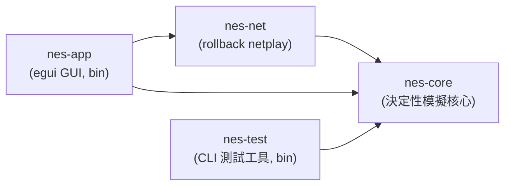
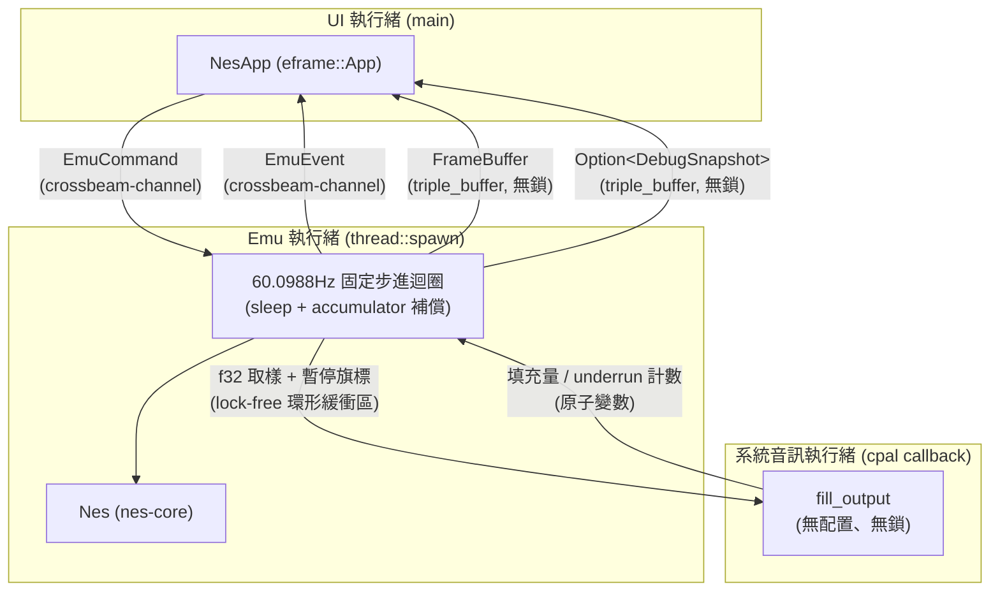
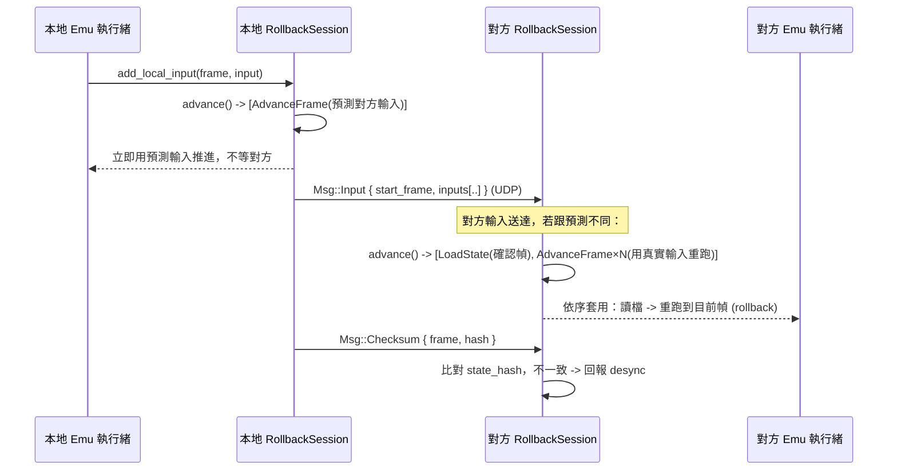
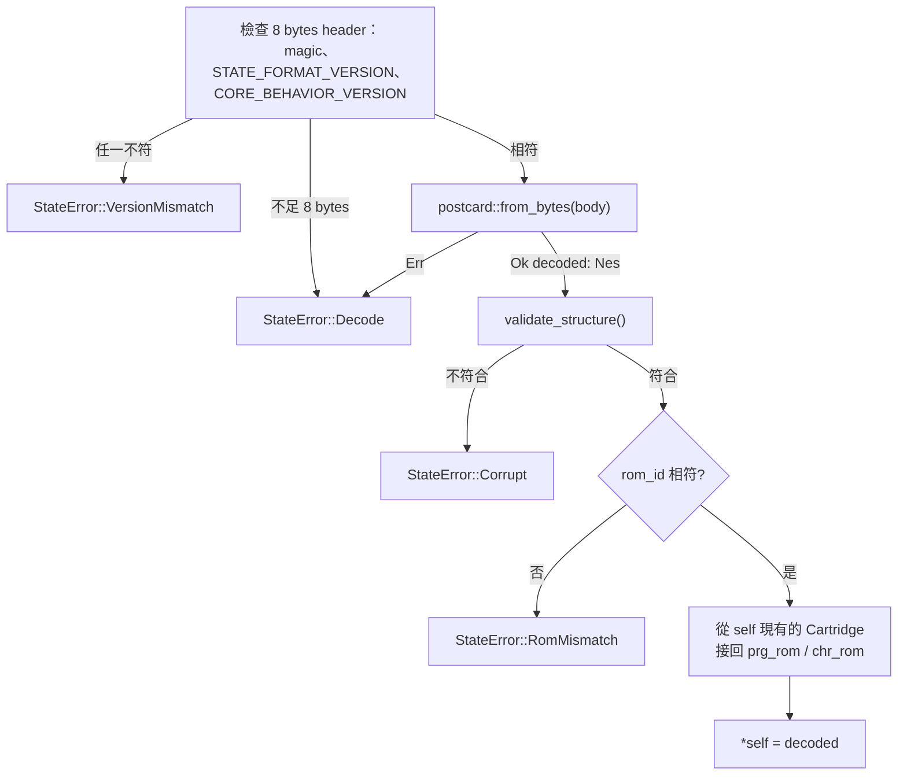

# 架構文件

> 對應課程「應用軟體設計」期末專案的四大主題：作業系統與應用程式的關係、
> 視窗環境、網路環境、整合設計。本文件說明整體架構、各模組如何對應到這些
> 主題，以及幾個關鍵設計決策背後的理由。

## 1. 課程四大主題 ↔ 模組對應表

| 課程主題 | 對應模組 / 機制 | 說明 |
|---|---|---|
| **(1) 作業系統與應用程式的關係**：多執行緒、檔案 I/O、timing | `nes-app/src/emu.rs`（emu 執行緒，60.0988Hz 固定步進）、`nes-app/src/main.rs`（`thread::spawn` + `crossbeam-channel` + `triple_buffer` 跨執行緒通訊）、`nes-app/src/app.rs`（用 `rfd`／`std::fs::read` 做檔案 I/O）、`nes-app/src/audio.rs`（系統音訊執行緒、lock-free 環形緩衝區、動態速率控制；見 §17.9） | UI 執行緒與 Emu 執行緒分離，避免模擬迴圈的 timing 被 GUI 重繪卡住；反之也避免 GUI 被模擬迴圈的 sleep 卡住。 |
| **(2) 視窗環境** | `nes-app`（`eframe`/`egui`） | 選單列、遊戲畫面 texture、Debugger 側邊面板、狀態列、鍵盤輸入映射。 |
| **(3) 網路環境** | `nes-net`（`protocol.rs` 封包格式、`transport.rs` UDP 傳輸層、`session.rs` rollback 排程） | 用 `std::net::UdpSocket`（non-blocking）+ 手刻協定，不用 async runtime，理由見 §5。 |
| **(4) 整合設計** | `Nes::run_frame` 作為 `nes-core` / `nes-net` / `nes-app` 三者的交會點 | `nes-app` 的 emu 執行緒把「網路層排出的指令」（`nes-net::Request`）套用在 `nes-core::Nes` 上；GUI 只透過 channel 跟 emu 執行緒溝通，三個子系統彼此不直接耦合。 |

## 2. Crate 依賴圖



`nes-core` 是唯一不依賴其他本專案 crate 的節點，且被所有人依賴——這是刻意的：
它必須維持「決定性、無 I/O」的性質，不能被上層的網路或 GUI 邏輯污染。

## 3. 執行緒模型



emu 執行緒與 UI 執行緒之間目前有 5 條獨立通道，方向、型別、用途、背壓策略
各不相同：

| 通道 | 型別 | 方向 | 用途 | 背壓策略 |
|---|---|---|---|---|
| 指令 | `crossbeam_channel::Sender/Receiver<EmuCommand>` | UI → Emu | `LoadRom`／`SetInput`／`Pause`／`Resume`／`SaveState`／`LoadState`／`SetDebugEnabled`／`SetDebugViews`／`StepInstruction`／`StepFrame`／`SetAudioChannelMask`／`TraceToFile`／`Quit`，每一則都有意義、不能丟 | unbounded：emu 執行緒每迴圈用 `try_iter()` 一次清空，不會累積 |
| 事件 | `crossbeam_channel::Sender/Receiver<EmuEvent>` | Emu → UI | `RomLoaded`／`Error`／`FpsReport`／`FrameAdvanced`／`TraceWritten`，每則都要送達 | unbounded：`FpsReport` 每秒 1 則、`FrameAdvanced` 每幀 1 則（UI 每次重繪都會 `try_iter()` 清空），不會累積成問題 |
| 畫面 | `triple_buffer::Input/Output<FrameBuffer>` | Emu → UI | 每幀畫好的 `FrameBuffer` | `triple_buffer`：只在乎「最新一張」，UI 沒讀不會擋住 emu 寫入，也不會無限堆積 |
| Debug 快照 | `triple_buffer::Input/Output<Option<DebugSnapshot>>` | Emu → UI | Debugger 面板顯示的 CPU/PPU/APU 狀態；`None` 代表「尚未收到任何快照」，跟真實模擬狀態（即使欄位剛好是 0）明確區分 | `triple_buffer`：同 FrameBuffer；另外用 `EmuCommand::SetDebugEnabled` 讓 emu 執行緒只在面板開啟時才產生快照，面板關閉時零成本 |
| PPU 影像 | `triple_buffer::Input/Output<Option<PpuViews>>` | Emu → UI | Debugger 的 pattern table（2 張 128×128）與 nametable（4 張 256×240），約 1.1MB／份 | `triple_buffer`；而且 **預設不產生**：只有面板開著且目前分頁是 Pattern/Nametable 時，UI 才送 `EmuCommand::SetDebugViews(Some(調色盤))`，emu 執行緒執行中每 3 幀更新一次，暫停時單步/讀檔後立即更新；離開分頁就送 `None`，之後零成本 |

除了上面 5 條，emu 執行緒與**系統的音訊執行緒**之間還有第 6 條：核心產生的取樣經
`AudioShared` 的環形緩衝區交給 cpal 的 callback，暫停旗標、主音量、填充量、underrun 計數都是
原子變數，callback 內不上鎖、不配置記憶體（設計與理由見 §17.9）。

- **為什麼 emu 執行緒跟 UI 執行緒分開？** GUI 重繪（尤其是開啟 debugger 面板、
  拖動視窗）耗時不固定，如果模擬迴圈跟 UI 畫在同一個執行緒，模擬的 timing
  會被 UI 卡頓拖慢；反過來，模擬迴圈裡的 `sleep` 也不能拖慢 UI 的重繪。
- **為什麼畫面／Debug 快照用 `triple_buffer` 而不是 channel？** 這兩者都是
  「每幀更新一次、UI 只在乎最新一份」的資料，如果透過一般 channel 傳遞，
  UI 執行緒處理不及就會塞住 emu 執行緒（channel 滿了會 block，或者用
  unbounded 會無限堆積記憶體）。`triple_buffer` 讓「寫最新一份、讀最新
  一份」永遠是 O(1) 且無鎖，讀寫互不阻塞。
- **為什麼指令/事件用 `crossbeam-channel`？** 指令（LoadRom、SetInput……）跟
  畫面不同，每一則都有意義、不能丟，用 unbounded channel 剛好；`crossbeam`
  比 `std::sync::mpsc` 效能更好、API 更完整（`try_iter` 等）。
- **為什麼 Debug 快照用 `Option<DebugSnapshot>` 而不是直接用
  `DebugSnapshot`？** 曾經發生過的 bug：UI 端在拿不到真實資料時，直接用
  `DebugSnapshot::default()` 頂替，結果 Debugger 面板長期顯示一份看起來
  正常、實際上完全是假資料的畫面（SP/Status 顯示 0，但 reset 後不可能是
  0）。用 `Option` 讓「尚未收到資料」在型別上就跟「收到了、且欄位剛好是
  某個值」區分開來，UI 端沒有任何藉口再用一份假資料頂替。

## 4. `nes-core` 公開 API：為什麼不用 callback

`Nes` 的對外介面刻意設計成「外部驅動、每次跑一幀」：

```rust
pub fn run_frame(&mut self, input: [Buttons; 2]) -> &FrameBuffer;
```

而不是常見的：

```rust
// 不採用的設計
pub fn run(&mut self, get_input: impl FnMut() -> [Buttons; 2], on_frame: impl FnMut(&FrameBuffer));
```

理由：

1. **Rollback 需要「隨時暫停、讀檔、重跑」**。如果模擬迴圈自己控制節奏（例如
   內部跑一個 `loop { ... }` 並透過 callback 要輸入、丟畫面），呼叫端就沒辦法
   在「這一幀」跟「下一幀」之間插入 `save_state`/`load_state`。外部驅動的
   `run_frame` 讓呼叫端（emu 執行緒 / rollback session）完全掌控時間軸。
2. **帶 lifetime 的 closure 會讓 `Nes` 很難被存進其他結構、很難被 `Clone`**。
   rollback 需要對 `Nes` 做 `Clone`／序列化／在多個「假設分支」之間切換，
   closure 型別（尤其是捕捉了外部狀態的）會讓這些操作變得非常麻煩，甚至
   需要 `Box<dyn FnMut>` 才能存起來，等於繞了一圈又回到需要動態分派。
3. **測試更簡單**：外部驅動的 API 讓單元測試可以完全不碰執行緒/計時器，直接
   在迴圈裡呼叫 `run_frame` 幾十幀，這也是 §7 那三個決定性測試能寫得這麼
   直接的原因。

## 5. 為什麼 `Mapper` 用 `enum` 而不是 trait object

`cartridge/mapper.rs`：

```rust
pub enum Mapper {
    Nrom(Nrom),
    Mmc1(Mmc1),
    Uxrom(Uxrom),
    Cnrom(Cnrom),
}
```

而不是：

```rust
// 不採用的設計
pub struct Cartridge {
    mapper: Box<dyn MapperTrait>,
}
```

理由是 **serde 序列化**。存檔（save state）需要把整台 `Nes` 的狀態（包含
`Cartridge`／`Mapper`）序列化成 bytes，之後還要能反序列化回「正確的具體型別」。
`enum` 的每個 variant 都是編譯期已知的具體型別，`derive(Serialize,
Deserialize)` 可以直接運作，postcard 編碼時只需要多存一個 variant tag。

`Box<dyn Trait>` 做不到這件事：trait object 在執行期已經抹除了具體型別資訊，
`serde` 沒辦法單靠 `Box<dyn Trait>` 知道反序列化時該建構哪一個實際的 struct
（需要額外的 registry/tag 機制，例如 `typetag` crate，那還是繞回「本質上是
一個 enum」，只是換一種寫法，且引入了額外依賴與執行期開銷）。既然 mapper
種類是有限且編譯期已知的（NROM/MMC1/UXROM/CNROM……），直接用 `enum` 最簡單、
最快、對 serde 最友善。變體的順序就是存檔裡的 variant tag，只能在最後追加（§15）。各 mapper 的
行為見 §16。

## 6. Netplay 協定與 rollback 流程

### 封包格式（`nes-net::protocol::Msg`）

`Input` 封包刻意帶「最近 N 幀」的輸入歷史（冗餘設計），而不是每幀送一個只
包含當幀輸入的小封包：UDP 會掉包，冗餘設計讓下一個送達的封包自然補上前面
掉的幀，不需要額外的重傳握手（reduce round-trip，這對延遲敏感的 netplay
很重要）。

### Rollback 演算法（詳細版見 `nes-net/src/session.rs` 的 doc comment）



要點：

1. **樂觀預測**：本地不等對方，用「對方上一次已知輸入」預測這一幀，正常
   `AdvanceFrame`。
2. **持續存檔**：每推進一幀都 `SaveState`，保留最近 N 幀（N 由
   `input_delay` 與允許的 rollback 深度決定）。
3. **輸入送達後比對**：真正的對方輸入送到後，如果跟預測不同，從「雙方都
   確定」的那一幀 `LoadState`，再用真實輸入依序 `AdvanceFrame` 追到目前幀
   （這就是 rollback：時間軸上退回去，重新播放）。
4. **確認幀推進**：雙方輸入都確定的幀變成 `confirmed_frame`，更早的存檔可
   以丟棄。
5. **Desync 偵測**：定期交換 `Nes::state_hash()`（xxh3-64 對 `save_state()`
   雜湊），同一幀雙方雜湊不一致就代表模擬邏輯出現了不確定性，應立即中止並
   回報，而不是悄悄讓兩邊玩不同的遊戲。

`RollbackSession` 目前（Phase 0）只定義了資料結構與方法簽名，`handle_msg`／
`advance` 的本體回傳空結果，真正的排程邏輯排進後續階段。

## 7. 決定性（determinism）規則清單

Rollback 與 desync 偵測完全依賴「同樣的初始狀態 + 同樣的輸入序列，永遠算出
同樣的結果」。`nes-core` 因此遵守以下規則：

1. `#![forbid(unsafe_code)]`：整個 crate 禁止 `unsafe`。
2. **不依賴任何 I/O、時間、亂數、執行緒或 GUI crate**——`nes-core` 的
   `Cargo.toml` 只有 `serde`/`postcard`/`xxhash-rust`/`thiserror`/
   `bitflags`，沒有 `std::time`、沒有 RNG、沒有 `std::thread`。所有「這一幀
   该做什麼」都由呼叫端透過 `run_frame(input)` 的參數決定。
3. **不在會影響狀態的邏輯中迭代 `HashMap`**——`HashMap` 的迭代順序在不同
   執行、不同機器上不保證一致（受 `RandomState` 影響），會讓兩台跑一樣輸入
   序列的機器算出不同結果。`nes-core` 目前沒有任何 `HashMap`；`nes-net` 的
   `RollbackSession` 需要「照幀號排序」的關聯容器時，用的是 `BTreeMap`（見
   `session.rs`），因為它的迭代順序是由 key 排序決定的，跨執行/跨機器保證
   一致。
4. **對外 API 是外部驅動、每幀呼叫**：見 §4，避免 `Nes` 自己掌控時間軸。
5. **所有進入 save state 的型別都 `derive(Serialize, Deserialize)`**，且整個
   `Nes` 型別樹只用 plain owned data（沒有 `Rc`/`RefCell`/`Arc`/`Mutex`），
   確保 `Nes` 可以被完整 `Clone`／序列化／還原，這是 rollback 的存檔/讀檔
   機制能運作的前提。（靜態 ROM bytes 是例外，刻意 `#[serde(skip)]`，理由與
   讀檔時如何確保接回同一份 ROM、如何拒絕損毀資料，見 §8。）
6. **畫面渲染是純函式**：Phase 0 的 `FrameBuffer::render_test_pattern(frame_count,
   input)` 只由這兩個參數決定輸出，不讀取任何全域/外部狀態；Phase 2 的 PPU
   渲染器（`ppu/render.rs`）維持這個性質：一條掃描線的像素只由當下的 `Ppu`
   （v/fine X/PPUCTRL/PPUMASK/OAM/調色盤）與卡帶 CHR 決定，沒有浮點運算、沒有
   時間或亂數。調色盤（`ppu/palette.rs`）是整數查表。`Ppu::frame_buffer` 是
   「輸出」而不是「狀態」，不進 save state（見 §8）。

7. **浮點數只允許出現在音訊輸出管線**（`apu/output.rs`：混音、降頻、濾波）。APU 的模擬狀態全部是
   整數；輸出管線與 `Ppu::frame_buffer` 同地位，不進 save state、不參與 `state_hash`（§17.8）。

以下三個測試（`crates/nes-core/src/lib.rs` 的 `tests` module）直接驗證了規則
5、6 帶來的性質：

- `save_then_load_preserves_state_hash`：存檔後立刻讀檔，`state_hash` 不變。
- `identical_input_sequences_produce_identical_hashes_across_instances`：
  兩個獨立的 `Nes` 實例，餵一模一樣的輸入序列，跑完之後雜湊完全相同。
- `rollback_replay_matches_uninterrupted_run`：在第 k 幀存檔、跑到 k+m、
  讀回存檔、用「相同」的輸入重新跑到 k+m，結果與「完全沒有讀檔」的一次
  性執行一模一樣——這正是 rollback 依賴的核心性質。

## 8. Save state 格式：排除 ROM bytes、用雜湊比對、拒絕損毀資料

Rollback 需要高頻率地存檔/讀檔（理論上每幀都可能存一次），所以 save state
的設計有兩個額外目標：**不要浪費空間重複存不會變的資料**、**讀到壞資料時要
明確拒絕，不能 panic 或悄悄跑出錯的模擬**。

### 8.1 ROM bytes 不進 save state

`Cartridge` 的 `prg_rom`/`chr_rom` 兩個欄位標了 `#[serde(skip)]`：

```rust
#[serde(skip)]
pub prg_rom: Vec<u8>,
#[serde(skip)]
pub chr_rom: Vec<u8>,
```

理由：同一場對局裡，PRG-ROM/CHR-ROM 的內容從頭到尾不會變（它們是唯讀
的卡帶資料），rollback 每次存讀檔都把整份 ROM（可能幾百 KB）重複序列化一次
既浪費頻寬/記憶體、也拖慢「每幀都可能要存一次檔」的效能需求。真正會變的
只有 **CHR-RAM**、**PRG-RAM**、CPU/PPU/APU 暫存器等執行期狀態，這些欄位照
常序列化。連帶地，[`Nes::state_hash`] 因為是對 `save_state()` 的輸出做
xxh3-64，也自動不包含 ROM bytes，只反映「真正會變的狀態」。

### 8.2 `rom_id`：確保讀檔時接回「同一份」ROM

因為 `prg_rom`/`chr_rom` 被跳過，`load_state` 讀回資料後必須從目前記憶體裡
已經載入的 ROM 把這兩個欄位接回去——但如果存檔其實是另一款遊戲存的
（例如使用者不小心把《薩爾達》的存檔拿去讀《瑪利歐》），接回去的 PRG/CHR
資料跟存檔裡的 CPU/PPU 狀態完全對不上，會直接跑出垃圾畫面或亂七八糟的
行為，而且不會有任何錯誤訊息。

`Cartridge` 因此存一個 `rom_id: RomId`（`rom_id.rs`）：**對整個 ROM 檔案（含 iNES header 與
trainer）計算的 xxh3-128**，在 `ines::parse` 解析時算好；`Nes::load_state` 讀檔時比對存檔裡的
`rom_id` 跟目前已載入 ROM 的 `rom_id`：

```rust
let expected = self.cpu.bus().cartridge.rom_id;
let found = decoded.cpu.bus().cartridge.rom_id;
if expected != found {
    return Err(StateError::RomMismatch { expected, found });
}
```

不符合就回傳 `StateError::RomMismatch`，拒絕讀檔，而不是接上錯的 ROM 繼續跑。

**Phase 4a 之前**這個欄位是 `rom_hash: u64`，只涵蓋 `PRG ++ CHR`。換成整個檔案的 128 位元雜湊有兩個理由：
(1) header 的 mapper／mirroring 位元不同就是不同的卡帶（舊版會把它們當成同一份 ROM）；(2) replay 與 netplay
握手都要用它確認「雙方載入的是同一份檔案」，128 位元讓碰撞在實務上不可能。位元組表示採 xxHash 的 canonical
形式（高 64 位元在前的 big-endian），與 `xxh128sum` 印出的十六進位字串相同，可用外部工具核對；UI 與 CLI 顯示
前 16 個十六進位字元（`RomId::short`）。這個改變讓 `STATE_FORMAT_VERSION` 由 2 升到 3（§15.4）。

### 8.3 結構驗證：拒絕長度被竄改的資料

postcard 對 `Vec<u8>` 的編碼是「長度前綴 + 內容」，理論上存檔資料可能因為
儲存媒介損毀、或被惡意竄改，導致解碼出一個「型別對、但長度不符合硬體規格」
的 `Nes`（例如 RAM 變成 2049 bytes）。`Nes::load_state` 在比對 `rom_hash`
之前，會先呼叫內部的 `validate_structure()` 逐一檢查：

- `Bus::ram` 必須是 `0x0800`（2KB）
- `Ppu::vram` 必須是 `2048`
- `Ppu::oam` 必須是 `256`
- `Cartridge::chr_ram` 必須符合 `info.chr_rom_banks`（有 CHR-ROM 就該是 0，
  沒有就該是 `CHR_RAM_SIZE`）
- `Cartridge::prg_ram` 必須是 `PRG_RAM_SIZE`

任何一項不符合就回傳 `StateError::Corrupt`，絕不 panic、也不會讓後續（尤其
是 Phase 1 之後會實作的 `Bus::read`/`write`）因為陣列長度不對而 out-of-bounds
panic。

### 8.4 `load_state` 完整流程



對應的三個「拒絕壞資料」測試（`crates/nes-core/src/lib.rs`）：

- `load_state_rejects_truncated_bytes`：把存檔位元組砍半再讀，驗證回傳
  `StateError::Decode`。
- `load_state_rejects_tampered_length`：手動把一份有效存檔的 RAM 長度改壞
  （`push` 多一個 byte）再讀，驗證 `validate_structure` 攔下來、回傳
  `StateError::Corrupt`。
- `load_state_rejects_mismatched_rom`：拿「另一份 ROM」存的檔去讀目前載入
  的 ROM，驗證回傳 `StateError::RomMismatch`。

### 8.5 Phase 3：存檔 header 與版本號

`save_state` 的輸出開頭是 8 bytes header（magic `"NESS"`、`STATE_FORMAT_VERSION`、
`CORE_BEHAVIOR_VERSION`，後兩者 u16 little-endian），後面才是 postcard 編碼的 `Nes`。
`load_state` 先檢查 header，magic 或任一版本號不符就回傳
`StateError::VersionMismatch { expected, found }`（`StateHeader`：magic + 兩個版本號），
在解碼與驗證之前就拒絕，不改動 `self`。版本號的意義、判定規則與 Phase 4 的銜接見 §15。
測試：`load_state_rejects_tampered_magic`、`..._tampered_format_version`、
`..._tampered_core_behavior_version`、`load_state_rejects_input_shorter_than_the_header`。

### Phase 2 補充：PPU 進 save state 的內容

- **進存檔**：`Ppu` 的所有時序與暫存器狀態——PPUCTRL/MASK/STATUS、OAMADDR、
  loopy `v`/`t`/fine X/`w`、`$2007` 讀取緩衝、I/O latch、OAM、VRAM、調色盤、
  **掃描線與 dot（＝CPU 與 PPU 之間的相位）**、幀計數與奇偶幀旗標、NMI 線與
  待處理旗標（含「寫 PPUCTRL 造成、要晚一條指令」的延遲旗標）、sprite 0 hit
  排定的 dot、預取次數；`Bus` 的 `total_cycles`、OAM DMA 待處理旗標、搖桿移位
  暫存器。因為 catch-up 模型下 PPU 位置就是 `total_cycles × 3` 的結果，存檔在
  「一幀中間」（單步除錯停下來時）也能完整還原，測試
  `mid_frame_save_state_preserves_cpu_ppu_phase` 驗證。
- **不進存檔**：`Ppu::frame_buffer`（輸出，下一幀會整張重畫）。代價是讀檔之後
  「立刻」拿到的畫面是全黑，直到下一次 `run_frame`；GUI 讀檔後不會更新畫面
  緩衝，所以暫停中讀檔畫面維持舊圖，繼續跑之後就會是正確的。
- **`load_state` 驗證**：除了 §8 原本的長度檢查，也檢查 PPU 欄位在硬體範圍內
  （掃描線 ≤ 261、dot ≤ 340、v/t ≤ `$7FFF`、fine X ≤ 7……），超出範圍回傳
  `StateError::Corrupt`，避免竄改的存檔讓 `run_frame` panic。

## 9. CPU 精度層級：instruction-level（Phase 1）

`crates/nes-core/src/cpu/mod.rs` 實作的 6502（2A03）CPU 是 **instruction-level**
（指令級）精度，不是 **cycle-level**（cycle 級）精度。差異：

- **cycle-level** 模擬器把每條指令拆成一個個 cycle 的微碼狀態機，`step()`
  每次只推進一個 cycle；匯流排存取（包含指令執行「途中」的每一次讀寫）都
  照真實硬體的時序精確發生。
- 本專案的 **instruction-level** 模擬器裡，`Cpu::step()` 一次把一條指令從
  取指到寫回全部做完，只在最後告訴呼叫端「這條指令總共花了幾個 cycle」
  （查 `OPCODES` 表 + 跨頁/分支的動態加成），再一次呼叫 `Bus::tick` 補上
  時間，而不是每個 cycle 都真的去摸一次匯流排。

### 為什麼選這個層級

Phase 1 的目標是「CPU 正確性」——最終暫存器狀態、指令消耗的 cycle 總數、
分支/跨頁的邊界行為要跟真實硬體一致（用 nestest 驗證）。這些性質全部只跟
「一條指令執行前」與「執行後」的狀態有關，跟「執行途中每個 cycle 匯流排上
發生了什麼」無關。既然目標不需要後者，选 instruction-level 可以大幅簡化
實作：`OPCODES` 表直接查表決定 cycle 數，每條指令只要寫「做什麼」，不用另外
寫「這個 cycle 該做什麼、下個 cycle 該做什麼」的狀態機。

### 影響／代價

1. **通過 nestest，但不是 SingleStepTests 的 `cycles` 欄位**。SingleStepTests
   每筆測試資料除了「最終暫存器/RAM」，還有一份「這條指令逐 cycle 的匯流排
   讀寫紀錄」；照任務規格我們只比對前者，不比對後者（見
   `crates/nes-core/src/cpu/singlestep.rs` 的模組文件）。實測結果：**官方
   opcode 256 萬分之 151 萬筆全數通過（100%）**；非官方 opcode 中，任務要求
   的那些（LAX/SAX/DCP/ISB/SLO/RLA/SRE/RRA/\*SBC/各種 NOP/JAM/ANC/ALR/ARR/
   AXS）也全數通過（JAM 只比對暫存器/RAM，cycle 數的差異見 §10）。Phase 2 時只有 8 個任務範圍外、
   真實硬體行為本身就不穩定（analog/undefined，依賴個別晶片的類比殘留電荷，不是單純的邏輯 bug）
   的 opcode（`$8B` `$93` `$9B` `$9C` `$9E` `$9F` `$AB` `$BB`）維持 NOP 占位；Phase 3 實作了
   `$9C/$9E/$AB`（§16.7），剩 5 個。
2. **PPU/mapper 還無法在指令「執行途中」插手**。例如某些少見的技巧（在
   PPU 正在畫某條掃描線的當下，靠一條指令的第 3、第 4 個 cycle 精準寫某個
   PPU 暫存器）需要 cycle-level 才能重現；Phase 1 的 PPU 還是 stub，用不到
   這個精度，之後如果真的要做這類精細時序（例如 sprite-0 hit 的邊界情況），
   才需要重新評估要不要把 CPU 也改成 cycle-level。
3. **`Bus::tick` 每條指令分兩段補時間**（Phase 3 定案，見 §13.1）：指令執行前追 `N − 1` 個
   cycle、執行後補最後 1 個，而不是逐 cycle 呼叫；PPU 的 `(scanline, cycle)` 是從累積的
   `total_cycles * 3` 換算回去的（見 `Bus::ppu_dot`），在「一條指令之內」沒有更細的解析度，
   但指令邊界（`trace()`/`debug_snapshot()`）讀到的值是精確的。

這個決定不影響 §7 的決定性規則：instruction-level 一樣是完全決定性的（同樣
輸入序列永遠得到同樣結果），只是不模擬「指令執行到一半」這個中間狀態。

## 10. SingleStepTests 回歸閘門與分類

`cargo test --release -p nes-core --lib cpu::singlestep -- --ignored --nocapture`
會把 256 個 opcode（各 10,000 筆，共 256 萬筆）依下表分類，**前三類任一類別
未 100% 通過就讓測試失敗**。第四類只列出、不影響結果。

| 類別 | opcode | 筆數 | 比對內容 | 閘門 |
|---|---|---|---|---|
| 官方 | 151 個官方 opcode | 1,510,000 | 暫存器 + RAM + **cycle 數** | 必須 100% |
| 非官方（穩定） | 其餘非官方（LAX/SAX/DCP/ISB/SLO/RLA/SRE/RRA/`*SBC`/各種 NOP/ANC/ALR/ARR/AXS/**SHY/SHX**…） | 870,000 | 暫存器 + RAM + **cycle 數** | 必須 100% |
| JAM | `02 12 22 32 42 52 62 72 92 B2 D2 F2`（12 個） | 120,000 | 暫存器 + RAM，**不比對 cycle 數** | 必須 100% |
| 不穩定 | `8B 93 9B 9F AB BB`（6 個；Phase 3 前是 8 個） | 60,000 | 全部（預期失敗） | 僅列出 |

理由：

- **JAM**：真實硬體執行 JAM 後 CPU 卡死。測試資料把「卡死」展開成 11 個 cycle
  的匯流排活動；本核心是 instruction-level，用 `Cpu::jammed` 旗標表示卡死，
  `step()` 回傳 2 cycle。「卡死後暫存器與 RAM 不再變動」是有意義且可驗證的
  性質，所以必須相符；11 vs 2 的 cycle 差異是模型差異，不是 bug，測試會把
  「暫存器/RAM 相符但 cycle 數不同」的案例數與範例單獨印出。
- **不穩定的 6 個**：真實行為取決於匯流排殘留電容、DMA 時機、晶片批次等類比因素，
  SingleStepTests 的期望值只是其中一種取樣。其中 `$8B $93 $9B $9F $BB` 維持 NOP 占位（0%）；
  `$AB` 依 blargg 實作，與 SingleStepTests 約 56% 相符。預期失敗，不計入閘門；若日後有人實作而
  通過，也不會讓測試失敗。**Phase 3 把 `$9C`、`$9E` 移出這一類**：依 blargg 實作後
  SingleStepTests 實測 100%，所以改列「非官方（穩定）」並納入閘門；`$AB` 留下的理由（blargg 與
  SingleStepTests 的 magic 常數互相衝突）見 §14.5。

實測（Phase 3）：官方 1,510,000/1,510,000、非官方穩定 870,000/870,000、JAM
120,000/120,000（其中 120,000 筆 cycle 數為預期差異）、不穩定 5,578/60,000。

## 11. Debugger API 與單步的決定性代價

`Nes` 上的 `trace()`、`peek()`、`step_instruction()` 是 Debugger 的正式公開
API，不在 `testing` feature 之後。`testing` 只剩純測試用途的 `override_pc`。

- `trace()`、`peek()`：唯讀、無副作用（不觸發 PPU/APU 暫存器的讀取副作用），
  任何時候都可以呼叫。
- `step_instruction()`：**會打破「以幀為單位」的決定性**。`run_frame` 保證
  每幀推進固定的 cycle 預算；單步讓 CPU 停在幀中間，之後的 `run_frame` 從
  那個位置繼續，兩台機器只要有一台單步過，狀態就對不上。因此只能在暫停狀態
  下使用，**netplay 進行中不得呼叫**。`nes-app` 的 emu 執行緒在
  `StepInstruction`／`StepFrame`／`TraceToFile` 指令上檢查暫停旗標，未暫停時
  回報 `EmuEvent::Error` 而不執行。

### 狀態列幀數 vs. Debugger cycle 數的取樣落差

原因：狀態列的幀數原本取自 `EmuEvent::FpsReport`，emu 執行緒每 1 秒才送一次
（約每 60 幀一次），UI 顯示的幀數平均落後真實幀數約 30 幀（最多近 60 幀）；
Debugger 快照卻是每幀更新，兩者就出現了約 35 幀的落差。

修正：`FpsReport` 只帶 FPS；新增每幀一則的 `EmuEvent::FrameAdvanced(frame)`
（單步、讀檔、載入 ROM 後也會送），並在 `DebugSnapshot` 加入 `frame_count`。
Debugger 開著時，狀態列直接用同一份快照的 `frame_count`，因此與面板的 cycle
數必然一致；面板關閉時用 `FrameAdvanced`。

## 12. 待辦

- **Phase 6：字型瘦身。** 將 `NotoSansCJKtc-Regular.otf`（目前 16MB、完整字重）
  subset 為常用繁體字以縮小執行檔，並確認 OFL 對修改後字型的命名規定
  （OFL-1.1 對「Modified Version」的 Reserved Font Name 限制，以及 subset
  後是否必須改名）。決定於第 0 步：目前保留完整字型，不做 subset。
- **Phase 3.5（APU 與音訊輸出）已完成，模擬核心正式凍結**：`CORE_BEHAVIOR_VERSION` = 3、
  `STATE_FORMAT_VERSION` = 2（§15.4、§17）。下一階段是 Phase 4（replay、netplay、rollback）。
- **效能候選：APU 延遲 catch-up（不在 Phase 4 之前處理，之後隨時可做；判斷見 §15.6）。**
  目前 `Bus::advance` 每條指令兩次都推進 APU，即使 APU 閒置也要付「每次 chunk 迴圈」的固定成本
  （§14.6：約 +150 µs／幀）。做法是把 APU 要追的 cycle 累積起來，只在「暫存器存取」、「CPU 可見的
  事件（frame IRQ 旗標、DMC 抓取／IRQ）到期」與幀邊界才追上；`save_state`／`debug_snapshot` 前先追上。
  Phase 3.5 曾試過「聽不到的聲道用算術批次前進」，因為 APU 每次只被推進 2–3 個 cycle，反而更慢，已還原（§17.2）。
- **實體手把（gilrs）：決定先不加，留到 Phase 5 再評估。** 需要新增依賴，屆時要先說明用途、
  授權與替代方案，經同意才加。在此之前雙人只有鍵盤（見 `nes-app/src/input.rs`）。
- **耗時上升：決定先接受，不隔離成因。** Phase 3.1 起 `run_frame` 每幀約多 70 µs（§14.6），
  尚未查明成因。Phase 4 會量測 rollback 重跑的實際成本，屆時若吃緊再優化。
- **Phase 4 之後的候選**：MMC3 與
  scanline IRQ；PRG-RAM 電池存檔的持久化；MMC1 的 SUROM／SXROM；
  `$8B $93 $9B $9F $BB` 這 5 個不穩定 opcode。

## 13. 時序模型（Phase 3 定案）

> **定案**：本節描述的時序是凍結後的模型。之後任何會改變它的修改都屬於「會改變模擬結果
> 的修改」，必須遞增 `CORE_BEHAVIOR_VERSION`（§15）。

### 13.1 模型：分段 catch-up

- CPU 維持 instruction-level（§9）。PPU 的 `(掃描線, dot)` 就是 `total_cycles × 3`
  推進的結果，不另存「相位」。
- **一條 N cycles 的指令分成兩段推進 PPU**（`Cpu::step`）：
  1. 取 opcode、解出運算元（不推進時間）；
  2. PPU 追上 **N − 1** 個 CPU cycle（`3 × (N − 1)` 個 dot）；
  3. 執行指令——讀寫記憶體與 PPU 暫存器都發生在這個時間點；
  4. PPU 再追上**最後 1 個 cycle**，加上分支 taken／跨頁的額外 cycle
     （分支不碰 PPU，所以放在後段無妨）。
  之後才處理 OAM DMA（暫停 513/514 cycles，PPU 照常追上）。
  舊模型（Phase 2）是 2→3→4 合併成「執行完才一次追 N 個 cycle」。
- **索引定址的 dummy read（Phase 3.1）**：abs,X / abs,Y / (ind),Y 在位址高位元組修正之前，
  硬體會先讀一次「低位元組已加上索引、高位元組仍是基底」的**未修正位址**。讀取類指令只有
  **跨頁時**才有（沒跨頁時那次就是真正的讀取）；store 與 RMW 指令（含非官方的
  SLO/RLA/SRE/RRA/DCP/ISB、SHY/SHX）**一律有**。因為這個位址可以是 `$2007` 這類有副作用的
  暫存器，所以在定址階段真的做一次 `Bus::read`，並放在真正存取之前 1 個 cycle
  （`step()` 的兩段 catch-up 在這裡多切一刀：`N−2`、dummy read、`1`、執行、`1`）。
  RMW 的完整存取順序：dummy read（未修正）→ 真正的讀取 → 寫回舊值（dummy write）→ 寫入新值。
  **Phase 3.1 起 RMW 對所有位址都寫兩次**（Phase 3 只在 `$8000+`），所以 `INC $2006` 也如硬體
  般寫兩次。其他定址模式的 dummy read 刻意不模擬，判斷見 §13.4。
- **一幀的邊界是「PPU 完成一幀」**：`Nes::run_frame` 迴圈跑到 PPU 進入 vblank
  （掃描線 241、dot 1）為止。此時 240 條可見掃描線都已畫完，之後到下一幀開始不會再寫
  framebuffer，所以拿到的畫面不會撕裂。CPU 只能在指令邊界停下，實際會越過 vblank 起點
  最多一條指令（≤ 8 cycles ＝ 24 dot，OAM DMA 則 513/514 cycles）——越過的部分只是
  vblank，無害。
- **輸入在一幀開始時鎖定**：`run_frame` 把兩個搖桿的按鍵狀態寫進 `Joypad::state`，
  整幀不再變；程式 strobe `$4016` 之後讀到的永遠是這一幀的輸入。
- **NMI**：PPU 在 vblank 起點（若 PPUCTRL bit7 開）或 vblank 期間寫 PPUCTRL
  bit7 由 0 變 1 時，在「NMI 輸出線」上偵測到邊緣並登記；CPU 在每條指令開始前
  檢查（`Cpu::step` 開頭），有就服務（7 cycles，該步不執行指令）。由 CPU 寫
  PPUCTRL 造成的邊緣多等一次檢查（＝「下一條指令之後」才觸發），對應硬體上寫入
  發生在指令最後一個 cycle、趕不上該指令結尾的偵測。（分段 catch-up 之後
  `04-nmi_control` 仍通過，這個規則不需要調整。）
- **OAM DMA**：`STA $4014` 之後，該指令結束時瞬間複製 256 bytes（從 OAMADDR 起、
  繞回），CPU 暫停 513 cycles（DMA 起始 cycle 為奇數則 514）。
- **渲染**：每條可見掃描線在 dot 0 一次畫完（背景 33 個 tile + 精靈 + 優先順序）；
  但 v 暫存器依真實時序逐 dot 遞增（dot 8/16/…/256 coarse X、dot 256 Y、dot 257
  hori(v)=hori(t)、pre-render 行 dot 280–304 vert(v)=vert(t)、dot 328/336 預取），
  所以 SMB 那種「等 sprite 0 hit 之後在 hblank 改捲動」的畫面分割會落在正確的
  掃描線。sprite 0 hit 在渲染該線時算出命中的 x，等 PPU 走到 dot x+1 才設旗標。
  測試 `sprite0_split_scroll_takes_effect_on_the_next_scanline` 驗證。
- **nametable mirroring 每次存取都查 mapper**（§16.4），不是載入 ROM 時決定一次。

### 13.2 寫入 PPU 暫存器的時機誤差（定案後）

模型把「指令的記憶體存取」放在**最後一個 cycle 開始的時間點**。對絕大多數會碰 PPU
暫存器的指令（`LDA/BIT/STA abs`、`STA abs,X`、`STA (zp),Y`……）這正是硬體上讀寫發生
的那個 cycle，剩下的誤差是 cycle 內的次序（1 個 CPU cycle ＝ 3 dot）：

| 指令 | cycles | 存取所在 cycle | 模型與硬體的差 |
|---|---|---|---|
| `LDA $2002`、`STA $2005/$2006/$2007`（abs） | 4 | 第 4 個（最後） | 存取時間點吻合；cycle 內 ≤ 3 dot |
| `STA $2007,X`、`STA ($xx),Y` | 5–6 | 最後 | 同上 |
| `INC/DEC/ASL…`（讀-改-寫）abs / abs,X | 6 / 7 | **讀**在第 4 / 5 個，寫在最後 | 「讀」被放到最後：PPU 比硬體多前進 2 個 cycle（≤ 6 dot）；寫吻合 |

（Phase 2 舊模型的落後是 `cycles − 1`，最多 5–6 個 CPU cycle／15–18 dot，見 git 歷史。）
一條掃描線有 341 個 dot，所以這個誤差對「以掃描線為單位」的用法（等 vblank、等 sprite 0
hit、在 hblank 改捲動）已經降到 ±1 dot 量級，不再有「±1 條線」的不確定窗口。
`split_catch_up_makes_ppu_register_reads_see_the_dots_before_the_last_cycle` 用
`LDA $2002` 驗證：PPU 在 vblank 起點前 9 dot（3 個 CPU cycle）時，讀取剛好看得到旗標；
早 1 dot 就看不到。RMW 那一列是從程式碼推論，沒有專門的測試。

**仍然受影響的東西：**

- *測試*：需要單一 PPU dot 精度的測試仍失敗——`ppu_vbl_nmi` 的 02（vbl 設旗標時間）、
  05（NMI 時間）、06（讀 `$2002` 抑制）、07/08（NMI 開關時間）、10（奇偶幀跳過的時間）。
  細節見 §14。
- *遊戲*：在 hblank 中做 mid-scanline 特效、且時間窗口只有幾個 dot 的畫面分割；
  逐 cycle 數指令、在特定 dot 改寫暫存器的 demo。**沒有真實遊戲驗證**，見手動測試文件。
- *渲染粒度*：一條線畫完之後才發生的暫存器寫入（mask、捲動、PPUCTRL、CHR-RAM／CHR bank
  切換、調色盤）要到下一條線才反映；硬體上這些會在線的中途生效。**MMC1 遊戲若在一條線的
  中間切 CHR bank，會有一條線的差異。**
- *dummy read*：索引定址的 dummy read 已在 Phase 3.1 模擬（§13.1），`ppu_read_buffer` 因此
  通過；其餘定址模式的 dummy read 刻意不模擬（§13.4）。

**本階段刻意不模擬的其他細節：** 開機後約 29658 cycles 內忽略部分暫存器寫入；
`$2007` 在渲染中存取時 v 的怪異遞增；渲染中寫 OAMDATA 的位址損壞；sprite overflow
的硬體 bug（只做「同一線超過 8 個精靈」的基本判斷）；I/O latch 的衰減；
BRK/NMI 的 hijack；`$2002` 在剛好 vblank 起點被讀取時的旗標抑制。

### 13.3 為什麼是這個切法（驗證紀錄）

Phase 2 實驗過、Phase 3 採用。與 Phase 2 相比（實際執行結果）：

- nestest：8991 行仍全數通過（指令邊界的時序沒變）。
- blargg：2005 版 `vbl_clear_time` 由失敗變通過；`ppu_vbl_nmi` 其餘失敗項目（需要 1 dot
  精度）與通過項目都不變；CPU 測試因為 `$9C/$9E/$AB` 另外變化（§14.1）。
- **黃金畫面：23 個 Phase 2 就有的雜湊，用 `nes-test golden` 逐一重新產生，全部與舊值相同
  （0 個改變）。** 原因：這些 ROM 結束時的畫面只是「印出測試結果文字」，通過／失敗與訊息
  文字沒變，畫面就不變；分段 catch-up 移動的是指令內 1 個 CPU cycle 的相位，肉眼與雜湊都
  看不到。`golden_frame_hash_of_rendering_rom`（合成 ROM，畫面每幀捲動）同樣不變。
  **這不代表模擬結果沒變**：狀態雜湊（`state_hash`）包含 PPU 掃描線／dot 相位，所以每份
  存檔都與 Phase 2 不同——這就是新增「行為指紋」測試（§15.3）的原因。
- `run_frame` 平均耗時：見 §14.6。

### 13.4 哪些 dummy read 模擬、哪些不模擬（Phase 3.1 的判斷）

原則：**會落在資料位址空間、因此可能碰到有副作用的 I/O 暫存器**的 dummy read 要模擬；位址由指令
本身固定、落在 RAM 或指令流的，沒有副作用，不模擬。

| 定址模式／指令 | dummy read 的位址 | 模擬？ | 理由 |
|---|---|---|---|
| abs,X / abs,Y / (ind),Y 的**讀取**指令 | 跨頁時的未修正位址 | **是（僅跨頁）** | 位址由資料決定，可以是 `$2007` 等 |
| abs,X / abs,Y / (ind),Y 的 **store / RMW** | 未修正位址（一律） | **是** | 同上 |
| RMW 的寫回前 dummy write | 同一位址寫舊值 | **是（所有位址）** | 對 PPU 暫存器與 mapper 有副作用（§16.3） |
| ZeroPage,X / ZeroPage,Y / (zp,X) | 未加索引的 zero page 位址 | 否 | zero page 是內部 RAM，讀取沒有副作用 |
| Implied / Accumulator | `PC + 1` | 否 | 指令流；除非程式在 I/O 位址執行才有副作用（不實際） |
| 堆疊指令 PHA/PHP/PLA/PLP/JSR/RTS/RTI/BRK | 堆疊頁 `$0100-$01FF`、`PC + 1`、RTS 的返回位址 | 否 | RAM 與指令流 |
| Relative（分支） | 成立時的 `PC + 2`、跨頁時的未修正目標 | 否 | 指令流 |
| Absolute / Immediate / ZeroPage / Indirect | 無 dummy read（RMW 的 dummy write 已涵蓋） | — | — |

這個判斷用 SingleStepTests 的存取比對驗證（§14.5）：不模擬的那些在資料裡全部只表現為「缺讀」，且
缺的位址都落在上表允許的區域；沒有任何「多讀」或寫入差異。**局限**：判斷「沒有副作用」是假設遊戲
不會在 `$2000-$401F` 執行程式碼；若日後要支援執行 I/O 區的程式（不實際），或改成 cycle-level，
這些就要補上。

## 14. Phase 3 測試結果（與 Phase 2 對照）

執行環境：`cargo build --release -p nes-test` 後以 `nes-test blargg <rom>` 執行
（`--max-frames` 6000–12000；ROM 放在被 gitignore 的 `roms/nes-test-roms/`，見
`ATTRIBUTION.md`）。以下都是實際執行的輸出。**變化欄**只列與 Phase 2（前一版 §14）的差異。

### 14.1 CPU：instr_test-v5

| ROM | Phase 3 | 變化與原因 |
|---|---|---|
| `rom_singles/` 01、02、04、05、06、08–16（14 個） | **通過** | 無變化 |
| `rom_singles/03-immediate` | **通過** | 失敗→通過：實作 `$AB` LXA（magic `$FF`，`A = X = imm`） |
| `rom_singles/07-abs_xy` | **通過** | 失敗→通過：實作 `$9C` SHY、`$9E` SHX |
| `official_only.nes`（MMC1） | **通過**（1855 幀） | 無法載入→通過：實作 mapper 1 |
| `all_instrs.nes`（MMC1） | **通過**（2383 幀） | 無法載入→通過：實作 mapper 1 |

### 14.2 PPU：ppu_vbl_nmi

`rom_singles/`：**與 Phase 2 完全相同**——01、03、04、09 通過；02、05、06、07、08 失敗
`$01`、10 失敗 `$03`，原因見 Phase 2 §14.2 的說明（全部是「需要單一 PPU dot 精度」）。
分段 catch-up 把落後從最多 5–6 個 CPU cycle 降到約 1 個，但這些測試要的是 1 dot 精度，
改善不夠，**也沒有硬湊**。

`ppu_vbl_nmi.nes`（合集，MMC1）：無法載入→**可載入、失敗 `$01`**：合集依序執行，
在第 2 項（`02-vbl_set_time`）失敗即停止，與單檔結果一致（第 1 項通過）。

### 14.3 其他 PPU 測試

| ROM | Phase 3 | 變化與原因 |
|---|---|---|
| `oam_read` | **通過** | 無變化 |
| `blargg_ppu_tests`：palette_ram、sprite_ram、vram_access | **通過** | 無變化 |
| `blargg_ppu_tests`：`vbl_clear_time`（2005） | **通過** | **失敗 `$03`→通過**：分段 catch-up（讀 `$2002` 落在指令最後一個 cycle） |
| `blargg_ppu_tests`：`power_up_palette` | 失敗 `$02` | 無變化：測的是作者那台機器的開機調色盤，不是規格，不追求相符 |
| `sprite_hit_tests_2005.10.05` 01–11 | **通過**（11 個） | 無變化 |
| `ppu_read_buffer/test_ppu_read_buffer.nes`（CNROM） | Phase 3：失敗 `$23`（#35）；**Phase 3.1：通過** | Phase 3 時 #35（`STA $2000,Y` 必須對 `$2007` 做 dummy read）失敗，與 CNROM 無關；Phase 3.1 實作索引定址的 dummy read（§13.1）後通過 |
| `scrolltest/scroll.nes`（MMC1） | （無自動判定） | 這是給人看的捲動示範，沒有 `$6000` 協定；截圖（200 幀）顯示標題文字與 tile 底圖正常，需要按方向鍵才會捲動，捲動行為未驗證 |

### 14.4 mapper 專用測試 ROM

`roms/nes-test-roms/` 裡**沒有 mapper 專用的測試 ROM**（沒有 MMC1 / UxROM / CNROM 的
bank 切換、mirroring、PRG-RAM 測試）。用到 mapper 的只有上面列的驗收 ROM
（`official_only`、`all_instrs`、`ppu_vbl_nmi.nes`、`scroll.nes` 是 mapper 1，
`test_ppu_read_buffer` 是 mapper 3），它們只是「剛好用 MMC1／CNROM 當載體」，
對 mapper 邏輯的檢驗很淺。**沒有去其他地方找 ROM。** mapper 邏輯的驗證靠 Rust 單元測試
與整合測試（合成 ROM，見 §16.8）和 `docs/manual-test-phase3.md` 的手動測試。

### 14.5 SingleStepTests 閘門的分類變化

| 類別 | Phase 2 | Phase 3 | 說明 |
|---|---|---|---|
| 官方 | 1,510,000 / 1,510,000 | 1,510,000 / 1,510,000 | 100%，含 cycle 數；分段 catch-up 不改變回傳的 cycle 數 |
| 非官方（穩定） | 850,000 / 850,000 | **870,000 / 870,000** | `$9C`、`$9E` 移入（各 10,000 筆，含 cycle 數 100%） |
| JAM | 120,000 / 120,000 | 120,000 / 120,000 | 不變（暫存器/RAM 相符；cycle 數 11 vs 2 是預期差異） |
| 不穩定（僅列出） | 0 / 80,000（8 個） | 5,578 / 60,000（6 個） | `$9C/$9E` 移出；`$AB` 5,578 / 10,000；其餘 5 個仍是 NOP 佔位 0% |

- **`$9C`／`$9E` 移到「穩定」的理由**：依 blargg 實作 `reg & (H + 1)`、跨頁時位址高位元組被
  換成該值之後，SingleStepTests 實測 10,000/10,000（含 cycle 數）。它們在這份資料裡的行為
  其實是確定的，不是不可預測；依「依實際結果歸類」的原則移入必須 100% 的閘門。
- **`$AB` 留在「不穩定」的理由**：blargg `03-immediate` 要求 magic `$FF`（`A = X = imm`），
  但 SingleStepTests 的資料逐 bit 分析只符合 magic `$EE`（`A = (A | $EE) & imm`）——實測
  改用 `$EE` 時 SingleStepTests 可到 100%，但 blargg 03-immediate 會失敗。兩份權威資料互相
  衝突（真實晶片的 magic 因批次而異）。本專案以 blargg 為準（任務指定），所以 `$AB` 與
  SingleStepTests 只有約 56% 相符，屬於「有記錄的已知差異」而不是 bug。
- 其餘 5 個（`$8B $93 $9B $9F $BB`）：不在本階段範圍，仍是 1-byte NOP 佔位。

#### 14.5.1 Phase 3.1：匯流排存取比對

`cpu::singlestep` 現在有第二個測試 `singlestep_bus_accesses`：除了暫存器／RAM／cycle 數，還比對每筆
測試**讀取過的位址集合**與**寫入過的 `(位址, 值)`（多重集合）**，不比對順序。測試用 `Bus` 在 flat RAM
模式下記錄存取（僅 `#[cfg(test)]`）。JAM 不參與。實測（每類別）：

| 類別 | 寫入 `(位址, 值)` | 讀取位址集合（嚴格） | 閘門（見下） |
|---|---|---|---|
| 官方 | 1,510,000 / 1,510,000 | 911,362 / 1,510,000（60.36%） | **1,510,000 / 1,510,000** |
| 非官方（穩定） | 870,000 / 870,000 | 591,170 / 870,000（67.95%） | **870,000 / 870,000** |
| 不穩定（僅列出） | 30,000 / 60,000 | 10,000 / 60,000 | 20,000 / 60,000（不計入） |

- **寫入 100%**，包含 RMW 的「舊值＋新值」兩次寫入（Phase 3.1 把 dummy write 擴到所有位址後才達成）。
- **嚴格的讀取比對達不到 100%，原因全部是「缺讀」**（沒有任何「多讀」）：那些是 §13.4 表中刻意不模擬的
  dummy read。依定址模式看嚴格相符率：AbsoluteX 100%、AbsoluteY 100%、IndirectY 100%、Immediate 100%、
  ZeroPage 100%、Indirect 100%；Absolute 96.88%（只有 JSR 缺堆疊讀取）；Relative 50.18%（分支成立時缺
  `PC+2` 等）；ZeroPageX 0.38%、ZeroPageY 0.21%、IndirectX 0.77%（缺 zero page 基底的讀取）；Implied
  與 Accumulator 0%（缺 `PC+1`）。
- **閘門**（官方與非官方穩定必須 100%）：寫入完全相符、**不得有多讀**、缺的讀取必須落在
  `unmodeled_read_allowed` 列出的允許區域（zero page、堆疊頁、`PC+1`、分支的指令流位址、RTS 返回位址），
  且**被模擬的定址模式必須讀取集合完全相符**。也就是說：不是「放寬到過」，而是把「不模擬哪些」寫成
  明確的規則，其餘全部嚴格。兩個類別都 100%。
- 不穩定類別（`$8B $93 $9B $9F $BB` 未實作、`$AB` 的 magic 衝突）維持只列出。
- 副產品：`$9C`／`$9E`（SHY／SHX，已在「非官方（穩定）」）的讀寫存取也完全相符。

### 14.6 `run_frame` 平均耗時（release，`bench_run_frame`）

| 情境 | Phase 2（單次） | Phase 3（三次） |
|---|---|---|
| 全部 NOP、渲染關閉 | 258 µs | 282 / 291 / 289 µs |
| LDA/STA/INX/CPX/BNE 迴圈 | 271 µs | 295 / 281 / 286 µs |
| `rendering_rom`（背景 + 精靈 + NMI） | 480 µs | 528 / 502 / 496 µs |

約慢 8–10%（每條指令兩次 `Bus::tick`、每次 nametable 存取多一次 mapper 查詢）。Phase 2 只量了
一次，機器上有雜訊，所以這個百分比只是粗估；絕對值約為 60Hz 幀預算（16.6 ms）的 3%。

**Phase 3.1**（七次量測）：全部 NOP 354–390 µs、LDA/STA 迴圈 351–395 µs、`rendering_rom` 547–726 µs
（雜訊很大）。比 Phase 3 又多約 70 µs／幀，約合每條指令多 4–5 ns（`resolve_operand` 多回傳未修正位址、
每條指令多一次判斷）；「全部 NOP」情境根本沒有索引定址，所以這是每條指令的固定成本，不是 dummy read
本身。沒有另外把這個成本隔離出來驗證，也不能排除一部分是機器負載。絕對值約為幀預算的 2–4%。

**Phase 3.5**（`bench_run_frame`，5 輪、與 Phase 3.1 的建置在同一台機器上交錯執行；表中是 5 輪的中位數，
括號是範圍）。「輸出關閉」＝ `Nes::set_output_enabled(false)`（不寫 framebuffer、不混音、不產生取樣；
rollback 重跑幀用）；「輸出開啟」＝ 畫面 + 混音／降頻／濾波，且每幀取走取樣（跟 GUI 一樣）。

| 情境 | Phase 3.1（無 APU） | Phase 3.5 輸出關閉 | Phase 3.5 輸出開啟 |
|---|---|---|---|
| 全部 NOP、渲染關閉 | 353 µs（346–420） | 526 µs（507–669） | 736 µs（621–782） |
| LDA/STA/INX/CPX/BNE 迴圈 | 354 µs（353–357） | 511 µs（483–522） | 656 µs（643–700） |
| `rendering_rom`（背景 + 精靈 + NMI） | 559 µs（550–565） | 696 µs（682–715） | 951 µs（887–982） |
| `apu_probe_rom`（四聲道、IRQ、DMC） | —（新） | 463 µs（452–468） | 525 µs（516–590） |

- 最壞情況（`rendering_rom`、輸出開啟）約 0.95 ms／幀，是 60Hz 幀預算（16.64 ms）的 5.7%。
- **APU 的固定成本約 +150–170 µs／幀**（全部 NOP：353 → 526）：`Bus::advance` 每條指令兩次進入 APU 的
  chunk 迴圈。這是「輸出關閉」的值，不含混音；`rendering_rom` 的輸出關閉比輸出開啟少約 250 µs，
  其中一部分是 PPU 少寫 framebuffer，一部分是少了混音（每個 chunk 的電平積分）與每個輸出取樣的三個
  濾波器。**沒有另外把兩者隔離量測**，所以「多少來自混音、多少來自 framebuffer」是推論。
- 「全部 NOP」的 APU 是預設狀態（計時器週期 0），chunk 幾乎每個 cycle 都要停一下，比真實遊戲
  （週期通常是幾十到幾百）更壞；`apu_probe_rom` 比較接近實際。
- 這些數字有機器雜訊（範圍欄），只有量級可信。

### 14.7 Phase 3.5 測試結果（APU 與中斷）

`roms/nes-test-roms/` 新增取得 `apu_test`、`blargg_apu_2005.07.30`、`apu_reset`、
`cpu_interrupts_v2`（同一個 GitHub 合集、同一個 commit，見 `ATTRIBUTION.md`）。以下是
`nes-test blargg <rom>`（release，`--max-frames 9000`）的**實際執行結果**；「前」是 Phase 3.1
的核心（APU 是 stub）用同一支腳本跑出來的。

#### 14.7.1 APU

| ROM | 前 | 後 | 說明 |
|---|---|---|---|
| `apu_test/rom_singles/1-len_ctr` … `6-irq_flag_timing`（6 個） | 失敗 | **通過** | 長度計數器、長度表、frame IRQ 旗標、jitter、長度時序、IRQ 旗標時序 |
| `apu_test/rom_singles/7-dmc_basics` | 失敗 | **通過** | |
| `apu_test/rom_singles/8-dmc_rates` | 逾時 | **通過** | 16 種 DMC 取樣率（在 DMC 暫停 4 cycle 的假設下） |
| `apu_test/apu_test.nes`（合集） | 失敗 | **通過**（296 幀，「All 8 tests passed」） | |
| `blargg_apu_2005.07.30` 01–08、10、11（10 個） | 失敗 | **通過** | 長度計數器、frame IRQ、jitter、mode 0／1 的長度時序、IRQ 時序、halt／reload 時序 |
| `blargg_apu_2005.07.30/09.reset_timing` | 失敗 | **通過** | 需要「reset 後 frame counter 已走了 9–12 cycle」（§17.7）；第一版只走了 4，回報「第四步太晚」 |
| `apu_reset` 6 個 | 5 失敗、1 通過 | **6 通過** | `4015_cleared`、`4017_timing`（量到 delay 11）、`4017_written`、`irq_flag_cleared`、`len_ctrs_enabled`、`works_immediately` |

**APU 共 26 項（apu_test 單檔 8 + 合集 1 + blargg_apu 11 + apu_reset 6；合集與單檔測同樣的內容）
全部通過，沒有預期失敗項目。**

#### 14.7.2 CPU 中斷（`cpu_interrupts_v2`）

| ROM | 前 | 後 | 說明 |
|---|---|---|---|
| `1-cli_latency`（12 個子項） | 失敗 | **通過** | CLI／SEI／PLP 的延遲、RTI 立即生效、未確認的 IRQ 不會讓主程式停擺（§17.6） |
| `2-nmi_and_brk` | 失敗 | **失敗（預期）** | NMI 在 BRK 的 7 個 cycle 序列中間到達時，硬體會「劫持」向量（NMI 向量、B 旗標仍為 1）。instruction-level 的中斷序列是一個不可分割的步驟，沒有「序列進行到第幾個 cycle」，無法重現 |
| `3-nmi_and_irq` | 失敗 | **失敗（預期）** | 同上（NMI 與 IRQ 序列的重疊） |
| `4-irq_and_dma` | 失敗 | **失敗（預期）** | IRQ 偵測與 OAM／DMC DMA 的 cycle 對齊（DMA 期間 CPU 停住，偵測點的位置取決於 DMA 落在哪個 cycle）。我們的 DMA 是「指令之後插入固定 cycle 數」（§17.5） |
| `5-branch_delays_irq` | 逾時 | **失敗（預期）** | 「成立且不跨頁的分支」會讓 IRQ 偵測晚一條指令（分支的額外 cycle 沒有偵測）。取樣點被固定在「指令倒數第二個 cycle」，沒有為分支特別處理 |
| `cpu_interrupts.nes`（合集） | 失敗 | **失敗（預期）** | 依序執行，第 2 項失敗即停止 |

這四個失敗的共同原因都是 **instruction-level 沒有「指令內部的 cycle 時間軸」**，沒有為了讓它們通過而
硬湊特例。**注意：每一項的具體原因是依測試的 readme 與輸出「推論」的（BRK／NMI／IRQ 序列的劫持、DMA 的
cycle 對齊、分支的偵測延遲），沒有逐項用除錯器驗證過。**

#### 14.7.3 既有項目（不得退步）與破壞性實驗

**ROM 清單對帳（Phase 3.1 的 48 個 vs. 本階段 47 個）**：差異是 `scrolltest/scroll.nes`——§14.3 記錄過它，但
CLAUDE.md 的清單漏列，所以依清單只跑出 47 個。它沒有 `$6000` 協定也沒有畫面文字（是給人看的捲動示範），
`nes-test blargg` 只能回報「無簽章、判讀 Unknown」（退出碼 1，**不代表失敗**）；它的驗證是黃金畫面
（`tests/golden_frames.rs` 已含 `scrolltest/scroll.nes`，200 幀雜湊 `0xf012bec60dd7a3ba`，本階段測試通過，
與 Phase 3.1 相同）。已補進 CLAUDE.md 的清單並註明判定方式。另外 `roms/nes-test-roms/dmc_tests/`
（4 個 ROM：`buffer_retained`、`latency`、`status`、`status_irq`）是 Phase 3.5 取得 APU 測試 ROM 時多拉的，
**沒有自動判定**：無 `$6000` 簽章、畫面是空白灰底（截圖確認；合集的 `test_roms.xml` 對其中 `status`、`status_irq` 記了同一個 Nestopia 畫面雜湊，與本專案的雜湊算法不同，無法比對），
所以**無法判定通過與否，沒有列入清單、也沒有宣稱通過**。

**既有 47 個 ROM**（`instr_test-v5` 16 單檔 + `official_only` + `all_instrs`、`ppu_vbl_nmi` 10 單檔 + 合集、
`oam_read`、`ppu_read_buffer`、`sprite_hit_tests_2005.10.05` 11 個、`blargg_ppu_tests_2005.09.15b` 5 個），
用同一支腳本在 APU 前後（前＝以 git HEAD 封存另外建置的 Phase 3.1 核心）各跑一次，以退出碼逐項比對：
**結果與 Phase 3.1 完全相同（0 項變化；通過 39／失敗 8，失敗的 8 個就是 §14.2、§14.3 記錄的預期失敗）**。
加上 nestest 共 48 項。nestest：8991 行通過，`--strict` 也通過（見 §17.11）。
SingleStepTests：官方 1,510,000／1,510,000、非官方穩定 870,000／870,000、JAM 120,000／120,000，
另有的匯流排存取比對閘門也通過——與 Phase 3.1 相同。

**破壞性實驗（實際執行）**：一次破壞一個 APU／IRQ 行為（編譯前改原始碼、跑 `cargo test -p nes-core --lib`、
還原），共 16 種。**指紋測試偵測到 13 種**：frame IRQ 永遠不設、讀 `$4015` 不清旗標、frame counter 晚
1 cycle、DMC 暫停 4→3、寫 `$4015` 不清 DMC IRQ、包絡線起始衰減、sweep negate 的補數差異、noise 短模式
回授位元、triangle 序列步進、`$4017` 生效延遲不分奇偶、存取前不先跑一個 cycle、讀 `$4015` 也更新
open bus、IRQ 偵測改到指令之後。**指紋測試沒偵測到 3 種**（由單元測試偵測到 2 種）：
長度表某一項錯（`length_counter_counts_down_...` 偵測；探針只用到索引 1 與 3 且 pulse 2 的長度會歸零）、
CLI／SEI／PLP 不延遲（3 個 CPU 單元測試偵測；探針的主迴圈沒有在 IRQ 等待時執行這三條指令）、
**DMC 啟用延遲不分奇偶（當時沒有任何測試偵測到；差 1 個 cycle 的抓取時間點）**。
還原後全部測試通過。**收尾補強**：新增 `dmc_start_delay_is_two_cycles_on_even_writes_and_three_on_odd_writes`
（在指定的寫入奇偶下啟用 DMC，驗證 `start_delay` 為 2／3、且抓取分別發生在第 3／4 次 `tick(1)`），
再次做同一個破壞（奇偶都取 2），**新測試失敗（偵測到）**、指紋測試仍不會失敗（指紋 ROM 沒有在會影響的時間點
啟用 DMC），還原後全部通過。這個實驗也抓到探針本身的缺陷（第一版把 `$4015` 啟用寫在長度載入之後，所有
長度計數器都是 0，聲道全靜音），已修正並重新釘住雜湊。

## 15. 會改變模擬結果的修改（判定規則與版本號）

Rollback、replay、netplay 都要求「相同 ROM + 相同輸入序列，任何時候重播都得到相同結果」。
Phase 3 起用兩個版本號把這個保證變成可檢查的規則（常數在 `crates/nes-core/src/state.rs`）：

| 版本號 | 意義 | 目前值 |
|---|---|---|
| `STATE_FORMAT_VERSION` | 存檔的**格式結構**：欄位、順序、型別、header 佈局 | 3 |
| `CORE_BEHAVIOR_VERSION` | **模擬行為**：同樣的 ROM 與輸入，狀態或畫面會不會不同 | 3 |

### 15.1 判定規則

**「會改變模擬結果的修改」＝ 存在某個 ROM 與輸入序列，使修改後的 `state_hash` 或任何一幀的
framebuffer 與修改前不同。** 遇到這種修改，必須遞增 `CORE_BEHAVIOR_VERSION`。

會（要遞增 `CORE_BEHAVIOR_VERSION`）：

- CPU：指令語意（含不穩定／JAM 指令）、cycle 數、中斷時序、**PPU catch-up 的切法**
  （§13.1）、RMW 寫入的處理（§16.3）。
- PPU：任何暫存器行為、時序、渲染（含調色盤數值、sprite 評估、優先順序）、NMI／vblank
  時機、open bus／I/O latch 的值。
- Bus：open bus、OAM DMA 時序、搖桿讀取與輸入鎖定時機、`run_frame` 的幀邊界。
- APU：任何暫存器行為、計時（frame counter、計時器週期、長度計數器的延遲寫入）、DMC 的取樣抓取
  與暫停 CPU 的 cycle 數、IRQ 來源；CPU 的 IRQ 偵測（時間點、I 旗標遮蔽規則）。
- Mapper：任何暫存器的行為、mirroring、PRG-RAM 啟用規則、bank 換算；**開機初值**
  （RAM、PPU、mapper 暫存器）。
- 修正一個「原本算錯」的行為也一樣：對舊版來說結果就是變了。
- **行為指紋的欄位規格**（§18.2）：新增、刪除或重排寫入的欄位，或改變雜湊方式。replay 的檢查點與 desync 偵測比對的
  就是這個指紋，規格一變，舊 replay 的檢查點全部驗證失敗，等同於 replay 相容性中斷。

不會（不需要遞增）：

- 純重構，且輸出逐位元相同（由黃金畫面與行為指紋測試證明）。
- **音訊輸出管線**（混音公式、降頻、濾波器、取樣率、聲道遮罩、輸出開關）：輸出，不進 `state_hash`
  （§17.8）。改它不影響 rollback，但要注意「輸出開關開／關的 `state_hash` 必須相同」這條不變式
  （測試 `output_switch_does_not_change_the_state_hash`）。
- Debugger／trace／`peek`／`debug_snapshot`／`debug_ppu_views` 這類唯讀輸出。
- GUI、網路、`nes-test` 的修改；效能優化（同樣要靠上述測試證明輸出相同）。
- **新增 mapper**：只讓原本載入失敗的 ROM 能載入，不影響既有 ROM。（`Mapper` 的變體只能
  在最後追加，否則屬於格式變更。）

需要遞增 `STATE_FORMAT_VERSION`：存檔的序列化佈局改變——新增／刪除／重排欄位、改型別、
在 enum 中間插入變體、改 header。格式與行為可以獨立變動；兩者都變就兩個都遞增。

### 15.2 行為

- `save_state` 開頭是 8 bytes：magic `"NESS"`、`STATE_FORMAT_VERSION`（u16 LE）、
  `CORE_BEHAVIOR_VERSION`（u16 LE），後面才是 postcard 編碼的 `Nes`。
- `load_state` 在 magic 或**任一**版本號不符時回傳
  `StateError::VersionMismatch { expected, found }`（兩者都是 `StateHeader`：magic + 兩個
  版本號），**在解碼之前**就拒絕，不改動 `self`。不足 8 bytes 的輸入回傳 `StateError::Decode`。
- 版本相同才保證「讀檔後重播＝當初的結果」。版本不同的存檔即使能解碼也不接受。

### 15.3 怎麼確保沒有人忘記遞增

- `behavior_fingerprint_is_pinned_to_the_version_numbers`（`nes-core` 的 lib 測試）：把兩個
  版本號與「四份合成 ROM（NROM 渲染、MMC1 不斷切 bank、索引定址 dummy read 探針、**APU 探針**）在固定
  輸入下跑 60 幀的 `state_hash`」釘在一起。模擬行為或存檔格式一變，狀態雜湊就變、測試失敗。
  APU 探針（`test_support::apu_probe_rom`）會用到 frame IRQ、`$4015`（讀取清旗標）、DMC IRQ 與
  抓取樣本暫停、兩個 sweep、noise 短模式、四個聲道的長度與包絡線；它對 APU 行為是否敏感，用
  「破壞性實驗」驗證過（§14.7.3）。
- **與存檔格式無關的行為指紋**（Phase 4a，§18.2）：`fingerprint_tests` 的
  `fingerprint_is_pinned_for_synthetic_roms` 釘住五份合成 ROM（含一次 soft reset）的 `Nes::behavior_fingerprint`。
  它不經過 serde，所以**只有模擬行為改變才會動**；上面那個 `state_hash` 版對行為與存檔格式都敏感。兩者的失敗組合
  可以分辨原因：兩者都失敗 ＝ 行為變了（遞增 `CORE_BEHAVIOR_VERSION`）；只有 `state_hash` 版失敗 ＝ 只有存檔格式
  變了（遞增 `STATE_FORMAT_VERSION`，行為指紋的釘值**不得**更新）。Phase 4a 的 2 → 3 升版就是後者的實例（§18.4）。
- `golden_frame_hash_of_rendering_rom` 與 `tests/golden_frames.rs`：釘住畫面輸出。
- 測試失敗時的流程：(1) 確認變動是預期的；(2) 依 §15.1 遞增對應的版本號；(3) 同時更新
  指紋測試裡的常數（版本號與雜湊）與黃金雜湊；(4) 在 §15.4 補一列紀錄。
  **只更新雜湊、不遞增版本號是不允許的**——那正是這個機制要防止的事。

### 15.4 版本紀錄

| `CORE_BEHAVIOR_VERSION` | 內容 |
|---|---|
| 1 | Phase 3 凍結：分段 catch-up、mapper 0/1/2/3（含 MMC1 的 RMW 連續寫入規則）、`$9C/$9E/$AB`。Phase 3 之前沒有版本號；Phase 2 的存檔與此版不相容 |
| 2 | Phase 3.1：索引定址的 dummy read（§13.1）、RMW 對所有位址都寫兩次（舊值、新值）。會改變任何有跨頁索引讀取／對 I/O 暫存器做 RMW 的程式的結果（例：`ppu_read_buffer` 由失敗變通過）。`STATE_FORMAT_VERSION` 不變（佈局沒改），但 header 內容含版本號，所以所有狀態雜湊都變了 |
| 3 | Phase 3.5：**APU**（五個聲道、frame counter、`$4015`、frame／DMC IRQ、DMC 抓取樣本暫停 CPU 4 cycle）、CPU 的 level-triggered IRQ 與 CLI/SEI/PLP 的延遲遮蔽、`$4015` 讀取不更新 open bus、reset 時 APU 的狀態（§17）。**這是核心的最後一次行為變更**，之後 Phase 4 的 replay／netplay 以此版本為準 |

| `STATE_FORMAT_VERSION` | 內容 |
|---|---|
| 1 | 8 bytes header + postcard(`Nes`)；`Mapper` 變體順序 Nrom、Mmc1、Uxrom、Cnrom；`Mirroring` 變體順序 Horizontal、Vertical、FourScreen、SingleScreenLower、SingleScreenUpper |
| 2 | Phase 3.5：`Apu` 由「原始暫存器 byte」換成完整的聲道／frame counter 狀態（`apu/mod.rs`、`apu/channels.rs`）；`Cpu` 多了 `irq_sample`、`irq_masked` 兩個欄位。輸出管線（`Apu::out`）標了 `#[serde(skip)]`，`Ppu::output_enabled` 也是，所以不在存檔裡 |
| 3 | Phase 4a：`Cartridge::rom_hash`（u64，只涵蓋 PRG + CHR）換成 `rom_id`（xxh3-128，整個 ROM 檔案，`[u8; 16]`）。**只有格式改變，`CORE_BEHAVIOR_VERSION` 不變**（模擬行為沒有任何改變：行為指紋的釘值與黃金畫面都逐位元不變，§18.4）；存檔位元組與 `state_hash` 因此全部改變 |

### 15.5 Phase 4 的銜接

- **replay 格式**（Phase 4a 已實作，§18.3）：檔頭記錄 `CORE_BEHAVIOR_VERSION` 與 ROM 的 `rom_id`（§8.2），重播前比對；
  版本不同就拒絕（不默默重播）。**replay 的內容是「開機狀態 + 輸入序列 + 行為指紋檢查點」，不包含存檔**（§15.6）。
- **netplay 握手**（4b 起）：雙方交換 `CORE_BEHAVIOR_VERSION` 與 `rom_id`，任一不符就拒絕連線。
  （`nes-net` 目前的協定骨架還寫著 `rom_hash: u64`，是 Phase 0 的佔位，4b 實作握手時要改成 `rom_id`。）
  這比事後靠指紋偵測到 desync 更早、訊息也更明確。desync 偵測仍保留，**用 `Nes::behavior_fingerprint`（§18.2）
  而不是 `state_hash`**：前者與存檔格式無關，雙方即使存檔格式版本不同（各自的 rollback 用各自的格式）也能比對。
- 這兩者沿用同一個 `CORE_BEHAVIOR_VERSION`，不另建協定版本；`STATE_FORMAT_VERSION` 只影響
  本機存檔與 rollback 內部的存讀檔，不必送到對方。（netplay 雙方各自用自己的存檔格式做
  rollback，只交換輸入與雜湊。）

### 15.6 replay、netplay 與存檔格式的關係（規則）

- **replay ＝ 開機狀態 + 輸入序列**。「開機狀態」就是 `Nes::from_rom`（由 ROM 與核心的程式碼決定，
  不是一份資料）；輸入序列是每幀兩個搖桿的按鍵。**replay 不得包含存檔**（`save_state` 的位元組）：
  一旦 replay 內嵌存檔，`STATE_FORMAT_VERSION` 就會變成 replay 相容性的一部分，任何存檔格式的調整
  都會讓舊 replay 失效。**這是規則，不是建議**：Phase 4 的 replay 格式實作與審查都要遵守。
- **netplay 只交換輸入**（加上握手時的 `CORE_BEHAVIOR_VERSION` 與 `rom_hash`、與 desync 偵測用的
  `state_hash`）。存檔只用在各自本機的 rollback，不送給對方。
- 因此：
  - **存檔格式的改變只需遞增 `STATE_FORMAT_VERSION`**，不影響 replay 與 netplay 的相容性；
  - **只有 `CORE_BEHAVIOR_VERSION` 的改變才會使 replay 失效**（同一份輸入序列會算出不同結果）。
- **延遲 catch-up（§12）與這條規則的關係**：它只改變「APU 何時被追上」，只要每個 CPU 可見的結果
  （暫存器讀值、IRQ、DMC 暫停、畫面、RAM）逐位元不變，就**不需要**遞增 `CORE_BEHAVIOR_VERSION`；
  但若它把「尚未追上的 cycle 數」放進存檔，就要遞增 `STATE_FORMAT_VERSION`，且目前釘住的行為指紋
  （`state_hash` 是對存檔位元組雜湊）會因格式而改變。**注意**（Phase 4a 之前的狀況，現已解決，見下）：當時的指紋測試無法區分「行為變了」與「只有
  存檔格式變了」，所以動手前要先加一個**與存檔格式無關的行為指紋**（例如：每幀結束時 CPU 暫存器、RAM、
  framebuffer 雜湊、APU 輸出取樣雜湊），用它證明行為沒變，才能只遞增 `STATE_FORMAT_VERSION`。
  （這一點修正了 Phase 3.5 初版 §12 的說法——當時寫「屬於行為版本的變更」，那只在行為真的改變時才成立。）
  **Phase 4a 已補上這個與存檔格式無關的行為指紋**（§18.2）：現在可以用它證明「行為沒變」，只遞增 `STATE_FORMAT_VERSION`。

## 16. Mapper

### 16.1 支援範圍

| iNES | 名稱 | PRG | CHR | mirroring | 暫存器（寫 `$8000-$FFFF`） |
|---|---|---|---|---|---|
| 0 | NROM | 16/32KB 固定 | 8KB | header 固定 | 無 |
| 1 | MMC1 | 16KB bank，模式見下 | 4KB 或 8KB bank，ROM 或 RAM | **由 control 暫存器動態控制** | 5-bit 序列寫入 |
| 2 | UxROM | `$8000` 可切 16KB，`$C000` 固定最後一個 | 通常 8KB CHR-RAM | header 固定 | 任何寫入＝bank 值 |
| 3 | CNROM | 固定（同 NROM） | 8KB bank 切換 | header 固定 | 任何寫入＝CHR bank 值 |

全部進 save state（`Mapper` enum 的變體，§5），並在 Debugger 的「Mapper」分頁顯示 bank
暫存器與它們目前造成的實際對應（`DebugSnapshot::mapper_regs`）。

### 16.2 MMC1

- **序列寫入**：每次寫入取 bit 0 從高位移入 5-bit 移位暫存器（先寫的 bit 在最後落在低位）；
  第 5 次寫入時把結果載入「由**第 5 次寫入的位址 bit 13–14**決定」的暫存器：
  `$8000` control、`$A000` CHR bank 0、`$C000` CHR bank 1、`$E000` PRG bank，然後清空移位暫存器。
- **重置**：寫入值 bit 7 = 1 → 清空移位暫存器，並把 control 的 bit 2–3 設為 1（`control |= $0C`，
  PRG 模式 3）。
- **control**：bit 0–1 mirroring（0 單畫面 A、1 單畫面 B、2 vertical、3 horizontal）；
  bit 2–3 PRG 模式（0/1：32KB，忽略 bank 最低位；2：`$8000` 固定第一個、`$C000` 切換；
  3：`$8000` 切換、`$C000` 固定最後一個）；bit 4 CHR 模式（0：8KB，忽略 CHR bank 0 最低位；
  1：兩個獨立 4KB）。
- **PRG bank 暫存器**：bit 0–3 是 bank，bit 4 = 1 停用 PRG-RAM（`$6000-$7FFF` 讀到 open bus、
  寫入被忽略；重新啟用後內容還在）。這是 MMC1B 的行為（MMC1A 沒有這個旗標）。
- **開機值**：control = `$0C`，其餘 0，PRG-RAM 啟用。真實晶片的開機值不確定，這是常見且
  所有遊戲的 reset 程式都能接受的選擇（遊戲自己會先寫 `$80`）。`Nes::reset` **不**重置 MMC1
  （硬體上按 reset 也不會，只有寫 bit 7 才會）。
- **不支援**：PRG-ROM > 256KB（SUROM／SXROM 用 CHR bank 0 的 bit 4 選另一半）、PRG-RAM
  換 bank（SOROM／SXROM）、電池存檔的持久化。超出範圍的 bank 編號對實際 ROM 大小取模，
  不會 panic，但行為與真實卡帶不同。

### 16.3 連續 CPU cycle 的寫入（RMW 指令）

MMC1 會忽略「緊接在上一個 CPU cycle 寫入之後」的那次寫入，只有第一次生效。6502 上唯一會在
相鄰 cycle 各寫一次的是讀-改-寫指令（INC/DEC/ASL/LSR/ROL/ROR，以及非官方的
DCP/ISB/SLO/RLA/SRE/RRA）：先把**舊值**寫回（dummy write）、下一個 cycle 才寫新值。
因此 `INC $8000` 之類的指令對 MMC1 而言，實際生效的是**舊值**。

**instruction-level 下的處理**：`Cpu::execute` 的 RMW 指令改呼叫 `Bus::write_rmw(addr, old,
new)`，它把寫入拆成「舊值」與「緊接的新值」兩次，第二次標記 `consecutive = true`，一路傳到
`Mapper::write_prg`，MMC1 看到 `consecutive` 就忽略。其他 mapper 不使用這個旗標。（Phase 3 只在
`$8000-$FFFF` 這樣做；**Phase 3.1 起對所有位址都做**，與硬體一致，也讓 SingleStepTests 的寫入
集合比對達到 100%。）與索引 dummy read 的先後：dummy read（未修正位址）→ 真正的讀取 → 舊值 →
新值，由 `rmw_indexed_access_order_...` 測試釘住。

**這是精確的，但有限制：**

- 精確：只有 RMW 會產生相鄰 cycle 的寫入；不同指令的寫入至少相隔 3 個 cycle（最短的
  寫入指令 `STA zp` 是 3 cycle，寫入在最後一個），所以不需要時間戳也不會誤判。
- 限制 1：CPU 不逐 cycle 執行，沒有「這次寫入發生在哪個 cycle」的資訊，規則寫死在
  「RMW ＝ 相鄰兩次寫入」。若日後改成 cycle-level CPU，應改成用實際的 cycle 時間戳判斷，並
  移除 `write_rmw`。
- 測試：`mmc1_rmw_instruction_counts_as_a_single_serial_write`（`INC $9000` 只算移位暫存器
  的 1 個 bit，對照組兩條 `STA` 算 2 個）、`mmc1_ignores_a_write_on_the_cycle_right_after_another_write`。

### 16.4 Mirroring 由 mapper 動態決定

`Cartridge::mirroring()` 回傳目前生效的 mirroring：mapper 有控制權時（MMC1）取 mapper 目前的
設定，否則取 iNES header 的固定值。**PPU 在每一次存取 nametable 時都呼叫它**
（`Ppu::read_memory` / `write_memory`，渲染器透過 `read_memory` 讀 tile 與屬性，所以也是每次
讀取都查），而不是在 `Nes::from_rom` 時決定一次。`Mirroring` 新增了 `SingleScreenLower` /
`SingleScreenUpper`（四個 nametable 都指向 VRAM 的前／後 1KB）。four-screen 卡帶仍然拒絕
載入（需要額外 2KB VRAM）。

### 16.5 不模擬 bus conflict

UxROM／CNROM 的部分卡帶會發生匯流排衝突：CPU 寫入時 ROM 也在輸出資料，實際寫入的值是兩者的
AND。**本專案不模擬**，寫入值直接生效。

- 理由：寫得正確的遊戲會把寫入值與該位址的 ROM 內容設成一樣（軟體已避開衝突），模擬與否結果
  相同；模擬需要在寫入時額外讀 ROM；沒有任何驗收 ROM 依賴它。
- 風險：極少數（刻意或誤用）依賴 bus conflict 取值的遊戲會表現不同。若手動測試發現 UxROM／
  CNROM 遊戲的 bank 切換錯亂，這是第一個要懷疑的地方。
- 決定記錄在 `cartridge/mapper.rs` 的模組文件。

### 16.6 存檔與安全性

- mapper 暫存器全部進存檔（含 MMC1 做到一半的序列寫入）；ROM bytes 仍然不進（§8.1）。
- `load_state` 額外驗證：mapper 變體必須與 header 的 mapper 編號一致、MMC1 各暫存器在
  硬體範圍內（例如 `shift_count < 5`），否則回傳 `StateError::Corrupt`。
- 所有 bank 換算都用「實際 ROM 長度」取模，不儲存也不信任 bank 數欄位，所以不論暫存器內容
  為何都不會越界（`run_frame` 路徑不得 panic）。

### 16.7 不穩定 opcode（`$9C` `$9E` `$AB`）

- `$9C` SHY abs,X／`$9E` SHX abs,Y（5 cycles，不跨頁加成）：寫入 `reg & (H + 1)`，H 是「加索引
  之前」基底位址的高位元組；索引加法跨頁時，寫入位址的高位元組被換成該值。
- `$AB` LXA #imm（2 cycles）：`A = X = (A | magic) & imm`，magic 取 `$FF`（見 §14.5 的取捨）。
- 其餘 5 個不穩定 opcode 不變。

### 16.8 mapper 的測試

`cartridge/mapper.rs` 的單元測試（序列寫入、重置、PRG／CHR 模式、mirroring、PRG-RAM 停用、
連續寫入忽略、越界不 panic、竄改暫存器）；`lib.rs` 用 `test_support::build_mapper_rom` 組出
合成 ROM 做整合測試（經匯流排切 bank、PPU 看得到 CHR bank、mirroring 每次存取都查、PRG-RAM
停用、RMW 只算一次、存讀檔含序列寫入做到一半、mapper 與 header 不符被拒絕、MMC1 上的 rollback
重播、隨機垃圾 ROM 在 mapper 1/2/3 下不 panic）；`tests/golden_frames.rs` 新增 7 個項目
（含 MMC1／CNROM 的驗收 ROM）。

### 16.9 UxROM / CNROM 合成測試 ROM（blargg `$6000` 協定）

`test_support::uxrom_test_rom()`（8 個 16KB PRG bank）與 `cnrom_test_rom()`（4 個 8KB CHR bank）
用迷你組譯器產生，程式逐項比對後以 blargg 協定回報（`$6000` 結果碼、簽章 `DE B0 61`、`$6004` 結果
文字），所以 `nes-test blargg` 可以直接判定：

- UxROM：依序 0→7、再 7→0 切換每個 bank，讀 `$8100` 的識別碼；每次切換後也檢查 `$C100` 仍是最後一個
  bank，以及正在執行的程式自己（`$E000`）沒有被換掉。
- CNROM：依序（正向、反向）切換每個 CHR bank，經 `$2006/$2007` 讀 `$0000` 與 `$1000` 的識別碼
  （設好位址後先讀一次丟掉 `$2007` 的緩衝值），並確認 PRG 固定。
- 失敗時結果碼是「第幾項檢查」，文字為 `<名稱>: Failed`。
- 自動化：`uxrom_synthetic_rom_passes_the_blargg_protocol`、`cnrom_synthetic_rom_passes_the_blargg_protocol`。
  `cargo run -p nes-core --features testing --example write_mapper_test_roms -- <dir>` 可寫成 `.nes`。
- **破壞性驗證（實際執行）**：暫時讓 UxROM／CNROM 忽略 bank 切換寫入，兩個合成測試與 4 個既有
  mapper 測試失敗（`nes-test blargg`：UxROM 結果碼 `$04`、CNROM `$05`，FAIL）；另外讓 UxROM 的
  `$C000` 跟著切換，UxROM 合成測試與 2 個既有測試失敗。復原後 mapper.rs 與備份逐位元相同、全數通過。
- 不模擬 bus conflict（§16.5），所以測試 ROM 直接寫 `$8000`，沒有刻意配合 ROM 內容。

## 17. APU 與音訊輸出（Phase 3.5）

### 17.1 範圍與檔案

- `nes-core/src/apu/mod.rs`：`Apu`（暫存器分派、frame counter、事件驅動的步進、DMC 抓取、reset、
  存檔驗證、Debugger 摘要）；`channels.rs`：長度計數器、包絡線、Pulse／Triangle／Noise／DMC；
  `output.rs`：混音、降頻、濾波（輸出，不進存檔）；`tests.rs`：測試。
- CPU 的 IRQ 偵測在 `cpu/mod.rs` 的 `Cpu::step`；匯流排上的 APU 存取在 `bus.rs`。
- 實作依據 NESdev wiki 的 APU 各頁（APU、APU Frame Counter、APU Length Counter、APU Envelope、
  APU Sweep、APU Pulse／Triangle／Noise／DMC、APU Mixer、CPU interrupts）。**frame counter 的逐 cycle
  時序與長度計數器的延遲寫入，是對照 blargg 的 APU 測試 ROM 與公開的逐 cycle 模擬器（Mesen）的行為
  慣例校準的**——沒有複製其程式碼（`ATTRIBUTION.md`）。
- 模擬狀態**只用整數**；浮點數只在 `output.rs`。

### 17.2 時序模型

APU 由 `Bus::advance` 驅動，與 PPU 一樣採分段 catch-up（§13.1）：`Cpu::step` 在指令執行前追上 `N − 1`
個 cycle、執行後補最後 1 個。

- **存取前先跑一個 cycle**（`Apu::sync`）：讀寫 APU 暫存器之前，APU 額外多跑 1 個 cycle（記在
  `ahead`，後面那個 cycle 的 `step` 就跳過）。逐 cycle 的模擬器裡「寫入發生時，APU 已經處理過該 cycle」，
  frame counter 的步驟 cycle 數（7457、14913、……）與 blargg 測試的時序都是照這個約定校準的；分段
  catch-up 的「最後一個 cycle 才存取」比它早 1 個 cycle，所以要補這一步。拿掉它，指紋會變（§14.7.3）。
  測試 `apu_cycle_count_stays_in_step_with_the_bus_across_register_accesses` 驗證 APU 的 cycle 計數與
  `Bus::total_cycles` 始終一致。
- **事件驅動**：每個計時器都記錄「距離下一次步進還有幾個 CPU cycle」（`cnt`），`Apu::step` 一次跳到
  最近的事件（frame counter 下一步、任一計時器到期、`$4017` 生效延遲、DMC 啟用延遲、待生效的長度計數器
  寫入），兩個事件之間狀態不變，所以整段區間的混音電平是常數。**與「逐 cycle」等價**：測試
  `chunked_stepping_is_equivalent_to_stepping_one_cycle_at_a_time` 用偽隨機的暫存器寫入與長度，比對
  `step(n)` 與 n 次 `step(1)` 的完整狀態（輸出開／關都測）。
- 試過但**已還原**的優化：聽不到（靜音或輸出關閉）的聲道用算術批次前進。`Bus::advance` 每次只給 APU
  2–3 個 cycle，chunk 本來就被指令切碎，多出來的判斷讓每幀反而慢約 100 µs。真正的優化是延遲 catch-up
  （§12），會改變存檔內容，留給 Phase 4 之前決定。

### 17.3 frame counter

`$4017` bit 7 選 4 步／5 步模式，bit 6 是 IRQ 抑制。步驟發生的 cycle（自重啟起算，NTSC）：
4 步 `7457、14913、22371、29828、29829、29830`，5 步 `7457、14913、22371、29829、37281、37282`；
動作依序是 quarter（包絡線、linear counter）、half（quarter + 長度計數器 + sweep）、quarter、（無）、
half、（無）。4 步模式的第 4–6 步（29828–29830）都會設 frame IRQ 旗標（未抑制時）。

- **寫入 `$4017` 的生效延遲**：寫入之後 3 個 cycle（寫入落在偶數 CPU cycle）或 4 個（奇數）才重啟計數器；
  5 步模式在生效時立即做一次 half-frame 時脈。IRQ 抑制位元**立即**生效（並清旗標）。
- **同時時脈的抑制**（`block`）：一次 frame 時脈之後 2 個 cycle 內不再有第二次，避免 `$4017` 的立即時脈
  與自然時脈重複。
- 讀 `$4015` 清 frame IRQ 旗標（`read_status`）；`peek` 不清（Debugger／trace 用）。

### 17.4 各聲道

- **長度計數器**：載入值表 `LENGTH_TABLE`；停用聲道（`$4015`）時立即清零、且忽略載入。**halt 旗標與
  新的長度都延遲一個 cycle 生效**（`new_halt`／`reload`），而且若那個 cycle 剛好被 frame counter 減過一次，
  這次載入被忽略（blargg 的 `len_halt_timing`、`len_reload_timing`）。
- **Pulse**：duty 波形、包絡線、sweep、11 bit 計時器（每 `2 × (t + 1)` CPU cycle 步進序列器）。**sweep
  negate 的差異**：pulse 1 用 1 的補數（`period − (period >> shift) − 1`），pulse 2 用 2 的補數；
  週期 < 8 或目標週期 > `$7FF` 都靜音（與 sweep 是否啟用無關）。
- **Triangle**：linear counter（reload flag、control）、長度計數器、32 步序列；兩個計數器都非零才前進。
  週期 < 2（超音波）且正在跑時輸出序列平均值 8，避免爆音（輸出處理，不改變狀態）。
- **Noise**：15 bit LFSR（長模式週期 32767、短模式 93），NTSC 週期表，包絡線、長度計數器。
- **DMC**：見 §17.5。

### 17.5 DMC 與 CPU 暫停

- 輸出單元每 `DMC_RATE_TABLE[rate]` 個 CPU cycle 處理 1 個 bit；8 個 bit 用完換緩衝區裡的下一個 byte，
  緩衝區因此變空就向記憶體抓下一個 byte（`$C000–$FFFF`，位址在 `$FFFF` 之後繞回 `$8000`）。取樣結束時：
  loop 則重新開始，否則 IRQ 致能就設 DMC IRQ 旗標。`$4011` 直接載入輸出電平；寫 `$4015` 清 DMC IRQ。
  `$4015` 啟用一個已經跑完的取樣時，DMA 在 2–3 個 cycle 之後（依寫入 cycle 的奇偶）才開始。
- **抓取樣本使 CPU 暫停固定 `DMC_STALL_CYCLES` = 4 個 cycle**。硬體是 3–4 個（依 CPU 正在執行讀或寫、
  是否與 OAM DMA 重疊而定，重疊時更少）。**誤差**：每次抓取最多多算 1 個 cycle；DMC 最快每 432 個
  cycle 抓一次，最壞每秒多暫停約 4000 個 cycle（約 0.2%）。抓取的時間點也只到「一條指令內」的精度。
  暫停期間 PPU 與 APU 照常前進（`Bus::tick` 補上，暫停期間又觸發的抓取會繼續補）。
- **不模擬** DMC DMA 與 `$4016`／`$2007` 讀取重疊時的副作用（重複讀取造成搖桿多移位、PPU 位址多前進）。
  理由：那是硬體 bug，需要知道 DMA 落在 CPU 哪個 cycle；寫得小心的遊戲會加上重讀來繞過。若日後改成
  cycle-level CPU 再補。`apu_test/8-dmc_rates` 與 `7-dmc_basics` 在這個近似下通過；`cpu_interrupts_v2/
  4-irq_and_dma` 需要這個精度而失敗（§14.7.2）。

### 17.6 CPU 的 IRQ：level-triggered、I 旗標遮蔽、CLI／SEI／PLP 的延遲

- **IRQ 線**（`Bus::irq_line`）＝ 所有來源的 OR：APU 的 frame IRQ 旗標、DMC IRQ 旗標（日後 mapper 的 IRQ
  也接在這裡）。旗標一直是高的，只要 I = 0，就會一直服務（處理常式沒確認的話）。
- **偵測時間點**：硬體在每條指令**倒數第二個 cycle 結束時**取樣 IRQ 線。`Cpu::step` 在「追上 `N − 1`
  個 cycle 之後、執行指令之前」取樣（`irq_sample`）：指令自己在最後一個 cycle 造成的變化（寫 `$4015`／
  `$4017`、讀 `$4015` 清旗標）趕不上這次取樣。取樣結果在**下一次** `step` 開頭使用。
- **I 旗標的遮蔽**（`irq_masked`）：多數指令就是指令之後的 I；**CLI、SEI、PLP 改變 I 旗標的時間點是它們
  的最後一個 cycle，晚於偵測**，所以偵測用的是**指令之前**的 I：
  - `CLI`：I 清掉，但 IRQ 要等下一條指令執行完才會被服務（「CLI 之後恰好執行一條指令」）；
  - `SEI`：一個已經在等的 IRQ 仍會在 SEI 之後被服務一次；
  - `PLP`：同 SEI／CLI（取決於彈出的 I）；
  - `RTI`：在倒數第二個 cycle 之前就還原了 I，**立即生效**（測試 `1-cli_latency` 的第 10、12 項）；
  - BRK／IRQ／NMI 序列自己設 I，服務之後處理常式的第一條指令一定先執行。
  這只影響**遮蔽**，不影響 I 旗標本身的值（CLI 後 PHP，推到堆疊的 I 是 0）。
- 服務 IRQ：7 cycle，push PC 與 P（B = 0）、設 I、跳到 `$FFFE`。NMI 優先於 IRQ。
- 測試：`cli_delays_a_pending_irq_by_one_instruction`、`sei_does_not_stop_...`、`plp_that_sets_i_...`、
  `irq_line_is_level_triggered_...`、`an_irq_is_not_taken_while_the_i_flag_is_set`、
  `frame_irq_reaches_the_cpu_through_the_real_apu`（真實 frame IRQ 在 29800–29860 cycle 之間進入處理常式），
  以及外部的 `cpu_interrupts_v2/1-cli_latency`。
- **限制**：BRK／NMI／IRQ 序列是不可分割的一步（沒有「NMI 劫持 BRK 向量」）；成立的分支不會延遲偵測；
  取樣點固定在倒數第二個 cycle，DMA 期間不重新取樣。這些是 §14.7.2 那四個預期失敗的原因。

### 17.7 開機與 reset

硬體在第一條指令之前 9–12 個 cycle 就已經當作「寫過 `$4015 = 0`、`$4017`」：冷開機寫 `$00`，按 reset 則
重寫最後一次寫入的模式（IRQ 抑制位元不保留）。實作：`Apu::reset(soft)` 停用所有聲道、清 frame／DMC IRQ、
frame counter 從 0 開始（模式：冷開機 4 步、reset 沿用），之後 CPU 的 reset 序列的 7 個 cycle 走完，計數器
已走 7 個 cycle（≈ 寫入後 10 個 cycle）。各聲道的計時器、序列器、DMC 輸出電平不受影響。
`Nes::reset` 依序呼叫 PPU、APU、CPU 的 reset。

### 17.8 存檔、驗證與「輸出不進存檔」

- **進存檔**：五個聲道的全部暫存器與計數器、frame counter（含待生效的 `$4017` 寫入與 `block`）、frame IRQ
  旗標、APU 的 cycle 計數（判斷寫入奇偶）、`ahead`、尚未補上的 DMC 暫停 cycle；`Cpu` 的 `irq_sample`、
  `irq_masked`。`STATE_FORMAT_VERSION` 2。
- **驗證**（`Apu::is_structurally_valid`，`load_state` 用）：序列位置、週期、計數器、DMC 位址／長度／剩餘
  bit 數、frame counter 的步驟與「cycle 還沒到下一個步驟」的不變式都在硬體範圍內，否則 `StateError::Corrupt`
  （測試 `tampered_apu_state_is_rejected_by_load_state`，7 種竄改）。所有計時器的 `cnt` 都保證 ≥ 1，
  所以不會有減法溢位。
- **輸出不進存檔**：`Apu::out`（`AudioOut`）與 `Ppu::output_enabled` 是 `#[serde(skip)]`。`Nes::load_state`
  把「設定」（輸出開關、取樣率、聲道遮罩）從目前的實例帶到讀進來的實例，並**重設濾波器與尚未取走的取樣**
  （測試 `load_state_keeps_output_settings_and_resets_the_audio_signal`）。

### 17.9 輸出管線與 `nes-app` 的音訊

**核心的輸出管線**（`apu/output.rs`，唯一允許浮點數的地方）：

1. **混音**：NESdev 的非線性公式（查表版）：`pulse_out = 95.52 / (8128 / (p1 + p2) + 100)`、
   `tnd_out = 163.67 / (24329 / (3t + 2n + d) + 100)`，兩者相加（以 `const fn` 在編譯期算好）。
2. **降頻**：APU 以 CPU 速率工作，輸出取樣是「那段時間內混音電平的時間平均」（box filter）；因為事件
   之間電平不變，`integrate(level, cycles)` 一次餵一段。
3. **濾波**：90 Hz 與 442 Hz 兩個一階 high-pass、14 kHz 一階 low-pass（真實 NES 的類比輸出級），在輸出
   取樣率上以一階 IIR 實作。
- API：`Nes::drain_audio`、`set_audio_sample_rate(hz)`（夾在 8k–192k，只重算係數、不清狀態，方便動態
  速率控制頻繁微調）、`set_output_enabled`、`set_audio_channel_mask`（各聲道獨立靜音）。沒人取走的取樣
  最多保留 2^17 個（超過丟最舊的）。
- **輸出開關**：關閉時不混音、不產生取樣，PPU 不寫 framebuffer，但 sprite 0 hit、overflow 的判斷照常
  （它們是狀態）。不變式：開／關的 `state_hash` 逐幀相同，包含中途切換
  （`output_switch_does_not_change_the_state_hash`，涵蓋會依賴渲染結果的 sprite 0 分割 ROM 與 APU 探針）。

**`nes-app` 的音訊**（`nes-app/src/audio.rs`）：

- **架構**：emu 執行緒每幀把 `drain_audio` 的取樣推進 `AudioShared` 的環形緩衝區；cpal 的 callback（系統音訊
  執行緒）取樣。**模擬的節拍仍由 emu 執行緒掌控，不改成由音訊驅動**。`cpal::Stream` 留在 UI 執行緒
  （`AudioOutput`），emu 執行緒只持有 `Arc<AudioShared>`。
- **環形緩衝區用 [`rtrb`](https://crates.io/crates/rtrb)**（0.4，MIT OR Apache-2.0；單一生產者、單一消費者、
  wait-free）。`Producer` 由 emu 執行緒獨占（`AudioProducer`），`Consumer` 由 cpal callback 獨占
  （`CallbackState`）：各自擁有一端，型別系統就保證只有一個生產者、一個消費者。共享的只有原子旗標與計數
  （暫停、音量、underrun、丟棄、flush 請求、填充量的近似值）。**callback 內沒有配置記憶體、沒有鎖**：
  只有 `pop`、原子讀寫與寫入裝置給的緩衝區。
  - **為什麼用 rtrb、不自製**：無鎖資料結構的正確性很難用測試證明（測試只能碰到「跑到的交錯」，
    抓不到罕見的記憶體序問題）；而且**本階段自製版本已經出過一次競態**：emu 執行緒清空緩衝區時寫了
    只該由 callback 寫的 `tail`，與 callback 同時更新 `tail` 就可能讓「已用量」算成負數（wrapping 之後變成
    極大值）。這個錯是我事後檢視程式碼才發現的，當時的測試沒有抓到。與其自己維護這種程式，不如用一個被廣泛使用、
    有文件化的記憶體序保證的 crate。自製版本（`RingBuffer`）與它的測試已刪除。
  - **清空只能由消費者做**：生產者要清空（載入 ROM）只能發「請求」（`flush_generation`），由 callback 在
    下一次執行時執行；暫停時 callback 也自己清。
  - 測試：`producer_and_consumer_agree_across_threads`（兩條執行緒 20 萬個取樣依序一致、不丟）、
    `samples_stay_in_order_when_the_ring_wraps_around`（不規則批次、多次繞過尾端）、其餘 callback 與
    動態速率控制的測試都改成走同一組 API。
- **動態速率控制** `RateController`：每幀依（指數平滑後的）緩衝區填充量，在 **±0.5%** 內調整核心的輸出
  取樣率：比目標多就降低（少產生取樣）、少就提高。比例控制器，緩衝區偏離目標 25% 就用滿上限，時間常數
  約 2.5 秒。增益太低會讓漂移接近 0.5% 時穩態誤差大到跑乾（第一版就是這樣，模擬測試抓到）。它吸收的是
  emu 計時器與音訊裝置時脈之間**最多 ±0.5%** 的長期漂移，不是短暫卡頓。
- **目標延遲 ≈ 50 ms**：callback 累積到目標量才開始播放（prebuffer），跑乾就靜音並重新累積（只算一次
  underrun，而不是每個 callback 都算）；開始播放有 512 個取樣的淡入。緩衝上限是目標的 3 倍（150 ms），
  emu 執行緒被卡住又補幀時多出來的取樣丟掉（`dropped`），延遲不會永久累積。
- **暫停靜音**：暫停時 callback 輸出靜音並丟掉殘留取樣；暫停中單步／讀檔產生的取樣直接丟掉；繼續時重新
  累積。音量與靜音以每個取樣一階平滑（避免拖動滑桿的拉鍊雜音）。
- **沒有音訊裝置**：`AudioOutput::start` 不 panic，回傳「無裝置」狀態與提示；程式照常執行，emu 執行緒把
  取樣丟掉。選單「Audio」顯示提示，狀態列顯示「音訊：無裝置（無聲）」。
- **UI**：選單 Audio（靜音、主音量、裝置名稱與取樣率）；狀態列顯示緩衝毫秒數與累計 underrun；Debugger
  的 **APU 分頁**（各聲道獨立靜音勾選、frame counter 模式／步驟／IRQ 旗標、五個聲道的暫存器與計數器、
  換算後的頻率、緩衝區進度條、underrun／丟棄取樣數、目前輸出取樣率與相對裝置的調整百分比）。
- **驗證**：純數值的單元測試涵蓋 callback（prebuffer、underrun、暫停、flush、音量、i16／u16 格式）與
  動態速率控制（10 分鐘模擬、±0.3% 的時脈漂移：緩衝 21–52 ms、0 underrun、0 丟取樣；對照組沒有速率
  控制時同樣的漂移會塞滿緩衝區）。`nes-app --audio-selftest` 在**真實裝置**上跑 12 秒（音量 0，不出聲）：
  WASAPI 48 kHz，緩衝 44.9–62.0 ms（平均 51.8）、0 underrun、速率調整 −0.010%（自製環形緩衝區版）；
  換成 rtrb 之後重跑：45.0–62.2 ms（平均 51.9）、0 underrun、+0.009%。**耳朵才能確認的項目**
  （音高、節奏、爆音）見 `docs/manual-test-phase3_5.md`，沒有宣稱驗證過。

### 17.10 Debugger／trace 的顯示約定

`Bus::peek` 是無副作用的讀取：`peek(0x4015)` 回傳狀態（bit 5 取 open bus）但**不清** frame IRQ 旗標。

### 17.11 trace 對 `$4000–$4015` 固定顯示 `FF` 的顯示慣例

- **慣例**：`Cpu::trace()` 與 `DebugSnapshot::cpu_disassembly` 的反組譯裡，運算元位址落在 `$4000–$4015`
  （含索引定址算出的有效位址）時，`= xx`（該位址目前的內容）一律顯示 `FF`（`Cpu::trace_value`）。
  其他位址仍用 `Bus::peek`。
- **理由**：
  1. **參考資料就是這樣**：nestest.log（Nintendulator 產生）在這些位址一律標 `= FF`，出現在第 8981、8983、
     8985、8987、8989 行（`STA $4015`、`STA $4004–$4007`）。`nestest --strict` 要與參考 log 逐字比對，
     不顯示 `FF` 就會在第 8981 行失敗。
  2. **技術上也說得通**：`$4000–$4014` 是唯寫暫存器，沒有東西可讀（真實硬體讀到 open bus）；`$4015` 雖然
     可讀，但**讀取有副作用**（清 frame IRQ 旗標），trace 是「不得改變狀態」的觀察操作（§11），不能真的讀。
     顯示 `FF` 表示「這裡沒有可安全顯示的值」。
- **範圍與限制**：**只影響顯示**，`Bus::peek`（`peek(0x4015)` 回傳狀態位元、不清旗標）與模擬結果不變。
  這是沿用參考 log 的約定，**不是硬體行為**；Debugger 的 APU 分頁才是看 APU 真實狀態的地方。
- **驗證**：`nestest`（8991 行）與 `nestest --strict`（8991 行）皆通過。

### 17.12 已知限制（Phase 3.5 結束時）

- instruction-level 造成的預期失敗：`cpu_interrupts_v2` 2–5（§14.7.2）。
- DMC 暫停固定 4 cycle、不模擬與 `$4016`／`$2007` 的重疊（§17.5）。
- 只有 NTSC（週期表與 CPU 時脈）。
- 效能：APU 每幀約 +150 µs 固定成本（§14.6），延遲 catch-up 留待評估（§12）。
- 沒有以真實遊戲驗證音質；沒有處理音訊裝置熱拔除（cpal 的錯誤只寫 log，需要重開程式）。

## 18. Phase 4a：決定性基礎設施（輸入抽象、行為指紋、replay、除錯工具）

Phase 4 要做 netplay（4b lockstep、4c rollback）。netplay 最難的是 desync 除錯：找出兩端從哪一幀、因為什麼開始分歧。
本階段**完全不碰網路**，只在單機上把「輸入序列 → 完全相同的結果」做到可錄製、可重播、可驗證、可比對。replay 就是離線版的
netplay：4b、4c 的正確性會歸約到這裡驗證過的 replay 正確性。**本階段沒有改變模擬行為**：`CORE_BEHAVIOR_VERSION` 維持 3
（證據見 §18.4）；只有存檔格式因 `rom_id` 而遞增（`STATE_FORMAT_VERSION` 2 → 3，§15.4）。

### 18.1 檔案與 API 一覽

| 內容 | 位置 |
|---|---|
| `FrameInput { p1, p2, reset }`、`Nes::run_frame(impl Into<FrameInput>)` | `nes-core/src/input.rs`、`lib.rs` |
| `Nes::behavior_fingerprint`、`Nes::is_power_on_state`、`Nes::rom_id` | `lib.rs`、`fingerprint.rs`（雜湊器）、各模組的 `fingerprint` 方法 |
| `RomId`（整個檔案的 xxh3-128） | `nes-core/src/rom_id.rs` |
| `Replay`（編碼／解碼）、`ReplayRecorder`、`ReplayPlayer`、`replay::verify` | `nes-core/src/replay.rs` |
| 雙實例測試工具（`testing` feature） | `nes-core/src/dual.rs` |
| 合成 ROM：`input_probe_rom`（對輸入與 reset 敏感） | `nes-core/src/test_support.rs` |
| GUI：Reset、錄製、播放、速度、存成 `.state` | `nes-app/src/{app,emu,commands}.rs` |
| CLI：`replay info/verify/generate`、`diff-state`、`save-state` | `nes-test/src/{main,replay_cmd,diff_state}.rs` |

**`run_frame` 的簽名**是 `fn run_frame(&mut self, input: impl Into<FrameInput>)`：接受 `FrameInput`，也接受舊式的
`[Buttons; 2]`（`From<[Buttons; 2]>`，等同 `reset: false`）。這是刻意的：既有的上百個測試呼叫點不必改，而且證明了
「沒有 reset 的輸入序列不受影響」（測試 `inputs_without_reset_are_unaffected_by_the_frame_input_type`）。

### 18.2 行為指紋（`Nes::behavior_fingerprint() -> u64`）的完整欄位規格

**用途**：replay 的檢查點、netplay 的 desync 偵測、雙實例比對。**與 `state_hash` 的差別**：`state_hash` 是 `save_state()`
位元組的雜湊，存檔格式一改就變；指紋**不經過 serde、postcard 或任何序列化格式**，只把狀態欄位的「數值」依下列固定順序寫進
xxh3-64（`xxhash_rust::xxh3::Xxh3Default`，seed 0，串流式 `update`），所以存檔格式改變時它不會變，只有模擬行為改變才會變。

**編碼規則**（`fingerprint.rs` 的 `Fp`）：整數以固定寬度 little-endian 寫入（`u8` 1 位元組、`u16` 2、`u32` 4、`u64` 8）；
`bool` 寫成 1 個位元組（0/1）；可變長度的資料（RAM、VRAM…）以 `u32`（little-endian）長度為前綴、後接原始位元組；
`Option<u8>` 寫成「有沒有值（bool）」加「值（`None` 時為 0）」。

**寫入順序**（每一列依序寫入；括號內是型別）：

| # | 區段 | 欄位（依序） |
|---|---|---|
| 1 | `Nes` | `frame_count`（u64） |
| 2 | CPU | `a`、`x`、`y`、`sp`（各 u8）、`pc`（u16）、`status`（P 暫存器的位元，u8）、`jammed`（bool）、`irq_sample`（bool）、`irq_masked`（bool） |
| 3 | 匯流排 | `total_cycles`（u64）、`open_bus`（u8）、`pending_oam_dma` 有無（bool）＋值（u8）、**RAM**（2048 位元組，長度前綴） |
| 4 | 搖桿 ×2（玩家 1、玩家 2） | `state`（按鍵位元，u8）、`strobe`（bool）、`shift`（移位暫存器，u8） |
| 5 | PPU | `ctrl`、`mask`、`status`、`oam_addr`（各 u8）、`v`（u16）、`t`（u16）、`fine_x`（u8）、`w`（bool）、`data_buffer`（u8）、`io_latch`（u8）、**OAM**（256 位元組）、**VRAM**（2048）、**調色盤**（32）、`scanline`（u16）、`cycle`（u16）、`frame`（u64）、`odd_frame`（bool）、`nmi_line`、`nmi_pending`、`nmi_delay`、`frame_done`（各 bool）、`sprite0_hit_dot`（u16）、`overflow_pending`（bool）、`prefetch_incs`（u8） |
| 6 | APU：pulse 1、pulse 2 | 每個：`ones_complement`、`enabled`（bool）、`duty`（u8）、**包絡線**〔`looping`、`constant`（bool）、`volume`（u8）、`start`（bool）、`divider`、`decay`（u8）〕、**長度計數器**〔`counter`（u8）、`halt`、`new_halt`（bool）、`reload`、`previous`（u8）〕、`sweep_enabled`（bool）、`sweep_period`（u8）、`sweep_negate`（bool）、`sweep_shift`（u8）、`sweep_reload`（bool）、`sweep_divider`（u8）、`timer_period`（u16）、`cnt`（u32）、`seq`（u8） |
| 7 | APU：triangle | `enabled`、`control`（bool）、`linear_reload_value`、`linear_counter`（u8）、`linear_reload_flag`（bool）、長度計數器（同上）、`timer_period`（u16）、`cnt`（u32）、`seq`（u8） |
| 8 | APU：noise | `enabled`（bool）、包絡線、長度計數器（同上）、`mode`（bool）、`period_index`（u8）、`cnt`（u32）、`shift`（u16） |
| 9 | APU：DMC | `irq_enabled`、`looping`（bool）、`rate_index`（u8）、`cnt`（u32）、`sample_addr`、`sample_length`、`current_addr`、`bytes_remaining`（各 u16）、`read_buffer`（u8）、`buffer_empty`（bool）、`shift_register`、`bits_remaining`（u8）、`silence`（bool）、`output_level`（u8）、`irq_flag`（bool）、`start_delay`（u8） |
| 10 | APU：frame counter 與其餘 | frame counter：`mode5`、`inhibit_irq`（bool）、`step`（u8）、`cycle`（u32）、`write_delay`（u8）、`new_mode5`（bool）、`block`（u8）；然後 `frame_irq`（bool）、`cycles`（u64）、`ahead`（u8）、`dmc_stall`（u32） |
| 11 | 卡帶 | mapper 編號（u8），接著該 mapper 的暫存器：NROM 無；MMC1：`shift`、`shift_count`、`control`、`chr0`、`chr1`、`prg`（各 u8）；UxROM：`bank`（u8）；CNROM：`chr_bank`（u8）。然後 **CHR-RAM**（有 CHR-RAM 的卡帶 8192 位元組，否則長度 0）、**PRG-RAM**（8192） |

表列的區段順序就是實際的寫入順序（第 6–10 列合起來是 `Apu::fingerprint`：pulse 1、pulse 2、triangle、noise、DMC、frame counter、
`frame_irq`、`cycles`、`ahead`、`dmc_stall`）。

**排除（刻意不納入）**：
- **framebuffer 與音訊輸出管線**（`Ppu::frame_buffer`、`Ppu::output_enabled`、`Apu::out`）：它們是輸出。rollback 重跑幀時會關閉輸出，
  若指紋包含輸出，開關輸出就會讓指紋不同。測試 `fingerprint_is_independent_of_the_output_switch`：開、關、逐幀切換，
  指紋逐幀相同。
- **靜態的卡帶資料**：PRG-ROM、CHR-ROM、iNES header 中繼資料（`RomInfo`）、NROM 由 header 決定的 bank 數——它們在模擬中不會改變，
  由 `rom_id` 識別。
- 除錯用的旁路（`#[cfg(test)]` 的 flat RAM 與存取記錄）。

**維護規則（必須遵守）**：
1. 新增任何會影響模擬結果的狀態欄位，必須**同時**：(a) 在對應的 `fingerprint` 方法寫入、(b) 更新上面的規格表。
2. `every_serialized_state_field_is_covered_by_the_fingerprint` 會逐一竄改存檔（serde）裡的**每個**欄位，漏掉的欄位讓測試失敗
   並列出欄位路徑——所以不可能默默漏掉；新增的靜態欄位（不該進指紋的）要加進該測試的 `STATIC_PREFIXES` 並在這裡說明理由。
3. 改變規格（增減、重排欄位、改雜湊方式）會讓舊 replay 的檢查點全部失效，依 §15.1 視為「會改變模擬結果的修改」，須遞增
   `CORE_BEHAVIOR_VERSION` 並重新釘住（`fingerprint_is_pinned_for_synthetic_roms`、golden replay）。

**測試（`crates/nes-core/src/fingerprint_tests.rs`）**：

| 項目 | 測試 | 內容 |
|---|---|---|
| a | `fingerprint_survives_save_and_load` | 存檔 → 讀檔後指紋不變（含「一幀中間」的狀態、讀進一個已經走到別處的實例） |
| b | `fingerprint_is_independent_of_the_output_switch` | 輸出開／關／逐幀切換，跑相同輸入 80 幀，六份合成 ROM，指紋逐幀相同 |
| c | `tampering_one_field_per_category_changes_the_fingerprint` | 依類別各竄改一個欄位（CPU、RAM、PPU、mapper、CHR-RAM／PRG-RAM、APU、搖桿，共 30 項），指紋都改變 |
| c′ | `every_serialized_state_field_is_covered_by_the_fingerprint` | **自動的完整性檢查**：對六種合成 ROM 的存檔，把每個欄位（大型陣列取頭／尾／中間）竄改一次，共 1152 個欄位（每個 ROM 約 190 個），指紋都必須改變 |
| d | `fingerprint_is_pinned_for_synthetic_roms` | 五份合成 ROM（NROM 渲染、MMC1、索引定址 dummy read、APU 探針、輸入探針＋一次 soft reset）在固定輸入下 60 幀的指紋 |
| e | `fingerprint_does_not_depend_on_the_serialization_format` | 見 §18.4 |

### 18.3 Replay 檔案格式（`nes-core/src/replay.rs`）

**只處理位元組，不做檔案 I/O**（呼叫端負責讀寫）。位元組佈局是明確定義的，全部 **little-endian**，不依賴 Rust struct 的記憶體佈局：

```text
offset  size  欄位
0       4     magic "NESR"（0x4E 0x45 0x53 0x52）
4       2     replay 格式版本（REPLAY_FORMAT_VERSION，目前 1）
6       2     CORE_BEHAVIOR_VERSION（錄製時的核心行為版本）
8       16    rom_id（整個 ROM 檔案的 xxh3-128，canonical 位元組，見 §8.2）
24      4     總幀數（u32）
28      2     檢查點間隔（u16，幀，預設 60，必須 ≥ 1）
30      4     輸入段數 N（u32）
34      7×N   輸入段（RLE）：
                +0  p1 按鍵（u8，Buttons 位元：A=1 B=2 Select=4 Start=8 上=16 下=32 左=64 右=128）
                +1  p2 按鍵（u8）
                +2  旗標（u8）：bit0 = 這一幀開始前 reset；其餘位元必須為 0
                +3  重複次數（u32，≥ 1）
34+7N   4     檢查點數 M（u32）
..      12×M  檢查點：+0 幀號（u32）、+4 行為指紋（u64）
```

檔案結尾就是最後一個檢查點，**不得有多餘的位元組**。輸入段的重複次數總和必須等於總幀數；檢查點的幀號必須嚴格遞增且 ≤ 總幀數。

**語意**：
- **起點永遠是開機狀態**（`Nes::from_rom` 的結果；`Nes::is_power_on_state`）。**replay 不含存檔**（§15.6 的規則）：存檔格式的改變
  不會使 replay 失效，只有 `CORE_BEHAVIOR_VERSION` 改變才會。
- **幀號約定**：「第 `n` 幀」＝ 第 `n` 次 `run_frame`（1 起算）；「第 `n` 幀的檢查點」＝ 第 `n` 次 `run_frame` 之後的指紋（`n = 0` 是開機
  狀態）；第 `n` 幀使用的輸入是輸入串流的第 `n − 1` 筆（0 起算）。
- **檢查點的位置**：第 0 幀（開機狀態）、每 `checkpoint_interval` 幀、最後一幀（若不是間隔的整數倍就補上）。
- **RLE**：相鄰且相同的 `FrameInput`（含 reset 旗標）合併成一段；`reset` 是輸入的一部分，所以 reset 一定在自己那一幀的輸入段裡。
  典型的雙人 replay 每段平均約 16 幀（Spacegulls 隨機腳本 10000 幀 → 624 段，檔案 6422 位元組）。
- **`ReplayRecorder`**：`new(&nes, interval)` 只接受開機狀態（否則 `NotPowerOn`）；每跑完一幀呼叫 `record_frame(input, &nes)`，內部檢查
  `nes.frame_count()` 剛好比已記錄的幀數多 1——**有幀沒有記錄（例如錄製中偷偷讀檔、多跑一幀）會被偵測到**（`OutOfSync`）；
  `finish(&nes)` 補最後一個檢查點並回傳 `Replay`。
- **`ReplayPlayer`**：`new(replay, &nes)` 拒絕版本不符（`CoreVersionMismatch`）、`rom_id` 不符（`RomMismatch`，訊息含雙方 `rom_id` 前 16 字元）、
  非開機狀態（`NotPowerOn`），並先驗證第 0 幀的檢查點；`step(&mut nes)` 用 replay 的輸入跑一幀並驗證該幀的檢查點。
- **`replay::verify(rom, &replay)`**：從 ROM 開機、**關閉輸出**（不畫畫面、不混音以加速；輸出不影響指紋）、跑完全部幀。
- **解碼器（`Replay::decode`）對任意位元組都不 panic**：長度先檢查再配置（標頭宣稱「40 億個輸入段」不會造成巨量配置，直接回傳
  `Truncated`）；接受的位元組一定是規範形式（`decode` 後 `encode` 得到同樣的位元組）。

**驗證失敗的回報（`ReplayMismatch`）**：第一個不符的檢查點的幀號 `frame`、上一個相符的檢查點的幀號 `last_good_frame`，以及
`suspect_frames()`＝ **分歧可能開始的幀範圍** `last_good_frame + 1 ..= frame`（第 0 幀就不符則是 `0..=0`）。
意義：兩個檢查點之間只有這些幀的輸入與執行可能造成分歧。檢查點間隔越小範圍越窄（間隔 1 時是單一幀）。

**測試（`replay_tests.rs`，19 個）**：錄製後重播通過（含 reset）；**golden replay**（合成 ROM、300 幀、雙人操作＋一次 reset：釘住
6 個檢查點指紋、編碼後 901 位元組的長度與 xxh3）；只能從開機狀態錄製；未記錄的幀被偵測；空錄製與檢查點邊界；輸出開／關播放
結果相同；版本／ROM 不符的可讀錯誤；**竄改輸入 → 分歧範圍包含該幀**（第 2、30、59、60、61、120、149、151、200、299、300 幀、
玩家 2、拿掉／多加 reset）；密集檢查點把範圍縮到單一幀；檢查點被竄改時的範圍；解碼器的隨機／截斷／單一位元組突變模糊測試
（固定種子 xorshift：20000 個隨機輸入、有效檔案的每個截斷長度與每個位置的 8 種突變、5000 個多位置突變；每個截斷長度都必須被拒絕）；各種錯誤檔案的分類；位元組佈局釘住。

### 18.4 「與格式無關」的佐證與行為沒變的證據

**測試 e（`fingerprint_does_not_depend_on_the_serialization_format`）**：把整台 `Nes` 換成**完全不同的序列化格式**——serde_json 的文字，
而不是 postcard 的位元組——往返一次，指紋不變（六份合成 ROM），且往返後再存成 postcard 與原本的位元組完全相同。這證明指紋是
狀態「數值」的函數，不是任何編碼結果。

**這證明到的程度**：指紋不依賴存檔的編碼（postcard／header／欄位在存檔裡的順序）。**沒有證明的部分**：
1. 無法證明「將來新增的欄位一定被納入」——那由 c′ 的自動完整性檢查（＋維護規則）負責；
2. 指紋是手寫的欄位順序，所以它依賴「規格」（§18.2）而不是 struct 佈局：重排 struct 的欄位不會改變它，但改寫入順序會（由 d 的釘值抓到）；
3. 它只能證明「相同」，不能證明「正確」——指紋相同只表示兩份狀態的（被納入的）欄位相同。

**歷史性的實證（本階段實際發生）**：釘值 d 是在 `STATE_FORMAT_VERSION` 還是 2（存檔含 `rom_hash: u64`）時記錄的；接著把它換成
`rom_id` 並升到 3，存檔位元組與 `state_hash` 全部改變（`behavior_fingerprint_is_pinned_to_the_version_numbers` 的四個雜湊都變了，
依 §15.3 更新常數並升版），而 d 的**五個釘值一個都沒有動**，黃金畫面（`golden_frame_hash_of_rendering_rom`、`tests/golden_frames.rs`）
也逐位元不變。這就是「只有格式變、行為沒變」的直接證據，所以 `CORE_BEHAVIOR_VERSION` 維持 3。

### 18.5 `FrameInput` 與 soft reset

`FrameInput { p1: Buttons, p2: Buttons, reset: bool }`。`reset` 在該幀**開始前**執行 `Nes::reset()`（NESdev wiki 的 reset 行為，實作與 Phase 2／3.5 相同：CPU 依 `Cpu::reset`
——SP=$FD、P=$24、PC 取自 `$FFFC`、耗 7 cycles、不清 A/X/Y，PPU 清 PPUCTRL／PPUMASK 與寫入 latch 等、APU 依 §17.7；
**RAM、VRAM、OAM、卡帶內容與 mapper 暫存器保留**），再鎖定按鍵並跑這一幀。`Nes::reset()` 在 Phase 2 就已存在（開機之外的 reset 訊號），
Phase 4a 沒有改動它，只是讓 `run_frame` 能經由輸入觸發：**只有 `reset == true` 時才有任何差別，不影響任何既有輸入序列的結果**
（`inputs_without_reset_are_unaffected_by_the_frame_input_type`，以及行為指紋釘值不變）。`reset_input_is_a_soft_reset_before_the_frame`
驗證「`reset: true` 的那一幀 ＝ 先呼叫 `Nes::reset()` 再跑這一幀」，並用輸入探針 ROM 確認 RAM 保留、程式從 reset 向量重新開始。

**不是開機**：`reset()` 之後 `is_power_on_state()` 為 `false`（CPU 又多走 7 個 cycle），所以 replay 不能從 reset 之後的狀態開始。

### 18.6 雙實例測試工具（`nes-core/src/dual.rs`，`testing` feature）

給 4b／4c 的 `nes-net` 測試用，比對「連線兩端」與「離線重播」是否逐幀相同：

- `run_both(rom, &inputs) -> Option<Divergence>`：兩個剛開機的實例吃同樣的輸入，回傳第一個指紋不同的幀。
- `DualRunner`：兩個實例各吃**各自**的輸入（`step(input_a, input_b)`）；`from_instances` 可接手已存在（例如剛 `load_state` 過）的實例；
  `set_output(a, b)` 分別開關輸出（rollback 重跑幀關閉輸出）；一旦出現分歧，回傳值固定為**第一個**分歧。
- `fingerprint_trace(&mut nes, inputs) -> Vec<u64>` ＋ `first_divergence(&a, &b)`：兩端各自獨立跑（甚至在不同執行緒／行程），事後比對；
  離線重播用 `replay.inputs()` 餵同一個函式。軌跡在檢查點的幀上等於 replay 記錄的指紋（測試 `independent_traces_can_be_compared_afterwards`）。
- `Divergence { frame, a, b }` 的 `frame` 是「已完成的 `run_frame` 次數」（第 1 幀＝第一次 `run_frame` 之後）。
- 已驗證的性質（`replay_tests.rs`）：同輸入永不分歧；不同輸入回報**恰好**是輸入開始不同的那一幀；輸出開關（逐幀切換）不造成分歧；
  rollback 預演——在第 120 幀存檔、往前跑 40 幀、讀檔、**關閉輸出**用同樣的輸入重跑，逐幀指紋與不中斷的軌跡一致。

### 18.7 `nes-app`：錄製、播放與被停用的功能

**執行緒模型不變**：UI 執行緒只送 `EmuCommand`、收 `EmuEvent`；replay 的編碼、播放與驗證都在 emu 執行緒（`emu.rs` 的 `Emu`），檔案 I/O
（rfd 對話框、`fs::write`）在 UI 執行緒。所有幀（計時器驅動或單步）都經過 `Emu::run_one_frame`，所以錄製一定記錄得到每一幀；**reset 只透過
`FrameInput` 傳遞**（`EmuCommand::Reset` 只是設下一幀的 `reset` 旗標，暫停中排隊、下一幀才生效）。

**選單**：`Emulation → Reset`（soft reset）；新選單 `Replay`：`Start Recording (重新開機)`、`Stop and Save Recording...`（rfd 存 `.replay`）、
`Play Replay...`、`Stop Replay`、播放速度 `1x / 2x（靜音）/ 最快（靜音）`；`File → Save State to File...`（存成 `.state`，供
`nes-test diff-state`）、`File → Save Recording As...`（使用者取消了存檔對話框時，錄好的 replay 保留在記憶體，可再存）。

**開始錄製一定重新開機**（power-on），因為 replay 的起點是開機狀態：emu 執行緒用保存的 ROM 位元組重新 `Nes::from_rom`。選單項目的 tooltip 與說明文字
明講這件事。

**錄製與播放期間停用**（會破壞「從開機狀態依輸入序列執行」的前提）：讀取記憶體中的存檔（F9 與選單）、單步一條指令、trace、載入別的 ROM、
（錄製時）開始另一份錄製或播放。**UI 與 emu 執行緒兩層都擋**：UI 把選單／按鈕設成 disabled 並附 tooltip 與說明文字（Debugger 面板顯示黃色說明），
F9 快捷鍵則直接送 `LoadState`，由 emu 執行緒回報 `錄製中不能讀取存檔：它會破壞「從開機狀態依輸入序列執行」的前提`（狀態列紅字）。**暫停可用；
「單步一幀」可用**（它就是一次 `run_frame`，錄製時會被記錄）；存檔（F5）可用（唯讀）。

**播放**：重新開機、`ReplayPlayer` 驗證版本與 `rom_id`（不符時彈出可讀的錯誤，不進入播放）；**播放期間鍵盤輸入被忽略**（UI 不送 `SetInput`，
emu 執行緒也忽略）；速度 1x（60.0988 Hz，有聲音）、2x（靜音）、最快（靜音；在 8 ms 的時間片內連續跑，只有每個時間片的第一幀開輸出，
輸出不影響指紋所以不影響驗證）。狀態列顯示 `[錄製中] 第 N 幀（T 秒）`、`[播放中 1x] 第 n/N 幀｜檢查點 k/K 已驗證相符｜鍵盤輸入已停用`、
`[播放完成] …`、`[檢查點不符] 第 F 幀；分歧發生在第 a–b 幀之間`，以及 `ROM <rom_id 前 16 字元>`（tooltip 顯示完整 32 字元）。**檢查點不符時立即暫停**，
並彈出視窗顯示分歧的幀範圍與雙方指紋；播放完成也自動暫停。（狀態列用文字標記而不是符號字元，避免字型缺字顯示成方框。）

**存成檔案供 `diff-state` 使用**：`File → Save State to File...`（`EmuCommand::ExportState`）。

**自動化測試（`emu.rs`，不需要 GUI）**：錄製 → 停止 → 播放的完整往返（含 reset 確實作用在模擬上、播放時鍵盤輸入被忽略）；竄改輸入 → 不符事件的範圍
包含該幀且自動暫停；錄製中／播放中每一種被停用的操作都被拒絕並說明原因、被拒絕的操作沒有多跑任何東西、錄下來的 replay 仍可完整重播；ROM 不符與壞檔案的
可讀錯誤；一般執行時 reset 經 `FrameInput` 生效（排隊、下一幀才作用、只作用一次）；「最快」與 2x 播放驗證全部檢查點。
**需要 GUI 才能確認的項目**（選單 disabled 的外觀與 tooltip、對話框、狀態列文字與顏色、彈出視窗、字型）**沒有宣稱驗證過**，見
[`manual-test-phase4a.md`](manual-test-phase4a.md)。

### 18.8 `nes-test` 子命令

| 命令 | 內容 |
|---|---|
| `replay info <replay>` | header（格式版本、錄製時的核心版本與是否相符、`rom_id` 與前 16 字元）、總幀數與秒數、輸入段數、reset 次數與幀號、檢查點間隔與數量 |
| `replay verify <rom> <replay>` | 驗證全部檢查點（關閉輸出）；通過 → 0（並印出耗時）；不符／拒絕／讀檔失敗 → 非 0，回報第一個不符的檢查點與分歧範圍 |
| `replay generate <rom> <out>` | 從開機依偽隨機的雙人輸入腳本錄一份 replay（`--frames`、`--seed`、`--interval`、`--reset-at`，可重複）；測試與效能量測用 |
| `diff-state <a> <b>` | 解碼兩份存檔，以 `serde_json::Value` 為中介逐欄位比對，輸出 `路徑: 左 vs 右`（例如 `ppu.v: 0x2104 vs 0x2105`）；大型陣列（RAM、VRAM、OAM、CHR-RAM、PRG-RAM）只列不同的**索引範圍**與首個差異，不傾印整個陣列；路徑省略 `cpu.bus.` 前綴；相同 → 0、有差異 → 1、無法解碼 → 2 |
| `save-state <rom> <out>` | 從開機（可選 `--replay`，依它的輸入）跑到 `--frames` 幀後寫出存檔；用來產生 `diff-state` 的比對對象（例如與 GUI 在同一幀存的檔案） |
| `info <rom>` | 新增 `rom_id` 一行（完整 32 字元與前 16 字元） |

`nes-test` 新增一般依賴 `serde_json`（使用者已同意；它原本就是 `nes-core` 的 dev-dependency，`Cargo.lock` 已有）。

### 18.9 實測紀錄（Phase 4a）

以下都是實際執行的結果（Windows、release、同一台機器）：

- **`behavior_fingerprint` 耗時**（`bench_run_frame`，每次呼叫）：`rendering_rom` 約 0.70–0.78 µs、`apu_probe_rom` 約 0.64–0.70 µs、Spacegulls（CHR-RAM
  8 KB + PRG-RAM 8 KB）約 1.0–1.1 µs；對照 `state_hash`（先 postcard 序列化整個 `Nes` 再雜湊）約 10.3 µs／10.1 µs／15.8–17.2 µs，**指紋約快 15 倍**。
  相對於一幀約 0.6–1.5 ms 的模擬成本，每幀算一次指紋（netplay 的 desync 偵測）可以忽略。
- **replay 驗證模式 10000 幀**（`nes-test replay verify`，Spacegulls，關閉輸出）：8.27–8.51 s（三次，約 1175–1210 幀/秒；10000 幀約 166 秒的遊戲時間，
  快約 20 倍）。5 分鐘（約 18000 幀）的 replay 驗證約需 15 秒。
- **破壞性測試 1（竄改輸入）**：對 Spacegulls 的 10000 幀 replay 用外部腳本改單一幀的輸入（p1 XOR 0xFF）：第 3001 幀 → 回報第 3060 幀不符、範圍 3001–3060；
  第 4321 幀 → 4380／4321–4380；第 9999 幀 → 10000／9961–10000；三次結束碼皆為 1，範圍都包含被竄改的幀。第 5000、5001 幀（reset 那一幀與之後）竄改後
  **驗證仍通過**——遊戲在那兩幀沒有讀取輸入（reset 後的開機畫面），單一幀的輸入沒有在狀態裡留下任何痕跡；這是檢查點機制的**固有性質**（驗證的是
  模擬狀態，不是輸入串流本身）。合成的輸入探針 ROM 每幀都會讀輸入並累積進 RAM，所以單元測試裡任何一幀（2–300）的竄改都被偵測到。
- **破壞性測試 2（指紋漏欄位）**：暫時拿掉 `Ppu::fingerprint` 的 `v` → c（`tampering_one_field_per_category…` 的「PPU：loopy v」）失敗、c′ 失敗、d 失敗；
  暫時拿掉 `Apu::fingerprint` 的 `frame_irq`（c 沒有列到的欄位）→ c 通過、**c′ 失敗並指出 `cpu.bus.apu.frame_irq`**、d 失敗。兩次都已還原。

### 18.10 已知限制與後續

- replay 只能從開機狀態開始；不支援含存檔的 replay（規則）。
- 檢查點只能偵測「有沒有在該幀留下狀態差異」；被遊戲忽略的輸入不會被偵測（§18.9）。需要逐幀輸入雜湊時可以在 4b 的協定層做。
- `nes-net` 的協定骨架仍是 `rom_hash: u64`，4b 實作握手時改用 `rom_id`（§15.5）。
- 「單步一幀」錄製時可用；`Nes::step_instruction` 與 `load_state` 在錄製期間被拒絕，但 `nes-core` 本身不強制（呼叫端責任）；`ReplayRecorder` 只能靠
  幀數對不上與 `NotPowerOn` 偵測誤用。
- 播放時按 reset 會被拒絕（reset 來自 replay）。
