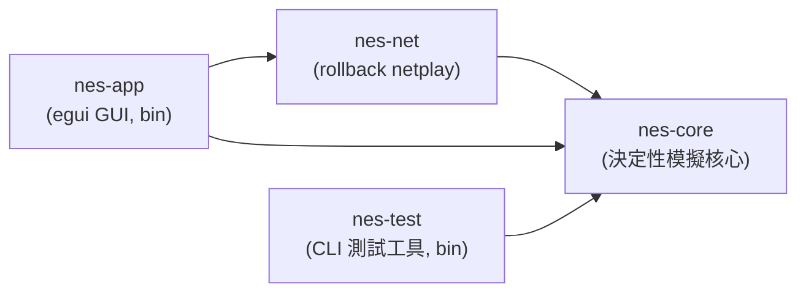
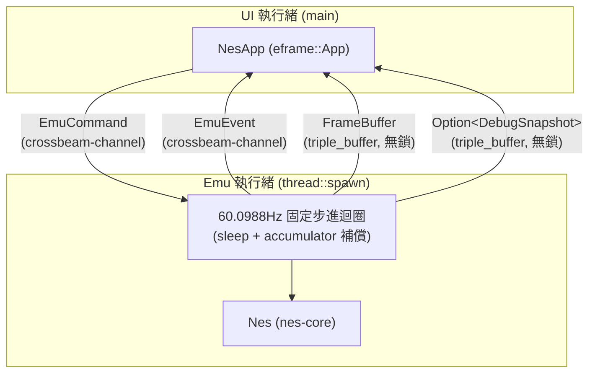
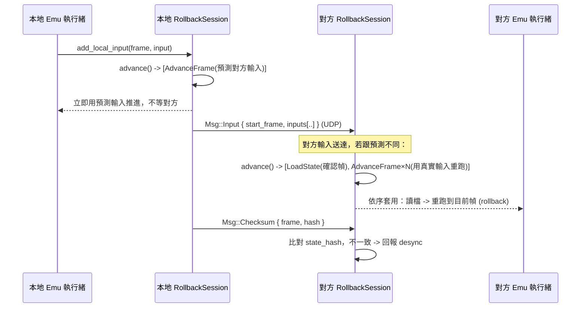
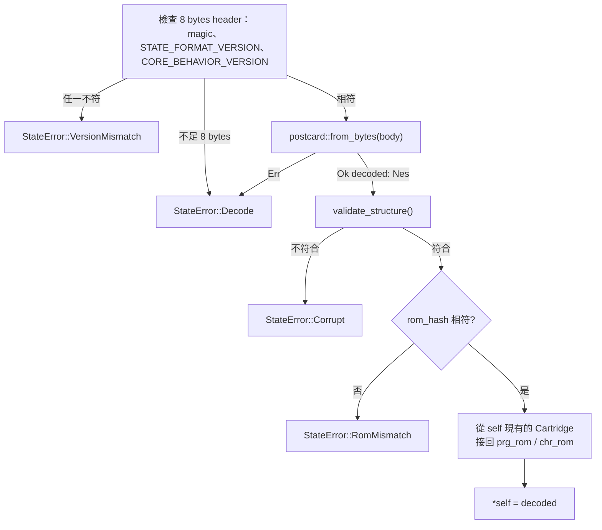

# 架構文件

> 對應課程「應用軟體設計」期末專案的四大主題：作業系統與應用程式的關係、
> 視窗環境、網路環境、整合設計。本文件說明整體架構、各模組如何對應到這些
> 主題，以及幾個關鍵設計決策背後的理由。

## 1. 課程四大主題 ↔ 模組對應表

| 課程主題 | 對應模組 / 機制 | 說明 |
|---|---|---|
| **(1) 作業系統與應用程式的關係**：多執行緒、檔案 I/O、timing | `nes-app/src/emu.rs`（emu 執行緒，60.0988Hz 固定步進）、`nes-app/src/main.rs`（`thread::spawn` + `crossbeam-channel` + `triple_buffer` 跨執行緒通訊）、`nes-app/src/app.rs`（用 `rfd`／`std::fs::read` 做檔案 I/O） | UI 執行緒與 Emu 執行緒分離，避免模擬迴圈的 timing 被 GUI 重繪卡住；反之也避免 GUI 被模擬迴圈的 sleep 卡住。 |
| **(2) 視窗環境** | `nes-app`（`eframe`/`egui`） | 選單列、遊戲畫面 texture、Debugger 側邊面板、狀態列、鍵盤輸入映射。 |
| **(3) 網路環境** | `nes-net`（`protocol.rs` 封包格式、`transport.rs` UDP 傳輸層、`session.rs` rollback 排程） | 用 `std::net::UdpSocket`（non-blocking）+ 手刻協定，不用 async runtime，理由見 §5。 |
| **(4) 整合設計** | `Nes::run_frame` 作為 `nes-core` / `nes-net` / `nes-app` 三者的交會點 | `nes-app` 的 emu 執行緒把「網路層排出的指令」（`nes-net::Request`）套用在 `nes-core::Nes` 上；GUI 只透過 channel 跟 emu 執行緒溝通，三個子系統彼此不直接耦合。 |

## 2. Crate 依賴圖



`nes-core` 是唯一不依賴其他本專案 crate 的節點，且被所有人依賴——這是刻意的：
它必須維持「決定性、無 I/O」的性質，不能被上層的網路或 GUI 邏輯污染。

## 3. 執行緒模型



emu 執行緒與 UI 執行緒之間目前有 5 條獨立通道，方向、型別、用途、背壓策略
各不相同：

| 通道 | 型別 | 方向 | 用途 | 背壓策略 |
|---|---|---|---|---|
| 指令 | `crossbeam_channel::Sender/Receiver<EmuCommand>` | UI → Emu | `LoadRom`／`SetInput`／`Pause`／`Resume`／`SaveState`／`LoadState`／`SetDebugEnabled`／`SetDebugViews`／`StepInstruction`／`StepFrame`／`TraceToFile`／`Quit`，每一則都有意義、不能丟 | unbounded：emu 執行緒每迴圈用 `try_iter()` 一次清空，不會累積 |
| 事件 | `crossbeam_channel::Sender/Receiver<EmuEvent>` | Emu → UI | `RomLoaded`／`Error`／`FpsReport`／`FrameAdvanced`／`TraceWritten`，每則都要送達 | unbounded：`FpsReport` 每秒 1 則、`FrameAdvanced` 每幀 1 則（UI 每次重繪都會 `try_iter()` 清空），不會累積成問題 |
| 畫面 | `triple_buffer::Input/Output<FrameBuffer>` | Emu → UI | 每幀畫好的 `FrameBuffer` | `triple_buffer`：只在乎「最新一張」，UI 沒讀不會擋住 emu 寫入，也不會無限堆積 |
| Debug 快照 | `triple_buffer::Input/Output<Option<DebugSnapshot>>` | Emu → UI | Debugger 面板顯示的 CPU/PPU/APU 狀態；`None` 代表「尚未收到任何快照」，跟真實模擬狀態（即使欄位剛好是 0）明確區分 | `triple_buffer`：同 FrameBuffer；另外用 `EmuCommand::SetDebugEnabled` 讓 emu 執行緒只在面板開啟時才產生快照，面板關閉時零成本 |
| PPU 影像 | `triple_buffer::Input/Output<Option<PpuViews>>` | Emu → UI | Debugger 的 pattern table（2 張 128×128）與 nametable（4 張 256×240），約 1.1MB／份 | `triple_buffer`；而且 **預設不產生**：只有面板開著且目前分頁是 Pattern/Nametable 時，UI 才送 `EmuCommand::SetDebugViews(Some(調色盤))`，emu 執行緒執行中每 3 幀更新一次，暫停時單步/讀檔後立即更新；離開分頁就送 `None`，之後零成本 |

- **為什麼 emu 執行緒跟 UI 執行緒分開？** GUI 重繪（尤其是開啟 debugger 面板、
  拖動視窗）耗時不固定，如果模擬迴圈跟 UI 畫在同一個執行緒，模擬的 timing
  會被 UI 卡頓拖慢；反過來，模擬迴圈裡的 `sleep` 也不能拖慢 UI 的重繪。
- **為什麼畫面／Debug 快照用 `triple_buffer` 而不是 channel？** 這兩者都是
  「每幀更新一次、UI 只在乎最新一份」的資料，如果透過一般 channel 傳遞，
  UI 執行緒處理不及就會塞住 emu 執行緒（channel 滿了會 block，或者用
  unbounded 會無限堆積記憶體）。`triple_buffer` 讓「寫最新一份、讀最新
  一份」永遠是 O(1) 且無鎖，讀寫互不阻塞。
- **為什麼指令/事件用 `crossbeam-channel`？** 指令（LoadRom、SetInput……）跟
  畫面不同，每一則都有意義、不能丟，用 unbounded channel 剛好；`crossbeam`
  比 `std::sync::mpsc` 效能更好、API 更完整（`try_iter` 等）。
- **為什麼 Debug 快照用 `Option<DebugSnapshot>` 而不是直接用
  `DebugSnapshot`？** 曾經發生過的 bug：UI 端在拿不到真實資料時，直接用
  `DebugSnapshot::default()` 頂替，結果 Debugger 面板長期顯示一份看起來
  正常、實際上完全是假資料的畫面（SP/Status 顯示 0，但 reset 後不可能是
  0）。用 `Option` 讓「尚未收到資料」在型別上就跟「收到了、且欄位剛好是
  某個值」區分開來，UI 端沒有任何藉口再用一份假資料頂替。

## 4. `nes-core` 公開 API：為什麼不用 callback

`Nes` 的對外介面刻意設計成「外部驅動、每次跑一幀」：

```rust
pub fn run_frame(&mut self, input: [Buttons; 2]) -> &FrameBuffer;
```

而不是常見的：

```rust
// 不採用的設計
pub fn run(&mut self, get_input: impl FnMut() -> [Buttons; 2], on_frame: impl FnMut(&FrameBuffer));
```

理由：

1. **Rollback 需要「隨時暫停、讀檔、重跑」**。如果模擬迴圈自己控制節奏（例如
   內部跑一個 `loop { ... }` 並透過 callback 要輸入、丟畫面），呼叫端就沒辦法
   在「這一幀」跟「下一幀」之間插入 `save_state`/`load_state`。外部驅動的
   `run_frame` 讓呼叫端（emu 執行緒 / rollback session）完全掌控時間軸。
2. **帶 lifetime 的 closure 會讓 `Nes` 很難被存進其他結構、很難被 `Clone`**。
   rollback 需要對 `Nes` 做 `Clone`／序列化／在多個「假設分支」之間切換，
   closure 型別（尤其是捕捉了外部狀態的）會讓這些操作變得非常麻煩，甚至
   需要 `Box<dyn FnMut>` 才能存起來，等於繞了一圈又回到需要動態分派。
3. **測試更簡單**：外部驅動的 API 讓單元測試可以完全不碰執行緒/計時器，直接
   在迴圈裡呼叫 `run_frame` 幾十幀，這也是 §7 那三個決定性測試能寫得這麼
   直接的原因。

## 5. 為什麼 `Mapper` 用 `enum` 而不是 trait object

`cartridge/mapper.rs`：

```rust
pub enum Mapper {
    Nrom(Nrom),
    Mmc1(Mmc1),
    Uxrom(Uxrom),
    Cnrom(Cnrom),
}
```

而不是：

```rust
// 不採用的設計
pub struct Cartridge {
    mapper: Box<dyn MapperTrait>,
}
```

理由是 **serde 序列化**。存檔（save state）需要把整台 `Nes` 的狀態（包含
`Cartridge`／`Mapper`）序列化成 bytes，之後還要能反序列化回「正確的具體型別」。
`enum` 的每個 variant 都是編譯期已知的具體型別，`derive(Serialize,
Deserialize)` 可以直接運作，postcard 編碼時只需要多存一個 variant tag。

`Box<dyn Trait>` 做不到這件事：trait object 在執行期已經抹除了具體型別資訊，
`serde` 沒辦法單靠 `Box<dyn Trait>` 知道反序列化時該建構哪一個實際的 struct
（需要額外的 registry/tag 機制，例如 `typetag` crate，那還是繞回「本質上是
一個 enum」，只是換一種寫法，且引入了額外依賴與執行期開銷）。既然 mapper
種類是有限且編譯期已知的（NROM/MMC1/UXROM/CNROM……），直接用 `enum` 最簡單、
最快、對 serde 最友善。變體的順序就是存檔裡的 variant tag，只能在最後追加（§15）。各 mapper 的
行為見 §16。

## 6. Netplay 協定與 rollback 流程

### 封包格式（`nes-net::protocol::Msg`）

`Input` 封包刻意帶「最近 N 幀」的輸入歷史（冗餘設計），而不是每幀送一個只
包含當幀輸入的小封包：UDP 會掉包，冗餘設計讓下一個送達的封包自然補上前面
掉的幀，不需要額外的重傳握手（reduce round-trip，這對延遲敏感的 netplay
很重要）。

### Rollback 演算法（詳細版見 `nes-net/src/session.rs` 的 doc comment）



要點：

1. **樂觀預測**：本地不等對方，用「對方上一次已知輸入」預測這一幀，正常
   `AdvanceFrame`。
2. **持續存檔**：每推進一幀都 `SaveState`，保留最近 N 幀（N 由
   `input_delay` 與允許的 rollback 深度決定）。
3. **輸入送達後比對**：真正的對方輸入送到後，如果跟預測不同，從「雙方都
   確定」的那一幀 `LoadState`，再用真實輸入依序 `AdvanceFrame` 追到目前幀
   （這就是 rollback：時間軸上退回去，重新播放）。
4. **確認幀推進**：雙方輸入都確定的幀變成 `confirmed_frame`，更早的存檔可
   以丟棄。
5. **Desync 偵測**：定期交換 `Nes::state_hash()`（xxh3-64 對 `save_state()`
   雜湊），同一幀雙方雜湊不一致就代表模擬邏輯出現了不確定性，應立即中止並
   回報，而不是悄悄讓兩邊玩不同的遊戲。

`RollbackSession` 目前（Phase 0）只定義了資料結構與方法簽名，`handle_msg`／
`advance` 的本體回傳空結果，真正的排程邏輯排進後續階段。

## 7. 決定性（determinism）規則清單

Rollback 與 desync 偵測完全依賴「同樣的初始狀態 + 同樣的輸入序列，永遠算出
同樣的結果」。`nes-core` 因此遵守以下規則：

1. `#![forbid(unsafe_code)]`：整個 crate 禁止 `unsafe`。
2. **不依賴任何 I/O、時間、亂數、執行緒或 GUI crate**——`nes-core` 的
   `Cargo.toml` 只有 `serde`/`postcard`/`xxhash-rust`/`thiserror`/
   `bitflags`，沒有 `std::time`、沒有 RNG、沒有 `std::thread`。所有「這一幀
   该做什麼」都由呼叫端透過 `run_frame(input)` 的參數決定。
3. **不在會影響狀態的邏輯中迭代 `HashMap`**——`HashMap` 的迭代順序在不同
   執行、不同機器上不保證一致（受 `RandomState` 影響），會讓兩台跑一樣輸入
   序列的機器算出不同結果。`nes-core` 目前沒有任何 `HashMap`；`nes-net` 的
   `RollbackSession` 需要「照幀號排序」的關聯容器時，用的是 `BTreeMap`（見
   `session.rs`），因為它的迭代順序是由 key 排序決定的，跨執行/跨機器保證
   一致。
4. **對外 API 是外部驅動、每幀呼叫**：見 §4，避免 `Nes` 自己掌控時間軸。
5. **所有進入 save state 的型別都 `derive(Serialize, Deserialize)`**，且整個
   `Nes` 型別樹只用 plain owned data（沒有 `Rc`/`RefCell`/`Arc`/`Mutex`），
   確保 `Nes` 可以被完整 `Clone`／序列化／還原，這是 rollback 的存檔/讀檔
   機制能運作的前提。（靜態 ROM bytes 是例外，刻意 `#[serde(skip)]`，理由與
   讀檔時如何確保接回同一份 ROM、如何拒絕損毀資料，見 §8。）
6. **畫面渲染是純函式**：Phase 0 的 `FrameBuffer::render_test_pattern(frame_count,
   input)` 只由這兩個參數決定輸出，不讀取任何全域/外部狀態；Phase 2 的 PPU
   渲染器（`ppu/render.rs`）維持這個性質：一條掃描線的像素只由當下的 `Ppu`
   （v/fine X/PPUCTRL/PPUMASK/OAM/調色盤）與卡帶 CHR 決定，沒有浮點運算、沒有
   時間或亂數。調色盤（`ppu/palette.rs`）是整數查表。`Ppu::frame_buffer` 是
   「輸出」而不是「狀態」，不進 save state（見 §8）。

以下三個測試（`crates/nes-core/src/lib.rs` 的 `tests` module）直接驗證了規則
5、6 帶來的性質：

- `save_then_load_preserves_state_hash`：存檔後立刻讀檔，`state_hash` 不變。
- `identical_input_sequences_produce_identical_hashes_across_instances`：
  兩個獨立的 `Nes` 實例，餵一模一樣的輸入序列，跑完之後雜湊完全相同。
- `rollback_replay_matches_uninterrupted_run`：在第 k 幀存檔、跑到 k+m、
  讀回存檔、用「相同」的輸入重新跑到 k+m，結果與「完全沒有讀檔」的一次
  性執行一模一樣——這正是 rollback 依賴的核心性質。

## 8. Save state 格式：排除 ROM bytes、用雜湊比對、拒絕損毀資料

Rollback 需要高頻率地存檔/讀檔（理論上每幀都可能存一次），所以 save state
的設計有兩個額外目標：**不要浪費空間重複存不會變的資料**、**讀到壞資料時要
明確拒絕，不能 panic 或悄悄跑出錯的模擬**。

### 8.1 ROM bytes 不進 save state

`Cartridge` 的 `prg_rom`/`chr_rom` 兩個欄位標了 `#[serde(skip)]`：

```rust
#[serde(skip)]
pub prg_rom: Vec<u8>,
#[serde(skip)]
pub chr_rom: Vec<u8>,
```

理由：同一場對局裡，PRG-ROM/CHR-ROM 的內容從頭到尾不會變（它們是唯讀
的卡帶資料），rollback 每次存讀檔都把整份 ROM（可能幾百 KB）重複序列化一次
既浪費頻寬/記憶體、也拖慢「每幀都可能要存一次檔」的效能需求。真正會變的
只有 **CHR-RAM**、**PRG-RAM**、CPU/PPU/APU 暫存器等執行期狀態，這些欄位照
常序列化。連帶地，[`Nes::state_hash`] 因為是對 `save_state()` 的輸出做
xxh3-64，也自動不包含 ROM bytes，只反映「真正會變的狀態」。

### 8.2 `rom_hash`：確保讀檔時接回「同一份」ROM

因為 `prg_rom`/`chr_rom` 被跳過，`load_state` 讀回資料後必須從目前記憶體裡
已經載入的 ROM 把這兩個欄位接回去——但如果存檔其實是另一款遊戲存的
（例如使用者不小心把《薩爾達》的存檔拿去讀《瑪利歐》），接回去的 PRG/CHR
資料跟存檔裡的 CPU/PPU 狀態完全對不上，會直接跑出垃圾畫面或亂七八糟的
行為，而且不會有任何錯誤訊息。

`Cartridge` 因此多存一個 `rom_hash: u64` 欄位（`xxh3_64(prg_rom ++
chr_rom)`，在 `ines::parse` 解析時算好），`Nes::load_state` 讀檔時比對存檔
裡的 `rom_hash` 跟目前已載入 ROM 的 `rom_hash`：

```rust
let expected_hash = self.cpu.bus().cartridge.rom_hash;
let found_hash = decoded.cpu.bus().cartridge.rom_hash;
if expected_hash != found_hash {
    return Err(StateError::RomMismatch { expected: expected_hash, found: found_hash });
}
```

不符合就回傳 `StateError::RomMismatch`，拒絕讀檔，而不是接上錯的 ROM 繼續跑。

### 8.3 結構驗證：拒絕長度被竄改的資料

postcard 對 `Vec<u8>` 的編碼是「長度前綴 + 內容」，理論上存檔資料可能因為
儲存媒介損毀、或被惡意竄改，導致解碼出一個「型別對、但長度不符合硬體規格」
的 `Nes`（例如 RAM 變成 2049 bytes）。`Nes::load_state` 在比對 `rom_hash`
之前，會先呼叫內部的 `validate_structure()` 逐一檢查：

- `Bus::ram` 必須是 `0x0800`（2KB）
- `Ppu::vram` 必須是 `2048`
- `Ppu::oam` 必須是 `256`
- `Cartridge::chr_ram` 必須符合 `info.chr_rom_banks`（有 CHR-ROM 就該是 0，
  沒有就該是 `CHR_RAM_SIZE`）
- `Cartridge::prg_ram` 必須是 `PRG_RAM_SIZE`

任何一項不符合就回傳 `StateError::Corrupt`，絕不 panic、也不會讓後續（尤其
是 Phase 1 之後會實作的 `Bus::read`/`write`）因為陣列長度不對而 out-of-bounds
panic。

### 8.4 `load_state` 完整流程



對應的三個「拒絕壞資料」測試（`crates/nes-core/src/lib.rs`）：

- `load_state_rejects_truncated_bytes`：把存檔位元組砍半再讀，驗證回傳
  `StateError::Decode`。
- `load_state_rejects_tampered_length`：手動把一份有效存檔的 RAM 長度改壞
  （`push` 多一個 byte）再讀，驗證 `validate_structure` 攔下來、回傳
  `StateError::Corrupt`。
- `load_state_rejects_mismatched_rom`：拿「另一份 ROM」存的檔去讀目前載入
  的 ROM，驗證回傳 `StateError::RomMismatch`。

### 8.5 Phase 3：存檔 header 與版本號

`save_state` 的輸出開頭是 8 bytes header（magic `"NESS"`、`STATE_FORMAT_VERSION`、
`CORE_BEHAVIOR_VERSION`，後兩者 u16 little-endian），後面才是 postcard 編碼的 `Nes`。
`load_state` 先檢查 header，magic 或任一版本號不符就回傳
`StateError::VersionMismatch { expected, found }`（`StateHeader`：magic + 兩個版本號），
在解碼與驗證之前就拒絕，不改動 `self`。版本號的意義、判定規則與 Phase 4 的銜接見 §15。
測試：`load_state_rejects_tampered_magic`、`..._tampered_format_version`、
`..._tampered_core_behavior_version`、`load_state_rejects_input_shorter_than_the_header`。

### Phase 2 補充：PPU 進 save state 的內容

- **進存檔**：`Ppu` 的所有時序與暫存器狀態——PPUCTRL/MASK/STATUS、OAMADDR、
  loopy `v`/`t`/fine X/`w`、`$2007` 讀取緩衝、I/O latch、OAM、VRAM、調色盤、
  **掃描線與 dot（＝CPU 與 PPU 之間的相位）**、幀計數與奇偶幀旗標、NMI 線與
  待處理旗標（含「寫 PPUCTRL 造成、要晚一條指令」的延遲旗標）、sprite 0 hit
  排定的 dot、預取次數；`Bus` 的 `total_cycles`、OAM DMA 待處理旗標、搖桿移位
  暫存器。因為 catch-up 模型下 PPU 位置就是 `total_cycles × 3` 的結果，存檔在
  「一幀中間」（單步除錯停下來時）也能完整還原，測試
  `mid_frame_save_state_preserves_cpu_ppu_phase` 驗證。
- **不進存檔**：`Ppu::frame_buffer`（輸出，下一幀會整張重畫）。代價是讀檔之後
  「立刻」拿到的畫面是全黑，直到下一次 `run_frame`；GUI 讀檔後不會更新畫面
  緩衝，所以暫停中讀檔畫面維持舊圖，繼續跑之後就會是正確的。
- **`load_state` 驗證**：除了 §8 原本的長度檢查，也檢查 PPU 欄位在硬體範圍內
  （掃描線 ≤ 261、dot ≤ 340、v/t ≤ `$7FFF`、fine X ≤ 7……），超出範圍回傳
  `StateError::Corrupt`，避免竄改的存檔讓 `run_frame` panic。

## 9. CPU 精度層級：instruction-level（Phase 1）

`crates/nes-core/src/cpu/mod.rs` 實作的 6502（2A03）CPU 是 **instruction-level**
（指令級）精度，不是 **cycle-level**（cycle 級）精度。差異：

- **cycle-level** 模擬器把每條指令拆成一個個 cycle 的微碼狀態機，`step()`
  每次只推進一個 cycle；匯流排存取（包含指令執行「途中」的每一次讀寫）都
  照真實硬體的時序精確發生。
- 本專案的 **instruction-level** 模擬器裡，`Cpu::step()` 一次把一條指令從
  取指到寫回全部做完，只在最後告訴呼叫端「這條指令總共花了幾個 cycle」
  （查 `OPCODES` 表 + 跨頁/分支的動態加成），再一次呼叫 `Bus::tick` 補上
  時間，而不是每個 cycle 都真的去摸一次匯流排。

### 為什麼選這個層級

Phase 1 的目標是「CPU 正確性」——最終暫存器狀態、指令消耗的 cycle 總數、
分支/跨頁的邊界行為要跟真實硬體一致（用 nestest 驗證）。這些性質全部只跟
「一條指令執行前」與「執行後」的狀態有關，跟「執行途中每個 cycle 匯流排上
發生了什麼」無關。既然目標不需要後者，选 instruction-level 可以大幅簡化
實作：`OPCODES` 表直接查表決定 cycle 數，每條指令只要寫「做什麼」，不用另外
寫「這個 cycle 該做什麼、下個 cycle 該做什麼」的狀態機。

### 影響／代價

1. **通過 nestest，但不是 SingleStepTests 的 `cycles` 欄位**。SingleStepTests
   每筆測試資料除了「最終暫存器/RAM」，還有一份「這條指令逐 cycle 的匯流排
   讀寫紀錄」；照任務規格我們只比對前者，不比對後者（見
   `crates/nes-core/src/cpu/singlestep.rs` 的模組文件）。實測結果：**官方
   opcode 256 萬分之 151 萬筆全數通過（100%）**；非官方 opcode 中，任務要求
   的那些（LAX/SAX/DCP/ISB/SLO/RLA/SRE/RRA/\*SBC/各種 NOP/JAM/ANC/ALR/ARR/
   AXS）也全數通過（JAM 只比對暫存器/RAM，cycle 數的差異見 §10）。Phase 2 時只有 8 個任務範圍外、
   真實硬體行為本身就不穩定（analog/undefined，依賴個別晶片的類比殘留電荷，不是單純的邏輯 bug）
   的 opcode（`$8B` `$93` `$9B` `$9C` `$9E` `$9F` `$AB` `$BB`）維持 NOP 占位；Phase 3 實作了
   `$9C/$9E/$AB`（§16.7），剩 5 個。
2. **PPU/mapper 還無法在指令「執行途中」插手**。例如某些少見的技巧（在
   PPU 正在畫某條掃描線的當下，靠一條指令的第 3、第 4 個 cycle 精準寫某個
   PPU 暫存器）需要 cycle-level 才能重現；Phase 1 的 PPU 還是 stub，用不到
   這個精度，之後如果真的要做這類精細時序（例如 sprite-0 hit 的邊界情況），
   才需要重新評估要不要把 CPU 也改成 cycle-level。
3. **`Bus::tick` 每條指令分兩段補時間**（Phase 3 定案，見 §13.1）：指令執行前追 `N − 1` 個
   cycle、執行後補最後 1 個，而不是逐 cycle 呼叫；PPU 的 `(scanline, cycle)` 是從累積的
   `total_cycles * 3` 換算回去的（見 `Bus::ppu_dot`），在「一條指令之內」沒有更細的解析度，
   但指令邊界（`trace()`/`debug_snapshot()`）讀到的值是精確的。

這個決定不影響 §7 的決定性規則：instruction-level 一樣是完全決定性的（同樣
輸入序列永遠得到同樣結果），只是不模擬「指令執行到一半」這個中間狀態。

## 10. SingleStepTests 回歸閘門與分類

`cargo test --release -p nes-core --lib cpu::singlestep -- --ignored --nocapture`
會把 256 個 opcode（各 10,000 筆，共 256 萬筆）依下表分類，**前三類任一類別
未 100% 通過就讓測試失敗**。第四類只列出、不影響結果。

| 類別 | opcode | 筆數 | 比對內容 | 閘門 |
|---|---|---|---|---|
| 官方 | 151 個官方 opcode | 1,510,000 | 暫存器 + RAM + **cycle 數** | 必須 100% |
| 非官方（穩定） | 其餘非官方（LAX/SAX/DCP/ISB/SLO/RLA/SRE/RRA/`*SBC`/各種 NOP/ANC/ALR/ARR/AXS/**SHY/SHX**…） | 870,000 | 暫存器 + RAM + **cycle 數** | 必須 100% |
| JAM | `02 12 22 32 42 52 62 72 92 B2 D2 F2`（12 個） | 120,000 | 暫存器 + RAM，**不比對 cycle 數** | 必須 100% |
| 不穩定 | `8B 93 9B 9F AB BB`（6 個；Phase 3 前是 8 個） | 60,000 | 全部（預期失敗） | 僅列出 |

理由：

- **JAM**：真實硬體執行 JAM 後 CPU 卡死。測試資料把「卡死」展開成 11 個 cycle
  的匯流排活動；本核心是 instruction-level，用 `Cpu::jammed` 旗標表示卡死，
  `step()` 回傳 2 cycle。「卡死後暫存器與 RAM 不再變動」是有意義且可驗證的
  性質，所以必須相符；11 vs 2 的 cycle 差異是模型差異，不是 bug，測試會把
  「暫存器/RAM 相符但 cycle 數不同」的案例數與範例單獨印出。
- **不穩定的 6 個**：真實行為取決於匯流排殘留電容、DMA 時機、晶片批次等類比因素，
  SingleStepTests 的期望值只是其中一種取樣。其中 `$8B $93 $9B $9F $BB` 維持 NOP 占位（0%）；
  `$AB` 依 blargg 實作，與 SingleStepTests 約 56% 相符。預期失敗，不計入閘門；若日後有人實作而
  通過，也不會讓測試失敗。**Phase 3 把 `$9C`、`$9E` 移出這一類**：依 blargg 實作後
  SingleStepTests 實測 100%，所以改列「非官方（穩定）」並納入閘門；`$AB` 留下的理由（blargg 與
  SingleStepTests 的 magic 常數互相衝突）見 §14.5。

實測（Phase 3）：官方 1,510,000/1,510,000、非官方穩定 870,000/870,000、JAM
120,000/120,000（其中 120,000 筆 cycle 數為預期差異）、不穩定 5,578/60,000。

## 11. Debugger API 與單步的決定性代價

`Nes` 上的 `trace()`、`peek()`、`step_instruction()` 是 Debugger 的正式公開
API，不在 `testing` feature 之後。`testing` 只剩純測試用途的 `override_pc`。

- `trace()`、`peek()`：唯讀、無副作用（不觸發 PPU/APU 暫存器的讀取副作用），
  任何時候都可以呼叫。
- `step_instruction()`：**會打破「以幀為單位」的決定性**。`run_frame` 保證
  每幀推進固定的 cycle 預算；單步讓 CPU 停在幀中間，之後的 `run_frame` 從
  那個位置繼續，兩台機器只要有一台單步過，狀態就對不上。因此只能在暫停狀態
  下使用，**netplay 進行中不得呼叫**。`nes-app` 的 emu 執行緒在
  `StepInstruction`／`StepFrame`／`TraceToFile` 指令上檢查暫停旗標，未暫停時
  回報 `EmuEvent::Error` 而不執行。

### 狀態列幀數 vs. Debugger cycle 數的取樣落差

原因：狀態列的幀數原本取自 `EmuEvent::FpsReport`，emu 執行緒每 1 秒才送一次
（約每 60 幀一次），UI 顯示的幀數平均落後真實幀數約 30 幀（最多近 60 幀）；
Debugger 快照卻是每幀更新，兩者就出現了約 35 幀的落差。

修正：`FpsReport` 只帶 FPS；新增每幀一則的 `EmuEvent::FrameAdvanced(frame)`
（單步、讀檔、載入 ROM 後也會送），並在 `DebugSnapshot` 加入 `frame_count`。
Debugger 開著時，狀態列直接用同一份快照的 `frame_count`，因此與面板的 cycle
數必然一致；面板關閉時用 `FrameAdvanced`。

## 12. 待辦

- **Phase 6：字型瘦身。** 將 `NotoSansCJKtc-Regular.otf`（目前 16MB、完整字重）
  subset 為常用繁體字以縮小執行檔，並確認 OFL 對修改後字型的命名規定
  （OFL-1.1 對「Modified Version」的 Reserved Font Name 限制，以及 subset
  後是否必須改名）。決定於第 0 步：目前保留完整字型，不做 subset。
- **下一階段是 Phase 3.5（APU 與音訊輸出），不是 Phase 4。** APU 會再改變一次模擬行為，
  必須遞增 `CORE_BEHAVIOR_VERSION`（目前為 2），並在 Phase 4 的 replay 格式與 netplay
  握手出現之前完成。
- **實體手把（gilrs）：決定先不加，留到 Phase 5 再評估。** 需要新增依賴，屆時要先說明用途、
  授權與替代方案，經同意才加。在此之前雙人只有鍵盤（見 `nes-app/src/input.rs`）。
- **耗時上升：決定先接受，不隔離成因。** Phase 3.1 起 `run_frame` 每幀約多 70 µs（§14.6），
  尚未查明成因。Phase 4 會量測 rollback 重跑的實際成本，屆時若吃緊再優化。
- **Phase 4 之後的候選**：MMC3 與
  scanline IRQ；PRG-RAM 電池存檔的持久化；MMC1 的 SUROM／SXROM；
  `$8B $93 $9B $9F $BB` 這 5 個不穩定 opcode。

## 13. 時序模型（Phase 3 定案）

> **定案**：本節描述的時序是凍結後的模型。之後任何會改變它的修改都屬於「會改變模擬結果
> 的修改」，必須遞增 `CORE_BEHAVIOR_VERSION`（§15）。

### 13.1 模型：分段 catch-up

- CPU 維持 instruction-level（§9）。PPU 的 `(掃描線, dot)` 就是 `total_cycles × 3`
  推進的結果，不另存「相位」。
- **一條 N cycles 的指令分成兩段推進 PPU**（`Cpu::step`）：
  1. 取 opcode、解出運算元（不推進時間）；
  2. PPU 追上 **N − 1** 個 CPU cycle（`3 × (N − 1)` 個 dot）；
  3. 執行指令——讀寫記憶體與 PPU 暫存器都發生在這個時間點；
  4. PPU 再追上**最後 1 個 cycle**，加上分支 taken／跨頁的額外 cycle
     （分支不碰 PPU，所以放在後段無妨）。
  之後才處理 OAM DMA（暫停 513/514 cycles，PPU 照常追上）。
  舊模型（Phase 2）是 2→3→4 合併成「執行完才一次追 N 個 cycle」。
- **索引定址的 dummy read（Phase 3.1）**：abs,X / abs,Y / (ind),Y 在位址高位元組修正之前，
  硬體會先讀一次「低位元組已加上索引、高位元組仍是基底」的**未修正位址**。讀取類指令只有
  **跨頁時**才有（沒跨頁時那次就是真正的讀取）；store 與 RMW 指令（含非官方的
  SLO/RLA/SRE/RRA/DCP/ISB、SHY/SHX）**一律有**。因為這個位址可以是 `$2007` 這類有副作用的
  暫存器，所以在定址階段真的做一次 `Bus::read`，並放在真正存取之前 1 個 cycle
  （`step()` 的兩段 catch-up 在這裡多切一刀：`N−2`、dummy read、`1`、執行、`1`）。
  RMW 的完整存取順序：dummy read（未修正）→ 真正的讀取 → 寫回舊值（dummy write）→ 寫入新值。
  **Phase 3.1 起 RMW 對所有位址都寫兩次**（Phase 3 只在 `$8000+`），所以 `INC $2006` 也如硬體
  般寫兩次。其他定址模式的 dummy read 刻意不模擬，判斷見 §13.4。
- **一幀的邊界是「PPU 完成一幀」**：`Nes::run_frame` 迴圈跑到 PPU 進入 vblank
  （掃描線 241、dot 1）為止。此時 240 條可見掃描線都已畫完，之後到下一幀開始不會再寫
  framebuffer，所以拿到的畫面不會撕裂。CPU 只能在指令邊界停下，實際會越過 vblank 起點
  最多一條指令（≤ 8 cycles ＝ 24 dot，OAM DMA 則 513/514 cycles）——越過的部分只是
  vblank，無害。
- **輸入在一幀開始時鎖定**：`run_frame` 把兩個搖桿的按鍵狀態寫進 `Joypad::state`，
  整幀不再變；程式 strobe `$4016` 之後讀到的永遠是這一幀的輸入。
- **NMI**：PPU 在 vblank 起點（若 PPUCTRL bit7 開）或 vblank 期間寫 PPUCTRL
  bit7 由 0 變 1 時，在「NMI 輸出線」上偵測到邊緣並登記；CPU 在每條指令開始前
  檢查（`Cpu::step` 開頭），有就服務（7 cycles，該步不執行指令）。由 CPU 寫
  PPUCTRL 造成的邊緣多等一次檢查（＝「下一條指令之後」才觸發），對應硬體上寫入
  發生在指令最後一個 cycle、趕不上該指令結尾的偵測。（分段 catch-up 之後
  `04-nmi_control` 仍通過，這個規則不需要調整。）
- **OAM DMA**：`STA $4014` 之後，該指令結束時瞬間複製 256 bytes（從 OAMADDR 起、
  繞回），CPU 暫停 513 cycles（DMA 起始 cycle 為奇數則 514）。
- **渲染**：每條可見掃描線在 dot 0 一次畫完（背景 33 個 tile + 精靈 + 優先順序）；
  但 v 暫存器依真實時序逐 dot 遞增（dot 8/16/…/256 coarse X、dot 256 Y、dot 257
  hori(v)=hori(t)、pre-render 行 dot 280–304 vert(v)=vert(t)、dot 328/336 預取），
  所以 SMB 那種「等 sprite 0 hit 之後在 hblank 改捲動」的畫面分割會落在正確的
  掃描線。sprite 0 hit 在渲染該線時算出命中的 x，等 PPU 走到 dot x+1 才設旗標。
  測試 `sprite0_split_scroll_takes_effect_on_the_next_scanline` 驗證。
- **nametable mirroring 每次存取都查 mapper**（§16.4），不是載入 ROM 時決定一次。

### 13.2 寫入 PPU 暫存器的時機誤差（定案後）

模型把「指令的記憶體存取」放在**最後一個 cycle 開始的時間點**。對絕大多數會碰 PPU
暫存器的指令（`LDA/BIT/STA abs`、`STA abs,X`、`STA (zp),Y`……）這正是硬體上讀寫發生
的那個 cycle，剩下的誤差是 cycle 內的次序（1 個 CPU cycle ＝ 3 dot）：

| 指令 | cycles | 存取所在 cycle | 模型與硬體的差 |
|---|---|---|---|
| `LDA $2002`、`STA $2005/$2006/$2007`（abs） | 4 | 第 4 個（最後） | 存取時間點吻合；cycle 內 ≤ 3 dot |
| `STA $2007,X`、`STA ($xx),Y` | 5–6 | 最後 | 同上 |
| `INC/DEC/ASL…`（讀-改-寫）abs / abs,X | 6 / 7 | **讀**在第 4 / 5 個，寫在最後 | 「讀」被放到最後：PPU 比硬體多前進 2 個 cycle（≤ 6 dot）；寫吻合 |

（Phase 2 舊模型的落後是 `cycles − 1`，最多 5–6 個 CPU cycle／15–18 dot，見 git 歷史。）
一條掃描線有 341 個 dot，所以這個誤差對「以掃描線為單位」的用法（等 vblank、等 sprite 0
hit、在 hblank 改捲動）已經降到 ±1 dot 量級，不再有「±1 條線」的不確定窗口。
`split_catch_up_makes_ppu_register_reads_see_the_dots_before_the_last_cycle` 用
`LDA $2002` 驗證：PPU 在 vblank 起點前 9 dot（3 個 CPU cycle）時，讀取剛好看得到旗標；
早 1 dot 就看不到。RMW 那一列是從程式碼推論，沒有專門的測試。

**仍然受影響的東西：**

- *測試*：需要單一 PPU dot 精度的測試仍失敗——`ppu_vbl_nmi` 的 02（vbl 設旗標時間）、
  05（NMI 時間）、06（讀 `$2002` 抑制）、07/08（NMI 開關時間）、10（奇偶幀跳過的時間）。
  細節見 §14。
- *遊戲*：在 hblank 中做 mid-scanline 特效、且時間窗口只有幾個 dot 的畫面分割；
  逐 cycle 數指令、在特定 dot 改寫暫存器的 demo。**沒有真實遊戲驗證**，見手動測試文件。
- *渲染粒度*：一條線畫完之後才發生的暫存器寫入（mask、捲動、PPUCTRL、CHR-RAM／CHR bank
  切換、調色盤）要到下一條線才反映；硬體上這些會在線的中途生效。**MMC1 遊戲若在一條線的
  中間切 CHR bank，會有一條線的差異。**
- *dummy read*：索引定址的 dummy read 已在 Phase 3.1 模擬（§13.1），`ppu_read_buffer` 因此
  通過；其餘定址模式的 dummy read 刻意不模擬（§13.4）。

**本階段刻意不模擬的其他細節：** 開機後約 29658 cycles 內忽略部分暫存器寫入；
`$2007` 在渲染中存取時 v 的怪異遞增；渲染中寫 OAMDATA 的位址損壞；sprite overflow
的硬體 bug（只做「同一線超過 8 個精靈」的基本判斷）；I/O latch 的衰減；
BRK/NMI 的 hijack；`$2002` 在剛好 vblank 起點被讀取時的旗標抑制。

### 13.3 為什麼是這個切法（驗證紀錄）

Phase 2 實驗過、Phase 3 採用。與 Phase 2 相比（實際執行結果）：

- nestest：8991 行仍全數通過（指令邊界的時序沒變）。
- blargg：2005 版 `vbl_clear_time` 由失敗變通過；`ppu_vbl_nmi` 其餘失敗項目（需要 1 dot
  精度）與通過項目都不變；CPU 測試因為 `$9C/$9E/$AB` 另外變化（§14.1）。
- **黃金畫面：23 個 Phase 2 就有的雜湊，用 `nes-test golden` 逐一重新產生，全部與舊值相同
  （0 個改變）。** 原因：這些 ROM 結束時的畫面只是「印出測試結果文字」，通過／失敗與訊息
  文字沒變，畫面就不變；分段 catch-up 移動的是指令內 1 個 CPU cycle 的相位，肉眼與雜湊都
  看不到。`golden_frame_hash_of_rendering_rom`（合成 ROM，畫面每幀捲動）同樣不變。
  **這不代表模擬結果沒變**：狀態雜湊（`state_hash`）包含 PPU 掃描線／dot 相位，所以每份
  存檔都與 Phase 2 不同——這就是新增「行為指紋」測試（§15.3）的原因。
- `run_frame` 平均耗時：見 §14.6。

### 13.4 哪些 dummy read 模擬、哪些不模擬（Phase 3.1 的判斷）

原則：**會落在資料位址空間、因此可能碰到有副作用的 I/O 暫存器**的 dummy read 要模擬；位址由指令
本身固定、落在 RAM 或指令流的，沒有副作用，不模擬。

| 定址模式／指令 | dummy read 的位址 | 模擬？ | 理由 |
|---|---|---|---|
| abs,X / abs,Y / (ind),Y 的**讀取**指令 | 跨頁時的未修正位址 | **是（僅跨頁）** | 位址由資料決定，可以是 `$2007` 等 |
| abs,X / abs,Y / (ind),Y 的 **store / RMW** | 未修正位址（一律） | **是** | 同上 |
| RMW 的寫回前 dummy write | 同一位址寫舊值 | **是（所有位址）** | 對 PPU 暫存器與 mapper 有副作用（§16.3） |
| ZeroPage,X / ZeroPage,Y / (zp,X) | 未加索引的 zero page 位址 | 否 | zero page 是內部 RAM，讀取沒有副作用 |
| Implied / Accumulator | `PC + 1` | 否 | 指令流；除非程式在 I/O 位址執行才有副作用（不實際） |
| 堆疊指令 PHA/PHP/PLA/PLP/JSR/RTS/RTI/BRK | 堆疊頁 `$0100-$01FF`、`PC + 1`、RTS 的返回位址 | 否 | RAM 與指令流 |
| Relative（分支） | 成立時的 `PC + 2`、跨頁時的未修正目標 | 否 | 指令流 |
| Absolute / Immediate / ZeroPage / Indirect | 無 dummy read（RMW 的 dummy write 已涵蓋） | — | — |

這個判斷用 SingleStepTests 的存取比對驗證（§14.5）：不模擬的那些在資料裡全部只表現為「缺讀」，且
缺的位址都落在上表允許的區域；沒有任何「多讀」或寫入差異。**局限**：判斷「沒有副作用」是假設遊戲
不會在 `$2000-$401F` 執行程式碼；若日後要支援執行 I/O 區的程式（不實際），或改成 cycle-level，
這些就要補上。

## 14. Phase 3 測試結果（與 Phase 2 對照）

執行環境：`cargo build --release -p nes-test` 後以 `nes-test blargg <rom>` 執行
（`--max-frames` 6000–12000；ROM 放在被 gitignore 的 `roms/nes-test-roms/`，見
`ATTRIBUTION.md`）。以下都是實際執行的輸出。**變化欄**只列與 Phase 2（前一版 §14）的差異。

### 14.1 CPU：instr_test-v5

| ROM | Phase 3 | 變化與原因 |
|---|---|---|
| `rom_singles/` 01、02、04、05、06、08–16（14 個） | **通過** | 無變化 |
| `rom_singles/03-immediate` | **通過** | 失敗→通過：實作 `$AB` LXA（magic `$FF`，`A = X = imm`） |
| `rom_singles/07-abs_xy` | **通過** | 失敗→通過：實作 `$9C` SHY、`$9E` SHX |
| `official_only.nes`（MMC1） | **通過**（1855 幀） | 無法載入→通過：實作 mapper 1 |
| `all_instrs.nes`（MMC1） | **通過**（2383 幀） | 無法載入→通過：實作 mapper 1 |

### 14.2 PPU：ppu_vbl_nmi

`rom_singles/`：**與 Phase 2 完全相同**——01、03、04、09 通過；02、05、06、07、08 失敗
`$01`、10 失敗 `$03`，原因見 Phase 2 §14.2 的說明（全部是「需要單一 PPU dot 精度」）。
分段 catch-up 把落後從最多 5–6 個 CPU cycle 降到約 1 個，但這些測試要的是 1 dot 精度，
改善不夠，**也沒有硬湊**。

`ppu_vbl_nmi.nes`（合集，MMC1）：無法載入→**可載入、失敗 `$01`**：合集依序執行，
在第 2 項（`02-vbl_set_time`）失敗即停止，與單檔結果一致（第 1 項通過）。

### 14.3 其他 PPU 測試

| ROM | Phase 3 | 變化與原因 |
|---|---|---|
| `oam_read` | **通過** | 無變化 |
| `blargg_ppu_tests`：palette_ram、sprite_ram、vram_access | **通過** | 無變化 |
| `blargg_ppu_tests`：`vbl_clear_time`（2005） | **通過** | **失敗 `$03`→通過**：分段 catch-up（讀 `$2002` 落在指令最後一個 cycle） |
| `blargg_ppu_tests`：`power_up_palette` | 失敗 `$02` | 無變化：測的是作者那台機器的開機調色盤，不是規格，不追求相符 |
| `sprite_hit_tests_2005.10.05` 01–11 | **通過**（11 個） | 無變化 |
| `ppu_read_buffer/test_ppu_read_buffer.nes`（CNROM） | Phase 3：失敗 `$23`（#35）；**Phase 3.1：通過** | Phase 3 時 #35（`STA $2000,Y` 必須對 `$2007` 做 dummy read）失敗，與 CNROM 無關；Phase 3.1 實作索引定址的 dummy read（§13.1）後通過 |
| `scrolltest/scroll.nes`（MMC1） | （無自動判定） | 這是給人看的捲動示範，沒有 `$6000` 協定；截圖（200 幀）顯示標題文字與 tile 底圖正常，需要按方向鍵才會捲動，捲動行為未驗證 |

### 14.4 mapper 專用測試 ROM

`roms/nes-test-roms/` 裡**沒有 mapper 專用的測試 ROM**（沒有 MMC1 / UxROM / CNROM 的
bank 切換、mirroring、PRG-RAM 測試）。用到 mapper 的只有上面列的驗收 ROM
（`official_only`、`all_instrs`、`ppu_vbl_nmi.nes`、`scroll.nes` 是 mapper 1，
`test_ppu_read_buffer` 是 mapper 3），它們只是「剛好用 MMC1／CNROM 當載體」，
對 mapper 邏輯的檢驗很淺。**沒有去其他地方找 ROM。** mapper 邏輯的驗證靠 Rust 單元測試
與整合測試（合成 ROM，見 §16.8）和 `docs/manual-test-phase3.md` 的手動測試。

### 14.5 SingleStepTests 閘門的分類變化

| 類別 | Phase 2 | Phase 3 | 說明 |
|---|---|---|---|
| 官方 | 1,510,000 / 1,510,000 | 1,510,000 / 1,510,000 | 100%，含 cycle 數；分段 catch-up 不改變回傳的 cycle 數 |
| 非官方（穩定） | 850,000 / 850,000 | **870,000 / 870,000** | `$9C`、`$9E` 移入（各 10,000 筆，含 cycle 數 100%） |
| JAM | 120,000 / 120,000 | 120,000 / 120,000 | 不變（暫存器/RAM 相符；cycle 數 11 vs 2 是預期差異） |
| 不穩定（僅列出） | 0 / 80,000（8 個） | 5,578 / 60,000（6 個） | `$9C/$9E` 移出；`$AB` 5,578 / 10,000；其餘 5 個仍是 NOP 佔位 0% |

- **`$9C`／`$9E` 移到「穩定」的理由**：依 blargg 實作 `reg & (H + 1)`、跨頁時位址高位元組被
  換成該值之後，SingleStepTests 實測 10,000/10,000（含 cycle 數）。它們在這份資料裡的行為
  其實是確定的，不是不可預測；依「依實際結果歸類」的原則移入必須 100% 的閘門。
- **`$AB` 留在「不穩定」的理由**：blargg `03-immediate` 要求 magic `$FF`（`A = X = imm`），
  但 SingleStepTests 的資料逐 bit 分析只符合 magic `$EE`（`A = (A | $EE) & imm`）——實測
  改用 `$EE` 時 SingleStepTests 可到 100%，但 blargg 03-immediate 會失敗。兩份權威資料互相
  衝突（真實晶片的 magic 因批次而異）。本專案以 blargg 為準（任務指定），所以 `$AB` 與
  SingleStepTests 只有約 56% 相符，屬於「有記錄的已知差異」而不是 bug。
- 其餘 5 個（`$8B $93 $9B $9F $BB`）：不在本階段範圍，仍是 1-byte NOP 佔位。

#### 14.5.1 Phase 3.1：匯流排存取比對

`cpu::singlestep` 現在有第二個測試 `singlestep_bus_accesses`：除了暫存器／RAM／cycle 數，還比對每筆
測試**讀取過的位址集合**與**寫入過的 `(位址, 值)`（多重集合）**，不比對順序。測試用 `Bus` 在 flat RAM
模式下記錄存取（僅 `#[cfg(test)]`）。JAM 不參與。實測（每類別）：

| 類別 | 寫入 `(位址, 值)` | 讀取位址集合（嚴格） | 閘門（見下） |
|---|---|---|---|
| 官方 | 1,510,000 / 1,510,000 | 911,362 / 1,510,000（60.36%） | **1,510,000 / 1,510,000** |
| 非官方（穩定） | 870,000 / 870,000 | 591,170 / 870,000（67.95%） | **870,000 / 870,000** |
| 不穩定（僅列出） | 30,000 / 60,000 | 10,000 / 60,000 | 20,000 / 60,000（不計入） |

- **寫入 100%**，包含 RMW 的「舊值＋新值」兩次寫入（Phase 3.1 把 dummy write 擴到所有位址後才達成）。
- **嚴格的讀取比對達不到 100%，原因全部是「缺讀」**（沒有任何「多讀」）：那些是 §13.4 表中刻意不模擬的
  dummy read。依定址模式看嚴格相符率：AbsoluteX 100%、AbsoluteY 100%、IndirectY 100%、Immediate 100%、
  ZeroPage 100%、Indirect 100%；Absolute 96.88%（只有 JSR 缺堆疊讀取）；Relative 50.18%（分支成立時缺
  `PC+2` 等）；ZeroPageX 0.38%、ZeroPageY 0.21%、IndirectX 0.77%（缺 zero page 基底的讀取）；Implied
  與 Accumulator 0%（缺 `PC+1`）。
- **閘門**（官方與非官方穩定必須 100%）：寫入完全相符、**不得有多讀**、缺的讀取必須落在
  `unmodeled_read_allowed` 列出的允許區域（zero page、堆疊頁、`PC+1`、分支的指令流位址、RTS 返回位址），
  且**被模擬的定址模式必須讀取集合完全相符**。也就是說：不是「放寬到過」，而是把「不模擬哪些」寫成
  明確的規則，其餘全部嚴格。兩個類別都 100%。
- 不穩定類別（`$8B $93 $9B $9F $BB` 未實作、`$AB` 的 magic 衝突）維持只列出。
- 副產品：`$9C`／`$9E`（SHY／SHX，已在「非官方（穩定）」）的讀寫存取也完全相符。

### 14.6 `run_frame` 平均耗時（release，`bench_run_frame`）

| 情境 | Phase 2（單次） | Phase 3（三次） |
|---|---|---|
| 全部 NOP、渲染關閉 | 258 µs | 282 / 291 / 289 µs |
| LDA/STA/INX/CPX/BNE 迴圈 | 271 µs | 295 / 281 / 286 µs |
| `rendering_rom`（背景 + 精靈 + NMI） | 480 µs | 528 / 502 / 496 µs |

約慢 8–10%（每條指令兩次 `Bus::tick`、每次 nametable 存取多一次 mapper 查詢）。Phase 2 只量了
一次，機器上有雜訊，所以這個百分比只是粗估；絕對值約為 60Hz 幀預算（16.6 ms）的 3%。

**Phase 3.1**（七次量測）：全部 NOP 354–390 µs、LDA/STA 迴圈 351–395 µs、`rendering_rom` 547–726 µs
（雜訊很大）。比 Phase 3 又多約 70 µs／幀，約合每條指令多 4–5 ns（`resolve_operand` 多回傳未修正位址、
每條指令多一次判斷）；「全部 NOP」情境根本沒有索引定址，所以這是每條指令的固定成本，不是 dummy read
本身。沒有另外把這個成本隔離出來驗證，也不能排除一部分是機器負載。絕對值約為幀預算的 2–4%。

## 15. 會改變模擬結果的修改（判定規則與版本號）

Rollback、replay、netplay 都要求「相同 ROM + 相同輸入序列，任何時候重播都得到相同結果」。
Phase 3 起用兩個版本號把這個保證變成可檢查的規則（常數在 `crates/nes-core/src/state.rs`）：

| 版本號 | 意義 | 目前值 |
|---|---|---|
| `STATE_FORMAT_VERSION` | 存檔的**格式結構**：欄位、順序、型別、header 佈局 | 1 |
| `CORE_BEHAVIOR_VERSION` | **模擬行為**：同樣的 ROM 與輸入，狀態或畫面會不會不同 | 1 |

### 15.1 判定規則

**「會改變模擬結果的修改」＝ 存在某個 ROM 與輸入序列，使修改後的 `state_hash` 或任何一幀的
framebuffer 與修改前不同。** 遇到這種修改，必須遞增 `CORE_BEHAVIOR_VERSION`。

會（要遞增 `CORE_BEHAVIOR_VERSION`）：

- CPU：指令語意（含不穩定／JAM 指令）、cycle 數、中斷時序、**PPU catch-up 的切法**
  （§13.1）、RMW 寫入的處理（§16.3）。
- PPU：任何暫存器行為、時序、渲染（含調色盤數值、sprite 評估、優先順序）、NMI／vblank
  時機、open bus／I/O latch 的值。
- Bus：open bus、OAM DMA 時序、搖桿讀取與輸入鎖定時機、`run_frame` 的幀邊界。
- Mapper：任何暫存器的行為、mirroring、PRG-RAM 啟用規則、bank 換算；**開機初值**
  （RAM、PPU、mapper 暫存器）。
- 修正一個「原本算錯」的行為也一樣：對舊版來說結果就是變了。

不會（不需要遞增）：

- 純重構，且輸出逐位元相同（由黃金畫面與行為指紋測試證明）。
- Debugger／trace／`peek`／`debug_snapshot`／`debug_ppu_views` 這類唯讀輸出。
- GUI、網路、`nes-test` 的修改；效能優化（同樣要靠上述測試證明輸出相同）。
- **新增 mapper**：只讓原本載入失敗的 ROM 能載入，不影響既有 ROM。（`Mapper` 的變體只能
  在最後追加，否則屬於格式變更。）

需要遞增 `STATE_FORMAT_VERSION`：存檔的序列化佈局改變——新增／刪除／重排欄位、改型別、
在 enum 中間插入變體、改 header。格式與行為可以獨立變動；兩者都變就兩個都遞增。

### 15.2 行為

- `save_state` 開頭是 8 bytes：magic `"NESS"`、`STATE_FORMAT_VERSION`（u16 LE）、
  `CORE_BEHAVIOR_VERSION`（u16 LE），後面才是 postcard 編碼的 `Nes`。
- `load_state` 在 magic 或**任一**版本號不符時回傳
  `StateError::VersionMismatch { expected, found }`（兩者都是 `StateHeader`：magic + 兩個
  版本號），**在解碼之前**就拒絕，不改動 `self`。不足 8 bytes 的輸入回傳 `StateError::Decode`。
- 版本相同才保證「讀檔後重播＝當初的結果」。版本不同的存檔即使能解碼也不接受。

### 15.3 怎麼確保沒有人忘記遞增

- `behavior_fingerprint_is_pinned_to_the_version_numbers`（`nes-core` 的 lib 測試）：把兩個
  版本號與「兩份合成 ROM（NROM 渲染、MMC1 不斷切 bank）在固定輸入下跑 60 幀的 `state_hash`」
  釘在一起。模擬行為或存檔格式一變，狀態雜湊就變、測試失敗。
- `golden_frame_hash_of_rendering_rom` 與 `tests/golden_frames.rs`：釘住畫面輸出。
- 測試失敗時的流程：(1) 確認變動是預期的；(2) 依 §15.1 遞增對應的版本號；(3) 同時更新
  指紋測試裡的常數（版本號與雜湊）與黃金雜湊；(4) 在 §15.4 補一列紀錄。
  **只更新雜湊、不遞增版本號是不允許的**——那正是這個機制要防止的事。

### 15.4 版本紀錄

| `CORE_BEHAVIOR_VERSION` | 內容 |
|---|---|
| 1 | Phase 3 凍結：分段 catch-up、mapper 0/1/2/3（含 MMC1 的 RMW 連續寫入規則）、`$9C/$9E/$AB`。Phase 3 之前沒有版本號；Phase 2 的存檔與此版不相容 |
| 2 | Phase 3.1：索引定址的 dummy read（§13.1）、RMW 對所有位址都寫兩次（舊值、新值）。會改變任何有跨頁索引讀取／對 I/O 暫存器做 RMW 的程式的結果（例：`ppu_read_buffer` 由失敗變通過）。`STATE_FORMAT_VERSION` 不變（佈局沒改），但 header 內容含版本號，所以所有狀態雜湊都變了 |

| `STATE_FORMAT_VERSION` | 內容 |
|---|---|
| 1 | 8 bytes header + postcard(`Nes`)；`Mapper` 變體順序 Nrom、Mmc1、Uxrom、Cnrom；`Mirroring` 變體順序 Horizontal、Vertical、FourScreen、SingleScreenLower、SingleScreenUpper |

### 15.5 Phase 4 的銜接

- **replay 格式**：檔頭記錄 `CORE_BEHAVIOR_VERSION` 與 ROM 的 `rom_hash`（§8.2），重播前比對；
  版本不同就拒絕（或明確警告「結果不保證相同」），不默默重播。
- **netplay 握手**：雙方交換 `CORE_BEHAVIOR_VERSION` 與 `rom_hash`，任一不符就拒絕連線。
  這比事後靠 `state_hash` 偵測到 desync 更早、訊息也更明確。desync 偵測仍保留。
- 這兩者沿用同一個 `CORE_BEHAVIOR_VERSION`，不另建協定版本；`STATE_FORMAT_VERSION` 只影響
  本機存檔與 rollback 內部的存讀檔，不必送到對方。（netplay 雙方各自用自己的存檔格式做
  rollback，只交換輸入與雜湊。）

## 16. Mapper

### 16.1 支援範圍

| iNES | 名稱 | PRG | CHR | mirroring | 暫存器（寫 `$8000-$FFFF`） |
|---|---|---|---|---|---|
| 0 | NROM | 16/32KB 固定 | 8KB | header 固定 | 無 |
| 1 | MMC1 | 16KB bank，模式見下 | 4KB 或 8KB bank，ROM 或 RAM | **由 control 暫存器動態控制** | 5-bit 序列寫入 |
| 2 | UxROM | `$8000` 可切 16KB，`$C000` 固定最後一個 | 通常 8KB CHR-RAM | header 固定 | 任何寫入＝bank 值 |
| 3 | CNROM | 固定（同 NROM） | 8KB bank 切換 | header 固定 | 任何寫入＝CHR bank 值 |

全部進 save state（`Mapper` enum 的變體，§5），並在 Debugger 的「Mapper」分頁顯示 bank
暫存器與它們目前造成的實際對應（`DebugSnapshot::mapper_regs`）。

### 16.2 MMC1

- **序列寫入**：每次寫入取 bit 0 從高位移入 5-bit 移位暫存器（先寫的 bit 在最後落在低位）；
  第 5 次寫入時把結果載入「由**第 5 次寫入的位址 bit 13–14**決定」的暫存器：
  `$8000` control、`$A000` CHR bank 0、`$C000` CHR bank 1、`$E000` PRG bank，然後清空移位暫存器。
- **重置**：寫入值 bit 7 = 1 → 清空移位暫存器，並把 control 的 bit 2–3 設為 1（`control |= $0C`，
  PRG 模式 3）。
- **control**：bit 0–1 mirroring（0 單畫面 A、1 單畫面 B、2 vertical、3 horizontal）；
  bit 2–3 PRG 模式（0/1：32KB，忽略 bank 最低位；2：`$8000` 固定第一個、`$C000` 切換；
  3：`$8000` 切換、`$C000` 固定最後一個）；bit 4 CHR 模式（0：8KB，忽略 CHR bank 0 最低位；
  1：兩個獨立 4KB）。
- **PRG bank 暫存器**：bit 0–3 是 bank，bit 4 = 1 停用 PRG-RAM（`$6000-$7FFF` 讀到 open bus、
  寫入被忽略；重新啟用後內容還在）。這是 MMC1B 的行為（MMC1A 沒有這個旗標）。
- **開機值**：control = `$0C`，其餘 0，PRG-RAM 啟用。真實晶片的開機值不確定，這是常見且
  所有遊戲的 reset 程式都能接受的選擇（遊戲自己會先寫 `$80`）。`Nes::reset` **不**重置 MMC1
  （硬體上按 reset 也不會，只有寫 bit 7 才會）。
- **不支援**：PRG-ROM > 256KB（SUROM／SXROM 用 CHR bank 0 的 bit 4 選另一半）、PRG-RAM
  換 bank（SOROM／SXROM）、電池存檔的持久化。超出範圍的 bank 編號對實際 ROM 大小取模，
  不會 panic，但行為與真實卡帶不同。

### 16.3 連續 CPU cycle 的寫入（RMW 指令）

MMC1 會忽略「緊接在上一個 CPU cycle 寫入之後」的那次寫入，只有第一次生效。6502 上唯一會在
相鄰 cycle 各寫一次的是讀-改-寫指令（INC/DEC/ASL/LSR/ROL/ROR，以及非官方的
DCP/ISB/SLO/RLA/SRE/RRA）：先把**舊值**寫回（dummy write）、下一個 cycle 才寫新值。
因此 `INC $8000` 之類的指令對 MMC1 而言，實際生效的是**舊值**。

**instruction-level 下的處理**：`Cpu::execute` 的 RMW 指令改呼叫 `Bus::write_rmw(addr, old,
new)`，它把寫入拆成「舊值」與「緊接的新值」兩次，第二次標記 `consecutive = true`，一路傳到
`Mapper::write_prg`，MMC1 看到 `consecutive` 就忽略。其他 mapper 不使用這個旗標。（Phase 3 只在
`$8000-$FFFF` 這樣做；**Phase 3.1 起對所有位址都做**，與硬體一致，也讓 SingleStepTests 的寫入
集合比對達到 100%。）與索引 dummy read 的先後：dummy read（未修正位址）→ 真正的讀取 → 舊值 →
新值，由 `rmw_indexed_access_order_...` 測試釘住。

**這是精確的，但有限制：**

- 精確：只有 RMW 會產生相鄰 cycle 的寫入；不同指令的寫入至少相隔 3 個 cycle（最短的
  寫入指令 `STA zp` 是 3 cycle，寫入在最後一個），所以不需要時間戳也不會誤判。
- 限制 1：CPU 不逐 cycle 執行，沒有「這次寫入發生在哪個 cycle」的資訊，規則寫死在
  「RMW ＝ 相鄰兩次寫入」。若日後改成 cycle-level CPU，應改成用實際的 cycle 時間戳判斷，並
  移除 `write_rmw`。
- 測試：`mmc1_rmw_instruction_counts_as_a_single_serial_write`（`INC $9000` 只算移位暫存器
  的 1 個 bit，對照組兩條 `STA` 算 2 個）、`mmc1_ignores_a_write_on_the_cycle_right_after_another_write`。

### 16.4 Mirroring 由 mapper 動態決定

`Cartridge::mirroring()` 回傳目前生效的 mirroring：mapper 有控制權時（MMC1）取 mapper 目前的
設定，否則取 iNES header 的固定值。**PPU 在每一次存取 nametable 時都呼叫它**
（`Ppu::read_memory` / `write_memory`，渲染器透過 `read_memory` 讀 tile 與屬性，所以也是每次
讀取都查），而不是在 `Nes::from_rom` 時決定一次。`Mirroring` 新增了 `SingleScreenLower` /
`SingleScreenUpper`（四個 nametable 都指向 VRAM 的前／後 1KB）。four-screen 卡帶仍然拒絕
載入（需要額外 2KB VRAM）。

### 16.5 不模擬 bus conflict

UxROM／CNROM 的部分卡帶會發生匯流排衝突：CPU 寫入時 ROM 也在輸出資料，實際寫入的值是兩者的
AND。**本專案不模擬**，寫入值直接生效。

- 理由：寫得正確的遊戲會把寫入值與該位址的 ROM 內容設成一樣（軟體已避開衝突），模擬與否結果
  相同；模擬需要在寫入時額外讀 ROM；沒有任何驗收 ROM 依賴它。
- 風險：極少數（刻意或誤用）依賴 bus conflict 取值的遊戲會表現不同。若手動測試發現 UxROM／
  CNROM 遊戲的 bank 切換錯亂，這是第一個要懷疑的地方。
- 決定記錄在 `cartridge/mapper.rs` 的模組文件。

### 16.6 存檔與安全性

- mapper 暫存器全部進存檔（含 MMC1 做到一半的序列寫入）；ROM bytes 仍然不進（§8.1）。
- `load_state` 額外驗證：mapper 變體必須與 header 的 mapper 編號一致、MMC1 各暫存器在
  硬體範圍內（例如 `shift_count < 5`），否則回傳 `StateError::Corrupt`。
- 所有 bank 換算都用「實際 ROM 長度」取模，不儲存也不信任 bank 數欄位，所以不論暫存器內容
  為何都不會越界（`run_frame` 路徑不得 panic）。

### 16.7 不穩定 opcode（`$9C` `$9E` `$AB`）

- `$9C` SHY abs,X／`$9E` SHX abs,Y（5 cycles，不跨頁加成）：寫入 `reg & (H + 1)`，H 是「加索引
  之前」基底位址的高位元組；索引加法跨頁時，寫入位址的高位元組被換成該值。
- `$AB` LXA #imm（2 cycles）：`A = X = (A | magic) & imm`，magic 取 `$FF`（見 §14.5 的取捨）。
- 其餘 5 個不穩定 opcode 不變。

### 16.8 mapper 的測試

`cartridge/mapper.rs` 的單元測試（序列寫入、重置、PRG／CHR 模式、mirroring、PRG-RAM 停用、
連續寫入忽略、越界不 panic、竄改暫存器）；`lib.rs` 用 `test_support::build_mapper_rom` 組出
合成 ROM 做整合測試（經匯流排切 bank、PPU 看得到 CHR bank、mirroring 每次存取都查、PRG-RAM
停用、RMW 只算一次、存讀檔含序列寫入做到一半、mapper 與 header 不符被拒絕、MMC1 上的 rollback
重播、隨機垃圾 ROM 在 mapper 1/2/3 下不 panic）；`tests/golden_frames.rs` 新增 7 個項目
（含 MMC1／CNROM 的驗收 ROM）。

### 16.9 UxROM / CNROM 合成測試 ROM（blargg `$6000` 協定）

`test_support::uxrom_test_rom()`（8 個 16KB PRG bank）與 `cnrom_test_rom()`（4 個 8KB CHR bank）
用迷你組譯器產生，程式逐項比對後以 blargg 協定回報（`$6000` 結果碼、簽章 `DE B0 61`、`$6004` 結果
文字），所以 `nes-test blargg` 可以直接判定：

- UxROM：依序 0→7、再 7→0 切換每個 bank，讀 `$8100` 的識別碼；每次切換後也檢查 `$C100` 仍是最後一個
  bank，以及正在執行的程式自己（`$E000`）沒有被換掉。
- CNROM：依序（正向、反向）切換每個 CHR bank，經 `$2006/$2007` 讀 `$0000` 與 `$1000` 的識別碼
  （設好位址後先讀一次丟掉 `$2007` 的緩衝值），並確認 PRG 固定。
- 失敗時結果碼是「第幾項檢查」，文字為 `<名稱>: Failed`。
- 自動化：`uxrom_synthetic_rom_passes_the_blargg_protocol`、`cnrom_synthetic_rom_passes_the_blargg_protocol`。
  `cargo run -p nes-core --features testing --example write_mapper_test_roms -- <dir>` 可寫成 `.nes`。
- **破壞性驗證（實際執行）**：暫時讓 UxROM／CNROM 忽略 bank 切換寫入，兩個合成測試與 4 個既有
  mapper 測試失敗（`nes-test blargg`：UxROM 結果碼 `$04`、CNROM `$05`，FAIL）；另外讓 UxROM 的
  `$C000` 跟著切換，UxROM 合成測試與 2 個既有測試失敗。復原後 mapper.rs 與備份逐位元相同、全數通過。
- 不模擬 bus conflict（§16.5），所以測試 ROM 直接寫 `$8000`，沒有刻意配合 ROM 內容。

