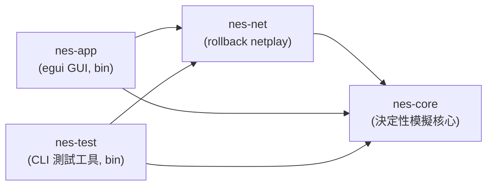
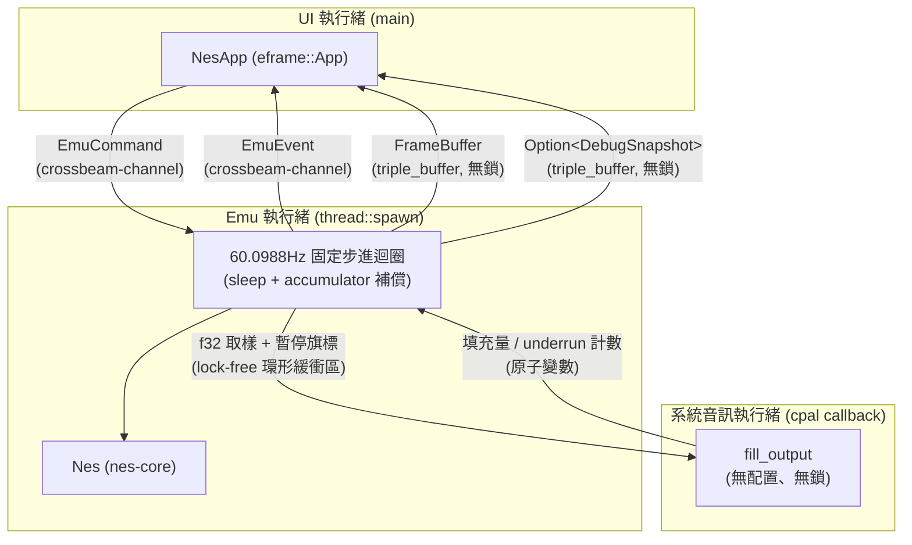
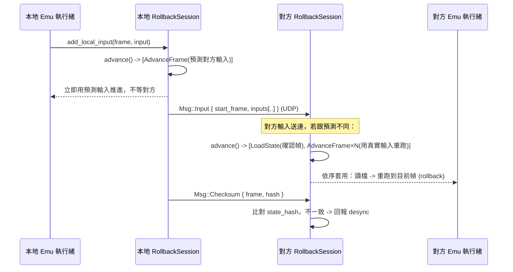
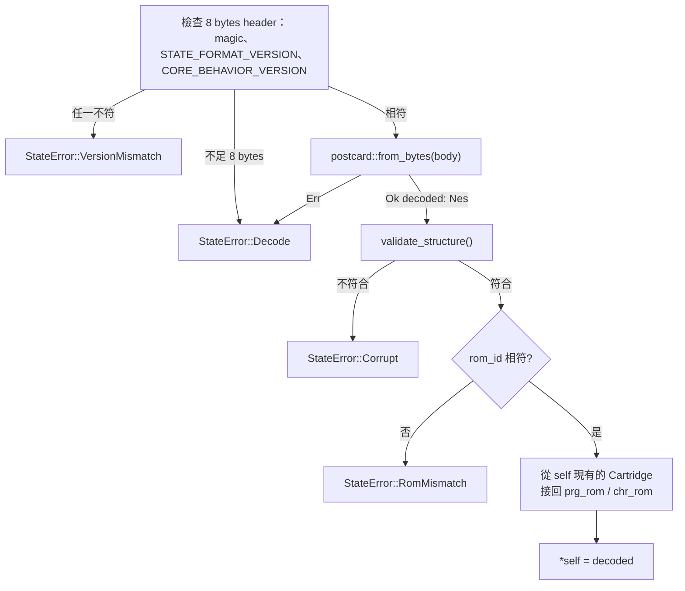

# 架構文件

> 對應課程「應用軟體設計」期末專案的四大主題：作業系統與應用程式的關係、
> 視窗環境、網路環境、整合設計。本文件說明整體架構、各模組如何對應到這些
> 主題，以及幾個關鍵設計決策背後的理由。

## 1. 課程四大主題 ↔ 模組對應表

| 課程主題 | 對應模組 / 機制 | 說明 |
|---|---|---|
| **(1) 作業系統與應用程式的關係**：多執行緒、檔案 I/O、timing | `nes-app/src/emu.rs`（emu 執行緒，60.0988Hz 固定步進）、`nes-app/src/main.rs`（`thread::spawn` + `crossbeam-channel` + `triple_buffer` 跨執行緒通訊）、`nes-app/src/app.rs`（用 `rfd`／`std::fs::read` 做檔案 I/O）、`nes-app/src/audio.rs`（系統音訊執行緒、lock-free 環形緩衝區、動態速率控制；見 §17.9） | UI 執行緒與 Emu 執行緒分離，避免模擬迴圈的 timing 被 GUI 重繪卡住；反之也避免 GUI 被模擬迴圈的 sleep 卡住。 |
| **(2) 視窗環境** | `nes-app`（`eframe`/`egui`） | 選單列、遊戲畫面 texture、Debugger 側邊面板、狀態列、鍵盤輸入映射。 |
| **(3) 網路環境** | `nes-net`（`protocol.rs` 封包格式、`transport.rs` UDP／記憶體內傳輸層、`simnet.rs` 網路模擬、`session.rs` lockstep session（Phase 4b，§19）、`rollback.rs` rollback 排程（4c）） | 用 `std::net::UdpSocket`（non-blocking）+ 手刻協定，不用 async runtime，理由見 §5；session 邏輯不讀系統時間（虛擬時鐘可測，§19）。 |
| **(4) 整合設計** | `Nes::run_frame` 作為 `nes-core` / `nes-net` / `nes-app` 三者的交會點 | `nes-app` 的 emu 執行緒把「網路層排出的指令」（`nes-net::Request`）套用在 `nes-core::Nes` 上；GUI 只透過 channel 跟 emu 執行緒溝通，三個子系統彼此不直接耦合。 |

## 2. Crate 依賴圖


```mermaid
graph LR
    nes_core["nes-core<br/>(決定性模擬核心)"]
    nes_net["nes-net<br/>(rollback netplay)"]
    nes_app["nes-app<br/>(egui GUI, bin)"]
    nes_test["nes-test<br/>(CLI 測試工具, bin)"]

    nes_net --> nes_core
    nes_app --> nes_core
    nes_app --> nes_net
    nes_test --> nes_core
    nes_test --> nes_net
```

`nes-core` 是唯一不依賴其他本專案 crate 的節點，且被所有人依賴——這是刻意的：
它必須維持「決定性、無 I/O」的性質，不能被上層的網路或 GUI 邏輯污染。

## 3. 執行緒模型


```mermaid
graph TB
    subgraph UI["UI 執行緒 (main)"]
        App["NesApp (eframe::App)"]
    end
    subgraph Emu["Emu 執行緒 (thread::spawn)"]
        Nes["Nes (nes-core)"]
        Loop["60.0988Hz 固定步進迴圈<br/>(sleep + accumulator 補償)"]
    end
    subgraph Audio["系統音訊執行緒 (cpal callback)"]
        Cb["fill_output<br/>(無配置、無鎖)"]
    end

    App -- "EmuCommand\n(crossbeam-channel)" --> Loop
    Loop -- "EmuEvent\n(crossbeam-channel)" --> App
    Loop -- "FrameBuffer\n(triple_buffer, 無鎖)" --> App
    Loop -- "Option&lt;DebugSnapshot&gt;\n(triple_buffer, 無鎖)" --> App
    Loop --> Nes
    Loop -- "f32 取樣 + 暫停旗標<br/>(lock-free 環形緩衝區)" --> Cb
    Cb -- "填充量 / underrun 計數<br/>(原子變數)" --> Loop
```

emu 執行緒與 UI 執行緒之間目前有 5 條獨立通道，方向、型別、用途、背壓策略
各不相同：

| 通道 | 型別 | 方向 | 用途 | 背壓策略 |
|---|---|---|---|---|
| 指令 | `crossbeam_channel::Sender/Receiver<EmuCommand>` | UI → Emu | `LoadRom`／`SetInput`／`Pause`／`Resume`／`SaveState`／`LoadState`／`SetDebugEnabled`／`SetDebugViews`／`StepInstruction`／`StepFrame`／`SetAudioChannelMask`／`TraceToFile`／`Reset`／錄製與播放／`NetHost`／`NetJoin`／`NetDisconnect`（Phase 4b）／`Quit`，每一則都有意義、不能丟 | unbounded：emu 執行緒每迴圈用 `try_iter()` 一次清空，不會累積 |
| 事件 | `crossbeam_channel::Sender/Receiver<EmuEvent>` | Emu → UI | `RomLoaded`／`Error`／`FpsReport`／`FrameAdvanced`／`TraceWritten`，每則都要送達 | unbounded：`FpsReport` 每秒 1 則、`FrameAdvanced` 每幀 1 則（UI 每次重繪都會 `try_iter()` 清空），不會累積成問題 |
| 畫面 | `triple_buffer::Input/Output<FrameBuffer>` | Emu → UI | 每幀畫好的 `FrameBuffer` | `triple_buffer`：只在乎「最新一張」，UI 沒讀不會擋住 emu 寫入，也不會無限堆積 |
| Debug 快照 | `triple_buffer::Input/Output<Option<DebugSnapshot>>` | Emu → UI | Debugger 面板顯示的 CPU/PPU/APU 狀態；`None` 代表「尚未收到任何快照」，跟真實模擬狀態（即使欄位剛好是 0）明確區分 | `triple_buffer`：同 FrameBuffer；另外用 `EmuCommand::SetDebugEnabled` 讓 emu 執行緒只在面板開啟時才產生快照，面板關閉時零成本 |
| PPU 影像 | `triple_buffer::Input/Output<Option<PpuViews>>` | Emu → UI | Debugger 的 pattern table（2 張 128×128）與 nametable（4 張 256×240），約 1.1MB／份 | `triple_buffer`；而且 **預設不產生**：只有面板開著且目前分頁是 Pattern/Nametable 時，UI 才送 `EmuCommand::SetDebugViews(Some(調色盤))`，emu 執行緒執行中每 3 幀更新一次，暫停時單步/讀檔後立即更新；離開分頁就送 `None`，之後零成本 |

除了上面 5 條，emu 執行緒與**系統的音訊執行緒**之間還有第 6 條：核心產生的取樣經
`AudioShared` 的環形緩衝區交給 cpal 的 callback，暫停旗標、主音量、填充量、underrun 計數都是
原子變數，callback 內不上鎖、不配置記憶體（設計與理由見 §17.9）。

- **為什麼 emu 執行緒跟 UI 執行緒分開？** GUI 重繪（尤其是開啟 debugger 面板、
  拖動視窗）耗時不固定，如果模擬迴圈跟 UI 畫在同一個執行緒，模擬的 timing
  會被 UI 卡頓拖慢；反過來，模擬迴圈裡的 `sleep` 也不能拖慢 UI 的重繪。
- **為什麼畫面／Debug 快照用 `triple_buffer` 而不是 channel？** 這兩者都是
  「每幀更新一次、UI 只在乎最新一份」的資料，如果透過一般 channel 傳遞，
  UI 執行緒處理不及就會塞住 emu 執行緒（channel 滿了會 block，或者用
  unbounded 會無限堆積記憶體）。`triple_buffer` 讓「寫最新一份、讀最新
  一份」永遠是 O(1) 且無鎖，讀寫互不阻塞。
- **為什麼指令/事件用 `crossbeam-channel`？** 指令（LoadRom、SetInput……）跟
  畫面不同，每一則都有意義、不能丟，用 unbounded channel 剛好；`crossbeam`
  比 `std::sync::mpsc` 效能更好、API 更完整（`try_iter` 等）。
- **為什麼 Debug 快照用 `Option<DebugSnapshot>` 而不是直接用
  `DebugSnapshot`？** 曾經發生過的 bug：UI 端在拿不到真實資料時，直接用
  `DebugSnapshot::default()` 頂替，結果 Debugger 面板長期顯示一份看起來
  正常、實際上完全是假資料的畫面（SP/Status 顯示 0，但 reset 後不可能是
  0）。用 `Option` 讓「尚未收到資料」在型別上就跟「收到了、且欄位剛好是
  某個值」區分開來，UI 端沒有任何藉口再用一份假資料頂替。

## 4. `nes-core` 公開 API：為什麼不用 callback

`Nes` 的對外介面刻意設計成「外部驅動、每次跑一幀」：

```rust
pub fn run_frame(&mut self, input: [Buttons; 2]) -> &FrameBuffer;
```

而不是常見的：

```rust
// 不採用的設計
pub fn run(&mut self, get_input: impl FnMut() -> [Buttons; 2], on_frame: impl FnMut(&FrameBuffer));
```

理由：

1. **Rollback 需要「隨時暫停、讀檔、重跑」**。如果模擬迴圈自己控制節奏（例如
   內部跑一個 `loop { ... }` 並透過 callback 要輸入、丟畫面），呼叫端就沒辦法
   在「這一幀」跟「下一幀」之間插入 `save_state`/`load_state`。外部驅動的
   `run_frame` 讓呼叫端（emu 執行緒 / rollback session）完全掌控時間軸。
2. **帶 lifetime 的 closure 會讓 `Nes` 很難被存進其他結構、很難被 `Clone`**。
   rollback 需要對 `Nes` 做 `Clone`／序列化／在多個「假設分支」之間切換，
   closure 型別（尤其是捕捉了外部狀態的）會讓這些操作變得非常麻煩，甚至
   需要 `Box<dyn FnMut>` 才能存起來，等於繞了一圈又回到需要動態分派。
3. **測試更簡單**：外部驅動的 API 讓單元測試可以完全不碰執行緒/計時器，直接
   在迴圈裡呼叫 `run_frame` 幾十幀，這也是 §7 那三個決定性測試能寫得這麼
   直接的原因。

## 5. 為什麼 `Mapper` 用 `enum` 而不是 trait object

`cartridge/mapper.rs`：

```rust
pub enum Mapper {
    Nrom(Nrom),
    Mmc1(Mmc1),
    Uxrom(Uxrom),
    Cnrom(Cnrom),
}
```

而不是：

```rust
// 不採用的設計
pub struct Cartridge {
    mapper: Box<dyn MapperTrait>,
}
```

理由是 **serde 序列化**。存檔（save state）需要把整台 `Nes` 的狀態（包含
`Cartridge`／`Mapper`）序列化成 bytes，之後還要能反序列化回「正確的具體型別」。
`enum` 的每個 variant 都是編譯期已知的具體型別，`derive(Serialize,
Deserialize)` 可以直接運作，postcard 編碼時只需要多存一個 variant tag。

`Box<dyn Trait>` 做不到這件事：trait object 在執行期已經抹除了具體型別資訊，
`serde` 沒辦法單靠 `Box<dyn Trait>` 知道反序列化時該建構哪一個實際的 struct
（需要額外的 registry/tag 機制，例如 `typetag` crate，那還是繞回「本質上是
一個 enum」，只是換一種寫法，且引入了額外依賴與執行期開銷）。既然 mapper
種類是有限且編譯期已知的（NROM/MMC1/UXROM/CNROM……），直接用 `enum` 最簡單、
最快、對 serde 最友善。變體的順序就是存檔裡的 variant tag，只能在最後追加（§15）。各 mapper 的
行為見 §16。

## 6. Netplay 協定與 rollback 流程

### 封包格式（`nes-net::protocol::Msg`）

`Input` 封包刻意帶「最近 N 幀」的輸入歷史（冗餘設計），而不是每幀送一個只
包含當幀輸入的小封包：UDP 會掉包，冗餘設計讓下一個送達的封包自然補上前面
掉的幀，不需要額外的重傳握手（reduce round-trip，這對延遲敏感的 netplay
很重要）。

> **Phase 4b 的實作是 lockstep**（雙方輸入到齊才推進），封包格式、握手、Ack／重送、指紋檢查與統計見 §19；
> 下面的 rollback 流程是 **4c 的設計草案，實作與量測見 §20**（與草案的差異：指紋改成每個 `Input` 封包附帶「已確認幀」的行為指紋、協定升為 v2），封包的細節以 §19.3／§20.3 為準
> （例如 Checksum 用行為指紋、幀號約定）。

### Rollback 演算法（詳細版見 `nes-net/src/rollback.rs` 的 doc comment）


```mermaid
sequenceDiagram
    participant A as 本地 Emu 執行緒
    participant NetA as 本地 RollbackSession
    participant NetB as 對方 RollbackSession
    participant B as 對方 Emu 執行緒

    A->>NetA: add_local_input(frame, input)
    NetA->>NetA: advance() -> [AdvanceFrame(預測對方輸入)]
    NetA-->>A: 立即用預測輸入推進，不等對方
    NetA->>NetB: Msg::Input { start_frame, inputs[..] } (UDP)

    Note over NetB: 對方輸入送達，若跟預測不同：
    NetB->>NetB: advance() -> [LoadState(確認幀), AdvanceFrame×N(用真實輸入重跑)]
    NetB-->>B: 依序套用：讀檔 -> 重跑到目前幀 (rollback)

    NetA->>NetB: Msg::Checksum { frame, hash }
    NetB->>NetB: 比對 state_hash，不一致 -> 回報 desync
```

要點：

1. **樂觀預測**：本地不等對方，用「對方上一次已知輸入」預測這一幀，正常
   `AdvanceFrame`。
2. **持續存檔**：每推進一幀都 `SaveState`，保留最近 N 幀（N 由
   `input_delay` 與允許的 rollback 深度決定）。
3. **輸入送達後比對**：真正的對方輸入送到後，如果跟預測不同，從「雙方都
   確定」的那一幀 `LoadState`，再用真實輸入依序 `AdvanceFrame` 追到目前幀
   （這就是 rollback：時間軸上退回去，重新播放）。
4. **確認幀推進**：雙方輸入都確定的幀變成 `confirmed_frame`，更早的存檔可
   以丟棄。
5. **Desync 偵測**：定期交換 `Nes::state_hash()`（xxh3-64 對 `save_state()`
   雜湊），同一幀雙方雜湊不一致就代表模擬邏輯出現了不確定性，應立即中止並
   回報，而不是悄悄讓兩邊玩不同的遊戲。

`RollbackSession`（`rollback.rs`）目前（Phase 0 的骨架）只定義了資料結構與方法簽名，`handle_msg`／
`advance` 的本體回傳空結果，真正的排程邏輯排進 Phase 4c；4b 的 `LockstepSession` 已經實作了它會沿用的部分
（握手、輸入的送收與 Ack、指紋交換、逾時、統計、事件佇列；見 §19.5）。

## 7. 決定性（determinism）規則清單

Rollback 與 desync 偵測完全依賴「同樣的初始狀態 + 同樣的輸入序列，永遠算出
同樣的結果」。`nes-core` 因此遵守以下規則：

1. `#![forbid(unsafe_code)]`：整個 crate 禁止 `unsafe`。
2. **不依賴任何 I/O、時間、亂數、執行緒或 GUI crate**——`nes-core` 的
   `Cargo.toml` 只有 `serde`/`postcard`/`xxhash-rust`/`thiserror`/
   `bitflags`，沒有 `std::time`、沒有 RNG、沒有 `std::thread`。所有「這一幀
   该做什麼」都由呼叫端透過 `run_frame(input)` 的參數決定。
3. **不在會影響狀態的邏輯中迭代 `HashMap`**——`HashMap` 的迭代順序在不同
   執行、不同機器上不保證一致（受 `RandomState` 影響），會讓兩台跑一樣輸入
   序列的機器算出不同結果。`nes-core` 目前沒有任何 `HashMap`；`nes-net` 的
   `RollbackSession` 需要「照幀號排序」的關聯容器時，用的是 `BTreeMap`（見
   `session.rs`），因為它的迭代順序是由 key 排序決定的，跨執行/跨機器保證
   一致。
4. **對外 API 是外部驅動、每幀呼叫**：見 §4，避免 `Nes` 自己掌控時間軸。
5. **所有進入 save state 的型別都 `derive(Serialize, Deserialize)`**，且整個
   `Nes` 型別樹只用 plain owned data（沒有 `Rc`/`RefCell`/`Arc`/`Mutex`），
   確保 `Nes` 可以被完整 `Clone`／序列化／還原，這是 rollback 的存檔/讀檔
   機制能運作的前提。（靜態 ROM bytes 是例外，刻意 `#[serde(skip)]`，理由與
   讀檔時如何確保接回同一份 ROM、如何拒絕損毀資料，見 §8。）
6. **畫面渲染是純函式**：Phase 0 的 `FrameBuffer::render_test_pattern(frame_count,
   input)` 只由這兩個參數決定輸出，不讀取任何全域/外部狀態；Phase 2 的 PPU
   渲染器（`ppu/render.rs`）維持這個性質：一條掃描線的像素只由當下的 `Ppu`
   （v/fine X/PPUCTRL/PPUMASK/OAM/調色盤）與卡帶 CHR 決定，沒有浮點運算、沒有
   時間或亂數。調色盤（`ppu/palette.rs`）是整數查表。`Ppu::frame_buffer` 是
   「輸出」而不是「狀態」，不進 save state（見 §8）。

7. **浮點數只允許出現在音訊輸出管線**（`apu/output.rs`：混音、降頻、濾波）。APU 的模擬狀態全部是
   整數；輸出管線與 `Ppu::frame_buffer` 同地位，不進 save state、不參與 `state_hash`（§17.8）。

以下三個測試（`crates/nes-core/src/lib.rs` 的 `tests` module）直接驗證了規則
5、6 帶來的性質：

- `save_then_load_preserves_state_hash`：存檔後立刻讀檔，`state_hash` 不變。
- `identical_input_sequences_produce_identical_hashes_across_instances`：
  兩個獨立的 `Nes` 實例，餵一模一樣的輸入序列，跑完之後雜湊完全相同。
- `rollback_replay_matches_uninterrupted_run`：在第 k 幀存檔、跑到 k+m、
  讀回存檔、用「相同」的輸入重新跑到 k+m，結果與「完全沒有讀檔」的一次
  性執行一模一樣——這正是 rollback 依賴的核心性質。

## 8. Save state 格式：排除 ROM bytes、用雜湊比對、拒絕損毀資料

Rollback 需要高頻率地存檔/讀檔（理論上每幀都可能存一次），所以 save state
的設計有兩個額外目標：**不要浪費空間重複存不會變的資料**、**讀到壞資料時要
明確拒絕，不能 panic 或悄悄跑出錯的模擬**。

### 8.1 ROM bytes 不進 save state

`Cartridge` 的 `prg_rom`/`chr_rom` 兩個欄位標了 `#[serde(skip)]`：

```rust
#[serde(skip)]
pub prg_rom: Vec<u8>,
#[serde(skip)]
pub chr_rom: Vec<u8>,
```

理由：同一場對局裡，PRG-ROM/CHR-ROM 的內容從頭到尾不會變（它們是唯讀
的卡帶資料），rollback 每次存讀檔都把整份 ROM（可能幾百 KB）重複序列化一次
既浪費頻寬/記憶體、也拖慢「每幀都可能要存一次檔」的效能需求。真正會變的
只有 **CHR-RAM**、**PRG-RAM**、CPU/PPU/APU 暫存器等執行期狀態，這些欄位照
常序列化。連帶地，[`Nes::state_hash`] 因為是對 `save_state()` 的輸出做
xxh3-64，也自動不包含 ROM bytes，只反映「真正會變的狀態」。

### 8.2 `rom_id`：確保讀檔時接回「同一份」ROM

因為 `prg_rom`/`chr_rom` 被跳過，`load_state` 讀回資料後必須從目前記憶體裡
已經載入的 ROM 把這兩個欄位接回去——但如果存檔其實是另一款遊戲存的
（例如使用者不小心把《薩爾達》的存檔拿去讀《瑪利歐》），接回去的 PRG/CHR
資料跟存檔裡的 CPU/PPU 狀態完全對不上，會直接跑出垃圾畫面或亂七八糟的
行為，而且不會有任何錯誤訊息。

`Cartridge` 因此存一個 `rom_id: RomId`（`rom_id.rs`）：**對整個 ROM 檔案（含 iNES header 與
trainer）計算的 xxh3-128**，在 `ines::parse` 解析時算好；`Nes::load_state` 讀檔時比對存檔裡的
`rom_id` 跟目前已載入 ROM 的 `rom_id`：

```rust
let expected = self.cpu.bus().cartridge.rom_id;
let found = decoded.cpu.bus().cartridge.rom_id;
if expected != found {
    return Err(StateError::RomMismatch { expected, found });
}
```

不符合就回傳 `StateError::RomMismatch`，拒絕讀檔，而不是接上錯的 ROM 繼續跑。

**Phase 4a 之前**這個欄位是 `rom_hash: u64`，只涵蓋 `PRG ++ CHR`。換成整個檔案的 128 位元雜湊有兩個理由：
(1) header 的 mapper／mirroring 位元不同就是不同的卡帶（舊版會把它們當成同一份 ROM）；(2) replay 與 netplay
握手都要用它確認「雙方載入的是同一份檔案」，128 位元讓碰撞在實務上不可能。位元組表示採 xxHash 的 canonical
形式（高 64 位元在前的 big-endian），與 `xxh128sum` 印出的十六進位字串相同，可用外部工具核對；UI 與 CLI 顯示
前 16 個十六進位字元（`RomId::short`）。這個改變讓 `STATE_FORMAT_VERSION` 由 2 升到 3（§15.4）。

### 8.3 結構驗證：拒絕長度被竄改的資料

postcard 對 `Vec<u8>` 的編碼是「長度前綴 + 內容」，理論上存檔資料可能因為
儲存媒介損毀、或被惡意竄改，導致解碼出一個「型別對、但長度不符合硬體規格」
的 `Nes`（例如 RAM 變成 2049 bytes）。`Nes::load_state` 在比對 `rom_hash`
之前，會先呼叫內部的 `validate_structure()` 逐一檢查：

- `Bus::ram` 必須是 `0x0800`（2KB）
- `Ppu::vram` 必須是 `2048`
- `Ppu::oam` 必須是 `256`
- `Cartridge::chr_ram` 必須符合 `info.chr_rom_banks`（有 CHR-ROM 就該是 0，
  沒有就該是 `CHR_RAM_SIZE`）
- `Cartridge::prg_ram` 必須是 `PRG_RAM_SIZE`

任何一項不符合就回傳 `StateError::Corrupt`，絕不 panic、也不會讓後續（尤其
是 Phase 1 之後會實作的 `Bus::read`/`write`）因為陣列長度不對而 out-of-bounds
panic。

### 8.4 `load_state` 完整流程


```mermaid
flowchart TD
    H["檢查 8 bytes header：<br/>magic、STATE_FORMAT_VERSION、CORE_BEHAVIOR_VERSION"] -->|任一不符| E0["StateError::VersionMismatch"]
    H -->|不足 8 bytes| E1
    H -->|相符| A["postcard::from_bytes(body)"]
    A -->|Err| E1["StateError::Decode"]
    A -->|Ok decoded: Nes| B["validate_structure()"]
    B -->|不符合| E2["StateError::Corrupt"]
    B -->|符合| C{"rom_id 相符?"}
    C -->|否| E3["StateError::RomMismatch"]
    C -->|是| D["從 self 現有的 Cartridge\n接回 prg_rom / chr_rom"]
    D --> F["*self = decoded"]
```

對應的三個「拒絕壞資料」測試（`crates/nes-core/src/lib.rs`）：

- `load_state_rejects_truncated_bytes`：把存檔位元組砍半再讀，驗證回傳
  `StateError::Decode`。
- `load_state_rejects_tampered_length`：手動把一份有效存檔的 RAM 長度改壞
  （`push` 多一個 byte）再讀，驗證 `validate_structure` 攔下來、回傳
  `StateError::Corrupt`。
- `load_state_rejects_mismatched_rom`：拿「另一份 ROM」存的檔去讀目前載入
  的 ROM，驗證回傳 `StateError::RomMismatch`。

### 8.5 Phase 3：存檔 header 與版本號

`save_state` 的輸出開頭是 8 bytes header（magic `"NESS"`、`STATE_FORMAT_VERSION`、
`CORE_BEHAVIOR_VERSION`，後兩者 u16 little-endian），後面才是 postcard 編碼的 `Nes`。
`load_state` 先檢查 header，magic 或任一版本號不符就回傳
`StateError::VersionMismatch { expected, found }`（`StateHeader`：magic + 兩個版本號），
在解碼與驗證之前就拒絕，不改動 `self`。版本號的意義、判定規則與 Phase 4 的銜接見 §15。
測試：`load_state_rejects_tampered_magic`、`..._tampered_format_version`、
`..._tampered_core_behavior_version`、`load_state_rejects_input_shorter_than_the_header`。

### Phase 2 補充：PPU 進 save state 的內容

- **進存檔**：`Ppu` 的所有時序與暫存器狀態——PPUCTRL/MASK/STATUS、OAMADDR、
  loopy `v`/`t`/fine X/`w`、`$2007` 讀取緩衝、I/O latch、OAM、VRAM、調色盤、
  **掃描線與 dot（＝CPU 與 PPU 之間的相位）**、幀計數與奇偶幀旗標、NMI 線與
  待處理旗標（含「寫 PPUCTRL 造成、要晚一條指令」的延遲旗標）、sprite 0 hit
  排定的 dot、預取次數；`Bus` 的 `total_cycles`、OAM DMA 待處理旗標、搖桿移位
  暫存器。因為 catch-up 模型下 PPU 位置就是 `total_cycles × 3` 的結果，存檔在
  「一幀中間」（單步除錯停下來時）也能完整還原，測試
  `mid_frame_save_state_preserves_cpu_ppu_phase` 驗證。
- **不進存檔**：`Ppu::frame_buffer`（輸出，下一幀會整張重畫）。代價是讀檔之後
  「立刻」拿到的畫面是全黑，直到下一次 `run_frame`；GUI 讀檔後不會更新畫面
  緩衝，所以暫停中讀檔畫面維持舊圖，繼續跑之後就會是正確的。
- **`load_state` 驗證**：除了 §8 原本的長度檢查，也檢查 PPU 欄位在硬體範圍內
  （掃描線 ≤ 261、dot ≤ 340、v/t ≤ `$7FFF`、fine X ≤ 7……），超出範圍回傳
  `StateError::Corrupt`，避免竄改的存檔讓 `run_frame` panic。

## 9. CPU 精度層級：instruction-level（Phase 1）

`crates/nes-core/src/cpu/mod.rs` 實作的 6502（2A03）CPU 是 **instruction-level**
（指令級）精度，不是 **cycle-level**（cycle 級）精度。差異：

- **cycle-level** 模擬器把每條指令拆成一個個 cycle 的微碼狀態機，`step()`
  每次只推進一個 cycle；匯流排存取（包含指令執行「途中」的每一次讀寫）都
  照真實硬體的時序精確發生。
- 本專案的 **instruction-level** 模擬器裡，`Cpu::step()` 一次把一條指令從
  取指到寫回全部做完，只在最後告訴呼叫端「這條指令總共花了幾個 cycle」
  （查 `OPCODES` 表 + 跨頁/分支的動態加成），再一次呼叫 `Bus::tick` 補上
  時間，而不是每個 cycle 都真的去摸一次匯流排。

### 為什麼選這個層級

Phase 1 的目標是「CPU 正確性」——最終暫存器狀態、指令消耗的 cycle 總數、
分支/跨頁的邊界行為要跟真實硬體一致（用 nestest 驗證）。這些性質全部只跟
「一條指令執行前」與「執行後」的狀態有關，跟「執行途中每個 cycle 匯流排上
發生了什麼」無關。既然目標不需要後者，选 instruction-level 可以大幅簡化
實作：`OPCODES` 表直接查表決定 cycle 數，每條指令只要寫「做什麼」，不用另外
寫「這個 cycle 該做什麼、下個 cycle 該做什麼」的狀態機。

### 影響／代價

1. **通過 nestest，但不是 SingleStepTests 的 `cycles` 欄位**。SingleStepTests
   每筆測試資料除了「最終暫存器/RAM」，還有一份「這條指令逐 cycle 的匯流排
   讀寫紀錄」；照任務規格我們只比對前者，不比對後者（見
   `crates/nes-core/src/cpu/singlestep.rs` 的模組文件）。實測結果：**官方
   opcode 256 萬分之 151 萬筆全數通過（100%）**；非官方 opcode 中，任務要求
   的那些（LAX/SAX/DCP/ISB/SLO/RLA/SRE/RRA/\*SBC/各種 NOP/JAM/ANC/ALR/ARR/
   AXS）也全數通過（JAM 只比對暫存器/RAM，cycle 數的差異見 §10）。Phase 2 時只有 8 個任務範圍外、
   真實硬體行為本身就不穩定（analog/undefined，依賴個別晶片的類比殘留電荷，不是單純的邏輯 bug）
   的 opcode（`$8B` `$93` `$9B` `$9C` `$9E` `$9F` `$AB` `$BB`）維持 NOP 占位；Phase 3 實作了
   `$9C/$9E/$AB`（§16.7），剩 5 個。
2. **PPU/mapper 還無法在指令「執行途中」插手**。例如某些少見的技巧（在
   PPU 正在畫某條掃描線的當下，靠一條指令的第 3、第 4 個 cycle 精準寫某個
   PPU 暫存器）需要 cycle-level 才能重現；Phase 1 的 PPU 還是 stub，用不到
   這個精度，之後如果真的要做這類精細時序（例如 sprite-0 hit 的邊界情況），
   才需要重新評估要不要把 CPU 也改成 cycle-level。
3. **`Bus::tick` 每條指令分兩段補時間**（Phase 3 定案，見 §13.1）：指令執行前追 `N − 1` 個
   cycle、執行後補最後 1 個，而不是逐 cycle 呼叫；PPU 的 `(scanline, cycle)` 是從累積的
   `total_cycles * 3` 換算回去的（見 `Bus::ppu_dot`），在「一條指令之內」沒有更細的解析度，
   但指令邊界（`trace()`/`debug_snapshot()`）讀到的值是精確的。

這個決定不影響 §7 的決定性規則：instruction-level 一樣是完全決定性的（同樣
輸入序列永遠得到同樣結果），只是不模擬「指令執行到一半」這個中間狀態。

## 10. SingleStepTests 回歸閘門與分類

`cargo test --release -p nes-core --lib cpu::singlestep -- --ignored --nocapture`
會把 256 個 opcode（各 10,000 筆，共 256 萬筆）依下表分類，**前三類任一類別
未 100% 通過就讓測試失敗**。第四類只列出、不影響結果。

| 類別 | opcode | 筆數 | 比對內容 | 閘門 |
|---|---|---|---|---|
| 官方 | 151 個官方 opcode | 1,510,000 | 暫存器 + RAM + **cycle 數** | 必須 100% |
| 非官方（穩定） | 其餘非官方（LAX/SAX/DCP/ISB/SLO/RLA/SRE/RRA/`*SBC`/各種 NOP/ANC/ALR/ARR/AXS/**SHY/SHX**…） | 870,000 | 暫存器 + RAM + **cycle 數** | 必須 100% |
| JAM | `02 12 22 32 42 52 62 72 92 B2 D2 F2`（12 個） | 120,000 | 暫存器 + RAM，**不比對 cycle 數** | 必須 100% |
| 不穩定 | `8B 93 9B 9F AB BB`（6 個；Phase 3 前是 8 個） | 60,000 | 全部（預期失敗） | 僅列出 |

理由：

- **JAM**：真實硬體執行 JAM 後 CPU 卡死。測試資料把「卡死」展開成 11 個 cycle
  的匯流排活動；本核心是 instruction-level，用 `Cpu::jammed` 旗標表示卡死，
  `step()` 回傳 2 cycle。「卡死後暫存器與 RAM 不再變動」是有意義且可驗證的
  性質，所以必須相符；11 vs 2 的 cycle 差異是模型差異，不是 bug，測試會把
  「暫存器/RAM 相符但 cycle 數不同」的案例數與範例單獨印出。
- **不穩定的 6 個**：真實行為取決於匯流排殘留電容、DMA 時機、晶片批次等類比因素，
  SingleStepTests 的期望值只是其中一種取樣。其中 `$8B $93 $9B $9F $BB` 維持 NOP 占位（0%）；
  `$AB` 依 blargg 實作，與 SingleStepTests 約 56% 相符。預期失敗，不計入閘門；若日後有人實作而
  通過，也不會讓測試失敗。**Phase 3 把 `$9C`、`$9E` 移出這一類**：依 blargg 實作後
  SingleStepTests 實測 100%，所以改列「非官方（穩定）」並納入閘門；`$AB` 留下的理由（blargg 與
  SingleStepTests 的 magic 常數互相衝突）見 §14.5。

實測（Phase 3）：官方 1,510,000/1,510,000、非官方穩定 870,000/870,000、JAM
120,000/120,000（其中 120,000 筆 cycle 數為預期差異）、不穩定 5,578/60,000。

## 11. Debugger API 與單步的決定性代價

`Nes` 上的 `trace()`、`peek()`、`step_instruction()` 是 Debugger 的正式公開
API，不在 `testing` feature 之後。`testing` 只剩純測試用途的 `override_pc`。

- `trace()`、`peek()`：唯讀、無副作用（不觸發 PPU/APU 暫存器的讀取副作用），
  任何時候都可以呼叫。
- `step_instruction()`：**會打破「以幀為單位」的決定性**。`run_frame` 保證
  每幀推進固定的 cycle 預算；單步讓 CPU 停在幀中間，之後的 `run_frame` 從
  那個位置繼續，兩台機器只要有一台單步過，狀態就對不上。因此只能在暫停狀態
  下使用，**netplay 進行中不得呼叫**。`nes-app` 的 emu 執行緒在
  `StepInstruction`／`StepFrame`／`TraceToFile` 指令上檢查暫停旗標，未暫停時
  回報 `EmuEvent::Error` 而不執行。

### 狀態列幀數 vs. Debugger cycle 數的取樣落差

原因：狀態列的幀數原本取自 `EmuEvent::FpsReport`，emu 執行緒每 1 秒才送一次
（約每 60 幀一次），UI 顯示的幀數平均落後真實幀數約 30 幀（最多近 60 幀）；
Debugger 快照卻是每幀更新，兩者就出現了約 35 幀的落差。

修正：`FpsReport` 只帶 FPS；新增每幀一則的 `EmuEvent::FrameAdvanced(frame)`
（單步、讀檔、載入 ROM 後也會送），並在 `DebugSnapshot` 加入 `frame_count`。
Debugger 開著時，狀態列直接用同一份快照的 `frame_count`，因此與面板的 cycle
數必然一致；面板關閉時用 `FrameAdvanced`。

## 12. 待辦

- **Phase 6：字型瘦身。** 將 `NotoSansCJKtc-Regular.otf`（目前 16MB、完整字重）
  subset 為常用繁體字以縮小執行檔，並確認 OFL 對修改後字型的命名規定
  （OFL-1.1 對「Modified Version」的 Reserved Font Name 限制，以及 subset
  後是否必須改名）。決定於第 0 步：目前保留完整字型，不做 subset。
- **Phase 3.5（APU 與音訊輸出）已完成，模擬核心正式凍結**：`CORE_BEHAVIOR_VERSION` = 3、
  `STATE_FORMAT_VERSION` = 2（§15.4、§17）。下一階段是 Phase 4（replay、netplay、rollback）。
- **效能候選：APU 延遲 catch-up（Phase 4c.1 判斷暫不需要，見 §20.12；判斷見 §15.6）。**
  目前 `Bus::advance` 每條指令兩次都推進 APU，即使 APU 閒置也要付「每次 chunk 迴圈」的固定成本
  （§14.6：約 +150 µs／幀）。做法是把 APU 要追的 cycle 累積起來，只在「暫存器存取」、「CPU 可見的
  事件（frame IRQ 旗標、DMC 抓取／IRQ）到期」與幀邊界才追上；`save_state`／`debug_snapshot` 前先追上。
  Phase 3.5 曾試過「聽不到的聲道用算術批次前進」，因為 APU 每次只被推進 2–3 個 cycle，反而更慢，已還原（§17.2）。
- **實體手把（gilrs）：決定先不加，留到 Phase 5 再評估。** 需要新增依賴，屆時要先說明用途、
  授權與替代方案，經同意才加。在此之前雙人只有鍵盤（見 `nes-app/src/input.rs`）。
- **耗時上升：決定先接受，不隔離成因。** Phase 3.1 起 `run_frame` 每幀約多 70 µs（§14.6），
  尚未查明成因。Phase 4 會量測 rollback 重跑的實際成本，屆時若吃緊再優化。
- **Phase 4 之後的候選**：MMC3 與
  scanline IRQ；PRG-RAM 電池存檔的持久化；MMC1 的 SUROM／SXROM；
  `$8B $93 $9B $9F $BB` 這 5 個不穩定 opcode。

## 13. 時序模型（Phase 3 定案）

> **定案**：本節描述的時序是凍結後的模型。之後任何會改變它的修改都屬於「會改變模擬結果
> 的修改」，必須遞增 `CORE_BEHAVIOR_VERSION`（§15）。

### 13.1 模型：分段 catch-up

- CPU 維持 instruction-level（§9）。PPU 的 `(掃描線, dot)` 就是 `total_cycles × 3`
  推進的結果，不另存「相位」。
- **一條 N cycles 的指令分成兩段推進 PPU**（`Cpu::step`）：
  1. 取 opcode、解出運算元（不推進時間）；
  2. PPU 追上 **N − 1** 個 CPU cycle（`3 × (N − 1)` 個 dot）；
  3. 執行指令——讀寫記憶體與 PPU 暫存器都發生在這個時間點；
  4. PPU 再追上**最後 1 個 cycle**，加上分支 taken／跨頁的額外 cycle
     （分支不碰 PPU，所以放在後段無妨）。
  之後才處理 OAM DMA（暫停 513/514 cycles，PPU 照常追上）。
  舊模型（Phase 2）是 2→3→4 合併成「執行完才一次追 N 個 cycle」。
- **索引定址的 dummy read（Phase 3.1）**：abs,X / abs,Y / (ind),Y 在位址高位元組修正之前，
  硬體會先讀一次「低位元組已加上索引、高位元組仍是基底」的**未修正位址**。讀取類指令只有
  **跨頁時**才有（沒跨頁時那次就是真正的讀取）；store 與 RMW 指令（含非官方的
  SLO/RLA/SRE/RRA/DCP/ISB、SHY/SHX）**一律有**。因為這個位址可以是 `$2007` 這類有副作用的
  暫存器，所以在定址階段真的做一次 `Bus::read`，並放在真正存取之前 1 個 cycle
  （`step()` 的兩段 catch-up 在這裡多切一刀：`N−2`、dummy read、`1`、執行、`1`）。
  RMW 的完整存取順序：dummy read（未修正）→ 真正的讀取 → 寫回舊值（dummy write）→ 寫入新值。
  **Phase 3.1 起 RMW 對所有位址都寫兩次**（Phase 3 只在 `$8000+`），所以 `INC $2006` 也如硬體
  般寫兩次。其他定址模式的 dummy read 刻意不模擬，判斷見 §13.4。
- **一幀的邊界是「PPU 完成一幀」**：`Nes::run_frame` 迴圈跑到 PPU 進入 vblank
  （掃描線 241、dot 1）為止。此時 240 條可見掃描線都已畫完，之後到下一幀開始不會再寫
  framebuffer，所以拿到的畫面不會撕裂。CPU 只能在指令邊界停下，實際會越過 vblank 起點
  最多一條指令（≤ 8 cycles ＝ 24 dot，OAM DMA 則 513/514 cycles）——越過的部分只是
  vblank，無害。
- **輸入在一幀開始時鎖定**：`run_frame` 把兩個搖桿的按鍵狀態寫進 `Joypad::state`，
  整幀不再變；程式 strobe `$4016` 之後讀到的永遠是這一幀的輸入。
- **NMI**：PPU 在 vblank 起點（若 PPUCTRL bit7 開）或 vblank 期間寫 PPUCTRL
  bit7 由 0 變 1 時，在「NMI 輸出線」上偵測到邊緣並登記；CPU 在每條指令開始前
  檢查（`Cpu::step` 開頭），有就服務（7 cycles，該步不執行指令）。由 CPU 寫
  PPUCTRL 造成的邊緣多等一次檢查（＝「下一條指令之後」才觸發），對應硬體上寫入
  發生在指令最後一個 cycle、趕不上該指令結尾的偵測。（分段 catch-up 之後
  `04-nmi_control` 仍通過，這個規則不需要調整。）
- **OAM DMA**：`STA $4014` 之後，該指令結束時瞬間複製 256 bytes（從 OAMADDR 起、
  繞回），CPU 暫停 513 cycles（DMA 起始 cycle 為奇數則 514）。
- **渲染**：每條可見掃描線在 dot 0 一次畫完（背景 33 個 tile + 精靈 + 優先順序）；
  但 v 暫存器依真實時序逐 dot 遞增（dot 8/16/…/256 coarse X、dot 256 Y、dot 257
  hori(v)=hori(t)、pre-render 行 dot 280–304 vert(v)=vert(t)、dot 328/336 預取），
  所以 SMB 那種「等 sprite 0 hit 之後在 hblank 改捲動」的畫面分割會落在正確的
  掃描線。sprite 0 hit 在渲染該線時算出命中的 x，等 PPU 走到 dot x+1 才設旗標。
  測試 `sprite0_split_scroll_takes_effect_on_the_next_scanline` 驗證。
- **nametable mirroring 每次存取都查 mapper**（§16.4），不是載入 ROM 時決定一次。

### 13.2 寫入 PPU 暫存器的時機誤差（定案後）

模型把「指令的記憶體存取」放在**最後一個 cycle 開始的時間點**。對絕大多數會碰 PPU
暫存器的指令（`LDA/BIT/STA abs`、`STA abs,X`、`STA (zp),Y`……）這正是硬體上讀寫發生
的那個 cycle，剩下的誤差是 cycle 內的次序（1 個 CPU cycle ＝ 3 dot）：

| 指令 | cycles | 存取所在 cycle | 模型與硬體的差 |
|---|---|---|---|
| `LDA $2002`、`STA $2005/$2006/$2007`（abs） | 4 | 第 4 個（最後） | 存取時間點吻合；cycle 內 ≤ 3 dot |
| `STA $2007,X`、`STA ($xx),Y` | 5–6 | 最後 | 同上 |
| `INC/DEC/ASL…`（讀-改-寫）abs / abs,X | 6 / 7 | **讀**在第 4 / 5 個，寫在最後 | 「讀」被放到最後：PPU 比硬體多前進 2 個 cycle（≤ 6 dot）；寫吻合 |

（Phase 2 舊模型的落後是 `cycles − 1`，最多 5–6 個 CPU cycle／15–18 dot，見 git 歷史。）
一條掃描線有 341 個 dot，所以這個誤差對「以掃描線為單位」的用法（等 vblank、等 sprite 0
hit、在 hblank 改捲動）已經降到 ±1 dot 量級，不再有「±1 條線」的不確定窗口。
`split_catch_up_makes_ppu_register_reads_see_the_dots_before_the_last_cycle` 用
`LDA $2002` 驗證：PPU 在 vblank 起點前 9 dot（3 個 CPU cycle）時，讀取剛好看得到旗標；
早 1 dot 就看不到。RMW 那一列是從程式碼推論，沒有專門的測試。

**仍然受影響的東西：**

- *測試*：需要單一 PPU dot 精度的測試仍失敗——`ppu_vbl_nmi` 的 02（vbl 設旗標時間）、
  05（NMI 時間）、06（讀 `$2002` 抑制）、07/08（NMI 開關時間）、10（奇偶幀跳過的時間）。
  細節見 §14。
- *遊戲*：在 hblank 中做 mid-scanline 特效、且時間窗口只有幾個 dot 的畫面分割；
  逐 cycle 數指令、在特定 dot 改寫暫存器的 demo。**沒有真實遊戲驗證**，見手動測試文件。
- *渲染粒度*：一條線畫完之後才發生的暫存器寫入（mask、捲動、PPUCTRL、CHR-RAM／CHR bank
  切換、調色盤）要到下一條線才反映；硬體上這些會在線的中途生效。**MMC1 遊戲若在一條線的
  中間切 CHR bank，會有一條線的差異。**
- *dummy read*：索引定址的 dummy read 已在 Phase 3.1 模擬（§13.1），`ppu_read_buffer` 因此
  通過；其餘定址模式的 dummy read 刻意不模擬（§13.4）。

**本階段刻意不模擬的其他細節：** 開機後約 29658 cycles 內忽略部分暫存器寫入；
`$2007` 在渲染中存取時 v 的怪異遞增；渲染中寫 OAMDATA 的位址損壞；sprite overflow
的硬體 bug（只做「同一線超過 8 個精靈」的基本判斷）；I/O latch 的衰減；
BRK/NMI 的 hijack；`$2002` 在剛好 vblank 起點被讀取時的旗標抑制。

### 13.3 為什麼是這個切法（驗證紀錄）

Phase 2 實驗過、Phase 3 採用。與 Phase 2 相比（實際執行結果）：

- nestest：8991 行仍全數通過（指令邊界的時序沒變）。
- blargg：2005 版 `vbl_clear_time` 由失敗變通過；`ppu_vbl_nmi` 其餘失敗項目（需要 1 dot
  精度）與通過項目都不變；CPU 測試因為 `$9C/$9E/$AB` 另外變化（§14.1）。
- **黃金畫面：23 個 Phase 2 就有的雜湊，用 `nes-test golden` 逐一重新產生，全部與舊值相同
  （0 個改變）。** 原因：這些 ROM 結束時的畫面只是「印出測試結果文字」，通過／失敗與訊息
  文字沒變，畫面就不變；分段 catch-up 移動的是指令內 1 個 CPU cycle 的相位，肉眼與雜湊都
  看不到。`golden_frame_hash_of_rendering_rom`（合成 ROM，畫面每幀捲動）同樣不變。
  **這不代表模擬結果沒變**：狀態雜湊（`state_hash`）包含 PPU 掃描線／dot 相位，所以每份
  存檔都與 Phase 2 不同——這就是新增「行為指紋」測試（§15.3）的原因。
- `run_frame` 平均耗時：見 §14.6。

### 13.4 哪些 dummy read 模擬、哪些不模擬（Phase 3.1 的判斷）

原則：**會落在資料位址空間、因此可能碰到有副作用的 I/O 暫存器**的 dummy read 要模擬；位址由指令
本身固定、落在 RAM 或指令流的，沒有副作用，不模擬。

| 定址模式／指令 | dummy read 的位址 | 模擬？ | 理由 |
|---|---|---|---|
| abs,X / abs,Y / (ind),Y 的**讀取**指令 | 跨頁時的未修正位址 | **是（僅跨頁）** | 位址由資料決定，可以是 `$2007` 等 |
| abs,X / abs,Y / (ind),Y 的 **store / RMW** | 未修正位址（一律） | **是** | 同上 |
| RMW 的寫回前 dummy write | 同一位址寫舊值 | **是（所有位址）** | 對 PPU 暫存器與 mapper 有副作用（§16.3） |
| ZeroPage,X / ZeroPage,Y / (zp,X) | 未加索引的 zero page 位址 | 否 | zero page 是內部 RAM，讀取沒有副作用 |
| Implied / Accumulator | `PC + 1` | 否 | 指令流；除非程式在 I/O 位址執行才有副作用（不實際） |
| 堆疊指令 PHA/PHP/PLA/PLP/JSR/RTS/RTI/BRK | 堆疊頁 `$0100-$01FF`、`PC + 1`、RTS 的返回位址 | 否 | RAM 與指令流 |
| Relative（分支） | 成立時的 `PC + 2`、跨頁時的未修正目標 | 否 | 指令流 |
| Absolute / Immediate / ZeroPage / Indirect | 無 dummy read（RMW 的 dummy write 已涵蓋） | — | — |

這個判斷用 SingleStepTests 的存取比對驗證（§14.5）：不模擬的那些在資料裡全部只表現為「缺讀」，且
缺的位址都落在上表允許的區域；沒有任何「多讀」或寫入差異。**局限**：判斷「沒有副作用」是假設遊戲
不會在 `$2000-$401F` 執行程式碼；若日後要支援執行 I/O 區的程式（不實際），或改成 cycle-level，
這些就要補上。

## 14. Phase 3 測試結果（與 Phase 2 對照）

執行環境：`cargo build --release -p nes-test` 後以 `nes-test blargg <rom>` 執行
（`--max-frames` 6000–12000；ROM 放在被 gitignore 的 `roms/nes-test-roms/`，見
`ATTRIBUTION.md`）。以下都是實際執行的輸出。**變化欄**只列與 Phase 2（前一版 §14）的差異。

### 14.1 CPU：instr_test-v5

| ROM | Phase 3 | 變化與原因 |
|---|---|---|
| `rom_singles/` 01、02、04、05、06、08–16（14 個） | **通過** | 無變化 |
| `rom_singles/03-immediate` | **通過** | 失敗→通過：實作 `$AB` LXA（magic `$FF`，`A = X = imm`） |
| `rom_singles/07-abs_xy` | **通過** | 失敗→通過：實作 `$9C` SHY、`$9E` SHX |
| `official_only.nes`（MMC1） | **通過**（1855 幀） | 無法載入→通過：實作 mapper 1 |
| `all_instrs.nes`（MMC1） | **通過**（2383 幀） | 無法載入→通過：實作 mapper 1 |

### 14.2 PPU：ppu_vbl_nmi

`rom_singles/`：**與 Phase 2 完全相同**——01、03、04、09 通過；02、05、06、07、08 失敗
`$01`、10 失敗 `$03`，原因見 Phase 2 §14.2 的說明（全部是「需要單一 PPU dot 精度」）。
分段 catch-up 把落後從最多 5–6 個 CPU cycle 降到約 1 個，但這些測試要的是 1 dot 精度，
改善不夠，**也沒有硬湊**。

`ppu_vbl_nmi.nes`（合集，MMC1）：無法載入→**可載入、失敗 `$01`**：合集依序執行，
在第 2 項（`02-vbl_set_time`）失敗即停止，與單檔結果一致（第 1 項通過）。

### 14.3 其他 PPU 測試

| ROM | Phase 3 | 變化與原因 |
|---|---|---|
| `oam_read` | **通過** | 無變化 |
| `blargg_ppu_tests`：palette_ram、sprite_ram、vram_access | **通過** | 無變化 |
| `blargg_ppu_tests`：`vbl_clear_time`（2005） | **通過** | **失敗 `$03`→通過**：分段 catch-up（讀 `$2002` 落在指令最後一個 cycle） |
| `blargg_ppu_tests`：`power_up_palette` | 失敗 `$02` | 無變化：測的是作者那台機器的開機調色盤，不是規格，不追求相符 |
| `sprite_hit_tests_2005.10.05` 01–11 | **通過**（11 個） | 無變化 |
| `ppu_read_buffer/test_ppu_read_buffer.nes`（CNROM） | Phase 3：失敗 `$23`（#35）；**Phase 3.1：通過** | Phase 3 時 #35（`STA $2000,Y` 必須對 `$2007` 做 dummy read）失敗，與 CNROM 無關；Phase 3.1 實作索引定址的 dummy read（§13.1）後通過 |
| `scrolltest/scroll.nes`（MMC1） | （無自動判定） | 這是給人看的捲動示範，沒有 `$6000` 協定；截圖（200 幀）顯示標題文字與 tile 底圖正常，需要按方向鍵才會捲動，捲動行為未驗證 |

### 14.4 mapper 專用測試 ROM

`roms/nes-test-roms/` 裡**沒有 mapper 專用的測試 ROM**（沒有 MMC1 / UxROM / CNROM 的
bank 切換、mirroring、PRG-RAM 測試）。用到 mapper 的只有上面列的驗收 ROM
（`official_only`、`all_instrs`、`ppu_vbl_nmi.nes`、`scroll.nes` 是 mapper 1，
`test_ppu_read_buffer` 是 mapper 3），它們只是「剛好用 MMC1／CNROM 當載體」，
對 mapper 邏輯的檢驗很淺。**沒有去其他地方找 ROM。** mapper 邏輯的驗證靠 Rust 單元測試
與整合測試（合成 ROM，見 §16.8）和 `docs/manual-test-phase3.md` 的手動測試。

### 14.5 SingleStepTests 閘門的分類變化

| 類別 | Phase 2 | Phase 3 | 說明 |
|---|---|---|---|
| 官方 | 1,510,000 / 1,510,000 | 1,510,000 / 1,510,000 | 100%，含 cycle 數；分段 catch-up 不改變回傳的 cycle 數 |
| 非官方（穩定） | 850,000 / 850,000 | **870,000 / 870,000** | `$9C`、`$9E` 移入（各 10,000 筆，含 cycle 數 100%） |
| JAM | 120,000 / 120,000 | 120,000 / 120,000 | 不變（暫存器/RAM 相符；cycle 數 11 vs 2 是預期差異） |
| 不穩定（僅列出） | 0 / 80,000（8 個） | 5,578 / 60,000（6 個） | `$9C/$9E` 移出；`$AB` 5,578 / 10,000；其餘 5 個仍是 NOP 佔位 0% |

- **`$9C`／`$9E` 移到「穩定」的理由**：依 blargg 實作 `reg & (H + 1)`、跨頁時位址高位元組被
  換成該值之後，SingleStepTests 實測 10,000/10,000（含 cycle 數）。它們在這份資料裡的行為
  其實是確定的，不是不可預測；依「依實際結果歸類」的原則移入必須 100% 的閘門。
- **`$AB` 留在「不穩定」的理由**：blargg `03-immediate` 要求 magic `$FF`（`A = X = imm`），
  但 SingleStepTests 的資料逐 bit 分析只符合 magic `$EE`（`A = (A | $EE) & imm`）——實測
  改用 `$EE` 時 SingleStepTests 可到 100%，但 blargg 03-immediate 會失敗。兩份權威資料互相
  衝突（真實晶片的 magic 因批次而異）。本專案以 blargg 為準（任務指定），所以 `$AB` 與
  SingleStepTests 只有約 56% 相符，屬於「有記錄的已知差異」而不是 bug。
- 其餘 5 個（`$8B $93 $9B $9F $BB`）：不在本階段範圍，仍是 1-byte NOP 佔位。

#### 14.5.1 Phase 3.1：匯流排存取比對

`cpu::singlestep` 現在有第二個測試 `singlestep_bus_accesses`：除了暫存器／RAM／cycle 數，還比對每筆
測試**讀取過的位址集合**與**寫入過的 `(位址, 值)`（多重集合）**，不比對順序。測試用 `Bus` 在 flat RAM
模式下記錄存取（僅 `#[cfg(test)]`）。JAM 不參與。實測（每類別）：

| 類別 | 寫入 `(位址, 值)` | 讀取位址集合（嚴格） | 閘門（見下） |
|---|---|---|---|
| 官方 | 1,510,000 / 1,510,000 | 911,362 / 1,510,000（60.36%） | **1,510,000 / 1,510,000** |
| 非官方（穩定） | 870,000 / 870,000 | 591,170 / 870,000（67.95%） | **870,000 / 870,000** |
| 不穩定（僅列出） | 30,000 / 60,000 | 10,000 / 60,000 | 20,000 / 60,000（不計入） |

- **寫入 100%**，包含 RMW 的「舊值＋新值」兩次寫入（Phase 3.1 把 dummy write 擴到所有位址後才達成）。
- **嚴格的讀取比對達不到 100%，原因全部是「缺讀」**（沒有任何「多讀」）：那些是 §13.4 表中刻意不模擬的
  dummy read。依定址模式看嚴格相符率：AbsoluteX 100%、AbsoluteY 100%、IndirectY 100%、Immediate 100%、
  ZeroPage 100%、Indirect 100%；Absolute 96.88%（只有 JSR 缺堆疊讀取）；Relative 50.18%（分支成立時缺
  `PC+2` 等）；ZeroPageX 0.38%、ZeroPageY 0.21%、IndirectX 0.77%（缺 zero page 基底的讀取）；Implied
  與 Accumulator 0%（缺 `PC+1`）。
- **閘門**（官方與非官方穩定必須 100%）：寫入完全相符、**不得有多讀**、缺的讀取必須落在
  `unmodeled_read_allowed` 列出的允許區域（zero page、堆疊頁、`PC+1`、分支的指令流位址、RTS 返回位址），
  且**被模擬的定址模式必須讀取集合完全相符**。也就是說：不是「放寬到過」，而是把「不模擬哪些」寫成
  明確的規則，其餘全部嚴格。兩個類別都 100%。
- 不穩定類別（`$8B $93 $9B $9F $BB` 未實作、`$AB` 的 magic 衝突）維持只列出。
- 副產品：`$9C`／`$9E`（SHY／SHX，已在「非官方（穩定）」）的讀寫存取也完全相符。

### 14.6 `run_frame` 平均耗時（release，`bench_run_frame`）

| 情境 | Phase 2（單次） | Phase 3（三次） |
|---|---|---|
| 全部 NOP、渲染關閉 | 258 µs | 282 / 291 / 289 µs |
| LDA/STA/INX/CPX/BNE 迴圈 | 271 µs | 295 / 281 / 286 µs |
| `rendering_rom`（背景 + 精靈 + NMI） | 480 µs | 528 / 502 / 496 µs |

約慢 8–10%（每條指令兩次 `Bus::tick`、每次 nametable 存取多一次 mapper 查詢）。Phase 2 只量了
一次，機器上有雜訊，所以這個百分比只是粗估；絕對值約為 60Hz 幀預算（16.6 ms）的 3%。

**Phase 3.1**（七次量測）：全部 NOP 354–390 µs、LDA/STA 迴圈 351–395 µs、`rendering_rom` 547–726 µs
（雜訊很大）。比 Phase 3 又多約 70 µs／幀，約合每條指令多 4–5 ns（`resolve_operand` 多回傳未修正位址、
每條指令多一次判斷）；「全部 NOP」情境根本沒有索引定址，所以這是每條指令的固定成本，不是 dummy read
本身。沒有另外把這個成本隔離出來驗證，也不能排除一部分是機器負載。絕對值約為幀預算的 2–4%。

**Phase 3.5**（`bench_run_frame`，5 輪、與 Phase 3.1 的建置在同一台機器上交錯執行；表中是 5 輪的中位數，
括號是範圍）。「輸出關閉」＝ `Nes::set_output_enabled(false)`（不寫 framebuffer、不混音、不產生取樣；
rollback 重跑幀用）；「輸出開啟」＝ 畫面 + 混音／降頻／濾波，且每幀取走取樣（跟 GUI 一樣）。

| 情境 | Phase 3.1（無 APU） | Phase 3.5 輸出關閉 | Phase 3.5 輸出開啟 |
|---|---|---|---|
| 全部 NOP、渲染關閉 | 353 µs（346–420） | 526 µs（507–669） | 736 µs（621–782） |
| LDA/STA/INX/CPX/BNE 迴圈 | 354 µs（353–357） | 511 µs（483–522） | 656 µs（643–700） |
| `rendering_rom`（背景 + 精靈 + NMI） | 559 µs（550–565） | 696 µs（682–715） | 951 µs（887–982） |
| `apu_probe_rom`（四聲道、IRQ、DMC） | —（新） | 463 µs（452–468） | 525 µs（516–590） |

- 最壞情況（`rendering_rom`、輸出開啟）約 0.95 ms／幀，是 60Hz 幀預算（16.64 ms）的 5.7%。
- **APU 的固定成本約 +150–170 µs／幀**（全部 NOP：353 → 526）：`Bus::advance` 每條指令兩次進入 APU 的
  chunk 迴圈。這是「輸出關閉」的值，不含混音；`rendering_rom` 的輸出關閉比輸出開啟少約 250 µs，
  其中一部分是 PPU 少寫 framebuffer，一部分是少了混音（每個 chunk 的電平積分）與每個輸出取樣的三個
  濾波器。**沒有另外把兩者隔離量測**，所以「多少來自混音、多少來自 framebuffer」是推論。
- 「全部 NOP」的 APU 是預設狀態（計時器週期 0），chunk 幾乎每個 cycle 都要停一下，比真實遊戲
  （週期通常是幾十到幾百）更壞；`apu_probe_rom` 比較接近實際。
- 這些數字有機器雜訊（範圍欄），只有量級可信。

### 14.7 Phase 3.5 測試結果（APU 與中斷）

`roms/nes-test-roms/` 新增取得 `apu_test`、`blargg_apu_2005.07.30`、`apu_reset`、
`cpu_interrupts_v2`（同一個 GitHub 合集、同一個 commit，見 `ATTRIBUTION.md`）。以下是
`nes-test blargg <rom>`（release，`--max-frames 9000`）的**實際執行結果**；「前」是 Phase 3.1
的核心（APU 是 stub）用同一支腳本跑出來的。

#### 14.7.1 APU

| ROM | 前 | 後 | 說明 |
|---|---|---|---|
| `apu_test/rom_singles/1-len_ctr` … `6-irq_flag_timing`（6 個） | 失敗 | **通過** | 長度計數器、長度表、frame IRQ 旗標、jitter、長度時序、IRQ 旗標時序 |
| `apu_test/rom_singles/7-dmc_basics` | 失敗 | **通過** | |
| `apu_test/rom_singles/8-dmc_rates` | 逾時 | **通過** | 16 種 DMC 取樣率（在 DMC 暫停 4 cycle 的假設下） |
| `apu_test/apu_test.nes`（合集） | 失敗 | **通過**（296 幀，「All 8 tests passed」） | |
| `blargg_apu_2005.07.30` 01–08、10、11（10 個） | 失敗 | **通過** | 長度計數器、frame IRQ、jitter、mode 0／1 的長度時序、IRQ 時序、halt／reload 時序 |
| `blargg_apu_2005.07.30/09.reset_timing` | 失敗 | **通過** | 需要「reset 後 frame counter 已走了 9–12 cycle」（§17.7）；第一版只走了 4，回報「第四步太晚」 |
| `apu_reset` 6 個 | 5 失敗、1 通過 | **6 通過** | `4015_cleared`、`4017_timing`（量到 delay 11）、`4017_written`、`irq_flag_cleared`、`len_ctrs_enabled`、`works_immediately` |

**APU 共 26 項（apu_test 單檔 8 + 合集 1 + blargg_apu 11 + apu_reset 6；合集與單檔測同樣的內容）
全部通過，沒有預期失敗項目。**

#### 14.7.2 CPU 中斷（`cpu_interrupts_v2`）

| ROM | 前 | 後 | 說明 |
|---|---|---|---|
| `1-cli_latency`（12 個子項） | 失敗 | **通過** | CLI／SEI／PLP 的延遲、RTI 立即生效、未確認的 IRQ 不會讓主程式停擺（§17.6） |
| `2-nmi_and_brk` | 失敗 | **失敗（預期）** | NMI 在 BRK 的 7 個 cycle 序列中間到達時，硬體會「劫持」向量（NMI 向量、B 旗標仍為 1）。instruction-level 的中斷序列是一個不可分割的步驟，沒有「序列進行到第幾個 cycle」，無法重現 |
| `3-nmi_and_irq` | 失敗 | **失敗（預期）** | 同上（NMI 與 IRQ 序列的重疊） |
| `4-irq_and_dma` | 失敗 | **失敗（預期）** | IRQ 偵測與 OAM／DMC DMA 的 cycle 對齊（DMA 期間 CPU 停住，偵測點的位置取決於 DMA 落在哪個 cycle）。我們的 DMA 是「指令之後插入固定 cycle 數」（§17.5） |
| `5-branch_delays_irq` | 逾時 | **失敗（預期）** | 「成立且不跨頁的分支」會讓 IRQ 偵測晚一條指令（分支的額外 cycle 沒有偵測）。取樣點被固定在「指令倒數第二個 cycle」，沒有為分支特別處理 |
| `cpu_interrupts.nes`（合集） | 失敗 | **失敗（預期）** | 依序執行，第 2 項失敗即停止 |

這四個失敗的共同原因都是 **instruction-level 沒有「指令內部的 cycle 時間軸」**，沒有為了讓它們通過而
硬湊特例。**注意：每一項的具體原因是依測試的 readme 與輸出「推論」的（BRK／NMI／IRQ 序列的劫持、DMA 的
cycle 對齊、分支的偵測延遲），沒有逐項用除錯器驗證過。**

#### 14.7.3 既有項目（不得退步）與破壞性實驗

**ROM 清單對帳（Phase 3.1 的 48 個 vs. 本階段 47 個）**：差異是 `scrolltest/scroll.nes`——§14.3 記錄過它，但
CLAUDE.md 的清單漏列，所以依清單只跑出 47 個。它沒有 `$6000` 協定也沒有畫面文字（是給人看的捲動示範），
`nes-test blargg` 只能回報「無簽章、判讀 Unknown」（退出碼 1，**不代表失敗**）；它的驗證是黃金畫面
（`tests/golden_frames.rs` 已含 `scrolltest/scroll.nes`，200 幀雜湊 `0xf012bec60dd7a3ba`，本階段測試通過，
與 Phase 3.1 相同）。已補進 CLAUDE.md 的清單並註明判定方式。另外 `roms/nes-test-roms/dmc_tests/`
（4 個 ROM：`buffer_retained`、`latency`、`status`、`status_irq`）是 Phase 3.5 取得 APU 測試 ROM 時多拉的，
**沒有自動判定**：無 `$6000` 簽章、畫面是空白灰底（截圖確認；合集的 `test_roms.xml` 對其中 `status`、`status_irq` 記了同一個 Nestopia 畫面雜湊，與本專案的雜湊算法不同，無法比對），
所以**無法判定通過與否，沒有列入清單、也沒有宣稱通過**。

**既有 47 個 ROM**（`instr_test-v5` 16 單檔 + `official_only` + `all_instrs`、`ppu_vbl_nmi` 10 單檔 + 合集、
`oam_read`、`ppu_read_buffer`、`sprite_hit_tests_2005.10.05` 11 個、`blargg_ppu_tests_2005.09.15b` 5 個），
用同一支腳本在 APU 前後（前＝以 git HEAD 封存另外建置的 Phase 3.1 核心）各跑一次，以退出碼逐項比對：
**結果與 Phase 3.1 完全相同（0 項變化；通過 39／失敗 8，失敗的 8 個就是 §14.2、§14.3 記錄的預期失敗）**。
加上 nestest 共 48 項。nestest：8991 行通過，`--strict` 也通過（見 §17.11）。
SingleStepTests：官方 1,510,000／1,510,000、非官方穩定 870,000／870,000、JAM 120,000／120,000，
另有的匯流排存取比對閘門也通過——與 Phase 3.1 相同。

**破壞性實驗（實際執行）**：一次破壞一個 APU／IRQ 行為（編譯前改原始碼、跑 `cargo test -p nes-core --lib`、
還原），共 16 種。**指紋測試偵測到 13 種**：frame IRQ 永遠不設、讀 `$4015` 不清旗標、frame counter 晚
1 cycle、DMC 暫停 4→3、寫 `$4015` 不清 DMC IRQ、包絡線起始衰減、sweep negate 的補數差異、noise 短模式
回授位元、triangle 序列步進、`$4017` 生效延遲不分奇偶、存取前不先跑一個 cycle、讀 `$4015` 也更新
open bus、IRQ 偵測改到指令之後。**指紋測試沒偵測到 3 種**（由單元測試偵測到 2 種）：
長度表某一項錯（`length_counter_counts_down_...` 偵測；探針只用到索引 1 與 3 且 pulse 2 的長度會歸零）、
CLI／SEI／PLP 不延遲（3 個 CPU 單元測試偵測；探針的主迴圈沒有在 IRQ 等待時執行這三條指令）、
**DMC 啟用延遲不分奇偶（當時沒有任何測試偵測到；差 1 個 cycle 的抓取時間點）**。
還原後全部測試通過。**收尾補強**：新增 `dmc_start_delay_is_two_cycles_on_even_writes_and_three_on_odd_writes`
（在指定的寫入奇偶下啟用 DMC，驗證 `start_delay` 為 2／3、且抓取分別發生在第 3／4 次 `tick(1)`），
再次做同一個破壞（奇偶都取 2），**新測試失敗（偵測到）**、指紋測試仍不會失敗（指紋 ROM 沒有在會影響的時間點
啟用 DMC），還原後全部通過。這個實驗也抓到探針本身的缺陷（第一版把 `$4015` 啟用寫在長度載入之後，所有
長度計數器都是 0，聲道全靜音），已修正並重新釘住雜湊。

## 15. 會改變模擬結果的修改（判定規則與版本號）

Rollback、replay、netplay 都要求「相同 ROM + 相同輸入序列，任何時候重播都得到相同結果」。
Phase 3 起用兩個版本號把這個保證變成可檢查的規則（常數在 `crates/nes-core/src/state.rs`）：

| 版本號 | 意義 | 目前值 |
|---|---|---|
| `STATE_FORMAT_VERSION` | 存檔的**格式結構**：欄位、順序、型別、header 佈局 | 3 |
| `CORE_BEHAVIOR_VERSION` | **模擬行為**：同樣的 ROM 與輸入，狀態或畫面會不會不同 | 3 |

### 15.1 判定規則

**「會改變模擬結果的修改」＝ 存在某個 ROM 與輸入序列，使修改後的 `state_hash` 或任何一幀的
framebuffer 與修改前不同。** 遇到這種修改，必須遞增 `CORE_BEHAVIOR_VERSION`。

會（要遞增 `CORE_BEHAVIOR_VERSION`）：

- CPU：指令語意（含不穩定／JAM 指令）、cycle 數、中斷時序、**PPU catch-up 的切法**
  （§13.1）、RMW 寫入的處理（§16.3）。
- PPU：任何暫存器行為、時序、渲染（含調色盤數值、sprite 評估、優先順序）、NMI／vblank
  時機、open bus／I/O latch 的值。
- Bus：open bus、OAM DMA 時序、搖桿讀取與輸入鎖定時機、`run_frame` 的幀邊界。
- APU：任何暫存器行為、計時（frame counter、計時器週期、長度計數器的延遲寫入）、DMC 的取樣抓取
  與暫停 CPU 的 cycle 數、IRQ 來源；CPU 的 IRQ 偵測（時間點、I 旗標遮蔽規則）。
- Mapper：任何暫存器的行為、mirroring、PRG-RAM 啟用規則、bank 換算；**開機初值**
  （RAM、PPU、mapper 暫存器）。
- 修正一個「原本算錯」的行為也一樣：對舊版來說結果就是變了。
- **行為指紋的欄位規格**（§18.2）：新增、刪除或重排寫入的欄位，或改變雜湊方式。replay 的檢查點與 desync 偵測比對的
  就是這個指紋，規格一變，舊 replay 的檢查點全部驗證失敗，等同於 replay 相容性中斷。

不會（不需要遞增）：

- 純重構，且輸出逐位元相同（由黃金畫面與行為指紋測試證明）。
- **音訊輸出管線**（混音公式、降頻、濾波器、取樣率、聲道遮罩、輸出開關）：輸出，不進 `state_hash`
  （§17.8）。改它不影響 rollback，但要注意「輸出開關開／關的 `state_hash` 必須相同」這條不變式
  （測試 `output_switch_does_not_change_the_state_hash`）。
- Debugger／trace／`peek`／`debug_snapshot`／`debug_ppu_views` 這類唯讀輸出。
- GUI、網路、`nes-test` 的修改；效能優化（同樣要靠上述測試證明輸出相同）。
- **新增 mapper**：只讓原本載入失敗的 ROM 能載入，不影響既有 ROM。（`Mapper` 的變體只能
  在最後追加，否則屬於格式變更。）

需要遞增 `STATE_FORMAT_VERSION`：存檔的序列化佈局改變——新增／刪除／重排欄位、改型別、
在 enum 中間插入變體、改 header。格式與行為可以獨立變動；兩者都變就兩個都遞增。

### 15.2 行為

- `save_state` 開頭是 8 bytes：magic `"NESS"`、`STATE_FORMAT_VERSION`（u16 LE）、
  `CORE_BEHAVIOR_VERSION`（u16 LE），後面才是 postcard 編碼的 `Nes`。
- `load_state` 在 magic 或**任一**版本號不符時回傳
  `StateError::VersionMismatch { expected, found }`（兩者都是 `StateHeader`：magic + 兩個
  版本號），**在解碼之前**就拒絕，不改動 `self`。不足 8 bytes 的輸入回傳 `StateError::Decode`。
- 版本相同才保證「讀檔後重播＝當初的結果」。版本不同的存檔即使能解碼也不接受。

### 15.3 怎麼確保沒有人忘記遞增

- `behavior_fingerprint_is_pinned_to_the_version_numbers`（`nes-core` 的 lib 測試）：把兩個
  版本號與「四份合成 ROM（NROM 渲染、MMC1 不斷切 bank、索引定址 dummy read 探針、**APU 探針**）在固定
  輸入下跑 60 幀的 `state_hash`」釘在一起。模擬行為或存檔格式一變，狀態雜湊就變、測試失敗。
  APU 探針（`test_support::apu_probe_rom`）會用到 frame IRQ、`$4015`（讀取清旗標）、DMC IRQ 與
  抓取樣本暫停、兩個 sweep、noise 短模式、四個聲道的長度與包絡線；它對 APU 行為是否敏感，用
  「破壞性實驗」驗證過（§14.7.3）。
- **與存檔格式無關的行為指紋**（Phase 4a，§18.2）：`fingerprint_tests` 的
  `fingerprint_is_pinned_for_synthetic_roms` 釘住五份合成 ROM（含一次 soft reset）的 `Nes::behavior_fingerprint`。
  它不經過 serde，所以**只有模擬行為改變才會動**；上面那個 `state_hash` 版對行為與存檔格式都敏感。兩者的失敗組合
  可以分辨原因：兩者都失敗 ＝ 行為變了（遞增 `CORE_BEHAVIOR_VERSION`）；只有 `state_hash` 版失敗 ＝ 只有存檔格式
  變了（遞增 `STATE_FORMAT_VERSION`，行為指紋的釘值**不得**更新）。Phase 4a 的 2 → 3 升版就是後者的實例（§18.4）。
- `golden_frame_hash_of_rendering_rom` 與 `tests/golden_frames.rs`：釘住畫面輸出。
- 測試失敗時的流程：(1) 確認變動是預期的；(2) 依 §15.1 遞增對應的版本號；(3) 同時更新
  指紋測試裡的常數（版本號與雜湊）與黃金雜湊；(4) 在 §15.4 補一列紀錄。
  **只更新雜湊、不遞增版本號是不允許的**——那正是這個機制要防止的事。

### 15.4 版本紀錄

| `CORE_BEHAVIOR_VERSION` | 內容 |
|---|---|
| 1 | Phase 3 凍結：分段 catch-up、mapper 0/1/2/3（含 MMC1 的 RMW 連續寫入規則）、`$9C/$9E/$AB`。Phase 3 之前沒有版本號；Phase 2 的存檔與此版不相容 |
| 2 | Phase 3.1：索引定址的 dummy read（§13.1）、RMW 對所有位址都寫兩次（舊值、新值）。會改變任何有跨頁索引讀取／對 I/O 暫存器做 RMW 的程式的結果（例：`ppu_read_buffer` 由失敗變通過）。`STATE_FORMAT_VERSION` 不變（佈局沒改），但 header 內容含版本號，所以所有狀態雜湊都變了 |
| 3 | Phase 3.5：**APU**（五個聲道、frame counter、`$4015`、frame／DMC IRQ、DMC 抓取樣本暫停 CPU 4 cycle）、CPU 的 level-triggered IRQ 與 CLI/SEI/PLP 的延遲遮蔽、`$4015` 讀取不更新 open bus、reset 時 APU 的狀態（§17）。**這是核心的最後一次行為變更**，之後 Phase 4 的 replay／netplay 以此版本為準 |

| `STATE_FORMAT_VERSION` | 內容 |
|---|---|
| 1 | 8 bytes header + postcard(`Nes`)；`Mapper` 變體順序 Nrom、Mmc1、Uxrom、Cnrom；`Mirroring` 變體順序 Horizontal、Vertical、FourScreen、SingleScreenLower、SingleScreenUpper |
| 2 | Phase 3.5：`Apu` 由「原始暫存器 byte」換成完整的聲道／frame counter 狀態（`apu/mod.rs`、`apu/channels.rs`）；`Cpu` 多了 `irq_sample`、`irq_masked` 兩個欄位。輸出管線（`Apu::out`）標了 `#[serde(skip)]`，`Ppu::output_enabled` 也是，所以不在存檔裡 |
| 3 | Phase 4a：`Cartridge::rom_hash`（u64，只涵蓋 PRG + CHR）換成 `rom_id`（xxh3-128，整個 ROM 檔案，`[u8; 16]`）。**只有格式改變，`CORE_BEHAVIOR_VERSION` 不變**（模擬行為沒有任何改變：行為指紋的釘值與黃金畫面都逐位元不變，§18.4）；存檔位元組與 `state_hash` 因此全部改變 |

### 15.5 Phase 4 的銜接

- **replay 格式**（Phase 4a 已實作，§18.3）：檔頭記錄 `CORE_BEHAVIOR_VERSION` 與 ROM 的 `rom_id`（§8.2），重播前比對；
  版本不同就拒絕（不默默重播）。**replay 的內容是「開機狀態 + 輸入序列 + 行為指紋檢查點」，不包含存檔**（§15.6）。
- **netplay 握手**（Phase 4b 已實作，§19.4）：雙方交換協定版本、`CORE_BEHAVIOR_VERSION` 與 `rom_id`，任一不符就拒絕連線。
  （Phase 0 的佔位 `rom_hash: u64` 已在 4b 換成 `rom_id`。）
  這比事後靠指紋偵測到 desync 更早、訊息也更明確。desync 偵測仍保留，**用 `Nes::behavior_fingerprint`（§18.2）
  而不是 `state_hash`**：前者與存檔格式無關，雙方即使存檔格式版本不同（各自的 rollback 用各自的格式）也能比對。
- 這兩者沿用同一個 `CORE_BEHAVIOR_VERSION`，不另建協定版本；`STATE_FORMAT_VERSION` 只影響
  本機存檔與 rollback 內部的存讀檔，不必送到對方。（netplay 雙方各自用自己的存檔格式做
  rollback，只交換輸入與雜湊。）

### 15.6 replay、netplay 與存檔格式的關係（規則）

- **replay ＝ 開機狀態 + 輸入序列**。「開機狀態」就是 `Nes::from_rom`（由 ROM 與核心的程式碼決定，
  不是一份資料）；輸入序列是每幀兩個搖桿的按鍵。**replay 不得包含存檔**（`save_state` 的位元組）：
  一旦 replay 內嵌存檔，`STATE_FORMAT_VERSION` 就會變成 replay 相容性的一部分，任何存檔格式的調整
  都會讓舊 replay 失效。**這是規則，不是建議**：Phase 4 的 replay 格式實作與審查都要遵守。
- **netplay 只交換輸入**（加上握手時的 `CORE_BEHAVIOR_VERSION` 與 `rom_hash`、與 desync 偵測用的
  `state_hash`）。存檔只用在各自本機的 rollback，不送給對方。
- 因此：
  - **存檔格式的改變只需遞增 `STATE_FORMAT_VERSION`**，不影響 replay 與 netplay 的相容性；
  - **只有 `CORE_BEHAVIOR_VERSION` 的改變才會使 replay 失效**（同一份輸入序列會算出不同結果）。
- **延遲 catch-up（§12）與這條規則的關係**：它只改變「APU 何時被追上」，只要每個 CPU 可見的結果
  （暫存器讀值、IRQ、DMC 暫停、畫面、RAM）逐位元不變，就**不需要**遞增 `CORE_BEHAVIOR_VERSION`；
  但若它把「尚未追上的 cycle 數」放進存檔，就要遞增 `STATE_FORMAT_VERSION`，且目前釘住的行為指紋
  （`state_hash` 是對存檔位元組雜湊）會因格式而改變。**注意**（Phase 4a 之前的狀況，現已解決，見下）：當時的指紋測試無法區分「行為變了」與「只有
  存檔格式變了」，所以動手前要先加一個**與存檔格式無關的行為指紋**（例如：每幀結束時 CPU 暫存器、RAM、
  framebuffer 雜湊、APU 輸出取樣雜湊），用它證明行為沒變，才能只遞增 `STATE_FORMAT_VERSION`。
  （這一點修正了 Phase 3.5 初版 §12 的說法——當時寫「屬於行為版本的變更」，那只在行為真的改變時才成立。）
  **Phase 4a 已補上這個與存檔格式無關的行為指紋**（§18.2）：現在可以用它證明「行為沒變」，只遞增 `STATE_FORMAT_VERSION`。

## 16. Mapper

### 16.1 支援範圍

| iNES | 名稱 | PRG | CHR | mirroring | 暫存器（寫 `$8000-$FFFF`） |
|---|---|---|---|---|---|
| 0 | NROM | 16/32KB 固定 | 8KB | header 固定 | 無 |
| 1 | MMC1 | 16KB bank，模式見下 | 4KB 或 8KB bank，ROM 或 RAM | **由 control 暫存器動態控制** | 5-bit 序列寫入 |
| 2 | UxROM | `$8000` 可切 16KB，`$C000` 固定最後一個 | 通常 8KB CHR-RAM | header 固定 | 任何寫入＝bank 值 |
| 3 | CNROM | 固定（同 NROM） | 8KB bank 切換 | header 固定 | 任何寫入＝CHR bank 值 |

全部進 save state（`Mapper` enum 的變體，§5），並在 Debugger 的「Mapper」分頁顯示 bank
暫存器與它們目前造成的實際對應（`DebugSnapshot::mapper_regs`）。

### 16.2 MMC1

- **序列寫入**：每次寫入取 bit 0 從高位移入 5-bit 移位暫存器（先寫的 bit 在最後落在低位）；
  第 5 次寫入時把結果載入「由**第 5 次寫入的位址 bit 13–14**決定」的暫存器：
  `$8000` control、`$A000` CHR bank 0、`$C000` CHR bank 1、`$E000` PRG bank，然後清空移位暫存器。
- **重置**：寫入值 bit 7 = 1 → 清空移位暫存器，並把 control 的 bit 2–3 設為 1（`control |= $0C`，
  PRG 模式 3）。
- **control**：bit 0–1 mirroring（0 單畫面 A、1 單畫面 B、2 vertical、3 horizontal）；
  bit 2–3 PRG 模式（0/1：32KB，忽略 bank 最低位；2：`$8000` 固定第一個、`$C000` 切換；
  3：`$8000` 切換、`$C000` 固定最後一個）；bit 4 CHR 模式（0：8KB，忽略 CHR bank 0 最低位；
  1：兩個獨立 4KB）。
- **PRG bank 暫存器**：bit 0–3 是 bank，bit 4 = 1 停用 PRG-RAM（`$6000-$7FFF` 讀到 open bus、
  寫入被忽略；重新啟用後內容還在）。這是 MMC1B 的行為（MMC1A 沒有這個旗標）。
- **開機值**：control = `$0C`，其餘 0，PRG-RAM 啟用。真實晶片的開機值不確定，這是常見且
  所有遊戲的 reset 程式都能接受的選擇（遊戲自己會先寫 `$80`）。`Nes::reset` **不**重置 MMC1
  （硬體上按 reset 也不會，只有寫 bit 7 才會）。
- **不支援**：PRG-ROM > 256KB（SUROM／SXROM 用 CHR bank 0 的 bit 4 選另一半）、PRG-RAM
  換 bank（SOROM／SXROM）、電池存檔的持久化。超出範圍的 bank 編號對實際 ROM 大小取模，
  不會 panic，但行為與真實卡帶不同。

### 16.3 連續 CPU cycle 的寫入（RMW 指令）

MMC1 會忽略「緊接在上一個 CPU cycle 寫入之後」的那次寫入，只有第一次生效。6502 上唯一會在
相鄰 cycle 各寫一次的是讀-改-寫指令（INC/DEC/ASL/LSR/ROL/ROR，以及非官方的
DCP/ISB/SLO/RLA/SRE/RRA）：先把**舊值**寫回（dummy write）、下一個 cycle 才寫新值。
因此 `INC $8000` 之類的指令對 MMC1 而言，實際生效的是**舊值**。

**instruction-level 下的處理**：`Cpu::execute` 的 RMW 指令改呼叫 `Bus::write_rmw(addr, old,
new)`，它把寫入拆成「舊值」與「緊接的新值」兩次，第二次標記 `consecutive = true`，一路傳到
`Mapper::write_prg`，MMC1 看到 `consecutive` 就忽略。其他 mapper 不使用這個旗標。（Phase 3 只在
`$8000-$FFFF` 這樣做；**Phase 3.1 起對所有位址都做**，與硬體一致，也讓 SingleStepTests 的寫入
集合比對達到 100%。）與索引 dummy read 的先後：dummy read（未修正位址）→ 真正的讀取 → 舊值 →
新值，由 `rmw_indexed_access_order_...` 測試釘住。

**這是精確的，但有限制：**

- 精確：只有 RMW 會產生相鄰 cycle 的寫入；不同指令的寫入至少相隔 3 個 cycle（最短的
  寫入指令 `STA zp` 是 3 cycle，寫入在最後一個），所以不需要時間戳也不會誤判。
- 限制 1：CPU 不逐 cycle 執行，沒有「這次寫入發生在哪個 cycle」的資訊，規則寫死在
  「RMW ＝ 相鄰兩次寫入」。若日後改成 cycle-level CPU，應改成用實際的 cycle 時間戳判斷，並
  移除 `write_rmw`。
- 測試：`mmc1_rmw_instruction_counts_as_a_single_serial_write`（`INC $9000` 只算移位暫存器
  的 1 個 bit，對照組兩條 `STA` 算 2 個）、`mmc1_ignores_a_write_on_the_cycle_right_after_another_write`。

### 16.4 Mirroring 由 mapper 動態決定

`Cartridge::mirroring()` 回傳目前生效的 mirroring：mapper 有控制權時（MMC1）取 mapper 目前的
設定，否則取 iNES header 的固定值。**PPU 在每一次存取 nametable 時都呼叫它**
（`Ppu::read_memory` / `write_memory`，渲染器透過 `read_memory` 讀 tile 與屬性，所以也是每次
讀取都查），而不是在 `Nes::from_rom` 時決定一次。`Mirroring` 新增了 `SingleScreenLower` /
`SingleScreenUpper`（四個 nametable 都指向 VRAM 的前／後 1KB）。four-screen 卡帶仍然拒絕
載入（需要額外 2KB VRAM）。

### 16.5 不模擬 bus conflict

UxROM／CNROM 的部分卡帶會發生匯流排衝突：CPU 寫入時 ROM 也在輸出資料，實際寫入的值是兩者的
AND。**本專案不模擬**，寫入值直接生效。

- 理由：寫得正確的遊戲會把寫入值與該位址的 ROM 內容設成一樣（軟體已避開衝突），模擬與否結果
  相同；模擬需要在寫入時額外讀 ROM；沒有任何驗收 ROM 依賴它。
- 風險：極少數（刻意或誤用）依賴 bus conflict 取值的遊戲會表現不同。若手動測試發現 UxROM／
  CNROM 遊戲的 bank 切換錯亂，這是第一個要懷疑的地方。
- 決定記錄在 `cartridge/mapper.rs` 的模組文件。

### 16.6 存檔與安全性

- mapper 暫存器全部進存檔（含 MMC1 做到一半的序列寫入）；ROM bytes 仍然不進（§8.1）。
- `load_state` 額外驗證：mapper 變體必須與 header 的 mapper 編號一致、MMC1 各暫存器在
  硬體範圍內（例如 `shift_count < 5`），否則回傳 `StateError::Corrupt`。
- 所有 bank 換算都用「實際 ROM 長度」取模，不儲存也不信任 bank 數欄位，所以不論暫存器內容
  為何都不會越界（`run_frame` 路徑不得 panic）。

### 16.7 不穩定 opcode（`$9C` `$9E` `$AB`）

- `$9C` SHY abs,X／`$9E` SHX abs,Y（5 cycles，不跨頁加成）：寫入 `reg & (H + 1)`，H 是「加索引
  之前」基底位址的高位元組；索引加法跨頁時，寫入位址的高位元組被換成該值。
- `$AB` LXA #imm（2 cycles）：`A = X = (A | magic) & imm`，magic 取 `$FF`（見 §14.5 的取捨）。
- 其餘 5 個不穩定 opcode 不變。

### 16.8 mapper 的測試

`cartridge/mapper.rs` 的單元測試（序列寫入、重置、PRG／CHR 模式、mirroring、PRG-RAM 停用、
連續寫入忽略、越界不 panic、竄改暫存器）；`lib.rs` 用 `test_support::build_mapper_rom` 組出
合成 ROM 做整合測試（經匯流排切 bank、PPU 看得到 CHR bank、mirroring 每次存取都查、PRG-RAM
停用、RMW 只算一次、存讀檔含序列寫入做到一半、mapper 與 header 不符被拒絕、MMC1 上的 rollback
重播、隨機垃圾 ROM 在 mapper 1/2/3 下不 panic）；`tests/golden_frames.rs` 新增 7 個項目
（含 MMC1／CNROM 的驗收 ROM）。

### 16.9 UxROM / CNROM 合成測試 ROM（blargg `$6000` 協定）

`test_support::uxrom_test_rom()`（8 個 16KB PRG bank）與 `cnrom_test_rom()`（4 個 8KB CHR bank）
用迷你組譯器產生，程式逐項比對後以 blargg 協定回報（`$6000` 結果碼、簽章 `DE B0 61`、`$6004` 結果
文字），所以 `nes-test blargg` 可以直接判定：

- UxROM：依序 0→7、再 7→0 切換每個 bank，讀 `$8100` 的識別碼；每次切換後也檢查 `$C100` 仍是最後一個
  bank，以及正在執行的程式自己（`$E000`）沒有被換掉。
- CNROM：依序（正向、反向）切換每個 CHR bank，經 `$2006/$2007` 讀 `$0000` 與 `$1000` 的識別碼
  （設好位址後先讀一次丟掉 `$2007` 的緩衝值），並確認 PRG 固定。
- 失敗時結果碼是「第幾項檢查」，文字為 `<名稱>: Failed`。
- 自動化：`uxrom_synthetic_rom_passes_the_blargg_protocol`、`cnrom_synthetic_rom_passes_the_blargg_protocol`。
  `cargo run -p nes-core --features testing --example write_mapper_test_roms -- <dir>` 可寫成 `.nes`。
- **破壞性驗證（實際執行）**：暫時讓 UxROM／CNROM 忽略 bank 切換寫入，兩個合成測試與 4 個既有
  mapper 測試失敗（`nes-test blargg`：UxROM 結果碼 `$04`、CNROM `$05`，FAIL）；另外讓 UxROM 的
  `$C000` 跟著切換，UxROM 合成測試與 2 個既有測試失敗。復原後 mapper.rs 與備份逐位元相同、全數通過。
- 不模擬 bus conflict（§16.5），所以測試 ROM 直接寫 `$8000`，沒有刻意配合 ROM 內容。

## 17. APU 與音訊輸出（Phase 3.5）

### 17.1 範圍與檔案

- `nes-core/src/apu/mod.rs`：`Apu`（暫存器分派、frame counter、事件驅動的步進、DMC 抓取、reset、
  存檔驗證、Debugger 摘要）；`channels.rs`：長度計數器、包絡線、Pulse／Triangle／Noise／DMC；
  `output.rs`：混音、降頻、濾波（輸出，不進存檔）；`tests.rs`：測試。
- CPU 的 IRQ 偵測在 `cpu/mod.rs` 的 `Cpu::step`；匯流排上的 APU 存取在 `bus.rs`。
- 實作依據 NESdev wiki 的 APU 各頁（APU、APU Frame Counter、APU Length Counter、APU Envelope、
  APU Sweep、APU Pulse／Triangle／Noise／DMC、APU Mixer、CPU interrupts）。**frame counter 的逐 cycle
  時序與長度計數器的延遲寫入，是對照 blargg 的 APU 測試 ROM 與公開的逐 cycle 模擬器（Mesen）的行為
  慣例校準的**——沒有複製其程式碼（`ATTRIBUTION.md`）。
- 模擬狀態**只用整數**；浮點數只在 `output.rs`。

### 17.2 時序模型

APU 由 `Bus::advance` 驅動，與 PPU 一樣採分段 catch-up（§13.1）：`Cpu::step` 在指令執行前追上 `N − 1`
個 cycle、執行後補最後 1 個。

- **存取前先跑一個 cycle**（`Apu::sync`）：讀寫 APU 暫存器之前，APU 額外多跑 1 個 cycle（記在
  `ahead`，後面那個 cycle 的 `step` 就跳過）。逐 cycle 的模擬器裡「寫入發生時，APU 已經處理過該 cycle」，
  frame counter 的步驟 cycle 數（7457、14913、……）與 blargg 測試的時序都是照這個約定校準的；分段
  catch-up 的「最後一個 cycle 才存取」比它早 1 個 cycle，所以要補這一步。拿掉它，指紋會變（§14.7.3）。
  測試 `apu_cycle_count_stays_in_step_with_the_bus_across_register_accesses` 驗證 APU 的 cycle 計數與
  `Bus::total_cycles` 始終一致。
- **事件驅動**：每個計時器都記錄「距離下一次步進還有幾個 CPU cycle」（`cnt`），`Apu::step` 一次跳到
  最近的事件（frame counter 下一步、任一計時器到期、`$4017` 生效延遲、DMC 啟用延遲、待生效的長度計數器
  寫入），兩個事件之間狀態不變，所以整段區間的混音電平是常數。**與「逐 cycle」等價**：測試
  `chunked_stepping_is_equivalent_to_stepping_one_cycle_at_a_time` 用偽隨機的暫存器寫入與長度，比對
  `step(n)` 與 n 次 `step(1)` 的完整狀態（輸出開／關都測）。
- 試過但**已還原**的優化：聽不到（靜音或輸出關閉）的聲道用算術批次前進。`Bus::advance` 每次只給 APU
  2–3 個 cycle，chunk 本來就被指令切碎，多出來的判斷讓每幀反而慢約 100 µs。真正的優化是延遲 catch-up
  （§12），會改變存檔內容，留給 Phase 4 之前決定。

### 17.3 frame counter

`$4017` bit 7 選 4 步／5 步模式，bit 6 是 IRQ 抑制。步驟發生的 cycle（自重啟起算，NTSC）：
4 步 `7457、14913、22371、29828、29829、29830`，5 步 `7457、14913、22371、29829、37281、37282`；
動作依序是 quarter（包絡線、linear counter）、half（quarter + 長度計數器 + sweep）、quarter、（無）、
half、（無）。4 步模式的第 4–6 步（29828–29830）都會設 frame IRQ 旗標（未抑制時）。

- **寫入 `$4017` 的生效延遲**：寫入之後 3 個 cycle（寫入落在偶數 CPU cycle）或 4 個（奇數）才重啟計數器；
  5 步模式在生效時立即做一次 half-frame 時脈。IRQ 抑制位元**立即**生效（並清旗標）。
- **同時時脈的抑制**（`block`）：一次 frame 時脈之後 2 個 cycle 內不再有第二次，避免 `$4017` 的立即時脈
  與自然時脈重複。
- 讀 `$4015` 清 frame IRQ 旗標（`read_status`）；`peek` 不清（Debugger／trace 用）。

### 17.4 各聲道

- **長度計數器**：載入值表 `LENGTH_TABLE`；停用聲道（`$4015`）時立即清零、且忽略載入。**halt 旗標與
  新的長度都延遲一個 cycle 生效**（`new_halt`／`reload`），而且若那個 cycle 剛好被 frame counter 減過一次，
  這次載入被忽略（blargg 的 `len_halt_timing`、`len_reload_timing`）。
- **Pulse**：duty 波形、包絡線、sweep、11 bit 計時器（每 `2 × (t + 1)` CPU cycle 步進序列器）。**sweep
  negate 的差異**：pulse 1 用 1 的補數（`period − (period >> shift) − 1`），pulse 2 用 2 的補數；
  週期 < 8 或目標週期 > `$7FF` 都靜音（與 sweep 是否啟用無關）。
- **Triangle**：linear counter（reload flag、control）、長度計數器、32 步序列；兩個計數器都非零才前進。
  週期 < 2（超音波）且正在跑時輸出序列平均值 8，避免爆音（輸出處理，不改變狀態）。
- **Noise**：15 bit LFSR（長模式週期 32767、短模式 93），NTSC 週期表，包絡線、長度計數器。
- **DMC**：見 §17.5。

### 17.5 DMC 與 CPU 暫停

- 輸出單元每 `DMC_RATE_TABLE[rate]` 個 CPU cycle 處理 1 個 bit；8 個 bit 用完換緩衝區裡的下一個 byte，
  緩衝區因此變空就向記憶體抓下一個 byte（`$C000–$FFFF`，位址在 `$FFFF` 之後繞回 `$8000`）。取樣結束時：
  loop 則重新開始，否則 IRQ 致能就設 DMC IRQ 旗標。`$4011` 直接載入輸出電平；寫 `$4015` 清 DMC IRQ。
  `$4015` 啟用一個已經跑完的取樣時，DMA 在 2–3 個 cycle 之後（依寫入 cycle 的奇偶）才開始。
- **抓取樣本使 CPU 暫停固定 `DMC_STALL_CYCLES` = 4 個 cycle**。硬體是 3–4 個（依 CPU 正在執行讀或寫、
  是否與 OAM DMA 重疊而定，重疊時更少）。**誤差**：每次抓取最多多算 1 個 cycle；DMC 最快每 432 個
  cycle 抓一次，最壞每秒多暫停約 4000 個 cycle（約 0.2%）。抓取的時間點也只到「一條指令內」的精度。
  暫停期間 PPU 與 APU 照常前進（`Bus::tick` 補上，暫停期間又觸發的抓取會繼續補）。
- **不模擬** DMC DMA 與 `$4016`／`$2007` 讀取重疊時的副作用（重複讀取造成搖桿多移位、PPU 位址多前進）。
  理由：那是硬體 bug，需要知道 DMA 落在 CPU 哪個 cycle；寫得小心的遊戲會加上重讀來繞過。若日後改成
  cycle-level CPU 再補。`apu_test/8-dmc_rates` 與 `7-dmc_basics` 在這個近似下通過；`cpu_interrupts_v2/
  4-irq_and_dma` 需要這個精度而失敗（§14.7.2）。

### 17.6 CPU 的 IRQ：level-triggered、I 旗標遮蔽、CLI／SEI／PLP 的延遲

- **IRQ 線**（`Bus::irq_line`）＝ 所有來源的 OR：APU 的 frame IRQ 旗標、DMC IRQ 旗標（日後 mapper 的 IRQ
  也接在這裡）。旗標一直是高的，只要 I = 0，就會一直服務（處理常式沒確認的話）。
- **偵測時間點**：硬體在每條指令**倒數第二個 cycle 結束時**取樣 IRQ 線。`Cpu::step` 在「追上 `N − 1`
  個 cycle 之後、執行指令之前」取樣（`irq_sample`）：指令自己在最後一個 cycle 造成的變化（寫 `$4015`／
  `$4017`、讀 `$4015` 清旗標）趕不上這次取樣。取樣結果在**下一次** `step` 開頭使用。
- **I 旗標的遮蔽**（`irq_masked`）：多數指令就是指令之後的 I；**CLI、SEI、PLP 改變 I 旗標的時間點是它們
  的最後一個 cycle，晚於偵測**，所以偵測用的是**指令之前**的 I：
  - `CLI`：I 清掉，但 IRQ 要等下一條指令執行完才會被服務（「CLI 之後恰好執行一條指令」）；
  - `SEI`：一個已經在等的 IRQ 仍會在 SEI 之後被服務一次；
  - `PLP`：同 SEI／CLI（取決於彈出的 I）；
  - `RTI`：在倒數第二個 cycle 之前就還原了 I，**立即生效**（測試 `1-cli_latency` 的第 10、12 項）；
  - BRK／IRQ／NMI 序列自己設 I，服務之後處理常式的第一條指令一定先執行。
  這只影響**遮蔽**，不影響 I 旗標本身的值（CLI 後 PHP，推到堆疊的 I 是 0）。
- 服務 IRQ：7 cycle，push PC 與 P（B = 0）、設 I、跳到 `$FFFE`。NMI 優先於 IRQ。
- 測試：`cli_delays_a_pending_irq_by_one_instruction`、`sei_does_not_stop_...`、`plp_that_sets_i_...`、
  `irq_line_is_level_triggered_...`、`an_irq_is_not_taken_while_the_i_flag_is_set`、
  `frame_irq_reaches_the_cpu_through_the_real_apu`（真實 frame IRQ 在 29800–29860 cycle 之間進入處理常式），
  以及外部的 `cpu_interrupts_v2/1-cli_latency`。
- **限制**：BRK／NMI／IRQ 序列是不可分割的一步（沒有「NMI 劫持 BRK 向量」）；成立的分支不會延遲偵測；
  取樣點固定在倒數第二個 cycle，DMA 期間不重新取樣。這些是 §14.7.2 那四個預期失敗的原因。

### 17.7 開機與 reset

硬體在第一條指令之前 9–12 個 cycle 就已經當作「寫過 `$4015 = 0`、`$4017`」：冷開機寫 `$00`，按 reset 則
重寫最後一次寫入的模式（IRQ 抑制位元不保留）。實作：`Apu::reset(soft)` 停用所有聲道、清 frame／DMC IRQ、
frame counter 從 0 開始（模式：冷開機 4 步、reset 沿用），之後 CPU 的 reset 序列的 7 個 cycle 走完，計數器
已走 7 個 cycle（≈ 寫入後 10 個 cycle）。各聲道的計時器、序列器、DMC 輸出電平不受影響。
`Nes::reset` 依序呼叫 PPU、APU、CPU 的 reset。

### 17.8 存檔、驗證與「輸出不進存檔」

- **進存檔**：五個聲道的全部暫存器與計數器、frame counter（含待生效的 `$4017` 寫入與 `block`）、frame IRQ
  旗標、APU 的 cycle 計數（判斷寫入奇偶）、`ahead`、尚未補上的 DMC 暫停 cycle；`Cpu` 的 `irq_sample`、
  `irq_masked`。`STATE_FORMAT_VERSION` 2。
- **驗證**（`Apu::is_structurally_valid`，`load_state` 用）：序列位置、週期、計數器、DMC 位址／長度／剩餘
  bit 數、frame counter 的步驟與「cycle 還沒到下一個步驟」的不變式都在硬體範圍內，否則 `StateError::Corrupt`
  （測試 `tampered_apu_state_is_rejected_by_load_state`，7 種竄改）。所有計時器的 `cnt` 都保證 ≥ 1，
  所以不會有減法溢位。
- **輸出不進存檔**：`Apu::out`（`AudioOut`）與 `Ppu::output_enabled` 是 `#[serde(skip)]`。`Nes::load_state`
  把「設定」（輸出開關、取樣率、聲道遮罩）從目前的實例帶到讀進來的實例，並**重設濾波器與尚未取走的取樣**
  （測試 `load_state_keeps_output_settings_and_resets_the_audio_signal`）。

### 17.9 輸出管線與 `nes-app` 的音訊

**核心的輸出管線**（`apu/output.rs`，唯一允許浮點數的地方）：

1. **混音**：NESdev 的非線性公式（查表版）：`pulse_out = 95.52 / (8128 / (p1 + p2) + 100)`、
   `tnd_out = 163.67 / (24329 / (3t + 2n + d) + 100)`，兩者相加（以 `const fn` 在編譯期算好）。
2. **降頻**：APU 以 CPU 速率工作，輸出取樣是「那段時間內混音電平的時間平均」（box filter）；因為事件
   之間電平不變，`integrate(level, cycles)` 一次餵一段。
3. **濾波**：90 Hz 與 442 Hz 兩個一階 high-pass、14 kHz 一階 low-pass（真實 NES 的類比輸出級），在輸出
   取樣率上以一階 IIR 實作。
- API：`Nes::drain_audio`、`set_audio_sample_rate(hz)`（夾在 8k–192k，只重算係數、不清狀態，方便動態
  速率控制頻繁微調）、`set_output_enabled`、`set_audio_channel_mask`（各聲道獨立靜音）。沒人取走的取樣
  最多保留 2^17 個（超過丟最舊的）。
- **輸出開關**：關閉時不混音、不產生取樣，PPU 不寫 framebuffer，但 sprite 0 hit、overflow 的判斷照常
  （它們是狀態）。不變式：開／關的 `state_hash` 逐幀相同，包含中途切換
  （`output_switch_does_not_change_the_state_hash`，涵蓋會依賴渲染結果的 sprite 0 分割 ROM 與 APU 探針）。

**`nes-app` 的音訊**（`nes-app/src/audio.rs`）：

- **架構**：emu 執行緒每幀把 `drain_audio` 的取樣推進 `AudioShared` 的環形緩衝區；cpal 的 callback（系統音訊
  執行緒）取樣。**模擬的節拍仍由 emu 執行緒掌控，不改成由音訊驅動**。`cpal::Stream` 留在 UI 執行緒
  （`AudioOutput`），emu 執行緒只持有 `Arc<AudioShared>`。
- **環形緩衝區用 [`rtrb`](https://crates.io/crates/rtrb)**（0.4，MIT OR Apache-2.0；單一生產者、單一消費者、
  wait-free）。`Producer` 由 emu 執行緒獨占（`AudioProducer`），`Consumer` 由 cpal callback 獨占
  （`CallbackState`）：各自擁有一端，型別系統就保證只有一個生產者、一個消費者。共享的只有原子旗標與計數
  （暫停、音量、underrun、丟棄、flush 請求、填充量的近似值）。**callback 內沒有配置記憶體、沒有鎖**：
  只有 `pop`、原子讀寫與寫入裝置給的緩衝區。
  - **為什麼用 rtrb、不自製**：無鎖資料結構的正確性很難用測試證明（測試只能碰到「跑到的交錯」，
    抓不到罕見的記憶體序問題）；而且**本階段自製版本已經出過一次競態**：emu 執行緒清空緩衝區時寫了
    只該由 callback 寫的 `tail`，與 callback 同時更新 `tail` 就可能讓「已用量」算成負數（wrapping 之後變成
    極大值）。這個錯是我事後檢視程式碼才發現的，當時的測試沒有抓到。與其自己維護這種程式，不如用一個被廣泛使用、
    有文件化的記憶體序保證的 crate。自製版本（`RingBuffer`）與它的測試已刪除。
  - **清空只能由消費者做**：生產者要清空（載入 ROM）只能發「請求」（`flush_generation`），由 callback 在
    下一次執行時執行；暫停時 callback 也自己清。
  - 測試：`producer_and_consumer_agree_across_threads`（兩條執行緒 20 萬個取樣依序一致、不丟）、
    `samples_stay_in_order_when_the_ring_wraps_around`（不規則批次、多次繞過尾端）、其餘 callback 與
    動態速率控制的測試都改成走同一組 API。
- **動態速率控制** `RateController`：每幀依（指數平滑後的）緩衝區填充量，在 **±0.5%** 內調整核心的輸出
  取樣率：比目標多就降低（少產生取樣）、少就提高。比例控制器，緩衝區偏離目標 25% 就用滿上限，時間常數
  約 2.5 秒。增益太低會讓漂移接近 0.5% 時穩態誤差大到跑乾（第一版就是這樣，模擬測試抓到）。它吸收的是
  emu 計時器與音訊裝置時脈之間**最多 ±0.5%** 的長期漂移，不是短暫卡頓。
- **目標延遲 ≈ 50 ms**：callback 累積到目標量才開始播放（prebuffer），跑乾就靜音並重新累積（只算一次
  underrun，而不是每個 callback 都算）；開始播放有 512 個取樣的淡入。緩衝上限是目標的 3 倍（150 ms），
  emu 執行緒被卡住又補幀時多出來的取樣丟掉（`dropped`），延遲不會永久累積。
- **暫停靜音**：暫停時 callback 輸出靜音並丟掉殘留取樣；暫停中單步／讀檔產生的取樣直接丟掉；繼續時重新
  累積。音量與靜音以每個取樣一階平滑（避免拖動滑桿的拉鍊雜音）。
- **沒有音訊裝置**：`AudioOutput::start` 不 panic，回傳「無裝置」狀態與提示；程式照常執行，emu 執行緒把
  取樣丟掉。選單「Audio」顯示提示，狀態列顯示「音訊：無裝置（無聲）」。
- **UI**：選單 Audio（靜音、主音量、裝置名稱與取樣率）；狀態列顯示緩衝毫秒數與累計 underrun；Debugger
  的 **APU 分頁**（各聲道獨立靜音勾選、frame counter 模式／步驟／IRQ 旗標、五個聲道的暫存器與計數器、
  換算後的頻率、緩衝區進度條、underrun／丟棄取樣數、目前輸出取樣率與相對裝置的調整百分比）。
- **驗證**：純數值的單元測試涵蓋 callback（prebuffer、underrun、暫停、flush、音量、i16／u16 格式）與
  動態速率控制（10 分鐘模擬、±0.3% 的時脈漂移：緩衝 21–52 ms、0 underrun、0 丟取樣；對照組沒有速率
  控制時同樣的漂移會塞滿緩衝區）。`nes-app --audio-selftest` 在**真實裝置**上跑 12 秒（音量 0，不出聲）：
  WASAPI 48 kHz，緩衝 44.9–62.0 ms（平均 51.8）、0 underrun、速率調整 −0.010%（自製環形緩衝區版）；
  換成 rtrb 之後重跑：45.0–62.2 ms（平均 51.9）、0 underrun、+0.009%。**耳朵才能確認的項目**
  （音高、節奏、爆音）見 `docs/manual-test-phase3_5.md`，沒有宣稱驗證過。

### 17.10 Debugger／trace 的顯示約定

`Bus::peek` 是無副作用的讀取：`peek(0x4015)` 回傳狀態（bit 5 取 open bus）但**不清** frame IRQ 旗標。

### 17.11 trace 對 `$4000–$4015` 固定顯示 `FF` 的顯示慣例

- **慣例**：`Cpu::trace()` 與 `DebugSnapshot::cpu_disassembly` 的反組譯裡，運算元位址落在 `$4000–$4015`
  （含索引定址算出的有效位址）時，`= xx`（該位址目前的內容）一律顯示 `FF`（`Cpu::trace_value`）。
  其他位址仍用 `Bus::peek`。
- **理由**：
  1. **參考資料就是這樣**：nestest.log（Nintendulator 產生）在這些位址一律標 `= FF`，出現在第 8981、8983、
     8985、8987、8989 行（`STA $4015`、`STA $4004–$4007`）。`nestest --strict` 要與參考 log 逐字比對，
     不顯示 `FF` 就會在第 8981 行失敗。
  2. **技術上也說得通**：`$4000–$4014` 是唯寫暫存器，沒有東西可讀（真實硬體讀到 open bus）；`$4015` 雖然
     可讀，但**讀取有副作用**（清 frame IRQ 旗標），trace 是「不得改變狀態」的觀察操作（§11），不能真的讀。
     顯示 `FF` 表示「這裡沒有可安全顯示的值」。
- **範圍與限制**：**只影響顯示**，`Bus::peek`（`peek(0x4015)` 回傳狀態位元、不清旗標）與模擬結果不變。
  這是沿用參考 log 的約定，**不是硬體行為**；Debugger 的 APU 分頁才是看 APU 真實狀態的地方。
- **驗證**：`nestest`（8991 行）與 `nestest --strict`（8991 行）皆通過。

### 17.12 已知限制（Phase 3.5 結束時）

- instruction-level 造成的預期失敗：`cpu_interrupts_v2` 2–5（§14.7.2）。
- DMC 暫停固定 4 cycle、不模擬與 `$4016`／`$2007` 的重疊（§17.5）。
- 只有 NTSC（週期表與 CPU 時脈）。
- 效能：APU 每幀約 +150 µs 固定成本（§14.6），延遲 catch-up 留待評估（§12）。
- 沒有以真實遊戲驗證音質；沒有處理音訊裝置熱拔除（cpal 的錯誤只寫 log，需要重開程式）。

## 18. Phase 4a：決定性基礎設施（輸入抽象、行為指紋、replay、除錯工具）

Phase 4 要做 netplay（4b lockstep、4c rollback）。netplay 最難的是 desync 除錯：找出兩端從哪一幀、因為什麼開始分歧。
本階段**完全不碰網路**，只在單機上把「輸入序列 → 完全相同的結果」做到可錄製、可重播、可驗證、可比對。replay 就是離線版的
netplay：4b、4c 的正確性會歸約到這裡驗證過的 replay 正確性。**本階段沒有改變模擬行為**：`CORE_BEHAVIOR_VERSION` 維持 3
（證據見 §18.4）；只有存檔格式因 `rom_id` 而遞增（`STATE_FORMAT_VERSION` 2 → 3，§15.4）。

### 18.1 檔案與 API 一覽

| 內容 | 位置 |
|---|---|
| `FrameInput { p1, p2, reset }`、`Nes::run_frame(impl Into<FrameInput>)` | `nes-core/src/input.rs`、`lib.rs` |
| `Nes::behavior_fingerprint`、`Nes::is_power_on_state`、`Nes::rom_id` | `lib.rs`、`fingerprint.rs`（雜湊器）、各模組的 `fingerprint` 方法 |
| `RomId`（整個檔案的 xxh3-128） | `nes-core/src/rom_id.rs` |
| `Replay`（編碼／解碼）、`ReplayRecorder`、`ReplayPlayer`、`replay::verify` | `nes-core/src/replay.rs` |
| 雙實例測試工具（`testing` feature） | `nes-core/src/dual.rs` |
| 合成 ROM：`input_probe_rom`（對輸入與 reset 敏感） | `nes-core/src/test_support.rs` |
| GUI：Reset、錄製、播放、速度、存成 `.state` | `nes-app/src/{app,emu,commands}.rs` |
| CLI：`replay info/verify/generate`、`diff-state`、`save-state` | `nes-test/src/{main,replay_cmd,diff_state}.rs` |

**`run_frame` 的簽名**是 `fn run_frame(&mut self, input: impl Into<FrameInput>)`：接受 `FrameInput`，也接受舊式的
`[Buttons; 2]`（`From<[Buttons; 2]>`，等同 `reset: false`）。這是刻意的：既有的上百個測試呼叫點不必改，而且證明了
「沒有 reset 的輸入序列不受影響」（測試 `inputs_without_reset_are_unaffected_by_the_frame_input_type`）。

### 18.2 行為指紋（`Nes::behavior_fingerprint() -> u64`）的完整欄位規格

**用途**：replay 的檢查點、netplay 的 desync 偵測、雙實例比對。**與 `state_hash` 的差別**：`state_hash` 是 `save_state()`
位元組的雜湊，存檔格式一改就變；指紋**不經過 serde、postcard 或任何序列化格式**，只把狀態欄位的「數值」依下列固定順序寫進
xxh3-64（`xxhash_rust::xxh3::Xxh3Default`，seed 0，串流式 `update`），所以存檔格式改變時它不會變，只有模擬行為改變才會變。

**編碼規則**（`fingerprint.rs` 的 `Fp`）：整數以固定寬度 little-endian 寫入（`u8` 1 位元組、`u16` 2、`u32` 4、`u64` 8）；
`bool` 寫成 1 個位元組（0/1）；可變長度的資料（RAM、VRAM…）以 `u32`（little-endian）長度為前綴、後接原始位元組；
`Option<u8>` 寫成「有沒有值（bool）」加「值（`None` 時為 0）」。

**寫入順序**（每一列依序寫入；括號內是型別）：

| # | 區段 | 欄位（依序） |
|---|---|---|
| 1 | `Nes` | `frame_count`（u64） |
| 2 | CPU | `a`、`x`、`y`、`sp`（各 u8）、`pc`（u16）、`status`（P 暫存器的位元，u8）、`jammed`（bool）、`irq_sample`（bool）、`irq_masked`（bool） |
| 3 | 匯流排 | `total_cycles`（u64）、`open_bus`（u8）、`pending_oam_dma` 有無（bool）＋值（u8）、**RAM**（2048 位元組，長度前綴） |
| 4 | 搖桿 ×2（玩家 1、玩家 2） | `state`（按鍵位元，u8）、`strobe`（bool）、`shift`（移位暫存器，u8） |
| 5 | PPU | `ctrl`、`mask`、`status`、`oam_addr`（各 u8）、`v`（u16）、`t`（u16）、`fine_x`（u8）、`w`（bool）、`data_buffer`（u8）、`io_latch`（u8）、**OAM**（256 位元組）、**VRAM**（2048）、**調色盤**（32）、`scanline`（u16）、`cycle`（u16）、`frame`（u64）、`odd_frame`（bool）、`nmi_line`、`nmi_pending`、`nmi_delay`、`frame_done`（各 bool）、`sprite0_hit_dot`（u16）、`overflow_pending`（bool）、`prefetch_incs`（u8） |
| 6 | APU：pulse 1、pulse 2 | 每個：`ones_complement`、`enabled`（bool）、`duty`（u8）、**包絡線**〔`looping`、`constant`（bool）、`volume`（u8）、`start`（bool）、`divider`、`decay`（u8）〕、**長度計數器**〔`counter`（u8）、`halt`、`new_halt`（bool）、`reload`、`previous`（u8）〕、`sweep_enabled`（bool）、`sweep_period`（u8）、`sweep_negate`（bool）、`sweep_shift`（u8）、`sweep_reload`（bool）、`sweep_divider`（u8）、`timer_period`（u16）、`cnt`（u32）、`seq`（u8） |
| 7 | APU：triangle | `enabled`、`control`（bool）、`linear_reload_value`、`linear_counter`（u8）、`linear_reload_flag`（bool）、長度計數器（同上）、`timer_period`（u16）、`cnt`（u32）、`seq`（u8） |
| 8 | APU：noise | `enabled`（bool）、包絡線、長度計數器（同上）、`mode`（bool）、`period_index`（u8）、`cnt`（u32）、`shift`（u16） |
| 9 | APU：DMC | `irq_enabled`、`looping`（bool）、`rate_index`（u8）、`cnt`（u32）、`sample_addr`、`sample_length`、`current_addr`、`bytes_remaining`（各 u16）、`read_buffer`（u8）、`buffer_empty`（bool）、`shift_register`、`bits_remaining`（u8）、`silence`（bool）、`output_level`（u8）、`irq_flag`（bool）、`start_delay`（u8） |
| 10 | APU：frame counter 與其餘 | frame counter：`mode5`、`inhibit_irq`（bool）、`step`（u8）、`cycle`（u32）、`write_delay`（u8）、`new_mode5`（bool）、`block`（u8）；然後 `frame_irq`（bool）、`cycles`（u64）、`ahead`（u8）、`dmc_stall`（u32） |
| 11 | 卡帶 | mapper 編號（u8），接著該 mapper 的暫存器：NROM 無；MMC1：`shift`、`shift_count`、`control`、`chr0`、`chr1`、`prg`（各 u8）；UxROM：`bank`（u8）；CNROM：`chr_bank`（u8）。然後 **CHR-RAM**（有 CHR-RAM 的卡帶 8192 位元組，否則長度 0）、**PRG-RAM**（8192） |

表列的區段順序就是實際的寫入順序（第 6–10 列合起來是 `Apu::fingerprint`：pulse 1、pulse 2、triangle、noise、DMC、frame counter、
`frame_irq`、`cycles`、`ahead`、`dmc_stall`）。

**排除（刻意不納入）**：
- **framebuffer 與音訊輸出管線**（`Ppu::frame_buffer`、`Ppu::output_enabled`、`Apu::out`）：它們是輸出。rollback 重跑幀時會關閉輸出，
  若指紋包含輸出，開關輸出就會讓指紋不同。測試 `fingerprint_is_independent_of_the_output_switch`：開、關、逐幀切換，
  指紋逐幀相同。
- **靜態的卡帶資料**：PRG-ROM、CHR-ROM、iNES header 中繼資料（`RomInfo`）、NROM 由 header 決定的 bank 數——它們在模擬中不會改變，
  由 `rom_id` 識別。
- 除錯用的旁路（`#[cfg(test)]` 的 flat RAM 與存取記錄）。

**維護規則（必須遵守）**：
1. 新增任何會影響模擬結果的狀態欄位，必須**同時**：(a) 在對應的 `fingerprint` 方法寫入、(b) 更新上面的規格表。
2. `every_serialized_state_field_is_covered_by_the_fingerprint` 會逐一竄改存檔（serde）裡的**每個**欄位，漏掉的欄位讓測試失敗
   並列出欄位路徑——所以不可能默默漏掉；新增的靜態欄位（不該進指紋的）要加進該測試的 `STATIC_PREFIXES` 並在這裡說明理由。
3. 改變規格（增減、重排欄位、改雜湊方式）會讓舊 replay 的檢查點全部失效，依 §15.1 視為「會改變模擬結果的修改」，須遞增
   `CORE_BEHAVIOR_VERSION` 並重新釘住（`fingerprint_is_pinned_for_synthetic_roms`、golden replay）。

**測試（`crates/nes-core/src/fingerprint_tests.rs`）**：

| 項目 | 測試 | 內容 |
|---|---|---|
| a | `fingerprint_survives_save_and_load` | 存檔 → 讀檔後指紋不變（含「一幀中間」的狀態、讀進一個已經走到別處的實例） |
| b | `fingerprint_is_independent_of_the_output_switch` | 輸出開／關／逐幀切換，跑相同輸入 80 幀，六份合成 ROM，指紋逐幀相同 |
| c | `tampering_one_field_per_category_changes_the_fingerprint` | 依類別各竄改一個欄位（CPU、RAM、PPU、mapper、CHR-RAM／PRG-RAM、APU、搖桿，共 30 項），指紋都改變 |
| c′ | `every_serialized_state_field_is_covered_by_the_fingerprint` | **自動的完整性檢查**：對六種合成 ROM 的存檔，把每個欄位（大型陣列取頭／尾／中間）竄改一次，共 1152 個欄位（每個 ROM 約 190 個），指紋都必須改變 |
| d | `fingerprint_is_pinned_for_synthetic_roms` | 五份合成 ROM（NROM 渲染、MMC1、索引定址 dummy read、APU 探針、輸入探針＋一次 soft reset）在固定輸入下 60 幀的指紋 |
| e | `fingerprint_does_not_depend_on_the_serialization_format` | 見 §18.4 |

### 18.3 Replay 檔案格式（`nes-core/src/replay.rs`）

**只處理位元組，不做檔案 I/O**（呼叫端負責讀寫）。位元組佈局是明確定義的，全部 **little-endian**，不依賴 Rust struct 的記憶體佈局：

```text
offset  size  欄位
0       4     magic "NESR"（0x4E 0x45 0x53 0x52）
4       2     replay 格式版本（REPLAY_FORMAT_VERSION，目前 1）
6       2     CORE_BEHAVIOR_VERSION（錄製時的核心行為版本）
8       16    rom_id（整個 ROM 檔案的 xxh3-128，canonical 位元組，見 §8.2）
24      4     總幀數（u32）
28      2     檢查點間隔（u16，幀，預設 60，必須 ≥ 1）
30      4     輸入段數 N（u32）
34      7×N   輸入段（RLE）：
                +0  p1 按鍵（u8，Buttons 位元：A=1 B=2 Select=4 Start=8 上=16 下=32 左=64 右=128）
                +1  p2 按鍵（u8）
                +2  旗標（u8）：bit0 = 這一幀開始前 reset；其餘位元必須為 0
                +3  重複次數（u32，≥ 1）
34+7N   4     檢查點數 M（u32）
..      12×M  檢查點：+0 幀號（u32）、+4 行為指紋（u64）
```

檔案結尾就是最後一個檢查點，**不得有多餘的位元組**。輸入段的重複次數總和必須等於總幀數；檢查點的幀號必須嚴格遞增且 ≤ 總幀數。

**語意**：
- **起點永遠是開機狀態**（`Nes::from_rom` 的結果；`Nes::is_power_on_state`）。**replay 不含存檔**（§15.6 的規則）：存檔格式的改變
  不會使 replay 失效，只有 `CORE_BEHAVIOR_VERSION` 改變才會。
- **幀號約定**：「第 `n` 幀」＝ 第 `n` 次 `run_frame`（1 起算）；「第 `n` 幀的檢查點」＝ 第 `n` 次 `run_frame` 之後的指紋（`n = 0` 是開機
  狀態）；第 `n` 幀使用的輸入是輸入串流的第 `n − 1` 筆（0 起算）。
- **檢查點的位置**：第 0 幀（開機狀態）、每 `checkpoint_interval` 幀、最後一幀（若不是間隔的整數倍就補上）。
- **RLE**：相鄰且相同的 `FrameInput`（含 reset 旗標）合併成一段；`reset` 是輸入的一部分，所以 reset 一定在自己那一幀的輸入段裡。
  典型的雙人 replay 每段平均約 16 幀（Spacegulls 隨機腳本 10000 幀 → 624 段，檔案 6422 位元組）。
- **`ReplayRecorder`**：`new(&nes, interval)` 只接受開機狀態（否則 `NotPowerOn`）；每跑完一幀呼叫 `record_frame(input, &nes)`，內部檢查
  `nes.frame_count()` 剛好比已記錄的幀數多 1——**有幀沒有記錄（例如錄製中偷偷讀檔、多跑一幀）會被偵測到**（`OutOfSync`）；
  `finish(&nes)` 補最後一個檢查點並回傳 `Replay`。
- **`ReplayPlayer`**：`new(replay, &nes)` 拒絕版本不符（`CoreVersionMismatch`）、`rom_id` 不符（`RomMismatch`，訊息含雙方 `rom_id` 前 16 字元）、
  非開機狀態（`NotPowerOn`），並先驗證第 0 幀的檢查點；`step(&mut nes)` 用 replay 的輸入跑一幀並驗證該幀的檢查點。
- **`replay::verify(rom, &replay)`**：從 ROM 開機、**關閉輸出**（不畫畫面、不混音以加速；輸出不影響指紋）、跑完全部幀。
- **解碼器（`Replay::decode`）對任意位元組都不 panic**：長度先檢查再配置（標頭宣稱「40 億個輸入段」不會造成巨量配置，直接回傳
  `Truncated`）；接受的位元組一定是規範形式（`decode` 後 `encode` 得到同樣的位元組）。

**驗證失敗的回報（`ReplayMismatch`）**：第一個不符的檢查點的幀號 `frame`、上一個相符的檢查點的幀號 `last_good_frame`，以及
`suspect_frames()`＝ **分歧可能開始的幀範圍** `last_good_frame + 1 ..= frame`（第 0 幀就不符則是 `0..=0`）。
意義：兩個檢查點之間只有這些幀的輸入與執行可能造成分歧。檢查點間隔越小範圍越窄（間隔 1 時是單一幀）。

**測試（`replay_tests.rs`，19 個）**：錄製後重播通過（含 reset）；**golden replay**（合成 ROM、300 幀、雙人操作＋一次 reset：釘住
6 個檢查點指紋、編碼後 901 位元組的長度與 xxh3）；只能從開機狀態錄製；未記錄的幀被偵測；空錄製與檢查點邊界；輸出開／關播放
結果相同；版本／ROM 不符的可讀錯誤；**竄改輸入 → 分歧範圍包含該幀**（第 2、30、59、60、61、120、149、151、200、299、300 幀、
玩家 2、拿掉／多加 reset）；密集檢查點把範圍縮到單一幀；檢查點被竄改時的範圍；解碼器的隨機／截斷／單一位元組突變模糊測試
（固定種子 xorshift：20000 個隨機輸入、有效檔案的每個截斷長度與每個位置的 8 種突變、5000 個多位置突變；每個截斷長度都必須被拒絕）；各種錯誤檔案的分類；位元組佈局釘住。

### 18.4 「與格式無關」的佐證與行為沒變的證據

**測試 e（`fingerprint_does_not_depend_on_the_serialization_format`）**：把整台 `Nes` 換成**完全不同的序列化格式**——serde_json 的文字，
而不是 postcard 的位元組——往返一次，指紋不變（六份合成 ROM），且往返後再存成 postcard 與原本的位元組完全相同。這證明指紋是
狀態「數值」的函數，不是任何編碼結果。

**這證明到的程度**：指紋不依賴存檔的編碼（postcard／header／欄位在存檔裡的順序）。**沒有證明的部分**：
1. 無法證明「將來新增的欄位一定被納入」——那由 c′ 的自動完整性檢查（＋維護規則）負責；
2. 指紋是手寫的欄位順序，所以它依賴「規格」（§18.2）而不是 struct 佈局：重排 struct 的欄位不會改變它，但改寫入順序會（由 d 的釘值抓到）；
3. 它只能證明「相同」，不能證明「正確」——指紋相同只表示兩份狀態的（被納入的）欄位相同。

**歷史性的實證（本階段實際發生）**：釘值 d 是在 `STATE_FORMAT_VERSION` 還是 2（存檔含 `rom_hash: u64`）時記錄的；接著把它換成
`rom_id` 並升到 3，存檔位元組與 `state_hash` 全部改變（`behavior_fingerprint_is_pinned_to_the_version_numbers` 的四個雜湊都變了，
依 §15.3 更新常數並升版），而 d 的**五個釘值一個都沒有動**，黃金畫面（`golden_frame_hash_of_rendering_rom`、`tests/golden_frames.rs`）
也逐位元不變。這就是「只有格式變、行為沒變」的直接證據，所以 `CORE_BEHAVIOR_VERSION` 維持 3。

### 18.5 `FrameInput` 與 soft reset

`FrameInput { p1: Buttons, p2: Buttons, reset: bool }`。`reset` 在該幀**開始前**執行 `Nes::reset()`（NESdev wiki 的 reset 行為，實作與 Phase 2／3.5 相同：CPU 依 `Cpu::reset`
——SP=$FD、P=$24、PC 取自 `$FFFC`、耗 7 cycles、不清 A/X/Y，PPU 清 PPUCTRL／PPUMASK 與寫入 latch 等、APU 依 §17.7；
**RAM、VRAM、OAM、卡帶內容與 mapper 暫存器保留**），再鎖定按鍵並跑這一幀。`Nes::reset()` 在 Phase 2 就已存在（開機之外的 reset 訊號），
Phase 4a 沒有改動它，只是讓 `run_frame` 能經由輸入觸發：**只有 `reset == true` 時才有任何差別，不影響任何既有輸入序列的結果**
（`inputs_without_reset_are_unaffected_by_the_frame_input_type`，以及行為指紋釘值不變）。`reset_input_is_a_soft_reset_before_the_frame`
驗證「`reset: true` 的那一幀 ＝ 先呼叫 `Nes::reset()` 再跑這一幀」，並用輸入探針 ROM 確認 RAM 保留、程式從 reset 向量重新開始。

**不是開機**：`reset()` 之後 `is_power_on_state()` 為 `false`（CPU 又多走 7 個 cycle），所以 replay 不能從 reset 之後的狀態開始。

### 18.6 雙實例測試工具（`nes-core/src/dual.rs`，`testing` feature）

給 4b／4c 的 `nes-net` 測試用，比對「連線兩端」與「離線重播」是否逐幀相同：

- `run_both(rom, &inputs) -> Option<Divergence>`：兩個剛開機的實例吃同樣的輸入，回傳第一個指紋不同的幀。
- `DualRunner`：兩個實例各吃**各自**的輸入（`step(input_a, input_b)`）；`from_instances` 可接手已存在（例如剛 `load_state` 過）的實例；
  `set_output(a, b)` 分別開關輸出（rollback 重跑幀關閉輸出）；一旦出現分歧，回傳值固定為**第一個**分歧。
- `fingerprint_trace(&mut nes, inputs) -> Vec<u64>` ＋ `first_divergence(&a, &b)`：兩端各自獨立跑（甚至在不同執行緒／行程），事後比對；
  離線重播用 `replay.inputs()` 餵同一個函式。軌跡在檢查點的幀上等於 replay 記錄的指紋（測試 `independent_traces_can_be_compared_afterwards`）。
- `Divergence { frame, a, b }` 的 `frame` 是「已完成的 `run_frame` 次數」（第 1 幀＝第一次 `run_frame` 之後）。
- 已驗證的性質（`replay_tests.rs`）：同輸入永不分歧；不同輸入回報**恰好**是輸入開始不同的那一幀；輸出開關（逐幀切換）不造成分歧；
  rollback 預演——在第 120 幀存檔、往前跑 40 幀、讀檔、**關閉輸出**用同樣的輸入重跑，逐幀指紋與不中斷的軌跡一致。

### 18.7 `nes-app`：錄製、播放與被停用的功能

**執行緒模型不變**：UI 執行緒只送 `EmuCommand`、收 `EmuEvent`；replay 的編碼、播放與驗證都在 emu 執行緒（`emu.rs` 的 `Emu`），檔案 I/O
（rfd 對話框、`fs::write`）在 UI 執行緒。所有幀（計時器驅動或單步）都經過 `Emu::run_one_frame`，所以錄製一定記錄得到每一幀；**reset 只透過
`FrameInput` 傳遞**（`EmuCommand::Reset` 只是設下一幀的 `reset` 旗標，暫停中排隊、下一幀才生效）。

**選單**：`Emulation → Reset`（soft reset）；新選單 `Replay`：`Start Recording (重新開機)`、`Stop and Save Recording...`（rfd 存 `.replay`）、
`Play Replay...`、`Stop Replay`、播放速度 `1x / 2x（靜音）/ 最快（靜音）`；`File → Save State to File...`（存成 `.state`，供
`nes-test diff-state`）、`File → Save Recording As...`（使用者取消了存檔對話框時，錄好的 replay 保留在記憶體，可再存）。

**開始錄製一定重新開機**（power-on），因為 replay 的起點是開機狀態：emu 執行緒用保存的 ROM 位元組重新 `Nes::from_rom`。選單項目的 tooltip 與說明文字
明講這件事。

**錄製與播放期間停用**（會破壞「從開機狀態依輸入序列執行」的前提）：讀取記憶體中的存檔（F9 與選單）、單步一條指令、trace、載入別的 ROM、
（錄製時）開始另一份錄製或播放。**UI 與 emu 執行緒兩層都擋**：UI 把選單／按鈕設成 disabled 並附 tooltip 與說明文字（Debugger 面板顯示黃色說明），
F9 快捷鍵則直接送 `LoadState`，由 emu 執行緒回報 `錄製中不能讀取存檔：它會破壞「從開機狀態依輸入序列執行」的前提`（狀態列紅字）。**暫停可用；
「單步一幀」可用**（它就是一次 `run_frame`，錄製時會被記錄）；存檔（F5）可用（唯讀）。

**播放**：重新開機、`ReplayPlayer` 驗證版本與 `rom_id`（不符時彈出可讀的錯誤，不進入播放）；**播放期間鍵盤輸入被忽略**（UI 不送 `SetInput`，
emu 執行緒也忽略）；速度 1x（60.0988 Hz，有聲音）、2x（靜音）、最快（靜音；在 8 ms 的時間片內連續跑，只有每個時間片的第一幀開輸出，
輸出不影響指紋所以不影響驗證）。狀態列顯示 `[錄製中] 第 N 幀（T 秒）`、`[播放中 1x] 第 n/N 幀｜檢查點 k/K 已驗證相符｜鍵盤輸入已停用`、
`[播放完成] …`、`[檢查點不符] 第 F 幀；分歧發生在第 a–b 幀之間`，以及 `ROM <rom_id 前 16 字元>`（tooltip 顯示完整 32 字元）。**檢查點不符時立即暫停**，
並彈出視窗顯示分歧的幀範圍與雙方指紋；播放完成也自動暫停。（狀態列用文字標記而不是符號字元，避免字型缺字顯示成方框。）

**存成檔案供 `diff-state` 使用**：`File → Save State to File...`（`EmuCommand::ExportState`）。

**自動化測試（`emu.rs`，不需要 GUI）**：錄製 → 停止 → 播放的完整往返（含 reset 確實作用在模擬上、播放時鍵盤輸入被忽略）；竄改輸入 → 不符事件的範圍
包含該幀且自動暫停；錄製中／播放中每一種被停用的操作都被拒絕並說明原因、被拒絕的操作沒有多跑任何東西、錄下來的 replay 仍可完整重播；ROM 不符與壞檔案的
可讀錯誤；一般執行時 reset 經 `FrameInput` 生效（排隊、下一幀才作用、只作用一次）；「最快」與 2x 播放驗證全部檢查點。
**需要 GUI 才能確認的項目**（選單 disabled 的外觀與 tooltip、對話框、狀態列文字與顏色、彈出視窗、字型）**沒有宣稱驗證過**，見
[`manual-test-phase4a.md`](manual-test-phase4a.md)。

### 18.8 `nes-test` 子命令

| 命令 | 內容 |
|---|---|
| `replay info <replay>` | header（格式版本、錄製時的核心版本與是否相符、`rom_id` 與前 16 字元）、總幀數與秒數、輸入段數、reset 次數與幀號、檢查點間隔與數量 |
| `replay verify <rom> <replay>` | 驗證全部檢查點（關閉輸出）；通過 → 0（並印出耗時）；不符／拒絕／讀檔失敗 → 非 0，回報第一個不符的檢查點與分歧範圍 |
| `replay generate <rom> <out>` | 從開機依偽隨機的雙人輸入腳本錄一份 replay（`--frames`、`--seed`、`--interval`、`--reset-at`，可重複）；測試與效能量測用 |
| `diff-state <a> <b>` | 解碼兩份存檔，以 `serde_json::Value` 為中介逐欄位比對，輸出 `路徑: 左 vs 右`（例如 `ppu.v: 0x2104 vs 0x2105`）；大型陣列（RAM、VRAM、OAM、CHR-RAM、PRG-RAM）只列不同的**索引範圍**與首個差異，不傾印整個陣列；路徑省略 `cpu.bus.` 前綴；相同 → 0、有差異 → 1、無法解碼 → 2 |
| `save-state <rom> <out>` | 從開機（可選 `--replay`，依它的輸入）跑到 `--frames` 幀後寫出存檔；用來產生 `diff-state` 的比對對象（例如與 GUI 在同一幀存的檔案） |
| `info <rom>` | 新增 `rom_id` 一行（完整 32 字元與前 16 字元） |

`nes-test` 新增一般依賴 `serde_json`（使用者已同意；它原本就是 `nes-core` 的 dev-dependency，`Cargo.lock` 已有）。

### 18.9 實測紀錄（Phase 4a）

以下都是實際執行的結果（Windows、release、同一台機器）：

- **`behavior_fingerprint` 耗時**（`bench_run_frame`，每次呼叫）：`rendering_rom` 約 0.70–0.78 µs、`apu_probe_rom` 約 0.64–0.70 µs、Spacegulls（CHR-RAM
  8 KB + PRG-RAM 8 KB）約 1.0–1.1 µs；對照 `state_hash`（先 postcard 序列化整個 `Nes` 再雜湊）約 10.3 µs／10.1 µs／15.8–17.2 µs，**指紋約快 15 倍**。
  相對於一幀約 0.6–1.5 ms 的模擬成本，每幀算一次指紋（netplay 的 desync 偵測）可以忽略。
- **replay 驗證模式 10000 幀**（`nes-test replay verify`，Spacegulls，關閉輸出）：8.27–8.51 s（三次，約 1175–1210 幀/秒；10000 幀約 166 秒的遊戲時間，
  快約 20 倍）。5 分鐘（約 18000 幀）的 replay 驗證約需 15 秒。
- **破壞性測試 1（竄改輸入）**：對 Spacegulls 的 10000 幀 replay 用外部腳本改單一幀的輸入（p1 XOR 0xFF）：第 3001 幀 → 回報第 3060 幀不符、範圍 3001–3060；
  第 4321 幀 → 4380／4321–4380；第 9999 幀 → 10000／9961–10000；三次結束碼皆為 1，範圍都包含被竄改的幀。第 5000、5001 幀（reset 那一幀與之後）竄改後
  **驗證仍通過**——遊戲在那兩幀沒有讀取輸入（reset 後的開機畫面），單一幀的輸入沒有在狀態裡留下任何痕跡；這是檢查點機制的**固有性質**（驗證的是
  模擬狀態，不是輸入串流本身）。合成的輸入探針 ROM 每幀都會讀輸入並累積進 RAM，所以單元測試裡任何一幀（2–300）的竄改都被偵測到。
- **破壞性測試 2（指紋漏欄位）**：暫時拿掉 `Ppu::fingerprint` 的 `v` → c（`tampering_one_field_per_category…` 的「PPU：loopy v」）失敗、c′ 失敗、d 失敗；
  暫時拿掉 `Apu::fingerprint` 的 `frame_irq`（c 沒有列到的欄位）→ c 通過、**c′ 失敗並指出 `cpu.bus.apu.frame_irq`**、d 失敗。兩次都已還原。

### 18.10 已知限制與後續

- replay 只能從開機狀態開始；不支援含存檔的 replay（規則）。
- 檢查點只能偵測「有沒有在該幀留下狀態差異」；被遊戲忽略的輸入不會被偵測（§18.9）。需要逐幀輸入雜湊時可以在 4b 的協定層做。
- `nes-net` 的協定骨架的 `rom_hash: u64` 已在 Phase 4b 換成 `rom_id`（§15.5、§19.4）。
- 「單步一幀」錄製時可用；`Nes::step_instruction` 與 `load_state` 在錄製期間被拒絕，但 `nes-core` 本身不強制（呼叫端責任）；`ReplayRecorder` 只能靠
  幀數對不上與 `NotPowerOn` 偵測誤用。
- 播放時按 reset 會被拒絕（reset 來自 replay）。

## 19. Phase 4b：Lockstep 連線與網路模擬層

Phase 4a 把「輸入序列 → 完全相同的結果」做成可錄製、可重播、可驗證。本階段實作第一個連線模型 **lockstep**：
雙方在第 N 幀的輸入都到齊之後，才推進到第 N 幀。它比 rollback 簡單、容易驗證，而且 4c 的 rollback 會沿用本階段的
transport、協定、握手與 session 介面。**`nes-core` 完全沒有修改**（`git diff -- crates/nes-core` 為空；
`CORE_BEHAVIOR_VERSION` 仍是 3，`STATE_FORMAT_VERSION` 仍是 3）。

**核心驗證策略：把 netplay 的正確性「歸約」到 4a 已驗證過的 replay 正確性。** 連線兩端的行為指紋必須逐幀相同，
而且必須等於「把雙方輸入依 input delay 合併成一份 replay、離線重播」的結果（§19.8）。

### 19.1 檔案與 API 一覽

| 內容 | 位置 |
|---|---|
| `Transport` trait、`UdpTransport`、`InMemoryTransport`、`Datagram` | `nes-net/src/transport.rs` |
| `SimulatedTransport`（丟包、單程延遲、抖動、重複；虛擬時鐘）、`NetworkConfig` | `nes-net/src/simnet.rs` |
| 協定 v1：`Msg`、`RejectReason`、`DisconnectReason`、`ProtocolError`、封包編解碼 | `nes-net/src/protocol.rs` |
| `LockstepSession`、`SessionConfig`、`Event`、`Stats`、`EndReason` | `nes-net/src/session.rs` |
| `MatchLog`：一場對戰的合併輸入＋每幀指紋，可切出標準 `Replay` | `nes-net/src/matchlog.rs` |
| 無視窗的對戰模擬器（`run_match`、`Endpoint`、`expected_log`、`Tamper`） | `nes-net/src/sim.rs` |
| 固定種子 PRNG（SplitMix64，不新增依賴） | `nes-net/src/rng.rs` |
| rollback 的骨架（4c 才實作） | `nes-net/src/rollback.rs` |
| emu 執行緒的 Netplay 模式、`NetHost`／`NetJoin`／`NetDisconnect`、`EmuEvent::Net`／`NetEnded` | `nes-app/src/{emu,commands}.rs` |
| Netplay 選單、對話框、狀態列 | `nes-app/src/app.rs` |
| CLI：`nes-test netsim` | `nes-test/src/netsim_cmd.rs` |

**不新增依賴**：`nes-net` 原本就有 `postcard`／`serde`／`thiserror`／`log`；`nes-test` 只新增本專案的 `nes-net`（路徑依賴）。
`nes-net` 的 dev-dependency 讓測試使用 `nes-core` 的 `testing` feature（合成 ROM）；`cargo build --release -p nes-app`
不會啟用它（dev-dependency 不參與 `cargo build`）。

### 19.2 Transport

`Transport` 只搬位元組（datagram 語意：不保證送達、順序、可能重複），**非阻塞**：

```rust
pub trait Transport {
    fn send(&mut self, now: Duration, data: &[u8]);                        // 送給目前的對端
    fn send_to(&mut self, now: Duration, addr: SocketAddr, data: &[u8]);   // 預設＝send
    fn recv(&mut self, now: Duration) -> Vec<Datagram>;                    // 取出所有已到達的封包
    fn set_peer(&mut self, addr: SocketAddr) {}                            // 握手完成時鎖定對端
}
```

- 每個方法都帶 **`now`（呼叫端傳入的時間）**：`UdpTransport` 用不到，`SimulatedTransport` 用它決定封包何時「送達」。
- **`UdpTransport`**：`listen(local)`（Host，對端未知）與 `connect(host)`（Client，對端＝Host）。session 在握手完成時呼叫
  `set_peer`，**之後只接受來自對端位址的封包**：別的位址的封包會被標記 `stranger`，session 只拿它回覆「房間已滿」
  （`Hello` → `Reject { RoomFull }`，經 `send_to`），其餘一律忽略（`udp_locks_onto_the_peer_and_marks_strangers`、
  `a_third_party_hello_gets_room_full`）。
- **Windows 的 `ConnectionReset`**：對已關閉的 port 送封包後，下一次 `recv_from` 會回傳 `ConnectionReset`（ICMP port
  unreachable）。它不是致命錯誤（對方關了程式，session 靠逾時發現），`recv` 必須**跳過而不是結束**
  （`udp_recv_survives_sending_to_a_closed_port`）。一次 `recv` 最多處理 512 個封包，避免被灌封包時卡住 emu 執行緒。
- **`InMemoryTransport::pair()`**：同一行程內的一對端點（`Arc<Mutex<VecDeque>>`），立即送達、保持順序。
- **`SimulatedTransport<T>`**（包在任何 transport 外層，作用在**送出端**）：`send` 時擲骰決定丟不丟、要不要多送一份、
  每一份的送達時間 ＝ `now + delay ± jitter`（均勻分布，最小 0）；封包放進「以送達時間排序」的佇列，之後任何一次
  `send`／`recv` 只要 `now` 已到就交給內層。`jitter > 0` 時封包自然亂序；送達時間相同的保持送出順序。
  **單程延遲**：RTT ≈ 2 × `delay`。固定種子（SplitMix64），相同種子與呼叫順序得到完全相同的結果
  （`loss_rate_is_roughly_calibrated_and_reproducible`）。`set_config` 可在執行中改變條件（中途斷線）。

### 19.3 協定 v1（`protocol.rs`）

```text
offset  size  內容
0       4     magic "NESN"
4       2     協定版本（little-endian u16，PROTOCOL_VERSION = 1）
6       …     postcard(Msg)，不得有多餘位元組
```

整個封包最大 `MAX_PACKET_SIZE` = **512 位元組**（小於乙太網路 MTU，避免 IP 分片；最大的 `Input` 封包也只有約 80 位元組）。
`decode` 一律回傳 `Result<Msg, ProtocolError>`：長度（先於任何解碼）、magic、版本、postcard 本體、多餘位元組、`Input` 的幀數
（≤ 64）都會檢查；**任何位元組序列都不 panic**、不做與輸入長度不成比例的配置（測試：隨機位元組、合法標頭後接隨機位元組
各 30000 組、每個訊息的每個截斷長度、每個訊息的每個單一位元突變、超過大小上限、宣稱 2^63 個元素的長度前綴）。

| 訊息 | 方向 | 內容 |
|---|---|---|
| `Hello` | Client → Host | `protocol_version`、`core_behavior_version`（`CORE_BEHAVIOR_VERSION`）、`rom_id`（`RomId`，整個 ROM 檔案的 xxh3-128；取代 Phase 0 的 `rom_hash: u64`） |
| `Accept` | Host → Client | `session_id`、`input_delay`（Host 決定，0–8）、`player`（分配給 Client 的位置，永遠是 1） |
| `Reject` | Host → Client | `reason`：`ProtocolVersion{host,client}`、`CoreVersion{host,client}`、`RomMismatch{host,client}`、`RoomFull`；`Display` 是給使用者看的中文說明 |
| `Input` | 雙向 | `session_id`、`start_frame`、`inputs`：發送者**自己那位玩家**從 `start_frame` 起的輸入（最多 64 幀；冗餘，見 §19.5） |
| `Ack` | 雙向 | `session_id`、`frame`：已**連續**收到對方輸入的最高幀號 |
| `Checksum` | 雙向 | `session_id`、`frame`（已完成的幀數）、`fingerprint`（`Nes::behavior_fingerprint`） |
| `Ping`／`Pong` | 雙向 | `session_id`、`timestamp_us`（發送者填、對方原樣送回，只有發送者解讀） |
| `Disconnect` | 雙向 | `session_id`、`reason`（`Left`／`Desync{frame}`）、`frames_completed`（發送者已完成的幀數，見 §19.5） |

**與任務規格的差異（都是為了實作需要，特此列出）**：`Hello` 沒有 `session_id`（握手時還沒有）；`Ping`／`Pong` 也帶 `session_id`
（規格「session_id 不符的封包直接丟棄」一律適用）；`Disconnect` 多了 `frames_completed`；`Ack` 的幀號是「最高的連續幀」，
所以只在收到過輸入之後才送（沒有「還沒收到任何幀」的值）。

**幀號約定**（與 replay §18.3 一致）：輸入的幀號 `f`（0 起算）＝第 `f + 1` 次 `run_frame` 使用的輸入；`Checksum` 的
幀號 `n`＝已完成 `n` 次 `run_frame` 之後的指紋（＝replay 檢查點的幀號）。

### 19.4 握手

```text
Client                                   Host（Listening）
  Hello ────────────────────────────────▶  依序檢查：協定版本 → 核心行為版本 → ROM
  （每 250 ms 重送，最多 10 秒）              任一不符：Reject{原因}，Host 仍然在等別人（不鎖定這個位址）
  ◀──────────────────────────────── Accept  全部相符：鎖定對端位址、進入 Running、送 Accept
```

- **Host 玩家 1、Client 玩家 2**；input delay 由 Host 在 `Accept` 決定（Client 的設定被覆蓋）。
- **雙方都從開機狀態開始（重新載入 ROM），第 0 幀對齊**：session 進入 Running 時產生 `Event::Connected`，呼叫端（emu 執行緒）
  收到後 `Nes::from_rom` 重新開機並開始記錄。
- **Accept 掉了**：Client 繼續送 Hello；Host 已在 Running，收到 Hello 就**重送同一份 Accept**（冪等）
  （`a_lost_accept_is_recovered…`）。30% 丟包、5% 重複下，200 組種子都在 9 秒內完成握手
  （`handshake_completes_under_30_percent_loss_for_many_seeds`）。
- **標頭的協定版本不同**（連本體都可能無法解碼）：解碼回傳 `UnsupportedVersion(v)`，Host 在等人時仍回覆
  `Reject{ProtocolVersion}`（`a_hello_with_a_different_wire_version_is_rejected_readably`）。
- **Client 逾時**：10 秒沒有 Accept／Reject → `Disconnected{HandshakeTimeout}`，文字包含「請確認 IP 與 port 正確、房主已建立房間，
  且防火牆允許 UDP」。Host 等對手不逾時（使用者取消）。
- **被拒絕的原因回報給 UI**：`EndReason::Rejected(RejectReason)` 的 `Display`，例如「連線被拒絕：ROM 不同：房主的 ROM 是
  6d4b660b0ce685ed，你的是 …。請雙方載入同一份 ROM 檔案」。

### 19.5 Lockstep session（`session.rs`）

**介面（呼叫端每個節拍做的事）**：

```rust
session.poll(now, &mut transport);                    // 收送封包、重送、逾時、握手、統計
while let Some(event) = session.poll_event() { … }    // Connected／Stalled／Resumed／Desync／Disconnected／Stats
if session.local_input_wanted() { session.add_local_input(keyboard); }
if let Some(input) = session.next_ready_frame(now) {  // 雙方輸入到齊才回傳 FrameInput
    nes.run_frame(input);
    session.frame_done(|| nes.behavior_fingerprint()); // 每 60 幀才呼叫閉包，交換並比對指紋
}                                                     // None：這個節拍不推進，也不阻塞
session.disconnect(now);                              // 使用者中斷（要繼續 poll 直到 Ended）
```

**為什麼是這個形式（給 4c 沿用）**：(1) session 是純邏輯——不擁有 `Nes`、不讀系統時間、不做 I/O、不開執行緒，
與 `nes-core` 的「外部驅動」一致（§4），也才能用虛擬時鐘完整測試；(2) `poll`／事件佇列／統計／握手／逾時／Ack 與冗餘傳送
與「怎麼推進」無關，rollback 直接沿用，只替換 `next_ready_frame`（缺的輸入用預測補上、事後讀檔重跑）；(3) 呼叫端主動輪詢比
callback 簡單：emu 執行緒本來就每毫秒醒來一次。

- **不讀系統時間**：`poll`、`next_ready_frame`、`disconnect` 都由呼叫端傳入 `now`（自任意原點起算的 `Duration`）；stall 的時間、
  逾時、重送、ping 全用它。`nes-net` 的 `src/` 沒有任何 `Instant::now()`／`SystemTime`（只有測試 `transport_roundtrip.rs` 與
  `transport.rs` 的 UDP 單元測試為了等真實 socket 而使用，見 §19.10）。
- **Input delay D（預設 2，0–8）**：本地第 k 次取樣的按鍵套用在第 `k + D` 幀；前 D 幀雙方都是空輸入（協定約定，雙方都知道 D）。
  `local_input_wanted()` 保證每推進一幀恰好取樣一次（本地輸入永遠只領先 `D + 1` 幀，不會因為 stall 而堆積）。
- **冗餘傳送**：每個 `Input` 封包帶「所有尚未被對方 Ack 的本地輸入」（從最舊的未確認幀起，上限 64 幀）；有新輸入立刻送，
  沒有新輸入但仍有未確認的（stall 中），每 50 ms 重送；收到 `Ack` 就丟棄已確認的。接收端每收到一個 `Input`（含重複的）就回 `Ack`。
  `redundancy = false`（只用於比較實驗）：每個封包只帶一幀——新輸入送最新一幀，每 50 ms 重送最舊的未確認幀；仍然正確，但
  掉一個包要等一次重送。
- **決定性**：`next_ready_frame` 只在第 f 幀雙方的輸入都已確定時才回傳，輸入一經收下不會被覆蓋，所以**交給 `run_frame` 的
  `FrameInput` 序列只由雙方輸入決定，與封包的到達順序、時間、丟失、重複都無關**（§19.8 驗證）。`reset` 永遠是 `false`
  （netplay 期間 reset 不是同步輸入的一部分，UI 停用它）。
- **指紋交換**：每 60 個已完成的幀，雙方各送 `Checksum` 並比對。不符 → `Event::Desync { frame, local, remote }`，session 停止
  （接著 `Disconnected { Desync }`），並送 `Disconnect { Desync }` 通知對方（對方也產生 Desync）。Checksum 不重送：掉了就略過該
  檢查點，下一個 60 幀再比（desync 是持續的狀態分歧，不會因為漏比一次而漏掉）。
- **逾時**：Running 中超過 5 秒沒有收到對方**任何**（session_id 相符的）封包 → `Disconnected { Timeout }`。每 500 ms 的
  Ping 保證閒置時也有封包。
- **中斷與幀數交換**：`disconnect(now)` 送 `Disconnect { Left, frames_completed }` 並進入 `Closing`（每 100 ms 重送，最多等 1 秒）；
  對方收到後**回覆自己的 `frames_completed`** 再結束。雙方各自得到對方的幀數（`Event::Disconnected.peer_frames`），
  存 replay 時**取兩者較小值**，兩份檔案的位元組因此完全相同。沒有交換到（強制結束、斷線逾時）時 `peer_frames` 是 `None`，
  各自存自己的長度（仍各自通過 verify，但可能差幾幀）。
- **統計**（`Stats`，`Event::Stats` 每秒一次，或 `stats()` 隨時查）：平滑 RTT（Ping／Pong）、input delay、已完成幀數、累計
  stall 次數與時間（`next_ready_frame` 第一次等不到對方輸入時開始，等到才結束；一次連續等不到只算一次）、累計與最近 1 秒視窗的
  每秒位元組數（UDP payload，不含 UDP／IP 標頭 28 位元組／封包）、封包數。stall 只在「本地輸入已有、就缺對方的」時計算。
  第一個 stall 可能是開機時等第一個封包（連上時預填的輸入立刻送出，理想網路下實測 stall 為 0）。
- **邊界**：對方輸入最多領先「連續收到的幀」256 幀（防記憶體被灌）；幀號用 `checked_add`；Ack 超過本地輸入時截斷；
  session_id 不符、垃圾封包、結束後的封包一律忽略（`garbage_and_foreign_session_packets_are_ignored`、
  `a_hostile_input_packet_cannot_grow_memory_or_overflow`）。

### 19.6 `nes-app` 的整合

- **emu 執行緒有兩種模式**：Local（`Session::Idle`／錄製／播放）與 Netplay（`Session::Netplay`）。Netplay 下仍以 60.0988 Hz
  為節拍；**每次迴圈（約 1 ms）poll 一次 socket**（`net_poll`：收送封包、重送、逾時、事件），每個幀節拍向 session 要下一幀：
  沒到齊就回傳 `Tick::Stalled`——**不推進、不阻塞執行緒**（UI 保持反應；音訊的空檔交給既有的動態速率控制），累積的時間最多留
  一幀（恢復後不狂追），下個迴圈立刻再試。等對手／握手中不推進任何幀。**emu 執行緒是唯一提供 `now`（`Instant`）的地方**。
- **連線成功 → 雙方重新開機**：收到 `Event::Connected` 時 `Nes::from_rom` 重新開機並建立 `MatchLog`。
- **Netplay 期間停用**（emu 執行緒與 UI **兩層都擋**，被拒絕的操作不做任何事）：讀取存檔（F9）、單步指令、Trace、載入 ROM、
  暫停、Reset、錄製／播放 replay。emu 執行緒回報「Netplay 中不能 X：單方面這麼做會讓雙方的模擬分歧（同步暫停／讀檔留待之後
  評估）」；UI 把選單與按鈕設為 disabled 並附 tooltip，Debugger 面板顯示黃色說明。**存檔保留**（F5 存到記憶體；`File → Save State to File...` 匯出 `.state` 檔）。
  Netplay 期間只有本地一個搖桿：**兩台電腦都用玩家 1 的按鍵配置**，session 對應到被分配的位置（`SetInput(1, …)` 被忽略）。
- **每場連線自動錄成 replay**（沿用 4a 的格式，內容為雙方合併後的輸入），存到**執行檔旁的 `netplay_replays\`**：
  `netplay-<Unix 秒>-p<1|2>-<ROM 前 16 字元>.replay`（`MatchLog::to_replay`，檢查點間隔 60）。正常結束時取雙方共同完成的幀數。
  關閉程式（`Quit`）也走同一條路：送 `Disconnect` 並最多等 0.5 秒交換幀數再結束。
- **Desync**：自動存下**目前的狀態檔**（`…-desync-frame<N>.state`）與該場 replay，UI 彈出視窗列出路徑與分析指令
  （`nes-test replay verify` 找分歧幀範圍、`nes-test diff-state` 比對兩台的 `.state`；兩台偵測到的時間點可能差幾幀，
  所以 `.state` 不保證是同一幀）。
- **斷線、被拒絕、逾時、無法綁定 port**：一律回到單機模式（手上的 `Nes` 維持原狀繼續跑）並回報原因（`EmuEvent::NetEnded`，
  UI 彈出視窗＋狀態列紅字）；不 panic。
- **最小 UI**：`Netplay` 選單——建立房間（輸入 port）、加入（輸入 IP:port，格式錯誤在視窗內提示）、input delay（0–8，僅房主有效）、
  取消／中斷連線；狀態列：`[Netplay] 已連線｜你是玩家 N｜ping … ms｜input delay D｜stall N 次（S 秒）｜↑ ↓ B/s`。
  完整大廳在 4d 完成（§21.4）。

### 19.7 `nes-test netsim`（無視窗的網路模擬）

```bash
nes-test netsim <rom> --frames 3600 --loss 10 --delay 100 --jitter 30 --duplicate 0 --seed 1 --runs 20 \
    --input-delay 2 [--no-redundancy] [--script-seed 0x5eed] [--blackout-at <秒>]
```

在同一行程內建立兩個 `LockstepSession`，經由 `SimulatedTransport` 連線，用**虛擬時鐘**（每步 1 ms，兩端各自依 60.0988 Hz 累加器
推進，與 emu 執行緒相同的迴圈）與腳本化的雙方輸入（每 3 次取樣換一次按鍵，兩位玩家、不同種子互不相同）跑指定幀數。輸出一列一個
種子的 Markdown 表格（可直接貼進報告），欄位：**完成**、**兩端相同**（逐幀指紋）、**＝離線重播**（獨立算出的標準答案）、
**replay 相同**（兩端各自記錄的 replay 與離線 replay 的位元組相同）、stall A／B（次／ms）、虛擬耗時與平均幀率、A→B 與 B→A 的每秒位元組數；
最後一列是平均。全部通過 → 結束碼 0；有失敗 → 1；ROM 讀不了 → 2。`--blackout-at` 從指定的虛擬時間起丟棄所有封包（斷線實驗）。

### 19.8 測試與驗證策略

**等價性（`nes-net/tests/equivalence.rs`，本階段最重要）**：離線標準答案 `expected_log` 只由「雙方腳本 ＋ input delay ＋ ROM」算出
（第 f 幀的輸入：`f < D` 為空，否則是各自的第 `f − D` 次取樣），**完全不經過網路與 session**——所以它是獨立的基準，不是「拿 session 的輸出
跟 session 的輸出比」。每組驗證：(1) 兩端的逐幀指紋序列相同；(2) 兩端都等於離線標準答案；(3) 兩端各自記錄的 replay（**每幀一個檢查點**）
與離線 replay 的位元組完全相同，且離線 replay 通過 `replay::verify`；(4) 沒有任何 Desync 事件。

| 測試 | 內容 |
|---|---|
| `ideal_network_…`／`lossy_100ms_30ms_jitter_…`／`terrible_network_…` | 3600 幀、**各 20 組不同種子**（合成的輸入探針 ROM：每一幀的輸入都會留在 RAM 裡）：理想網路；10% 丟包、100 ms、抖動 30 ms；30% 丟包、200 ms、抖動 80 ms、5% 重複 |
| `every_input_delay_from_0_to_8_is_equivalent` | D = 0…8 各 600 幀（有丟包） |
| `off_by_one_frame_application_is_detected` | **破壞性測試**：接收端把對方的輸入套用到錯誤的幀（差 1）→ 等價性測試**必須失敗**，而且 session 自己的指紋交換在第 60 幀抓到（Desync 事件） |
| `disabling_redundancy_stays_correct_but_stalls_much_more` | **破壞性測試**：關閉冗餘傳送——結果仍正確（等價），但 stall 時間增加（數據見 §19.9） |

**其他**：握手（成功、三種不符各自被拒絕並回傳正確原因、拒絕後 Host 仍能接受好的 Client、30% 丟包 200 組種子、Accept 掉了、Client 逾時、房間已滿、
標頭版本不同）、斷線（中途丟棄所有封包 → 雙方都在斷網後約 5 秒產生 `Disconnected { Timeout }`，5 組種子；主動中斷、對方不回覆、結束後不再產生事件）、
stall 統計、垃圾封包與敵意封包、真實 UDP（`transport_roundtrip.rs`：兩個 `UdpTransport` 綁在 127.0.0.1，兩個 session 各跑 600 幀，兩端指紋相同且等於離線重播）、
emu 執行緒（`emu.rs`：兩個 emu 執行緒經 loopback 連線、雙方存下位元組相同且通過 verify 的 replay；關閉程式的路徑；ROM 不同被拒絕；被停用的操作；port 被佔用）、
`netsim` 子命令、`MatchLog` 與 `ReplayRecorder` 位元組相同。

### 19.9 實測結果（`nes-test netsim`，Spacegulls，3600 幀，input delay 2，20 組種子，release）

以下都是實際執行的結果。「stall」是**每端**的平均（次數／毫秒）；「耗時」是虛擬時間（理想是 3600 ÷ 60.0988 ≈ 59.9 秒）。

| 網路條件（單程延遲） | 等價（兩端相同＋＝離線重播＋replay 位元組相同） | stall A（次／ms） | stall B（次／ms） | 耗時（s） | 平均幀率 | 頻寬 A→B／B→A（B/s） |
|---|---|---|---|---|---|---|
| 理想網路 | **20/20** | 0.0／0 | 0.0／0 | 59.9 | 60.1 | 1886／1886 |
| 10% 丟包、100 ms、抖動 ±30 ms | **20/20** | 2228.8／92417 | 2220.4／92282 | 151.2 | 23.8 | 1140／1139 |
| 30% 丟包、200 ms、抖動 ±80 ms、5% 重複 | **20/20** | 2019.0／216310 | 2033.4／216001 | 275.4 | 13.1 | 896／897 |

（合成 ROM 版的同一組測試 `cargo test -p nes-net --test equivalence` 也全數等價；這裡用 Spacegulls 是因為報告要用真實遊戲的數字。）

**這些數字說明了 lockstep 的本質，不是實作的問題**：input delay 2 幀只有約 33 ms，而條件 2、3 的單程延遲是 100／200 ms（RTT 200／400 ms 以上）。
lockstep 每個往返只能前進「約 D + 1 幀」，所以幀率掉到 24／13 fps，遊戲「慢動作」但**完全正確**——這正是需要 rollback（4c）的理由。
理想網路（同機／低延遲區網）下 stall 為 0、幀率 60.1。頻寬約 1–2 KB/s（冗餘傳送在丟包時每個封包帶較多輸入，理想網路反而較高：每幀一個封包
＋每個 `Input` 一個 `Ack`）。

**破壞性測試 2：關閉冗餘傳送（`--no-redundancy`）——結果仍然全部等價，stall 增加。**

| 網路條件 | 冗餘 | 等價 | stall（每端，次／ms） | 耗時（s） | 平均幀率 |
|---|---|---|---|---|---|
| 10% 丟包、100 ms、±30 ms | 開 | 20/20 | 2228.8／92417 | 151.2 | 23.8 |
| | **關** | 20/20 | 1701.3／168702 | 227.8 | 15.8 |
| 30% 丟包、200 ms、±80 ms、5% 重複 | 開 | 20/20 | 2019.0／216310 | 275.4 | 13.1 |
| | **關** | 20/20 | 1904.6／636253 | 695.5 | 5.2 |
| 20% 丟包、15 ms、±5 ms（丟包主導） | 開 | 20/20 | 437.1／5211 | 65.0 | 55.4 |
| | **關** | 20/20 | 1121.2／41576 | 100.9 | 35.7 |

丟包主導條件下 stall 時間增加約 8 倍（5.2 s → 41.6 s，55.4 → 35.7 fps）；在高延遲條件下，stall 時間增加 1.8 倍與 2.9 倍（stall **次數**反而略少：沒有冗餘時「一次連續的 stall」拖得更久、合併成較少的次數）；丟包是主因時差距最明顯
（冗餘讓下一個封包自然補上掉的幀，沒有冗餘就得等一次逾時重送）。

### 19.10 已知限制與偏離規格之處

- **UDP 單元測試也用了真實時間**：規格說「真實 UDP 跑 600 幀」是唯一使用真實時間的測試。實作上 `transport.rs` 的 `UdpTransport` 單元測試（3 個）與
  `transport_roundtrip.rs` 的 `hello_roundtrip_over_udp` 也需要等 loopback 送達（輪詢 + 短暫 sleep，上限只是卡死保護）；它們不涉及 session 邏輯。
  `nes-app` 的 emu 執行緒測試（兩個執行緒經 loopback 對戰）也是實時的（emu 執行緒本來就由實時計時器驅動），全部事件驅動、逾時只是卡死保護。
  **session 與協定的所有測試（握手、等價性、斷線、破壞性）都是虛擬時鐘。**
- **真實 UDP 測試的逾時**：整場 60 秒（`HANG_GUARD`）只用來在卡死時讓測試失敗；幀不依 60 Hz 推進（有輸入就跑），實測約 1.1 秒；session 的 5 秒斷線逾時只有在
  loopback 上 5 秒完全沒封包才會觸發（機器被凍結超過 5 秒才可能）。
- **lockstep 在高延遲下慢**（§19.9）；**不做** NAT 穿透、IPv6 監聽（Host 綁 `0.0.0.0`）、多於兩位玩家、觀戰。
- **同步暫停、同步讀檔**：停用。**netplay 中的 Reset 在 4c 起已重新啟用**（成為 `Input` 的一部分，§20.6）。
- **Checksum 不重送**（§19.5）；Desync 時兩台的 `.state` 不一定是同一幀。
- **Netplay 結束後手上的 `Nes` 繼續在單機模式運作**（不重新開機）。
- **GUI 部分沒有自動化驗證**：選單／對話框／狀態列的外觀與文字、Windows 防火牆、真實區網的延遲與 stall、彈出視窗（含 Desync 視窗，因為無法在 GUI 上自動觸發 desync）——
  見 [`manual-test-phase4b.md`](manual-test-phase4b.md)。emu 執行緒的 Desync 存檔路徑（`finish_netplay` 的 `.state` 分支）只由 `nes-net` 的 desync 偵測測試與程式碼審視涵蓋，
  沒有端到端的自動測試（沒有辦法在 emu 執行緒上注入故障）。

**input delay 掃描**（理想網路 + 單程延遲 20 ms＝RTT 約 40 ms，3 組種子，Spacegulls 3600 幀；實測）：

| input delay | 兩端相同＋＝離線重播 | stall（每端，次／ms） | 平均幀率 |
|---|---|---|---|
| 0 | 3/3 | 3600.0／77400 | 26.7 |
| 1 | 3/3 | 3596.0／9930 | 53.3 |
| 2 | 3/3 | 1.0／41（A）、15.0／46（B）（只有開機時） | 60.1 |
| 4 | 3/3 | 1.0／41、0.0／0 | 60.1 |
| 8 | 3/3 | 1.0／41、0.0／0 | 60.1 |

RTT 約 40 ms（約 2.4 幀）時，D ≥ 2 就不再 stall；D = 0／1 每幀都在等。真實區網（RTT 幾毫秒）用預設的 D = 2 綽綽有餘。

## 20. Phase 4c：Rollback 連線

Phase 4b 的 lockstep 在高延遲下幀率大幅下降（單程 100 ms 只剩約 24 幀）。本階段實作 **rollback**：本地輸入立即套用、對方輸入先預測，
真實輸入到達且與預測不同時，還原到預測錯誤的那一幀、關閉輸出重跑到目前幀。**lockstep 完整保留**（UI 與 netsim 都能選；同樣的
種子與條件下 lockstep 的數字與 4b 逐位相同，見 §20.8），房主決定模式、Client 跟隨。

驗證策略沿用 4b：**rollback 的正確性歸約到 4a 的 replay 正確性**——所有「已確認」的幀，兩端的行為指紋必須相同，而且必須等於用最終確認的
雙方輸入離線重播的結果（標準答案 `expected_log_with` 完全不經過網路、預測與還原）。

**`nes-core` 的模擬行為沒有改變**：`CORE_BEHAVIOR_VERSION` 仍是 3、`STATE_FORMAT_VERSION` 仍是 3，所有釘住的指紋與存檔雜湊沒有動
（`behavior_fingerprint_is_pinned_to_the_version_numbers`、`fingerprint_is_pinned_for_synthetic_roms`、黃金畫面都通過）。core 只新增一個
方法 `Nes::copy_state_from`（§20.1）。

### 20.1 快照：直接複製模擬狀態，不含輸出

- **API**：`Nes::copy_state_from(&mut self, src: &Nes) -> bool`。把 `src` 的**模擬狀態**複製進 `self`：沿用 `self` 既有的 `Vec` 容量（沒有任何配置）、
  不經過序列化、**不複製輸出與靜態資料**（framebuffer、音訊輸出管線、輸出設定、PRG-ROM／CHR-ROM）。ROM 不同（`rom_id` 不同）時不做事並回傳 `false`。
- **完整性**：`Cpu`／`Bus`／`Ppu`／`Apu`／`Cartridge` 各有一個 `copy_state_from`，用**不含 `..` 的完整解構**（新增欄位而漏掉，編譯失敗；
  刻意排除的輸出欄位寫成 `frame_buffer: _`）。測試（`snapshot_tests.rs`，5 個）：兩台走過不同歷史的實例，複製後 `save_state` 位元組（涵蓋全部序列化欄位）與指紋
  相同（7 種合成 ROM：NROM／MMC1／UxROM／CNROM／APU／dummy read／渲染）；複製後接著吃相同輸入逐幀指紋相同；不動輸出（畫面雜湊、取樣率、聲道遮罩、
  尚未取走的音訊取樣、輸出開關）；不同 ROM 被拒絕；**規格第 1 節的測試**：在第 F 幀（0、1、37、90、91、120）存快照、繼續跑（用錯誤輸入）、還原、以相同輸入
  重跑（重跑幀關閉輸出、最後一幀開啟），行為指紋與從未還原的版本逐幀相同。**變異驗證**：暫時拿掉 `Apu::copy_state_from` 對 `frame_irq` 的複製，
  `snapshot_restore_and_replay_matches_the_never_restored_run` 失敗；已還原。
- **快照環形緩衝**（`nes-net/src/snapshot.rs`，`SnapshotRing`）：`K + 1` 個槽（預測視窗 K：需要 `S_C ..= S_cur`），第 `n` 幀存在槽 `n % (K + 1)`；每個槽是開機時
  `clone` 出來的一整台 `Nes`，之後只用 `copy_state_from` 覆寫。`execute` 依序執行請求清單（存快照時同時算行為指紋，還原失敗回傳 `Err` 而不是 panic）。

**framebuffer 與音訊輸出管線是否應該排除在快照之外？——排除。** 量測（`cargo run --release -p nes-core --features testing --example bench_snapshot -- Spacegulls-1.1.nes`，
每次呼叫的平均耗時，20000 次，熱快取的微基準）：

| 做法 | input_probe | rendering | Spacegulls |
|---|---|---|---|
| 完整 `nes.clone()`（配置並複製全部，含 framebuffer 240 KB、ROM） | 26.9 µs | 16.4 µs | 22.8 µs |
| 完整 `slot.clone_from(&nes)`（derive 的 `Clone`，預設 `clone_from` 沒有重複利用配置） | 22.0 µs | 21.6 µs | 27.1 µs |
| **只複製模擬狀態**（`copy_state_from`，採用） | **0.08 µs** | **0.09 µs** | **0.18 µs** |
| 模擬狀態 ＋ framebuffer 也複製（假想的「重複利用配置」最佳情況） | 4.4 µs | 4.2 µs | 5.1 µs |
| 序列化 `save_state`（僅供對照） | 7.7 µs | 7.8 µs | 14.8 µs |
| 還原：`copy_state_from` ／ `load_state`（反序列化，僅供對照） | 0.08 ／ 14.8 µs | 0.09 ／ 15.4 µs | 0.18 ／ 28.1 µs |

理由：輸出（畫面、音訊）還原時不需要還原——重跑的幀本來就關閉輸出，最後一幀重畫整張畫面；快照含 framebuffer 光是那 240 KB 的複製就要約 4–5 µs（比其餘狀態貴 25–50 倍），
沒有任何收益。**代價**：每個槽仍帶著一份用不到的 framebuffer 與 ROM 資料（`K + 1` 份，K=8 約 3 MB 量級），因為槽是整台 `Nes`；若記憶體要緊，可以另做一個只含模擬狀態的
快照型別（需要複製整棵結構樹，本階段不值得）。**相對於一幀約 0.6–1.5 ms 的模擬成本，快照與還原都可以忽略（不到 0.02%）。**

### 20.2 規劃器與請求清單（`nes-net/src/rollback.rs`）

**設計選擇：session 以「請求清單」驅動模擬器，而不是讓 session 持有 `Nes`**——`Request::{SaveState, LoadState, AdvanceFrame { frame, input, output_enabled }}`，由 emu 執行緒
（或 netsim／測試）用 `snapshot::execute` 執行。理由：（1）規劃器（`RollbackPlanner`）**完全不需要 `Nes`**，可以用一條「狀態雜湊鏈」當假模擬器單獨測試（15 個單元測試）；
（2）`nes-net` 維持不依賴執行緒／計時器／GUI；（3）昂貴的工作（重跑）發生在 emu 執行緒，由它決定何時執行、量測耗時。沒有找到更好的設計。

**Session 結構**：握手、Ack／重送、Ping、統計、逾時、中斷與事件佇列與 lockstep **共用同一個 `Session` 型別**（4b 的 `LockstepSession` 更名為 `Session`，
`mode()` 決定推進方式）。單一型別是必要的：Client 在握手完成前不知道房主選了哪種模式。rollback 模式下 `Session` 內含一個 `RollbackPlanner`；
`Session::advance(now, keyboard) -> Plan`、`state_saved(frame, fingerprint)`、`drain_confirmed()`、`record_resim(duration)` 是 rollback 的介面。

**幀號約定**：狀態 `S_n` ＝ 已完成 `n` 幀之後；`AdvanceFrame { frame: f }` 把 `S_f` 推進成 `S_{f+1}`；`SaveState { frame: n }` 緊接在產生 `S_n` 的推進之後。

**兩個幀號**：**目前幀 `cur`**（模擬到哪，可能含預測）與**已確認幀 `C`**（`S_C` 之前的輸入都是真實的、模擬時用的就是真實輸入；不會再被改變）。不變式 `cur − C ≤ K`。

**每個節拍的演算法**（`RollbackPlanner::advance`）：

1. **比對**：對 `[C, cur)` 中「當時用預測輸入模擬、現在真實輸入到了」的幀，相同 → 預測正確，不同 → 預測錯誤；取最早的錯誤幀 `F`。
2. **還原重跑**：`LoadState(F)`，再對 `F..cur` 每幀 `AdvanceFrame`（**輸出關閉**）＋`SaveState`，輸入用現在知道的（真實的已到就用真實，否則重新預測）。
3. **確認**：`C` 前進到第一個「真實輸入還沒到」的幀（或 `cur`）。
4. **推進新的一幀**：`cur − C ≥ K` → `Outcome::Stalled`（預測視窗滿了，退化成 lockstep 的等待，**不超出快照範圍**）；時間同步要求放慢 → `Outcome::Held`；
   否則取樣本地輸入、`AdvanceFrame`（**輸出開啟，只有這一幀**）＋`SaveState`。

**預測**：對方在第 `f` 幀的輸入 ＝「最後一個已確認（連續收到）的輸入」的按鍵；**reset 旗標永遠預測為 `false`**（不預測會讓雙方重置的事件）。
**本地輸入延遲**預設 1、可設 0–4，**每一方各自決定、不必一致**（前 D 幀的空輸入也照常送給對方，對方不必猜）。預測視窗 K 預設 8、可設 1–32，也是本地設定。

**輸出關閉的重跑**：只有真正新推進的那一幀 `output_enabled = true`；只重跑、沒有新幀的節拍（例如視窗滿時收到真實輸入）全程關閉輸出。

### 20.3 協定 v2（`nes-net/src/protocol.rs`）

`PROTOCOL_VERSION` 1 → 2。變更：`Accept` 新增 `mode`（`Lockstep`／`Rollback`，房主決定）；每幀輸入是 `PlayerInput { buttons, reset }`（reset 旗標，見 §20.6）；
`Input` 新增 `sender_frame`（發送者送出時的幀號）、`frame_advantage: i8`（發送者估計的幀數優勢）、`confirmed: Option<ConfirmedFingerprint>`
（最新一個已確認幀的行為指紋，§20.5）。`Checksum` 訊息保留給 lockstep。`Msg` 的 variant 順序不變（只在最後追加）。

**v1 的連線在握手時被拒絕，並顯示易懂的原因**：

- **v1 的 Client → v2 的房主**：房主解碼失敗於 `UnsupportedVersion(1)`，回 `Reject { ProtocolVersion { host: 2, client: 1 } }`，**標頭用 v1**（`Msg::encode_with_version`）——`Reject` 的本體佈局與 v1 相同
  （`Msg` 的第 3 個 variant、兩個 varint），所以舊版程式解得出並顯示它自己的文字「連線被拒絕：協定版本不符：房主使用 v2，你使用 v1」。測試
  `a_reject_can_be_encoded_with_the_legacy_header`（位元組釘死）、`a_v1_client_is_rejected_with_a_reply_it_can_decode`。
- **v2 的 Client → v1 的房主**：v1 房主（4b 的程式）本來就會用 v1 標頭回 `Reject`；v2 的 Client 在 `Connecting` 狀態收到任何「別的版本」的 NESN 封包，立即結束並顯示
  「協定版本不符：房主使用 v1，你使用 v2（v1 是 Phase 4b 的舊版，只有 lockstep；v2 新增 rollback、reset 同步與新的封包格式，兩者無法互通）」，而不是等 10 秒逾時
  （`a_v2_client_shows_a_readable_reason_when_the_host_speaks_v1`）。
- **這是用手工組出來的 v1 位元組驗證的，沒有用真正的 v1 執行檔連線**：實機步驟見 [`manual-test-phase4c.md`](manual-test-phase4c.md) F 節（`git worktree add ..\nes-phase4b phase-4b` 後建置）。

### 20.4 時間同步

雙方在每個 `Input` 封包交換**幀數優勢**＝本地目前幀 − 依 RTT 推估的對方目前幀（`對方封包標示的幀 + RTT/2 × 60.0988`）。對最近 40 個樣本取平均；建議放慢的幀數
＝ `(本地優勢 − 對方回報的優勢) / 2`（雙方各自的估計有雜訊，取兩者之差的一半，GGPO 的作法）。達到 1 幀就「多等一幀」（`Outcome::Held`：呼叫端**消耗掉這一幀的時間**、不重試），
兩次之間至少隔 4 幀，並把視窗內的樣本依這一幀修正（本地優勢 −1、對方 +1），避免視窗尚未更新時連續過度放慢。亂序／重送的舊封包（幀號不比已收過的新）不取樣。
放慢只影響時間，不影響模擬結果，所以浮點數只出現在這裡（`nes-core` 的模擬狀態仍然只用整數）。

**時鐘偏差收斂**（`clock_skew_of_one_percent_converges_…`，合成 ROM、單程 40 ms、抖動 ±8 ms、1% 丟包、B 的幀時鐘快 1%、3600 幀）：下表是**兩端目前幀的真實差 A−B**
（不是估計值），每 4 秒一筆：

| 時間（s） | 1 | 5 | 9 | 13 | 17 | 21 | 25 | 29 | 33 | 37 | 41 | 45 | 49 | 53 | 57 |
|---|---|---|---|---|---|---|---|---|---|---|---|---|---|---|---|
| 時間同步**開** | +0 | −1 | −1 | −1 | −1 | +0 | −1 | −2 | −1 | −1 | +0 | −1 | −2 | −1 | −1 |
| 時間同步**關** | +0 | −3 | −6 | −6 | −6 | −5 | −6 | −6 | −6 | −6 | −6 | −6 | −6 | −6 | −6 |

同步開：幀差維持在 0～−2 幀，B（快的一端）被放慢 35 次（3600 幀 × 1% ≈ 36，符合預期），A 0 次，兩端都沒有 stall；A／B 各 rollback 1089／1196 次（3600 幀約 1200 次輸入變化，
所以 rollback 次數有界、大致等於輸入變化次數）。同步關：幀差在約 9 秒內漂到 −6 就被預測視窗（K=8）＋stall 卡住（B stall 246 次／640 ms）。Spacegulls 20 組種子的版本：
`netsim … --mode rollback --clock-skew 1 --loss 1 --delay 40 --jitter 8`，**同步開：20/20 等價，兩端幀差 |A−B| 平均 0.88 幀，rollback 19.2 次／秒，stall 0**；
`--no-time-sync`：20/20 等價，|A−B| 平均 5.49 幀，stall 243 次／638 ms（每端）。

### 20.5 Desync 偵測：只對「已確認」的狀態算指紋

每個 `Input` 封包都附帶**最新一個已確認幀**的指紋（取代 4b 中「丟了就跳過」的 `Checksum`：4b 在 30% 丟包下會跳過許多檢查點；現在每個封包都重帶最新的，丟包只延後偵測）。

**如何追蹤每個快照是否完全由已確認輸入產生**：`SaveState { frame: n }` 執行後，呼叫端回報 `S_n` 的指紋，規劃器記在 `fps[n]`（`S_n` 在目前時間軸上的指紋）。**只有 `n ≤ C` 的指紋才會被送出或
拿來比對**：`n ≤ C` 代表第 `0..n` 幀模擬時用的輸入，都已經與真實輸入逐幀比對相同（預測正確，或已經還原重跑成真實輸入）。預測錯誤時 `n > F` 的指紋全部作廢
（`fps.retain(n ≤ F)`），重跑後重新回報；所以預測輸入產生、尚未確認的狀態**永遠不會外流**。對方的指紋若在本地還沒確認到那一幀，先留著（最多 64 個），本地確認之後再比。
兩端因此可以在不同的幀節奏下比對同一幀（每端保留最近 128 個已確認幀的指紋）。

Desync 時沿用 4b 的處理：存下狀態檔與該場 replay（在 UI 顯示路徑）。

### 20.6 Reset 同步

reset 旗標加進每幀的輸入（`PlayerInput.reset`）。一幀的 `FrameInput.reset` ＝ 兩位玩家旗標的 **OR**——任一方按下 Reset，雙方在同一幀 soft reset（`Nes::run_frame` 在該幀開始前執行
`reset()`），並被記進 replay（`FrameInput` 本來就含 reset）。reset 是**輸入**：預測時永遠假設對方沒按（真的按了會在真實輸入到達時被還原重跑）。lockstep 同樣支援。
Netplay 中重新啟用 Reset；暫停、讀取存檔、單步、trace、載入 ROM、錄製／播放 replay 仍然停用。

### 20.7 統計（`Stats::rollback`，`RollbackStats`）

每秒 rollback 次數、累計次數、平均與最大重跑深度、每次重跑的耗時（平均與最大，由 emu 執行緒／netsim 量測後 `record_resim` 回報）、幀數優勢（本地平均與對方回報的）、
預測準確率（在「已經知道真實輸入」的預測幀中，預測正確的比例；另回報用預測模擬過的幀數）、時間同步放慢次數、stall 次數與時間（rollback：預測視窗滿了）。
狀態列顯示：模式、ping、input delay、rollback 次數／秒（平均／最大深度）、幀差、預測準確率、stall（完整的疊加層留到 4d）。

### 20.8 netsim 與 lockstep 對 rollback 的對照表

`nes-test netsim <rom> --mode lockstep|rollback --window K --clock-skew <百分比> --input-change-rate <0–1> [--no-time-sync] [--resets] [--compare]`。
`--input-change-rate`：腳本輸入每 `round(1/r)` 次取樣換一次（1＝每幀都換，0.5＝每 2 幀，預設 1/3）。輸出新增第 20.7 節的欄位與「本地輸入延遲」
（lockstep ＝ input delay ＋ 每幀平均 stall；rollback ＝ input delay）。各種子平行跑（結果依種子排序，與執行緒數無關）。

**對照表**（實測：`netsim Spacegulls-1.1.nes --compare --frames 3600 --runs 20`，release，每種條件 20 組種子，lockstep input delay 2、rollback input delay 1／K=8、輸入每 3 次取樣換一次）：

| 網路條件（單程） | 模式 | 等價 | 平均幀率 | 虛擬耗時（s） | stall 每端（次／ms） | 本地輸入延遲（ms） | rollback（次／s） | 重跑深度（平均／最大） | 預測準確率 | 頻寬 A→B／B→A（B/s） |
|---|---|---|---|---|---|---|---|---|---|---|
| 理想網路 | lockstep | 20/20 | 60.1 | 59.9 | 0／0 | 33.3 | — | — | — | 2184／2185 |
| 理想網路 | rollback | 20/20 | 60.1 | 59.9 | 0／0 | 16.6 | 0.00 | 0.00／0 | — | 2850／2850 |
| 10% 丟包、100 ms、±30 ms | lockstep | 20/20 | **23.8** | 151.2 | 2225／92349 | 58.9 | — | — | — | 1435／1434 |
| 10% 丟包、100 ms、±30 ms | rollback | 20/20 | **59.7** | 60.3 | 12／211 | 16.6 | 19.14 | 5.51／8 | 46.0% | 4089／4086 |
| 30% 丟包、200 ms、±80 ms、5% 重複 | lockstep | 20/20 | **13.1** | 275.4 | 2026／216156 | 93.3 | — | — | — | 1152／1153 |
| 30% 丟包、200 ms、±80 ms、5% 重複 | rollback | 20/20 | **40.3** | 89.3 | 745／29370 | 16.6 | 11.17 | 6.74／8 | 36.0% | 3312／3303 |

「等價」＝兩端相同 ＋ ＝離線重播 ＋ replay 位元組相同（全部 120 場皆通過，結束碼 0）。**lockstep 的列與 4b（§19.9）逐位相同**（stall 2228.8／92417、13.1 fps 等；分別用 4b 的三個指令重跑也一致）——
證明 lockstep 沒有被這次重構改變。對照表輸出裡還有「重跑耗時」欄（平均約 11–14 ms、最大約 45–48 ms），但那是 **16 執行緒同時跑模擬時的牆鐘時間**，
被 CPU 競爭放大，**不能拿來判斷是否在幀預算內**——用 §20.10 的 `rollback-bench`。第三種條件（單程 200 ms ＋ 30% 丟包）超出預測視窗（K=8 ＋ input delay 1 ≈ 150 ms），
所以仍有 stall、幀率 40.3（lockstep 13.1 的 3 倍）；增大 K 可以吸收更多延遲，代價是重跑更深。

`--input-change-rate 0.5 --resets`（最壞情況，10% 丟包、單程 100 ms，20 組種子）：20/20 等價，預測準確率 27.1%，25.0 次／秒 rollback（平均深度 5.63），59.7 fps。

### 20.9 `nes-app` 整合與音訊瑕疵

Netplay 選單新增：模式（rollback 預設／lockstep）、input delay（rollback 0–4 預設 1；lockstep 0–8 預設 2）、預測視窗 K；模式由房主決定，加入者跟隨（加入視窗也可設自己的
input delay）。emu 執行緒（`emu.rs` 的 `Emu::rollback_frame`）向 session 要請求清單，用 `snapshot::execute` 執行：**重跑期間關閉輸出，只把最後一幀送給 UI 與音訊**，
`MatchLog` 只記已確認的幀，存 replay 時雙方取共同的已確認幀數（兩份位元組相同）。Reset 在 Netplay 中重新啟用。

**音訊瑕疵（已知取捨）**：已經播出的預測幀的聲音無法收回。rollback 發生時，那些幀的聲音是用「預測的輸入」算出來的，重跑之後狀態被修正，但只有最後一幀的音訊會被輸出，
所以可能出現極短暫的音訊瑕疵（被預測錯誤影響到的聲道變化的那幾十毫秒）。這是 rollback 遊戲業界通行的取捨；緩解方式（例如延遲輸出幾幀音訊）會增加音訊延遲，本階段不做。
**沒有用耳朵確認過**（需要 GUI 與真人，見手動測試）。

### 20.10 測試、破壞性測試與效能

**測試**（`nes-net/tests/rollback_equivalence.rs`，12 個；每個都檢查：兩端已確認幀的指紋逐幀相同、＝離線重播、replay 位元組相同並通過 `verify`、**沒有任何 desync（假的也不行）**）：
三種網路條件（與 4b 相同）× 各 20 組種子（900 幀，合成輸入探針 ROM；每幀輸入都留在 RAM 裡）；最壞情況（輸入每 2、3、1 幀就變、含 Reset，多種網路條件）；不同的本地 input delay
（[0,4]、[4,0]、[2,3]）與視窗（1、3、8、16）；輸出開啟的路徑（模擬 GUI）；時鐘偏差收斂；**對方靜默 3 秒**（低於 5 秒斷線逾時）；三種破壞性測試；差 1 幀套用對方輸入。
（每場只有 900 幀：rollback 每個節拍最多重跑 K 幀，模擬成本是 lockstep 的數倍，3600 幀 × 20 組種子要跑很久；3600 幀的版本由上面的 netsim 在 release 跑。）
真實 UDP（`transport_roundtrip.rs`）：兩個 `UdpTransport` 綁在 127.0.0.1，rollback 模式 600 幀，兩端已確認幀的指紋相同且等於離線重播。

**對方停止傳送輸入超過 K 幀**（`a_silent_peer_stalls_…`）：K=6、雙向丟棄所有封包 3 秒：兩端都停在「已確認幀 + 6」（目前幀 247），沒有超出快照範圍、沒有內部錯誤、沒有斷線；
恢復後跑完 1200 幀且逐幀等價。整場 `cur − C` 從未超過 K。

**破壞性測試**（每一項都必須被測試抓到；實測）：

| 破壞 | 怎麼做（`Sabotage`／`Tamper`，只給測試用） | 結果 |
|---|---|---|
| 還原到 `F+1` 而不是 `F` | `LoadOneFrameLate` | 等價性失敗（A 與離線標準答案在第 2 幀分歧）；session 自己的指紋交換也偵測到 desync（第 9 幀）。規劃器層級的單元測試也抓到 |
| 偵測到預測錯誤時不執行還原 | `SkipRollback` | 等價性失敗（第 2 幀分歧）；desync 事件 2 個 |
| 對用預測輸入模擬出來的幀計算指紋 | `PublishUnconfirmedFingerprint` | 在 10% 丟包／100 ms 下產生**假 desync**（第 7 幀，模擬本身是正確的），連線被誤判而中止；同樣條件下正確的實作 0 個 desync。這正是每個等價性測試的「`desync_events() == 0`」斷言會抓到的 |
| 差 1 幀套用對方輸入（4b 的 `Tamper`） | `AppliesRemoteInputOneFrameLate` | rollback 模式下同樣被抓到 |

**效能**（`nes-test rollback-bench Spacegulls-1.1.nes --depth 8`，release，每次 2000 次，**最壞情況：每個幀節拍都還原到 8 幀之前、重跑 8 幀（輸出關閉、每幀存快照與算指紋）、再推進新的一幀
（輸出開啟、取走音訊、複製 framebuffer）**；幀預算 16.64 ms）。三次獨立執行：

| 情境 | 平均（ms） | p99（ms） | 最大（ms） | 最大 ÷ 預算 |
|---|---|---|---|---|
| 一般幀（新的一幀＋快照＋指紋） | 1.14–1.15 | 1.9–2.1 | 2.6／2.6／4.3 | 15–26% |
| **最壞：還原＋重跑 8 幀＋新的一幀** | **7.75–7.93** | 12.9–13.6 | **15.0／15.2／18.1** | **90%／92%／109%** |

**如實回報（4c 當時的量測，模型偏保守一幀、機器負載較高）**：三次執行中有一次最大值超過預算、K=16 明確超出。4c.1 重新以正確的模型與 10000 個節拍的分布量測並優化，見 §20.12（p99 61–62% 預算）。

### 20.11 已知限制與偏離規格之處

- rollback 的預測視窗滿了就會 stall（單程延遲超過約 `K + input delay` 幀時），此時行為接近 lockstep；stall 統計在狀態列。
- 每個快照槽是整台 `Nes`（含用不到的 framebuffer 與 ROM 資料，K=8 約 3 MB 量級），見 §20.1。
- 最壞情況的 p99 在預算內（§20.12），但最大值偶爾因作業系統雜訊超出預算；K>10 未驗證。
- 音訊瑕疵沒有用耳朵確認（§20.9）；GUI 部分（選單、狀態列、彈出視窗、兩種模式的手感）沒有自動化驗證，見 [`manual-test-phase4c.md`](manual-test-phase4c.md)。
- v1 拒絕流程只用手工組出的位元組驗證，沒有用真正的 v1 執行檔連線（§20.3）。
- rollback 的等價性測試每場 900 幀；3600 幀版本由 `netsim`（release）驗證。
- Desync 時兩台的 `.state` 不一定是同一幀（同 4b）；`nes-test replay verify`／`diff-state` 的分析流程不變。

### 20.12 Phase 4c.1：最壞耗時分析與優化

**量測方法的修正（如實）**：4c 的 `rollback-bench` 把最壞情況做成「還原＋重跑 K 幀＋**再加**新的一幀」（K=8 時共 9 幀），比規劃器實際允許的多一幀
（`cur − C < K` 才推進新的一幀，所以一個節拍最壞是「重跑 K−1 幀＋新的一幀」或視窗已滿時「重跑 K 幀」，合計 K 幀）。4c.1 起 `--depth K` 代表**一個節拍合計 K 幀**。
另外改為每種設定 **10000 個節拍**，回報 p50／p90／p99／p99.9／最大，並同時量「完全不 rollback 的一般幀」的分布當基準。

**剖析方法**（`nes-test rollback-profile`，需要 `--features nes-test/profile`；`nes-core` 的 `profile` feature 預設不編譯，只新增 `Nes::profile_ppu／profile_apu／profile_mapper` 三個「只推進單一元件」的方法，
**core 仍然不讀時間，計時全在 `nes-test`**）：不在一幀內數萬次的元件呼叫前後插計時點（每次約 20–30 ns 的開銷會比被量測的東西還大），而是**元件隔離**：對 1000 個遊戲中的幀邊界狀態，
用 `copy_state_from` 複製到暫時實例，分別量「完整一幀（輸出關閉）」「只跑 PPU 一幀份的 dot（含／不含渲染，`mask = 0` 代表不含）」「只跑 APU 一幀份的 cycle」「29781 次 mapper 讀取（上限）」，
「其餘（CPU＋匯流排）」取差額。每項取 3 次最小值。**誤差來源**：隔離時暫存器不變（真實執行中 CPU 會在幀中途寫暫存器）；呼叫粒度固定為每次 3 個 CPU cycle（真實是每條指令 2–7 個 cycle）；
隔離跑時快取只有單一元件的資料，所以元件相加通常略小於完整一幀，差額全部落進「其餘」（偏大）；取最小值略偏低；元件相加不是獨立驗證（「其餘」是差額）。
不同次執行之間的絕對值有 ±10–30% 的機器負載漂移（例如同一份程式的「逐 dot 時序迴圈」兩次量到 137 與 202 µs），所以下表只適合看**比例**與**優化前後的相對變化**。

**時間分配（Spacegulls，重跑一幀、輸出關閉，1000 個取樣幀的平均）**：

| 元件 | 優化前（µs／占比） | 優化後（µs／占比） |
|---|---|---|
| 完整一幀 | 751.7 | **613.7（−18%）** |
| PPU：逐 dot 時序迴圈（渲染關閉） | 201.9（26.9%） | 123.0（20.0%）（此項在兩次量測間漂移，兩個版本的程式碼相同） |
| PPU：掃描線渲染（背景＋精靈評估） | 147.1（19.6%） | **82.9（13.5%）** |
| APU | 184.5（24.5%） | 197.7（32.2%）（程式碼未改，差異是量測漂移） |
| 其餘（CPU＋匯流排＋dispatch，差額） | 218.1（29.0%） | 210.1（34.2%） |
| （參考）mapper 讀取上限 | 78.7（10.5%） | 78.8（12.8%） |

**優化（一項）：輸出關閉時，PPU 只計算會影響行為的部分**（`ppu/render.rs`）。檢查結果：輸出關閉時原本就已略過調色盤查表與 RGBA 寫入，但仍然畫完整條背景（33 個 tile 的 nametable／pattern 讀取）與全部精靈的像素。
會影響行為的只有 overflow 與 sprite 0 hit，而 sprite 0 hit 只取決於「sprite 0 的不透明像素」與「該像素的背景是否不透明」：所以輸出關閉時（1）只畫 sprite 0（其他精靈只計數，overflow 判斷照舊）；
（2）這條線上沒有 sprite 0 的不透明像素時，連背景都不算（`render_background`／`read_chr` 沒有副作用）。輸出開啟的路徑完全沒動。
**驗證**：行為指紋、所有釘住值、黃金畫面與 259 個 nes-core 單元測試全數不變；新增 `tests/output_off_equivalence.rs`（**用會用到 sprite 0 hit／overflow 的真實 test ROM**：sprite_hit_tests 全部 11 個、sprite_ram、
ppu_vbl_nmi 等共 16 個，加上 Spacegulls，共 17 個 ROM，每個跑 400～1500 幀，輸出開／輸出關／逐幀切換三份的指紋逐幀相同、最後存檔位元組相同）；**變異驗證**：暫時把「有 sprite 0 才算背景」改成
「輸出關閉就不算背景」，該測試在 `01.basics`（第 9 幀）立刻失敗，已還原。blargg 80 個檔：66 PASS、13 預期失敗、1 無自動判定，失敗的 13 個檔案與之前完全相同；nestest（一般與 `--strict`）通過；
SingleStepTests 閘門通過；`nes-test golden` 重新產生的雜湊 `0x4d24dd71ab935d87` 與釘住的相同；`CORE_BEHAVIOR_VERSION` 仍是 3（沒有任何模擬行為改變）。

**最壞情況分布（`rollback-bench Spacegulls-1.1.nes --depth 8 --iterations 10000`，release；一個節拍合計 8 幀；幀預算 16.64 ms；單位 ms；各三次獨立執行）**：

| | 平均 | p50 | p90 | p99 | p99.9 | 最大 | p99 ÷ 預算 |
|---|---|---|---|---|---|---|---|
| **優化前** 最壞 | 7.10／7.22／7.17 | 6.50／6.53／6.50 | 9.96／10.42／10.30 | **11.95／12.13／12.05** | 13.00／12.68／13.06 | 18.97／13.75／18.52 | 72–73% |
| **優化後** 最壞 | 6.13／6.22／6.14 | 5.57／5.61／5.59 | 8.85／8.93／8.73 | **10.11／10.31／10.17** | 10.76／11.58／11.52 | 14.28／13.64／15.03 | 61–62% |
| 優化前 一般幀（基準） | 1.20／1.24／1.22 | 1.11 | 1.76／1.87／1.82 | 2.09／2.14／2.14 | 2.49／2.49／2.49 | 3.05／3.98／4.91 | 13% |
| 優化後 一般幀（基準） | 1.14／1.14／1.19 | 1.08 | 1.39／1.45／1.74 | 2.06／2.00／2.05 | 2.36／2.42／2.45 | 3.41／3.43／4.31 | 12% |

（優化前的數字是在同一個量測程式、同一個模型下，暫時還原 `render.rs` 重新量的。**與 4c 報告的差異**：4c 報告的「平均 7.75–7.93、最大 15.0／15.2／18.1」是 9 幀的模型，而且當時機器負載較高
——同一時期一般幀平均 1.35 ms 而不是 1.14–1.24 ms——所以與這裡優化前的數字不能直接比；同一模型下的優化前後才是公平的比較。）

**目標：K=8 最壞情境 p99 < 16.64 ms——達成**（優化後 p99 10.1–10.3 ms，預算的 61–62%，三次執行一致；優化前在同一模型下也是 72%，4c 報告的「超出」主要來自多算的一幀與當時較高的機器負載）。

**最大值超出預算的部分：證明來自作業系統雜訊，而不是節拍本身的成本。** 優化後三次執行的最大值是 14.28／13.64／15.03 ms（都在預算內）；優化前有兩次超出（18.97、18.52 ms）。
判別方法：任何 > 85% 預算的慢節拍，`rollback-bench` 會**立刻用同一份請求清單重跑 10 次**（`LoadState` 會回到同一個狀態，所以每次做的是完全一樣的事）並取最小值。實測：

| | 第一次 | 重跑最小值 | 倍數 |
|---|---|---|---|
| 優化前 | 14.83／15.92／18.97／17.71／14.70／14.30／14.50／18.52／16.40 | 6.29／5.99／6.45／5.79／6.38／6.32／5.99／6.27／7.91 | 2.1–3.1× |
| 優化後 | 14.28／14.59／15.03 | 5.31／4.93／5.30 | 2.7–3.0× |

同樣的工作，重跑只要 5–8 ms；第一次慢 2–3 倍，代表多出來的 8–12 ms 不是這個節拍的內容造成的，而是排程或快取被洗掉的偶發延遲。**注意這與規格建議的證明方式不同**：規格建議看「一般幀是否也出現同量級的偶發延遲」，
但一般幀的最大值只有 3–5 ms（占預算 18–30%），因為一般幀本身只有 1.1 ms，同樣的雜訊事件（約 +8–12 ms）對它的影響若發生在它身上也會顯示出來——這次的一般幀樣本裡最大 +3 ms 左右，
與「約每 10000 個節拍出現 1–5 次的大延遲」的頻率相比，一般幀的暴露時間只有 rollback 節拍的 1/6，所以不一定會抓到。因此我用「同工重跑」這個更直接的判別，而**沒有**用一般幀的基準來證明：
一般幀基準只能說明「雜訊的量級在 3–5 ms」，並不能解釋 10 ms 以上的尖峰，這點要如實承認。

**APU 延遲 catch-up（§12 待辦）：判斷為不需要，本階段不做。** 依據：（1）目標（p99 < 16.64 ms）已達成且有 38% 的餘裕；（2）剖析顯示 APU 約占一幀的 25–32%（約 185–200 µs／幀，且這是每次 3 個 cycle 的粒度近似），
即使延遲 catch-up 能把它降到接近零，p99 也只會從約 10.2 ms 降到約 7.5 ms——沒有必要用這個代價換；（3）延遲 catch-up 要動的是 IRQ 偵測時點（CPU 在指令倒數第二個 cycle 取樣 IRQ 線）、DMC 抓取的 CPU 暫停與
`$4015`／`$4017` 暫存器存取的前置同步，屬於凍結核心中風險最高的部分，任何疏漏都會讓 replay／netplay 的指紋分歧。指紋與格式無關的測試基礎確實已經具備（§18.2），若之後需要（例如支援 K>10 或更慢的機器），
可以再做；預估上限是省下 APU 的 25–32%。

### 20.13 Phase 4c.1 補強：mapper 的 CHR 觀察宣告、單節拍上限、CI 必定執行的輸出開關測試

**（1）Mapper 宣告「是否觀察 PPU 的 CHR 讀取」**。§20.12 的優化（輸出關閉時只畫 sprite 0、沒有 sprite 0 不透明像素時略過背景）有一個隱含前提：略過的 `read_chr` 沒有副作用。這對 mapper 0–3 成立，
但 MMC3（PPU 位址線 A12 的邊緣計數 scanline IRQ）、MMC2／MMC4（讀到特定 tile 切換 CHR bank 的 latch）這類 mapper，「PPU 讀哪些 CHR 位址、依什麼順序」本身就會改變 mapper 狀態。
所以新增 `Mapper::observes_chr_reads() -> bool`（`cartridge/mapper.rs`）：NROM／MMC1／UxROM／CNROM 宣告 `false`；**宣告為 `true` 的 mapper，輸出關閉時一律走完整的渲染路徑**
（`ppu/render.rs` 的 `skip_unobservable = !output && !cart.mapper.observes_chr_reads()`；完整路徑仍然略過調色盤查表與 RGBA 寫入，那些與 mapper 無關）。
**限制**：宣告錯誤（該宣告 `true` 卻寫成 `false`）會讓 rollback 重跑與一般執行的 mapper 狀態分歧，而且**現有測試抓不到**（沒有這種 mapper）；因此 `CLAUDE.md` 加了規則：新增 mapper 必須正確宣告，並補上「輸出開／關指紋相同」的測試。
`Mapper::observes_chr_reads` 的 `match` 沒有萬用分支，新增 variant 時編譯器會強迫決定。
測試（`output_switch_tests.rs`）：四種 mapper 都宣告 `false`；用測試專用的強制開關讓 `observes_chr_reads` 回傳 `true`，驗證走完整路徑（`render_background` 次數 ≥ 60 幀 × 200 條線，對比略過路徑 ≤ 60 × 12）而且行為指紋與略過路徑完全相同。
（這個強制開關只存在於 `cfg(test)`；「完整路徑會真的被觸發」由計數器證明，不是推論。）

**（2）單一節拍的 `AdvanceFrame` 請求數 ≤ K，並修正了一個規劃器的邊界情況。** 新測試 `a_plan_never_contains_more_than_k_advance_frames`（規劃器層級：隨機延遲／亂序／整段停電，K ∈ {1,2,3,8,16,32}、input delay 0–4、每組 20 個種子）與
`a_single_tick_never_requests_more_than_k_advance_frames`（完整模擬：丟包 0／10／30%、每 1／3 幀換輸入、K ∈ {1,2,8,16}、input delay 0／4、時鐘偏差 ±1%、含 Reset；並要求上限**確實被碰到**）。
**測試在第一次執行就失敗了**：K=1 時一個節拍出現 2 個 `AdvanceFrame`。原因：視窗已滿（`cur − C = K`）且 K 幀都預測錯誤時，重跑 K 幀之後確認幀立刻跟上、視窗重新打開，
同一個節拍又推進新的一幀，合計 **K+1** 幀——4c.1 前一版的說明（「一個節拍最壞是重跑 K−1 幀＋新的一幀，或 K 幀」）在這個邊界情況下並不成立，`rollback-bench` 採用的「合計 K 幀」模型因此**低估了一幀**。
修正（`rollback.rs`）：重跑用掉 `depth` 幀後，新的一幀只有在 `depth + 1 ≤ K` 時才推進，否則這個節拍回傳 `Stalled`（約 1 ms 後的下一個迴圈再推進）。只影響時間、不影響結果（等價性測試全數通過）。
修正後實測各 K 的單一節拍最大 `AdvanceFrame` 數：{1:1, 2:2, 8:8, 16:16}——**上限恰好等於 K，模型是緊的**，`rollback-bench` 的「一個節拍合計 K 幀」現在有測試佐證。
（修正前的最壞是 K+1 = 9 幀；§20.12 的分布是在 K 幀的模型下量的，修正後 K 幀才是真正的上限；K+1 只發生在「視窗全滿、全部預測錯誤」的少見邊界，影響是 p99.9 之外的偶發一個節拍。）

**同一輪測試還抓到一個 `nes-app`／netsim 的既有問題**：取走已確認幀（`drain_confirmed`）只發生在「有請求要執行」的節拍。已確認幀可能只因為對方的真實輸入到了（預測正確）就前進，那個節拍沒有請求，
紀錄就少了最後幾幀（等價性測試在 `K=8 hold=2 D=4` 看到 A 的紀錄比確認幀少一幀）。現在無論有沒有請求都取走，`nes-app` 結束連線時也做最後一次取走，replay 才不會比雙方約定的幀數短。

**（3）`output_off_equivalence` 在 CI（沒有 `roms/`）上的實際行為**：它讀 `roms/nes-test-roms/…` 與 repo 根目錄的 `Spacegulls-1.1.nes`，兩者都被 gitignore；檔案不存在時每個 ROM 都 `continue`，測試**以 0 個 ROM 通過**（只印出「略過」），
所以在 CI 上是空轉（從程式碼判讀；沒有另外用隱藏 `roms/` 的方式實測）。因此新增**不依賴外部 ROM、CI 上必定執行**的版本：`test_support::sprite0_split_rom()`（SMB 式畫面分割：主迴圈輪詢 sprite 0 hit、命中後改寫水平捲動，
NMI 重設捲動並存下 `$2002`；9 個精靈擠在同一條線造成 overflow；RAM `$02` 是等待命中的迴圈計數，會反映 hit 的時序），與 `output_switch_tests.rs`：輸出開／關／逐幀切換的指紋逐幀相同、存檔位元組相同，並且斷言測試不是空轉
（命中次數 ≥ 200／240 幀、迴圈計數非 0、NMI 讀到的 `$2002` 同時有 sprite 0 hit 與 overflow）。
**變異驗證**（實測）：把「有 sprite 0 才算背景」改成「輸出關閉就不算背景」→ 新測試 `output_off_matches_output_on_on_a_sprite0_split_screen` 在第 2 幀失敗（另有 5 個既有的輸出開關測試也失敗）；
把 `skip_unobservable` 改成忽略 mapper 宣告 → `a_mapper_that_observes_chr_reads_takes_the_full_render_path` 失敗。兩項都已還原。


## 21. Phase 4d：連線 UI、強健性與實機測試工具

4b／4c 已在模擬網路下證明 lockstep 與 rollback 的正確性。本階段讓 netplay 能在真實環境中可靠使用：完整的連線大廳、遊戲中的統計疊加層、
面對異常或惡意封包的強健性、以及收集真實網路數據的工具。**不改變模擬行為**（`CORE_BEHAVIOR_VERSION` 仍是 3、`STATE_FORMAT_VERSION` 仍是 3，
`git diff -- crates/nes-core/src` 只有 `cpu/singlestep.rs` 的測試設定，見 §21.9），**不改變 lockstep／rollback 的演算法**，**協定仍是 v2**。

**為什麼協定維持 v2**：線上格式沒有任何變化——語意違規時的通知沿用既有的 `Disconnect { reason: Left }`（對方看到「對方已中斷連線」；本地端的
`EndReason::ProtocolViolation` 才說明真正的原因，因為違規的一方通常是有問題的程式或惡意封包，不需要對它說明）；新增的統計欄位（`packets_ignored`、
`silent_for`、每秒視窗的最大重跑深度……）只存在本地，不在封包裡。`Msg::decode` 的行為也不變（仍拒絕超過 64 幀的 `Input`），只是 session 改用
`Msg::decode_lenient`（同一個解碼，不檢查幀數上限）才能在確認 `session_id` 之後把它當作違規，而不是像雜訊一樣默默丟掉。

### 21.1 檔案與 API 一覽

| 內容 | 位置 |
|---|---|
| 語意違規：`Violation`、`EndReason::ProtocolViolation`、回覆速率限制、事件佇列上限、`BufferSizes`／`Session::buffer_sizes()`、`Stats::packets_ignored`／`silent_for` | `nes-net/src/session.rs` |
| `RemoteInput`（`Accepted`／`Duplicate`／`Conflict`／`Stale`／`TooFar`）、`REMOTE_HISTORY`、每秒視窗的最大重跑深度 | `nes-net/src/rollback.rs` |
| `Msg::decode_lenient` | `nes-net/src/protocol.rs` |
| 統計紀錄：`StatsRecorder`（累計 → 每秒）、`StatsRow`、CSV 標題與解析、`summarize`（平均／最小／p50／p95／最大）、`MatchSummary` | `nes-net/src/statslog.rs` |
| `local_lan_ipv4()`、`InMemoryTransport` 佇列上限、`SimulatedTransport` 在途封包上限 | `nes-net/src/transport.rs`、`simnet.rs` |
| 連線大廳、統計疊加層（F3）、desync 警告、結束摘要視窗 | `nes-app/src/app.rs` |
| 最近連線、輸入檢查、防火牆提示、折線資料、疊加層文字、折線繪製 | `nes-app/src/netui.rs` |
| 統計 CSV 寫檔、每場摘要、`NetSummaryInfo` | `nes-app/src/emu.rs`、`commands.rs` |
| CLI：`nes-test stats-summary` | `nes-test/src/stats_cmd.rs` |
| 測試：`robustness.rs`（27）、`room_full.rs`（2）、`stats.rs`（5） | `nes-net/tests/` |

### 21.2 語意防護（`nes-net`）

網路封包是不可信的輸入。4b 保證「任何位元組序列都不會 panic」；這裡處理**格式正確、但內容不可能來自遵守協定的對方**的封包。原則：
(1) **先檢查、後套用**——違規的輸入絕不會進入輸入表（沒有覆蓋、沒有影響模擬）；(2) 只有「確認是對方」（來源位址＝鎖定的對端、`session_id` 相符）的封包才會
導致中止連線，來自別的位址的封包一律只忽略（不能讓路過的封包殺掉連線）；(3) 中止時通知對方（`Disconnect`）、產生 `Disconnected { ProtocolViolation }`、
之後 session 保持結束且安靜。

| 語意錯誤 | 處理 | 說明 |
|---|---|---|
| 輸入的幀號領先「連續收到的幀」≥ 256（或 `start_frame + i` 溢位） | **中止** `InputFrameTooFar` | 合法的對方只從「未被我們 Ack 的最舊一幀」起送，領先量最多約 110 幀（預測視窗 32 ＋ 輸入延遲 4 ＋ 雙方差距）；256 是既有的記憶體上限，現在超過就是違規而不是默默丟掉。255 可、256 不可（測試釘住邊界） |
| 輸入的幀號遠在過去（比保留的 256 幀歷史更舊） | **安全忽略**（計入 `packets_ignored`） | 晚到的重複封包是正常的；太舊而無法比對的直接忽略，不改變任何狀態 |
| 一個 `Input` 封包攜帶超過 64 幀 | **中止** `TooManyInputs` | 在確認 `session_id` 之後才判定；`session_id` 不符的同樣封包只是被忽略 |
| 同一幀收到與先前**不同**的輸入 | **中止** `ConflictingInput` | 輸入一經送出就不能改變。已用掉的幀仍保留 256 幀歷史（lockstep 的 `remote`、rollback 規劃器的 `remote`）供比對；內容相同的重複是正常的冗餘傳送（`Duplicate`）。沒有這個檢查時，後到的不同輸入會被默默忽略（先到者贏）：不會 desync，但也發現不了對方有問題；破壞性測試（§21.9）確認拿掉檢查後對應的測試會失敗 |
| `Input.sender_frame` 比本地目前幀領先 > 256 | **中止** `SenderFrameTooFar` | 否則一個偽造的 `u32::MAX` 會讓時間同步的「舊封包」判斷永遠成立，之後所有合法封包都被當成過時 |
| `Ack` 確認了本地根本沒送過的幀 | **中止** `AckBeyondSent` | 以前是「截斷到本地輸入」（安全但默默）；合法的對方只會確認收到的 |
| 握手完成後又收到 **Hello**（Host） | 寬限期（10 秒）內、**內容與原本相同**：重送同一份 Accept（Accept 掉了的既有恢復機制）；否則**中止** `HandshakeAfterRunning { Hello }` | Client 連上之後就不再送 Hello，所以超過寬限期的 Hello 不是「Accept 掉了」能解釋的 |
| 握手完成後又收到 **Accept**（Client） | 內容與原本**相同**：忽略（房主對每個 Hello 都回一份 Accept，Hello 與 Accept 在網路上重疊時，連上之後還會收到相同的）；不同：**中止** `HandshakeAfterRunning { Accept }` | 內容＝`session_id`、`input_delay`、`player`、`mode` |
| Host 收到 Accept、Client 收到 Hello | **中止**（角色不對） | |
| `Pong` 的時間戳在未來，或算出的往返時間 > 10 秒 | 忽略（不更新 RTT）；`packets_ignored` +1 | 否則偽造的 Pong 可以把 ping 顯示與時間同步的 RTT 弄壞 |
| 對方持續送封包卻超過 600 幀沒 Ack 我們的輸入（rollback 的本地輸入只在被 Ack 時才釋放） | **中止** `NotAcking` | 本地輸入佇列不能因為對方不確認而無限成長 |
| **來自非對方位址**的封包（`UdpTransport` 在握手後把它們標記為 `stranger`） | `Hello`：回覆「房間已滿」（**速率限制**：每秒最多 20 個回覆）；其餘（帶著正確 `session_id` 的 Input／Ack／Disconnect／Checksum／Accept 也一樣）**一律忽略**，不改變任何緩衝區 | 被拒絕的 Hello（版本／ROM 不符）的 `Reject` 回覆也受同一個速率限制，所以 Hello 洪流不會讓房主變成放大器，房主仍然在等人、之後正確的 Hello 仍然連得上 |

### 21.3 所有佇列與緩衝區的上限

「封包洪流」測試（每秒 2 萬個封包、5 個虛擬秒＝ 10 萬個，混合 Ping／Pong／不同幀號的 Checksum（rollback 版還帶不同幀號的指紋）／
內容不變的重複 Input／有效 Ack／垃圾位元組／陌生位址的 Hello 與 Input，事件故意不取走）每個 `poll` 之後檢查 `Session::buffer_sizes()`。

| 容器 | 上限 | 位置 |
|---|---|---|
| 一次 `poll` 處理的封包數 | 1024（其餘丟棄、計入 `packets_ignored`）；`UdpTransport::recv` 另有 512／次 | `session.rs` `MAX_DATAGRAMS_PER_POLL`、`transport.rs` |
| 對方輸入表（lockstep `remote`、規劃器 `remote`） | 領先 256 ＋ 歷史 256 ＝ 512 | `MAX_REMOTE_AHEAD`、`REMOTE_HISTORY` |
| 待比對的行為指紋（本地／對方，lockstep 的 `Checksum`） | 各 32 | `MAX_PENDING_CHECKSUMS`（`trim_oldest`） |
| 規劃器：待比對的對方指紋／已確認的本地指紋／預測中的幀 | 64／約 190／預測視窗 K ≤ 32 | `rollback.rs` |
| 事件佇列（呼叫端不取走時） | 128；先丟最舊的 `Stats`／`Stalled`／`Resumed`，`Connected`／`Desync`／`Disconnected` 一定保留 | `MAX_QUEUED_EVENTS` |
| 待送佇列 `outbox` | 每次 `poll` 結束時清空（測試在每個 poll 後斷言為 0） | |
| 本地未被 Ack 的輸入（rollback） | 600 幀，超過即 `NotAcking` | `MAX_UNACKED_INPUTS` |
| 回覆給陌生位址／被拒絕 Hello 的封包 | 每秒 20 個 | `MAX_REPLIES_PER_SEC` |
| `InMemoryTransport` 單向佇列／`SimulatedTransport` 在途封包 | 各 8192（滿了丟棄新封包，datagram 語意允許） | `MAX_QUEUED_DATAGRAMS`、`MAX_IN_FLIGHT` |

**已知限制**：(1) 沒有加密或簽章，`session_id`（32 位元）只擋掉路過的舊封包；能偽造來源位址與 `session_id` 的攻擊者可以中止連線（同 4b）。
(2) 每個 `Input`／`Ping` 回一個 `Ack`／`Pong`（1:1）——不是放大（回覆比請求小），但洪流下 session 仍會回覆最多 1024 個／poll。
(3) 中止連線時通知對方用的是 `Disconnect { Left }`，對方顯示「對方已中斷連線」而不是違規原因。

### 21.4 連線大廳（`nes-app`）

`Netplay → 連線大廳…` 開啟一個（非強制回應的）視窗，取代 4b 的最小化選單（選單只剩「連線大廳…」「取消／中斷連線」「統計疊加層（F3）」）：

- **本機區網 IPv4**：`nes_net::transport::local_lan_ipv4()`。**做法（不新增依賴）**：建立一個 UDP socket，`connect` 到外部位址 `8.8.8.8:80`，再讀 `local_addr()`。
  UDP 的 `connect` 只是讓作業系統依路由表選好「送往那個位址會從哪張網卡出去」並記下來，**不會送出任何封包**，所以離線也不會有流量、那個位址也不必真的可達。
  **限制**：只給出「預設路由」那張網卡的位址——多張網卡（有線＋Wi-Fi、WSL／Docker／VM 的虛擬網卡）時只會給其中一個，不一定是對方所在網段的那個；VPN 開著時可能是
  VPN 的位址；沒有網路（沒有預設路由）時 `connect` 失敗，顯示「偵測不到」；只找 IPv4，回傳 loopback 或 `0.0.0.0` 視為找不到；它是區網位址，跨網際網路需要路由器的
  port forwarding（本專案不做 NAT 穿透）。大廳在位址旁附這些限制的說明並提供「重新偵測」與 `ipconfig` 的替代做法。
  **驗證程度**：過濾條件（loopback → `None`）有自動測試；「不會送出封包」是從 UDP `connect` 的語意推論，沒有抓封包驗證；實際回傳哪個位址取決於使用者的網路，需要手動確認（manual-test-phase4d A2）。
- **建立房間**：port（1–65535，檢查與錯誤訊息在 `netui::parse_port`）、模式（rollback／lockstep）、input delay、預測視窗 K。顯示「請對方連到：`IP:port`」與複製鈕。
- **加入房間**：`IP:port`（`netui::parse_join_addr`：缺 port、格式錯、port 0、`0.0.0.0` 各有說明）、**最近連線過的位址**（`RecentAddrs`：只存記憶體、最新在前、不重複、最多 8 筆；
  只有**連線成功**才記，設定檔留到 Phase 5）、input delay 與 K。
- **握手狀態**：等待中（「已等待 N 秒」）、連線中（「n / 10 秒」）、中斷中，**取消**按鈕；被拒絕（版本／ROM 不符、房間已滿）與逾時的**原因**顯示在大廳（紅字，沒連上過所以沒有摘要視窗）；
  連線成功時大廳自動關閉。
- **防火牆提示**：Host 等待超過 **10 秒**（`netui::FIREWALL_HINT_AFTER`，純函式 `firewall_hint_due` 有邊界測試：9.999 秒不出現、10 秒出現）出現黃字說明：Windows 防火牆是否允許該 UDP port、
  IP／port 是否正確（多網卡）、是否同一個區網。
- **房間已滿**：已有對手時第三個連線收到 `Reject { RoomFull }`（4b 已實作），4d 加上速率限制與「原本兩端仍等價跑完」的整合測試（`tests/room_full.rs`）。

### 21.5 統計疊加層（F3）

`Netplay` 選單的「統計疊加層」或 **F3** 切換；半透明黑底、疊在遊戲畫面左上角（`egui::Area`，`interactable(false)`：不擋鍵盤與滑鼠，也**不影響模擬**——它只讀 UI 執行緒手上的 `NetStatus`）。
內容（`netui::overlay_lines`，純函式，有測試）：模式、玩家、input delay、已確認幀數；ping；每秒 rollback 次數（與累計）；平均與最大重跑深度；重跑耗時（平均／最大）；
幀數優勢（本地／對方回報）；預測準確率（對／錯）；stall 次數與累計秒數；雙向頻寬；音訊 underrun 次數；被忽略的封包數；沉默超過 1.5 秒時的紅色警告。
**兩條折線**（最近 10 秒，每秒一點，用 egui 的 painter 自己畫，`netui::draw_line_chart`／`chart_segments`）：ping（毫秒）與每秒 rollback 次數。資料來自 emu 執行緒每秒一次的
`NetStatus`（帶序號 `seq`，`NetHistory::record` 每個序號只記一次，所以階段改變等原因重發的狀態不會把折線灌滿）。
**Desync 警告**：desync 時 session 已結束，所以警告是一個紅色橫幅（疊在遊戲畫面上）加上結果視窗，列出已存下的**狀態檔與 replay 路徑**與分析指令；直到使用者關閉結果視窗。

### 21.6 斷線處理與本場摘要

- **對方正常離開**：對方的 `Disconnect` 一到就結束（`PeerLeft`），**立即**顯示；**網路中斷**（拔網路線）：5 秒沒有收到對方任何封包才結束（`Timeout`，既有的 `PEER_TIMEOUT`）。
  為了讓使用者不必乾等，`Stats::silent_for`（距離上次收到對方封包多久）在每秒的統計事件裡更新；**超過 1.5 秒**狀態列變紅、疊加層出現警告（虛擬時鐘測試：
  斷網後每秒的 `silent_for` 逐秒增加、逾時前 3–5 秒）。
- 兩者都**回到單機模式**（手上的 `Nes` 保持原狀繼續跑，不重新開機）並彈出「本場摘要」視窗：模式、時長、總幀數（雙方取共同完成的幀數；斷線逾時時各自的長度）、ping 平均／最大、
  （rollback）rollback 次數／最大重跑深度／預測準確率、stall 次數與秒數、傳送／接收位元組、音訊 underrun 次數，以及 **replay 與統計 CSV 的完整路徑**。
  握手階段就失敗（沒連上過）沒有摘要，只在大廳顯示原因。

### 21.7 統計紀錄檔與 `nes-test stats-summary`

每場連線在連線成功時於 **replay 旁**（`nes-app.exe` 旁的 `netplay_replays\`）建立 `netplay-<Unix 秒>-p<1|2>-<ROM 前 16 字元>-stats.csv`，之後**每秒追加一行**
（emu 執行緒收到 `Event::Stats` 時；程式當掉也保有已寫入的部分）。累計值由 `StatsRecorder` 換算成**這一秒**的值（用虛擬時鐘測試）。**欄位名稱帶單位**：

| 欄位 | 單位 | 說明 |
|---|---|---|
| `time_s` | 秒 | 自連線成功起 |
| `mode` | — | `lockstep`／`rollback` |
| `ping_ms` | ms | 平滑後的往返時間；還沒量到＝空 |
| `fps` | 幀/秒 | 這一秒內已確認（lockstep：已完成）的幀數 ÷ 經過的秒數 |
| `rollbacks` | 次 | 這一秒內的 rollback 次數（lockstep＝空） |
| `resim_depth_avg`／`resim_depth_max` | 幀 | 這一秒內的平均／最大重跑深度（沒有 rollback 的一秒，平均＝空） |
| `resim_ms_avg` | ms | 這一秒內每次重跑（含還原）的平均耗時 |
| `stalls`／`stall_ms` | 次／ms | 這一秒內新增的 stall 次數與時間 |
| `frame_advantage` | 幀 | rollback 的本地幀數優勢（正＝領先） |
| `prediction_accuracy_pct` | % | 累計的預測準確率 |
| `send_bytes_per_s`／`recv_bytes_per_s` | B/s | UDP payload（不含 28 位元組的 UDP／IP 標頭／封包） |
| `audio_underruns` | 次 | 這一秒內新增的音訊 underrun 次數 |

`nes-test stats-summary <csv>... [--metrics a,b]`：讀一個或多個 CSV，輸出**一張** Markdown 表（每個檔案的每個指標一列）：`檔案｜模式｜秒數｜指標｜單位｜樣本｜平均｜最小｜p50｜p95｜最大`。
百分位用最近排名法；空欄位不計入樣本；檔案讀不了或格式不符回報檔名與行號、結束碼 2；`--metrics` 打錯會列出合法的名稱。
往返測試：`statslog::tests`（寫出 → 解析 → 再寫出位元組相同）、`tests/stats.rs`（整場模擬對戰的 CSV → 解析 → 摘要）、`stats_cmd::tests`（四場合成資料 → 一張表，手算的 p50／p95／最大相符）、
`emu.rs` 的 loopback 測試（兩個 emu 執行緒實際寫出的 CSV 可被解析、有摘要）。

### 21.8 「找不到 ROM 就默默通過」的稽核

Phase 4c.1 發現 `output_off_equivalence` 在沒有 `roms/` 的 CI 上會以「0 個 ROM 通過」顯示為 pass。稽核方式：`grep` 全部 crate 的 `std::fs::read`／`read_to_string`／`env!("CARGO_MANIFEST_DIR")`／
`include_bytes!`／`roms`，再逐一確認是不是 `#[test]`。**依賴外部檔案（`roms/`、使用者的遊戲 ROM）的測試共 4 個**（`nes-app` 的字型 `include_bytes!` 在 repo 內、編譯期嵌入，不算；
`nes-test`／`nes-app`／`nes-net` 的測試只讀自己在暫存資料夾寫出的合成檔案）：

| # | 測試 | 依賴 | 4c.1 的行為（假通過） | 4d 的處理 | CI 必定執行的對應測試 |
|---|---|---|---|---|---|
| 1 | `nes-core/tests/golden_frames.rs` `test_rom_final_screens_match_golden_hashes` | `roms/nes-test-roms/`（30 個 ROM） | 缺目錄：`return`（pass）；缺單檔：`continue`（pass） | `#[ignore = "requires roms/"]`；用 `--ignored` 執行時缺目錄**或缺任何一個檔案**都 `panic`（列出缺的檔案） | `tests::golden_frame_hash_of_rendering_rom`（合成 ROM，每幀捲動，釘住 framebuffer 雜湊）、`replay_tests::golden_replay_pins_checkpoints_and_encoded_bytes` |
| 2 | `nes-core/tests/output_off_equivalence.rs` `output_off_is_behaviorally_identical_on_real_roms` | `roms/nes-test-roms/`（16 個 ROM）＋選用的 `Spacegulls-1.1.nes`（商業遊戲，使用者自己放的） | 缺檔：`continue`，**以 0 個 ROM 通過** | 同上；缺任何 test ROM 就 `panic`，並斷言「至少比對了全部 16 個」；Spacegulls 仍是選用（缺少不算失敗，有則多比對一個） | `output_switch_tests.rs`（4 個：SMB 式 sprite 0 畫面分割的合成 ROM、渲染 ROM、mapper 宣告與強制走完整路徑的指紋相同） |
| 3 | `nes-core/src/cpu/singlestep.rs` `singlestep_tests_all_opcodes` | `roms/singlestep/v1/`（256 個 JSON，約 1 GB） | 已經是 `#[ignore]`，但 `--ignored` 缺資料時 `return`（pass） | `#[ignore = "requires roms/…"]`；缺資料 `panic` 並說明去哪裡下載 | `cpu::tests`（40 個手寫的指令語意、旗標、位址模式、中斷）、`cpu::opcodes`（2）、`bus::tests`（11） |
| 4 | 同上 `singlestep_bus_accesses` | 同上 | 同上 | 同上 | 同上 |

**為什麼選 `#[ignore = "requires roms/"]`（規格建議的做法）而不是其他做法**：(a) 顯示為「ignored」，CI 的輸出誠實地說「這個沒跑」；(b) 不需要 feature、環境變數或建置設定，也不改變 `cargo test --workspace` 的編譯；
(c) `--ignored`／`--include-ignored` 是標準的本機完整執行方式；(d) 我另外加了「明確要求執行卻缺檔就**失敗**」——只加 `#[ignore]` 不夠，因為在沒有 `roms/` 的機器上有人用 `--include-ignored`
仍會得到假通過。考慮過的替代做法：在測試裡偵測 CI 環境變數（`CI=true`）決定要不要略過——太隱晦、依賴外部環境；在 `build.rs` 偵測 `roms/` 決定 `cfg`——會讓「有沒有 `roms/`」
影響編譯結果與快取，且測試從清單裡消失（比 ignored 更看不出來）。

**每一類功能在 CI 上仍有不依賴外部檔案、必定執行的測試**：

| 功能類別 | 依賴外部 ROM 的驗證 | CI 必定執行的測試（合成 ROM／手寫） |
|---|---|---|
| 黃金畫面（PPU 輸出） | `golden_frames`（30 個 ROM 的雜湊） | `golden_frame_hash_of_rendering_rom`、`ppu::tests`（43） |
| 輸出開／關等價（rollback 重跑用） | `output_off_equivalence` | `output_switch_tests`（4）、`snapshot_tests`（5）、`nes-net` 的 `rollback_equivalence`（13，合成的輸入探針 ROM）、`stats`（5） |
| CPU 指令語意 | SingleStepTests（256 萬筆） | `cpu::tests`（40）、`cpu::opcodes`（2） |
| 匯流排存取、dummy read | `singlestep_bus_accesses` | `bus::tests`（11）、`cpu::tests` 裡的 dummy read／存取順序案例（5） |
| APU、mapper、iNES、replay、指紋 | （blargg 的 apu／mapper 測試只是驗收用 CLI，不在 `cargo test` 裡） | `apu::tests`（36）＋`apu::output`（6）、`cartridge::mapper`（15）、`cartridge::ines`（12）、`replay_tests`（19）、`fingerprint_tests`（7） |

**沒有任何一類功能只剩依賴外部 ROM 的測試，所以沒有需要補的合成 ROM 版本。** 誠實的限制：blargg 的 80 個 ROM（PPU 的 VBL／NMI 週期級時序、sprite hit 邊界、APU 細節……）從來就不在 `cargo test` 裡，
是驗收指令 7 的手動 CLI；這一層的**細粒度時序回歸**在 CI 上只有 `ppu::tests`／`apu::tests` 的手寫案例涵蓋，不如那 80 個 ROM 細——改動時序後必須在本機跑驗收指令 7。

### 21.9 測試與驗證

**新增的自動化測試**（全部在 CI 上必定執行、虛擬時鐘、不需要 `roms/`；除 `room_full` 與 `emu.rs` 的 loopback 測試用真實 UDP 外）：

| 內容 | 測試 |
|---|---|
| 6a 每一種語意錯誤的封包各有測試（兩種模式各跑一次） | `robustness.rs`：幀號遠在未來／邊界 255 可 256 不可／溢位／遠在過去被安全忽略、Ack 超過已送出、`sender_frame` 遠在未來、Pong 未來或離譜的 RTT、冗餘輸入 65 幀（嚴格 `decode` 仍拒絕）與正好 64 幀可以、`session_id` 不符的超量封包只是被忽略、**同一幀不同輸入**（尚未用掉／已模擬過兩種，後者確認已模擬的每一幀都是對方原本送的輸入）、相同輸入重複是正常冗餘、Host 的 Hello（寬限期內相同→重送 Accept、超過寬限期或內容不同→中止）、Host 收到 Accept、Client 的重複 Accept（相同→忽略、三種不同→中止）、Client 收到 Hello、**陌生位址**（帶正確 `session_id` 的 Input／Disconnect／Ack／Checksum／Accept 都不改變任何緩衝區；Hello 得到「房間已滿」但每秒最多 20 個）、被拒絕的 Hello 也限速且房主仍在等人、對方不 Ack、事件佇列有上限、隨機組合各種訊息與來源不 panic、結束之後保持安靜 |
| 6b 封包洪流 | `a_packet_flood_keeps_every_buffer_bounded_and_the_session_alive`（每秒 2 萬個封包 × 5 秒 ×兩種模式，每個 poll 後 `buffer_sizes()` 都在上限內、對陌生人的回覆 ≤ 120、洪流後仍能正常推進且套用的都是對方真正送的輸入）；`a_single_huge_burst_is_truncated_per_poll`（一次 10 萬個封包，只處理 1024 個）；`in_memory_queue_is_bounded` |
| 6c 房間已滿 | `room_full.rs`（真實 UDP，兩種模式）：A、B 連上並開始對戰**之後**，C（另加一個狂送 Hello 的 socket）連進來 → C 收到 `Rejected(RoomFull)`；A、B 仍跑完 600 幀，指紋逐幀相同、等於離線重播、replay 位元組相同、沒有 desync 或 Disconnected |
| 6d 統計的計算（虛擬時鐘） | `stats.rs`：ping＝2×單程延遲（兩種模式）、每秒紀錄加總等於最終累計（rollback 次數、stall 次數與時間）、最大重跑深度 ≤ K 且等於整場最大值、預測準確率與規劃器一致、頻寬與幀率量級、理想網路 60.1 fps／無 stall、斷網後 `silent_for` 逐秒增加；`statslog::tests`（6） |
| 6e CSV 往返與摘要子命令 | `statslog::tests`（寫出 → 解析 → 再寫出位元組相同）、`stats.rs`（整場對戰 → CSV → 摘要）、`stats_cmd::tests`（4 場合成資料 → 一張表，p50／p95／最大手算相符；檔案錯誤；篩選；空檔）、`emu.rs`（兩個 emu 執行緒寫出的 CSV 可解析、有摘要、路徑與 replay 一致） |
| UI 純邏輯 | `netui::tests`（7）：最近連線、port／位址檢查、防火牆提示的 10 秒邊界、折線歷史（10 筆、每個序號只記一次）、折線頂點換算、疊加層必要的每一項統計、沉默警告 |
| 6f 既有的等價性、時鐘偏差、破壞性測試 | 全部維持通過（`equivalence` 6、`rollback_equivalence` 13、`handshake` 24——其中 `a_hostile_input_packet_cannot_grow_memory_or_overflow` 依 4d 的新語意改寫：太遠／溢位／與已收到的不同／宣稱的幀號過遠現在是中止連線，合理範圍內仍照常接受、Ack 超過已送出的也是中止） |

**6g 破壞性測試（實測；每一項都是暫時修改原始碼 → 跑測試 → 還原，還原後 `cmp` 與備份位元組相同）**：

| 暫時拿掉 | 失敗的測試 |
|---|---|
| 「同一幀收到不同輸入」的檢查（`Conflict` 分支改成什麼都不做） | `robustness`：`a_different_input_for_a_frame_already_received_aborts_and_is_not_applied`、`a_different_input_for_a_frame_that_was_already_simulated_aborts_and_the_simulation_stays_honest`；`handshake`：`a_hostile_input_packet_cannot_grow_memory_or_overflow`（共 3 個） |
| 待比對指紋的上限（`trim_oldest` 改成空函式） | `a_packet_flood_keeps_every_buffer_bounded_and_the_session_alive`：「lockstep 第 12 個 poll：`BufferSizes { … remote_checksums: 33 … }`」（上限 32） |
| 每次 `poll` 處理封包數的上限 | `a_single_huge_burst_is_truncated_per_poll`（一次處理了全部而不是 1024 個） |
| 事件佇列的上限 | `the_event_queue_is_bounded_when_the_caller_never_drains_it`（385 個事件） |
| 回覆速率限制 | `a_stranger_hello_gets_room_full_but_the_reply_rate_is_limited`（500 個 Hello 回了 500 個）、`rejected_hellos_are_also_rate_limited…`（300 個回 300 個）、洪流測試（對陌生人回了 12500 個封包） |
| 「領先連續收到的幀 256 幀」的上限 | `handshake` 的 `a_hostile_input_packet…`、`robustness` 的 `an_input_frame_far_in_the_future_aborts_the_connection`、`the_future_limit_is_exactly_256_frames…`、`a_connection_that_ended_by_violation_stays_ended_and_quiet` |

**沒有改變模擬與演算法的證據（實測）**：把 HEAD（4c.1，`7893b5e`）用 `git worktree`（detached，事後移除）另外建置，與本階段的建置跑**同樣的** `netsim`（Spacegulls，3600 幀，20 組種子）：
rollback 的「10% 丟包、100 ms、±30 ms」與最壞情況（`--loss 30 --delay 200 --jitter 80 --duplicate 5 --input-change-rate 0.5 --resets`）兩組，**每一列的完成／兩端相同／＝離線重播／replay 相同／stall／
虛擬耗時／幀率都逐列相同**，彙總列的 rollback 次數、重跑深度、預測準確率、頻寬也相同（只有「重跑耗時」是真實時鐘量測，各次不同）。
（順帶：§20.8 表格裡 rollback 的 stall 欄位是 4c.1 之前的數字，4c.1 起的實際值是 33.4／278 與 824.1／29717——HEAD 與本階段完全相同。）

### 21.10 驗收結果（實際執行）

| # | 指令 | 結果 |
|---|---|---|
| 1 | `cargo build --workspace` | 成功 |
| 2 | `cargo test --workspace` | **497 通過 + 4 忽略**（明細見 CLAUDE.md 基準；CI 必定執行 497、需要 `roms/` 的本機測試 4） |
| 3 | `cargo clippy --workspace --all-targets -- -D warnings` | 無警告（`Event` 的 `large_enum_variant` 以 `#[allow]` 處理並註明理由：事件每秒一個、不在熱路徑上） |
| 4 | `cargo fmt --all -- --check` | 通過 |
| 5 | nestest（含 `--strict`） | 兩者都「8991 行全數比對通過，錯誤碼 $02=$03=00」 |
| 6 | SingleStepTests 閘門（release） | 官方 1510000/1510000（100%）、非官方（穩定）870000/870000（100%）、JAM 120000/120000（100%）；匯流排存取閘門官方與非官方（穩定）皆 100%；不穩定 opcode 8B／93／9B／9F／AB／BB 為預期失敗（同 4c） |
| 7 | blargg（80 個 `.nes`，依固定計數規則） | **80 個：66 PASS、13 預期失敗、1 無自動判定**——與 4c 完全相同；13 個預期失敗＝`ppu_vbl_nmi` 單檔 6（02、05、06、07、08、10）＋合集 1、`power_up_palette` 1、`cpu_interrupts` 單檔 4（2、3、4、5）＋合集 1；無自動判定＝`scrolltest/scroll.nes`（靠黃金畫面） |
| 8 | 黃金畫面與輸出開／關（`--ignored`，release） | `golden_frames`：檢查了 30 / 30 個 ROM，通過；`output_off_equivalence`：比對了 17 個 ROM（16 個 test ROM＋Spacegulls），通過 |
| 9 | `netsim`（Spacegulls，3600 幀，20 組種子，release） | lockstep 三種條件（理想；10%／100 ms／±30 ms；30%／200 ms／±80 ms／5% 重複）、rollback 同三種、rollback 最壞（`--input-change-rate 0.5 --resets`）、rollback 時鐘偏差 `--clock-skew 1`（10%／100 ms 條件）：**全部 20/20「兩端相同、＝離線重播、replay 相同」，結束碼 0**。lockstep 的數字與 4b／4c 逐位相同（stall 2228.8／92417、2019.0／216310，幀率 23.8／13.1，頻寬 2184／1435／1152 B/s）。`--compare` 對照表也全數 20/20 |
| 10 | `rollback-bench --depth 8`（10000 個節拍） | 最壞（還原＋重跑 7 幀＋新的一幀）：平均 5.686、p50 5.561、p90 6.231、**p99 8.313 ms（預算 16.64 ms 的 50.0%）**、p99.9 10.669、最大 13.085 ms（78.6%）；一般幀 p99 1.932 ms、最大 4.423 ms。目標 p99 < 預算：達成，最大值也在預算內（本次量測；作業系統雜訊仍可能偶爾超出，見 §20.12） |

### 21.11 已知限制與沒有驗證的項目

- **GUI 沒有自動化驗證**（見 [`manual-test-phase4d.md`](manual-test-phase4d.md)）：大廳與疊加層的版面與中文字型、按鈕（複製、重新偵測、取消、最近連線點選）、防火牆提示在畫面上是否於 10 秒時出現（計時邏輯 `firewall_hint_due`
  有測試，畫面沒有）、折線圖的外觀、紅色橫幅與摘要視窗、Windows 防火牆、Wi-Fi／有線的真實延遲、拔網路線時的實際反應。**Desync 警告無法在 GUI 上觸發**（沒有辦法在執行中注入分歧），只由自動化測試與程式碼審視涵蓋。
  本階段沒有實際啟動 GUI。
- **`local_lan_ipv4()` 的「不送出封包」是從 UDP `connect` 的語意推論**，沒有抓封包驗證；多網卡／VPN 時回傳的位址不一定是對方要連的那個（§21.4）。
- 沒有加密或簽章：能偽造來源位址與 `session_id` 的攻擊者仍能中止連線（§21.3）。
- `Disconnect { Left }` 也用來通知「違規中止」，對方的畫面不會顯示違規原因（§21.3）。
- `emu.rs` 沒有端到端測試「違規」路徑（沒有辦法在 emu 執行緒上注入惡意封包）；`finish_netplay` 對 `ProtocolViolation` 的處理（歸為 `NetEndKind::Error`、有摘要）只由程式碼審視與 `nes-net` 的測試涵蓋。
- **實機數據尚未收集**：四場 10 分鐘的有線／Wi-Fi × lockstep／rollback 需要兩台電腦，流程在 manual-test-phase4d 的 F 節；本階段只用合成資料驗證了工具鏈（`stats-summary`）。
